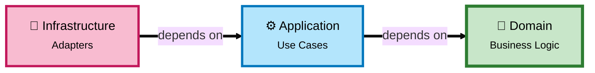
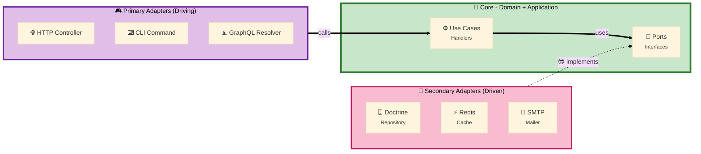
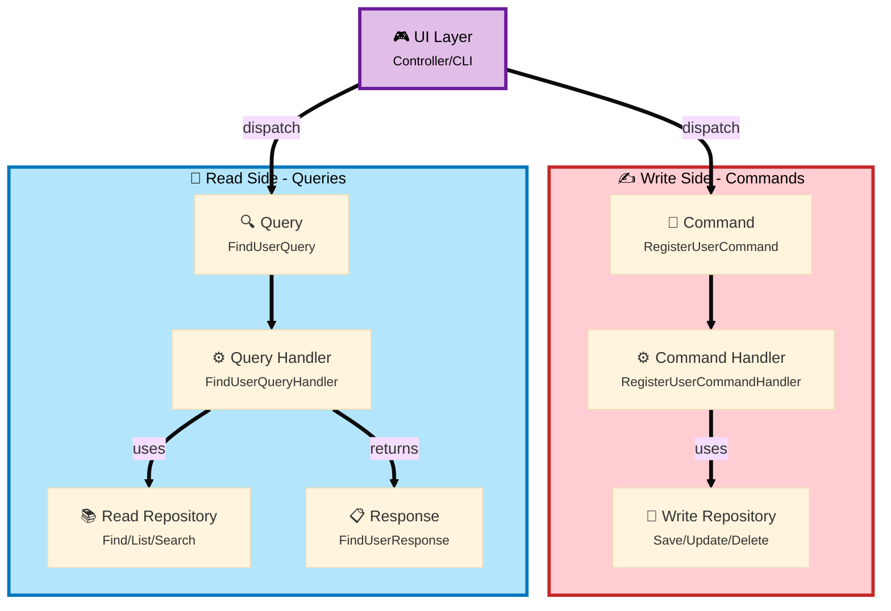
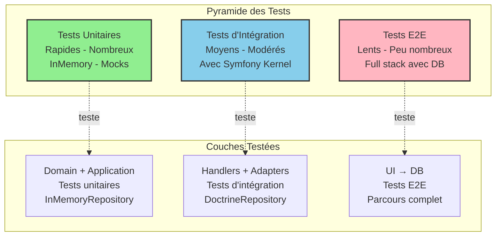
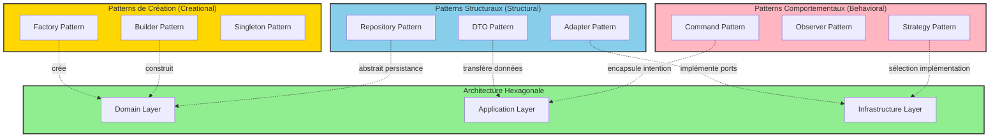

# Architecture Hexagonale - Guide Complet

## Table des matières

1. [Vue d'ensemble](#1-vue-densemble)
2. [Les 3 Couches](#2-les-3-couches)
3. [Ports vs Adapters](#3-ports-vs-adapters)
4. [CQRS Pattern](#4-cqrs-pattern)
5. [Testabilité](#5-testabilité)
6. [Structure de répertoires](#6-structure-de-répertoires)
7. [Bonnes pratiques](#7-bonnes-pratiques)
8. [Design Patterns Favorisés](#8-design-patterns-favorisés)
   - 8.1 [Patterns de Création](#81-patterns-de-création-creational-patterns) - Factory, Builder, Singleton
   - 8.2 [Patterns Structuraux](#82-patterns-structuraux-structural-patterns) - Adapter, Repository, DTO
   - 8.3 [Patterns Comportementaux](#83-patterns-comportementaux-behavioral-patterns) - Strategy, Command, Observer
   - 8.4 [Autres Patterns](#84-autres-patterns-importants) - Specification, Null Object
9. [Migration progressive](#9-migration-progressive)
10. [Ressources](#10-ressources)

---

## 1. Vue d'ensemble

L'architecture hexagonale (aussi appelée **Ports and Adapters**) est un pattern architectural qui vise à **isoler la logique métier** des préoccupations techniques (framework, base de données, API externes, etc.).

### 1.1 Principe fondamental

> **Les dépendances pointent toujours vers l'intérieur** (vers le domaine)



---

## 2. Les 3 Couches

### 2.1 Domain (Cœur - Hexagone)

**Responsabilité:** Logique métier pure, règles de gestion, invariants

**Contient:**
- `Model/` - Entités avec identité et cycle de vie
- `ValueObject/` - Objets immuables définis par leurs valeurs
- `Port/` - Interfaces (contrats) pour les dépendances externes

**Règles strictes:**
- AUCUNE dépendance vers les couches externes
- AUCUNE annotation/attribut Symfony/Doctrine
- PHP pur uniquement
- Indépendant du framework

**Exemple Entity:**
```php
namespace App\User\Account\Domain\Model;

final class User
{
    public function __construct(
        private UserId $id,
        private Email $email,
        private bool $isActive = false,
    ) {
    }

    // Business logic
    public function activate(): void
    {
        if ($this->isActive) {
            throw new UserAlreadyActiveException();
        }
        $this->isActive = true;
    }
}
```

**Exemple Value Object:**
```php
namespace App\User\Account\Domain\ValueObject;

final readonly class Email
{
    public function __construct(public string $value)
    {
        if (!filter_var($value, FILTER_VALIDATE_EMAIL)) {
            throw new InvalidEmailException($value);
        }
    }
}
```

**Exemple Port (Interface):**
```php
namespace App\User\Account\Domain\Port;

interface UserRepositoryInterface
{
    public function save(User $user): void;
    public function findById(UserId $id): ?User;
}
```

### 2.2 Application (Orchestration)

**Responsabilité:** Cas d'utilisation, orchestration des opérations métier

**Contient:**
- `Command/` - Commandes CQRS (écritures)
- `Query/` - Requêtes CQRS (lectures)
- Handlers - Logique d'orchestration

**Règles:**
- Dépend du Domain uniquement
- Utilise les Ports (interfaces)
- Coordonne les opérations
- Ne contient PAS de logique métier

**Command:**
```php
namespace App\User\Account\Application\Register;

final readonly class RegisterCommand
{
    public function __construct(
        public string $email,
        public string $password,
    ) {
    }
}
```

**Command Handler:**
```php
namespace App\User\Account\Application\Register;

use App\User\Account\Domain\Port\UserRepositoryInterface;
use Symfony\Component\Messenger\Attribute\AsMessageHandler;

#[AsMessageHandler]
final readonly class RegisterCommandHandler
{
    public function __construct(
        private UserRepositoryInterface $repository,
        private PasswordHasherInterface $hasher,
    ) {
    }

    public function __invoke(RegisterCommand $command): void
    {
        // Orchestration only, no business logic
        $user = new User(
            id: UserId::generate(),
            email: new Email($command->email),
            password: $this->hasher->hash($command->password),
        );

        $this->repository->save($user);
    }
}
```

### 2.3 Infrastructure (Détails techniques)

**Responsabilité:** Implémentations concrètes, détails techniques

**Contient:**
- `Persistence/` - Adapters pour la persistance (Doctrine, etc.)
- `Messaging/` - Adapters pour la messagerie
- `ExternalAPI/` - Adapters pour les APIs externes

**Règles:**
- Implémente les Ports (interfaces du Domain)
- Contient les détails techniques
- Peut dépendre de Domain et Application
- Utilise Doctrine, HTTP clients, etc.

**Adapter Doctrine:**
```php
namespace App\User\Account\Infrastructure\Persistence\Doctrine;

use App\User\Account\Domain\Model\User;
use App\User\Account\Domain\Port\UserRepositoryInterface;
use Doctrine\ORM\EntityManagerInterface;

final class DoctrineUserRepository implements UserRepositoryInterface
{
    public function __construct(
        private readonly EntityManagerInterface $em,
    ) {
    }

    public function save(User $user): void
    {
        $this->em->persist($user);
        $this->em->flush();
    }

    public function findById(UserId $id): ?User
    {
        return $this->em->find(User::class, $id->value);
    }
}
```

---

## 3. Ports vs Adapters



### 3.1 Port (Interface)

Un **Port** est une interface définie dans le **Domain** qui représente un besoin.

**Types de Ports:**

1. **Ports Primaires (Driving/Primary)** - Ce que l'application offre
   - Exemple : Use case handlers
   - Appelés par les adapters primaires (UI)

2. **Ports Secondaires (Driven/Secondary)** - Ce que l'application requiert
   - Exemple : `RepositoryInterface`, `EmailSenderInterface`
   - Implémentés par les adapters secondaires (Infrastructure)

### 3.2 Adapter (Implémentation)

Un **Adapter** est une implémentation concrète d'un Port dans l'**Infrastructure**.

**Exemples d'Adapters:**

```php
// Port (Domain)
interface UserRepositoryInterface
{
    public function save(User $user): void;
}

// Adapter 1 - Doctrine (Infrastructure)
class DoctrineUserRepository implements UserRepositoryInterface
{
    public function save(User $user): void
    {
        $this->em->persist($user);
        $this->em->flush();
    }
}

// Adapter 2 - In Memory (Infrastructure/Tests)
class InMemoryUserRepository implements UserRepositoryInterface
{
    private array $users = [];

    public function save(User $user): void
    {
        $this->users[$user->getId()->value] = $user;
    }
}
```

---

## 4. CQRS Pattern



### 4.1 Command (Écriture)

**Caractéristiques:**
- Intention de **modifier l'état**
- Retourne `void`
- Nom au présent : `RegisterUser`, `PublishArticle`

```php
final readonly class PublishArticleCommand
{
    public function __construct(
        public string $articleId,
        public \DateTimeImmutable $publishedAt,
    ) {
    }
}
```

### 4.2 Query (Lecture)

**Caractéristiques:**
- Intention de **lire des données**
- Retourne un `Response`
- Nom descriptif : `FindUserById`, `ListArticles`

```php
final readonly class FindUserByIdQuery
{
    public function __construct(
        public string $userId,
    ) {
    }
}

final readonly class FindUserByIdResponse
{
    public function __construct(
        public string $id,
        public string $email,
        public bool $isActive,
    ) {
    }
}
```

### 4.3 Séparation stricte

```php
// MAUVAIS - Retourne une valeur
class RegisterUserCommand
{
    public function __invoke(RegisterCommand $cmd): User { ... }
}

// BON - Void uniquement
class RegisterUserCommandHandler
{
    public function __invoke(RegisterCommand $cmd): void { ... }
}

// BON - Query retourne les données
class FindUserQueryHandler
{
    public function __invoke(FindUserQuery $q): FindUserResponse { ... }
}
```

---

## 5. Testabilité

L'architecture hexagonale facilite grandement les tests :



### 5.1 Test du Domain (ultra rapide)

```php
class UserTest extends TestCase
{
    public function testUserCanBeActivated(): void
    {
        $user = new User(
            id: UserId::generate(),
            email: new Email('test@example.com'),
        );

        $user->activate();

        $this->assertTrue($user->isActive());
    }
}
```

### 5.2 Test de l'Application avec InMemory

```php
class RegisterCommandHandlerTest extends TestCase
{
    public function testUserIsRegistered(): void
    {
        $repository = new InMemoryUserRepository();
        $handler = new RegisterCommandHandler($repository);

        $command = new RegisterCommand(
            email: 'test@example.com',
            password: 'secret',
        );

        $handler($command);

        $this->assertCount(1, $repository->all());
    }
}
```

---

## 6. Structure de répertoires

```
src/
└── User/                          # Bounded Context
    └── Account/                   # Module
        ├── Application/           # Couche Application
        │   ├── Register/
        │   │   ├── RegisterCommand.php
        │   │   ├── RegisterCommandHandler.php
        │   │   └── AccountFactory.php
        │   └── Find/
        │       ├── FindQuery.php
        │       ├── FindQueryHandler.php
        │       └── FindResponse.php
        │
        ├── Domain/                # Couche Domain (Cœur)
        │   ├── Model/
        │   │   └── User.php
        │   ├── ValueObject/
        │   │   ├── Email.php
        │   │   └── UserId.php
        │   └── Port/
        │       └── UserRepositoryInterface.php
        │
        └── Infrastructure/        # Couche Infrastructure
            ├── Persistence/
            │   ├── Doctrine/
            │   │   ├── DoctrineUserRepository.php
            │   │   └── Mapping/
            │   │       └── User.orm.xml
            │   └── InMemory/
            │       └── InMemoryUserRepository.php
            └── Messaging/
                └── SymfonyMessengerAdapter.php
```

---

## 7. Bonnes pratiques

### 7.1 Domain pur

```php
// MAUVAIS - Dépendance à Doctrine
use Doctrine\ORM\Mapping as ORM;

#[ORM\Entity]
class User { }

// BON - PHP pur
class User
{
    public function __construct(
        private UserId $id,
        private Email $email,
    ) {
    }
}
```

### 7.2 Value Objects immuables

```php
// MAUVAIS - Mutable
class Email
{
    public string $value;

    public function setValue(string $value): void
    {
        $this->value = $value;
    }
}

// BON - Immutable avec readonly
final readonly class Email
{
    public function __construct(
        public string $value,
    ) {
        if (!filter_var($value, FILTER_VALIDATE_EMAIL)) {
            throw new InvalidEmailException();
        }
    }
}
```

### 7.3 Ports dans le Domain

```php
// MAUVAIS - Adapter dans le Domain
namespace App\Domain;

use Doctrine\ORM\EntityManagerInterface;

class UserService
{
    public function __construct(
        private EntityManagerInterface $em
    ) {}
}

// BON - Port (interface) dans le Domain
namespace App\Domain\Port;

interface UserRepositoryInterface
{
    public function save(User $user): void;
}

namespace App\Application;

class RegisterHandler
{
    public function __construct(
        private UserRepositoryInterface $repository
    ) {}
}
```

### 7.4 Factories pour création complexe

```php
final readonly class OrderFactory
{
    public function __construct(
        private IdGeneratorInterface $idGenerator,
        private ClockInterface $clock,
    ) {
    }

    public function create(CreateOrderCommand $command): Order
    {
        return new Order(
            id: new OrderId($this->idGenerator->generate()),
            customerId: new CustomerId($command->customerId),
            items: $this->createOrderItems($command->items),
            createdAt: $this->clock->now(),
        );
    }
}
```

---

## 8. Design Patterns Favorisés

L'architecture hexagonale encourage naturellement l'utilisation de nombreux design patterns éprouvés. Cette section explore comment l'hexagonal facilite et favorise ces patterns.



### 8.1 Patterns de Création (Creational Patterns)

#### 8.1.1 Factory Pattern

**Pourquoi l'hexagonal le favorise:**
- La création d'entités complexes nécessite souvent plusieurs Value Objects
- Validation et logique métier doivent être centralisées
- Le Domain ne doit pas dépendre de l'Infrastructure

**Exemple:**
```php
<?php

declare(strict_types=1);

namespace App\User\Account\Application\Register;

use App\User\Account\Domain\Model\User;
use App\User\Account\Domain\ValueObject\Email;
use App\User\Account\Domain\ValueObject\UserId;
use App\User\Account\Domain\ValueObject\HashedPassword;
use App\Shared\Domain\Service\IdGeneratorInterface;
use App\Shared\Domain\Service\PasswordHasherInterface;

/**
 * Factory Pattern - Crée des entités complexes du Domain
 */
final readonly class UserFactory
{
    public function __construct(
        private IdGeneratorInterface $idGenerator,
        private PasswordHasherInterface $passwordHasher,
    ) {
    }

    public function createFromCommand(RegisterCommand $command): User
    {
        return new User(
            id: new UserId($this->idGenerator->generate()),
            email: new Email($command->email),
            password: new HashedPassword(
                $this->passwordHasher->hash($command->password)
            ),
            createdAt: new \DateTimeImmutable(),
        );
    }
}
```

**Avantages dans l'hexagonal:**
- Encapsule la logique de création complexe
- Isole les dépendances (ID generator, hasher) de l'entité
- Facilite les tests (mock de la factory)

#### 8.1.2 Builder Pattern

**Utilisation:**
- Construction progressive d'objets complexes
- Configurations avec nombreuses options

**Exemple:**
```php
<?php

declare(strict_types=1);

namespace App\Order\Domain\Builder;

use App\Order\Domain\Model\Order;
use App\Order\Domain\ValueObject\OrderId;
use App\Order\Domain\ValueObject\OrderItem;

/**
 * Builder Pattern - Construction progressive d'une commande
 */
final class OrderBuilder
{
    private ?OrderId $id = null;
    private ?string $customerId = null;
    private array $items = [];
    private ?string $shippingAddress = null;
    private ?string $billingAddress = null;

    public function withId(OrderId $id): self
    {
        $this->id = $id;
        return $this;
    }

    public function forCustomer(string $customerId): self
    {
        $this->customerId = $customerId;
        return $this;
    }

    public function addItem(OrderItem $item): self
    {
        $this->items[] = $item;
        return $this;
    }

    public function withShippingAddress(string $address): self
    {
        $this->shippingAddress = $address;
        return $this;
    }

    public function build(): Order
    {
        if ($this->id === null || $this->customerId === null) {
            throw new \LogicException('Order must have id and customer');
        }

        return new Order(
            id: $this->id,
            customerId: $this->customerId,
            items: $this->items,
            shippingAddress: $this->shippingAddress,
            billingAddress: $this->billingAddress ?? $this->shippingAddress,
        );
    }
}

// Utilisation dans un test
$order = (new OrderBuilder())
    ->withId(OrderId::generate())
    ->forCustomer('customer-123')
    ->addItem(new OrderItem('product-1', 2))
    ->addItem(new OrderItem('product-2', 1))
    ->withShippingAddress('123 Main St')
    ->build();
```

#### 8.1.3 Singleton Pattern (Port Registry)

**Cas d'usage limité mais pertinent:**
- Registre de ports disponibles
- Configuration globale

```php
<?php

declare(strict_types=1);

namespace App\Shared\Infrastructure\Registry;

/**
 * Singleton - Registre des adapters disponibles
 */
final class AdapterRegistry
{
    private static ?self $instance = null;
    private array $adapters = [];

    private function __construct() {}

    public static function getInstance(): self
    {
        if (self::$instance === null) {
            self::$instance = new self();
        }

        return self::$instance;
    }

    public function register(string $portName, object $adapter): void
    {
        $this->adapters[$portName] = $adapter;
    }

    public function get(string $portName): object
    {
        return $this->adapters[$portName] ?? throw new \RuntimeException(
            "No adapter registered for port: {$portName}"
        );
    }
}
```

---

### 8.2 Patterns Structuraux (Structural Patterns)

#### 8.2.1 Adapter Pattern (Cœur de l'Hexagonal)

**C'est LE pattern central de l'architecture hexagonale!**

**Pourquoi:**
- Traduit les interfaces externes vers les Ports du Domain
- Permet de changer d'infrastructure sans toucher au Domain

**Exemple complet:**
```php
<?php

declare(strict_types=1);

// PORT (Domain Layer)
namespace App\User\Account\Domain\Port;

use App\User\Account\Domain\Model\User;
use App\User\Account\Domain\ValueObject\UserId;

interface UserRepositoryInterface
{
    public function save(User $user): void;
    public function findById(UserId $id): ?User;
    public function findByEmail(string $email): ?User;
}

// ADAPTER 1 - Doctrine (Infrastructure)
namespace App\User\Account\Infrastructure\Persistence\Doctrine;

use App\User\Account\Domain\Model\User;
use App\User\Account\Domain\Port\UserRepositoryInterface;
use App\User\Account\Domain\ValueObject\UserId;
use Doctrine\ORM\EntityManagerInterface;

/**
 * Adapter Pattern - Adapte Doctrine vers notre Port
 */
final readonly class DoctrineUserRepository implements UserRepositoryInterface
{
    public function __construct(
        private EntityManagerInterface $entityManager,
    ) {
    }

    public function save(User $user): void
    {
        $this->entityManager->persist($user);
        $this->entityManager->flush();
    }

    public function findById(UserId $id): ?User
    {
        return $this->entityManager->find(User::class, $id->value);
    }

    public function findByEmail(string $email): ?User
    {
        return $this->entityManager
            ->getRepository(User::class)
            ->findOneBy(['email.value' => $email]);
    }
}

// ADAPTER 2 - MongoDB (Infrastructure)
namespace App\User\Account\Infrastructure\Persistence\MongoDB;

use App\User\Account\Domain\Model\User;
use App\User\Account\Domain\Port\UserRepositoryInterface;
use MongoDB\Client;

/**
 * Adapter Pattern - Adapte MongoDB vers le même Port
 */
final readonly class MongoUserRepository implements UserRepositoryInterface
{
    private const COLLECTION = 'users';

    public function __construct(
        private Client $mongoClient,
        private string $databaseName,
    ) {
    }

    public function save(User $user): void
    {
        $collection = $this->mongoClient
            ->selectDatabase($this->databaseName)
            ->selectCollection(self::COLLECTION);

        $collection->updateOne(
            ['_id' => $user->getId()->value],
            ['$set' => $this->serialize($user)],
            ['upsert' => true]
        );
    }

    // ... autres méthodes
}

// ADAPTER 3 - InMemory (Tests)
namespace Tests\Unit\User\Account\Infrastructure\Persistence\InMemory;

use App\User\Account\Domain\Model\User;
use App\User\Account\Domain\Port\UserRepositoryInterface;

/**
 * Adapter Pattern - Implémentation en mémoire pour tests rapides
 */
final class InMemoryUserRepository implements UserRepositoryInterface
{
    private array $users = [];

    public function save(User $user): void
    {
        $this->users[$user->getId()->value] = $user;
    }

    public function findById(UserId $id): ?User
    {
        return $this->users[$id->value] ?? null;
    }

    public function findByEmail(string $email): ?User
    {
        foreach ($this->users as $user) {
            if ($user->getEmail()->value === $email) {
                return $user;
            }
        }

        return null;
    }

    // Helper pour les tests
    public function clear(): void
    {
        $this->users = [];
    }
}
```

**Bénéfices:**
- **3 adapters** différents pour le **même port**
- Le **Domain** ne change jamais
- **L'Application** ne change jamais
- Changement de DB = changer l'adapter dans `services.yaml`

#### 8.2.2 Repository Pattern

**Intégration naturelle:**
- Les Ports définissent les interfaces de Repository
- Les Adapters implémentent la persistance

**Exemple avec méthodes métier:**
```php
<?php

declare(strict_types=1);

// Port avec méthodes métier
namespace App\Product\Domain\Port;

use App\Product\Domain\Model\Product;

interface ProductRepositoryInterface
{
    public function save(Product $product): void;
    public function findById(string $id): ?Product;

    // Méthodes métier (pas technique)
    public function findActiveProducts(): array;
    public function findProductsLowInStock(int $threshold): array;
    public function findBestSellers(int $limit): array;
}

// Adapter Doctrine
namespace App\Product\Infrastructure\Persistence\Doctrine;

use App\Product\Domain\Model\Product;
use App\Product\Domain\Port\ProductRepositoryInterface;

final readonly class DoctrineProductRepository implements ProductRepositoryInterface
{
    public function findActiveProducts(): array
    {
        return $this->entityManager
            ->createQueryBuilder()
            ->select('p')
            ->from(Product::class, 'p')
            ->where('p.isActive = :active')
            ->setParameter('active', true)
            ->getQuery()
            ->getResult();
    }

    public function findProductsLowInStock(int $threshold): array
    {
        return $this->entityManager
            ->createQueryBuilder()
            ->select('p')
            ->from(Product::class, 'p')
            ->where('p.stock < :threshold')
            ->setParameter('threshold', $threshold)
            ->orderBy('p.stock', 'ASC')
            ->getQuery()
            ->getResult();
    }
}
```

#### 8.2.3 DTO Pattern (Data Transfer Object)

**Utilisation systématique dans l'hexagonal:**

**1. Commands (Write) - DTOs immuables**
```php
<?php

declare(strict_types=1);

namespace App\User\Account\Application\Register;

/**
 * DTO Pattern - Command = DTO immutable pour l'écriture
 */
final readonly class RegisterCommand
{
    public function __construct(
        public string $email,
        public string $password,
        public string $firstName,
        public string $lastName,
    ) {
    }
}
```

**2. Queries Response - DTOs de lecture**
```php
<?php

declare(strict_types=1);

namespace App\User\Account\Application\FindById;

/**
 * DTO Pattern - Response = DTO pour la lecture
 */
final readonly class FindByIdResponse
{
    public function __construct(
        public string $id,
        public string $email,
        public string $firstName,
        public string $lastName,
        public bool $isActive,
        public string $createdAt,
    ) {
    }

    public static function fromUser(User $user): self
    {
        return new self(
            id: $user->getId()->value,
            email: $user->getEmail()->value,
            firstName: $user->getFirstName(),
            lastName: $user->getLastName(),
            isActive: $user->isActive(),
            createdAt: $user->getCreatedAt()->format('Y-m-d H:i:s'),
        );
    }
}
```

**3. API DTOs - Séparation UI/Application**
```php
<?php

declare(strict_types=1);

namespace App\UI\Http\DTO;

/**
 * DTO Pattern - DTO spécifique à l'API HTTP
 */
final readonly class RegisterUserRequest
{
    public function __construct(
        public string $email,
        public string $password,
        public string $first_name,  // snake_case pour API
        public string $last_name,
    ) {
    }

    public function toCommand(): RegisterCommand
    {
        return new RegisterCommand(
            email: $this->email,
            password: $this->password,
            firstName: $this->first_name,  // Conversion vers Domain
            lastName: $this->last_name,
        );
    }
}
```

**Flux complet:**
```
HTTP Request (JSON)
    → RegisterUserRequest (DTO API)
    → RegisterCommand (DTO Application)
    → User (Domain Entity)
    → Persistence
```

---

### 8.3 Patterns Comportementaux (Behavioral Patterns)

#### 8.3.1 Strategy Pattern

**Usage naturel dans l'hexagonal:**
- Sélection dynamique d'adapters
- Algorithmes de calcul interchangeables

**Exemple - Multiple payment strategies:**
```php
<?php

declare(strict_types=1);

// Port (Interface = Strategy)
namespace App\Payment\Domain\Port;

use App\Payment\Domain\Model\Payment;

interface PaymentGatewayInterface
{
    public function process(Payment $payment): bool;
    public function refund(Payment $payment): bool;
}

// Strategy 1 - Stripe
namespace App\Payment\Infrastructure\Gateway;

use App\Payment\Domain\Port\PaymentGatewayInterface;
use Stripe\StripeClient;

final readonly class StripePaymentGateway implements PaymentGatewayInterface
{
    public function __construct(
        private StripeClient $stripe,
    ) {
    }

    public function process(Payment $payment): bool
    {
        $result = $this->stripe->charges->create([
            'amount' => $payment->getAmount()->inCents(),
            'currency' => $payment->getAmount()->currency,
            'source' => $payment->getToken(),
        ]);

        return $result->status === 'succeeded';
    }

    public function refund(Payment $payment): bool
    {
        // Stripe refund logic
    }
}

// Strategy 2 - PayPal
namespace App\Payment\Infrastructure\Gateway;

use App\Payment\Domain\Port\PaymentGatewayInterface;

final readonly class PayPalPaymentGateway implements PaymentGatewayInterface
{
    public function process(Payment $payment): bool
    {
        // PayPal logic
    }
}

// Context - Utilisation de la stratégie
namespace App\Payment\Application\ProcessPayment;

use App\Payment\Domain\Port\PaymentGatewayInterface;

#[AsMessageHandler]
final readonly class ProcessPaymentCommandHandler
{
    public function __construct(
        private PaymentGatewayInterface $paymentGateway,  // Strategy injectée
    ) {
    }

    public function __invoke(ProcessPaymentCommand $command): void
    {
        $payment = $this->createPayment($command);

        // La stratégie est utilisée sans savoir laquelle c'est
        $success = $this->paymentGateway->process($payment);

        if (!$success) {
            throw new PaymentFailedException();
        }
    }
}
```

**Configuration Symfony (choix de stratégie):**
```yaml
# config/services.yaml
services:
    # Stratégie par défaut
    App\Payment\Domain\Port\PaymentGatewayInterface:
        class: App\Payment\Infrastructure\Gateway\StripePaymentGateway

    # Ou selon environnement
    App\Payment\Domain\Port\PaymentGatewayInterface:
        class: '%env(PAYMENT_GATEWAY)%'
        # PAYMENT_GATEWAY=App\Payment\Infrastructure\Gateway\PayPalPaymentGateway
```

#### 8.3.2 Command Pattern (CQRS)

**Implémentation native dans l'hexagonal:**

```php
<?php

declare(strict_types=1);

namespace App\Order\Application\PlaceOrder;

/**
 * Command Pattern - Encapsule une requête comme un objet
 */
final readonly class PlaceOrderCommand
{
    public function __construct(
        public string $customerId,
        public array $items,
        public string $shippingAddress,
    ) {
    }
}

// Handler = Receiver
#[AsMessageHandler]
final readonly class PlaceOrderCommandHandler
{
    public function __construct(
        private OrderRepositoryInterface $orderRepository,
        private OrderFactory $orderFactory,
    ) {
    }

    public function __invoke(PlaceOrderCommand $command): void
    {
        $order = $this->orderFactory->createFromCommand($command);
        $this->orderRepository->save($order);
    }
}

// Invoker
namespace App\UI\Http\Controller;

use Symfony\Component\Messenger\MessageBusInterface;

final class OrderController
{
    public function __construct(
        private MessageBusInterface $commandBus,  // Invoker
    ) {
    }

    #[Route('/orders', methods: ['POST'])]
    public function placeOrder(Request $request): Response
    {
        $command = new PlaceOrderCommand(
            customerId: $request->get('customer_id'),
            items: $request->get('items'),
            shippingAddress: $request->get('shipping_address'),
        );

        // Invocation du command
        $this->commandBus->dispatch($command);

        return new JsonResponse(['status' => 'success']);
    }
}
```

**Avantages:**
- Historique des commandes (event sourcing possible)
- Annulation/Redo possible
- Validation centralisée
- Asynchrone facilement (via message queue)

#### 8.3.3 Observer Pattern (Domain Events)

**Événements du Domain:**

```php
<?php

declare(strict_types=1);

// Event
namespace App\User\Account\Domain\Event;

final readonly class UserRegisteredEvent
{
    public function __construct(
        public string $userId,
        public string $email,
        public \DateTimeImmutable $occurredAt,
    ) {
    }
}

// Entity qui dispatche l'événement
namespace App\User\Account\Domain\Model;

final class User
{
    private array $domainEvents = [];

    public function register(): void
    {
        // Logique métier
        $this->isActive = true;

        // Enregistre l'événement
        $this->domainEvents[] = new UserRegisteredEvent(
            userId: $this->id->value,
            email: $this->email->value,
            occurredAt: new \DateTimeImmutable(),
        );
    }

    public function pullDomainEvents(): array
    {
        $events = $this->domainEvents;
        $this->domainEvents = [];
        return $events;
    }
}

// Observer 1 - Envoyer email
namespace App\User\Account\Application\EventSubscriber;

use Symfony\Component\Messenger\Attribute\AsMessageHandler;

#[AsMessageHandler]
final readonly class SendWelcomeEmailOnUserRegistered
{
    public function __construct(
        private MailerInterface $mailer,
    ) {
    }

    public function __invoke(UserRegisteredEvent $event): void
    {
        $this->mailer->send(
            new WelcomeEmail($event->email)
        );
    }
}

// Observer 2 - Logger
#[AsMessageHandler]
final readonly class LogUserRegistration
{
    public function __construct(
        private LoggerInterface $logger,
    ) {
    }

    public function __invoke(UserRegisteredEvent $event): void
    {
        $this->logger->info('New user registered', [
            'user_id' => $event->userId,
            'email' => $event->email,
        ]);
    }
}

// Observer 3 - Créer profil
#[AsMessageHandler]
final readonly class CreateUserProfileOnUserRegistered
{
    public function __invoke(UserRegisteredEvent $event): void
    {
        // Créer le profil utilisateur
    }
}
```

**Bénéfices:**
- **Découplage total** entre modules
- **Extensibilité** - ajouter observer = nouvelle classe
- **Single Responsibility** - chaque observer fait une chose

---

### 8.4 Autres Patterns Importants

#### 8.4.1 Specification Pattern

**Pour les requêtes complexes:**

```php
<?php

declare(strict_types=1);

namespace App\Product\Domain\Specification;

use App\Product\Domain\Model\Product;

interface ProductSpecificationInterface
{
    public function isSatisfiedBy(Product $product): bool;
}

final readonly class ActiveProductSpecification implements ProductSpecificationInterface
{
    public function isSatisfiedBy(Product $product): bool
    {
        return $product->isActive();
    }
}

final readonly class InStockSpecification implements ProductSpecificationInterface
{
    public function isSatisfiedBy(Product $product): bool
    {
        return $product->getStock() > 0;
    }
}

// Composite Specification
final readonly class AndSpecification implements ProductSpecificationInterface
{
    public function __construct(
        private ProductSpecificationInterface $spec1,
        private ProductSpecificationInterface $spec2,
    ) {
    }

    public function isSatisfiedBy(Product $product): bool
    {
        return $this->spec1->isSatisfiedBy($product)
            && $this->spec2->isSatisfiedBy($product);
    }
}

// Utilisation
$activeAndInStock = new AndSpecification(
    new ActiveProductSpecification(),
    new InStockSpecification()
);

$filteredProducts = array_filter(
    $products,
    fn(Product $p) => $activeAndInStock->isSatisfiedBy($p)
);
```

#### 8.4.2 Null Object Pattern

**Pour éviter les null checks:**

```php
<?php

declare(strict_types=1);

namespace App\User\Account\Domain\Model;

// Interface
interface UserInterface
{
    public function getId(): UserId;
    public function getEmail(): Email;
    public function isActive(): bool;
}

// User réel
final class User implements UserInterface
{
    // ... implémentation normale
}

// Null User
final class NullUser implements UserInterface
{
    public function getId(): UserId
    {
        return new UserId('null');
    }

    public function getEmail(): Email
    {
        return new Email('null@example.com');
    }

    public function isActive(): bool
    {
        return false;
    }
}

// Repository
final class DoctrineUserRepository
{
    public function findById(UserId $id): UserInterface
    {
        $user = $this->entityManager->find(User::class, $id->value);

        // Retourne NullUser au lieu de null
        return $user ?? new NullUser();
    }
}

// Utilisation - pas de null check!
$user = $repository->findById($userId);
if ($user->isActive()) {  // Pas de null check nécessaire
    // ...
}
```

---

### 8.5 Tableau Récapitulatif

| Pattern | Catégorie | Couche Hexagonale | Usage Principal |
|---------|-----------|-------------------|-----------------|
| **Factory** | Creational | Application/Domain | Création d'entités complexes |
| **Builder** | Creational | Domain/Tests | Construction progressive |
| **Singleton** | Creational | Infrastructure | Registres, configurations |
| **Adapter** | Structural | Infrastructure | **CORE - Implémente les ports** |
| **Repository** | Structural | Domain (Port) + Infra (Adapter) | Abstraction persistance |
| **DTO** | Structural | Application | Commands, Queries, Responses |
| **Strategy** | Behavioral | Infrastructure | Algorithmes interchangeables |
| **Command** | Behavioral | Application | **CQRS - Use cases** |
| **Observer** | Behavioral | Application | Domain Events |
| **Specification** | Domain | Domain | Règles métier complexes |
| **Null Object** | Special | Domain | Éviter null checks |

---

### 8.6 Anti-Patterns à Éviter

#### 🌪️ Service Locator dans le Domain
```php
// MAUVAIS
class User
{
    public function save(): void
    {
        $repository = ServiceLocator::get(UserRepositoryInterface::class);
        $repository->save($this);
    }
}

// BON - Injection de dépendances
class RegisterCommandHandler
{
    public function __construct(
        private UserRepositoryInterface $repository
    ) {}
}
```

#### 🌪️ God Object / Anemic Domain
```php
// MAUVAIS - Anemic
class User
{
    public string $email;
    public string $password;
    // Pas de logique
}

class UserService
{
    public function register(User $user): void
    {
        // Toute la logique ici
    }
}

// BON - Rich Domain
class User
{
    public function register(Email $email, HashedPassword $password): void
    {
        // Validation et logique métier ici
    }
}
```

---

## 9. Migration progressive

### 9.1 Étape 1 : Extraire le Domain
```php
// Avant
class UserController
{
    public function register(Request $request): Response
    {
        $user = new User();
        $user->setEmail($request->get('email'));
        $this->em->persist($user);
        $this->em->flush();
    }
}

// Après
class UserController
{
    public function register(Request $request): Response
    {
        $command = new RegisterCommand($request->get('email'));
        $this->commandBus->dispatch($command);
    }
}
```

### 9.2 Étape 2 : Créer les Ports
```php
// Domain/Port
interface UserRepositoryInterface
{
    public function save(User $user): void;
}
```

### 9.3 Étape 3 : Créer les Adapters
```php
// Infrastructure
class DoctrineUserRepository implements UserRepositoryInterface
{
    public function save(User $user): void
    {
        $this->em->persist($user);
        $this->em->flush();
    }
}
```

---

## 10. Ressources

- [Hexagonal Architecture par Alistair Cockburn](https://alistair.cockburn.us/hexagonal-architecture/)
- [Clean Architecture par Robert C. Martin](https://blog.cleancoder.com/uncle-bob/2012/08/13/the-clean-architecture.html)
- [DDD par Eric Evans](https://www.domainlanguage.com/ddd/)
- [CQRS Pattern](https://martinfowler.com/bliki/CQRS.html)

---

**Ce bundle vous aide à mettre en œuvre ces principes facilement avec Symfony !**
