# Hexagonal Architecture Maker Bundle for Symfony

<p align="center">
  
</p>

<p align="center">
  <strong>A complete Symfony Maker bundle for generating Hexagonal Architecture (Ports & Adapters) components</strong>
</p>

<p align="center">
  <a href="LICENSE"></a>
  <a href="https://www.php.net/"></a>
  <a href="https://symfony.com/"></a>
</p>

<p align="center">
  ✨ <strong>19 maker commands</strong> | 💎 <strong>Pure Domain</strong> | 🎯 <strong>CQRS Pattern</strong> | 🏗️ <strong>Full Layer Coverage</strong> | 🔄 <strong>Async/Queue Support</strong>
</p>

---

## Table of Contents

- [Quick Start](#quick-start)
- [1. Features](#1-features)
- [2. Why Hexagonal Architecture](#2-why-hexagonal-architecture) → [📚 Complete Guide](WHY-HEXAGONAL.md)
- [3. Installation](#3-installation)
- [4. Complete Architecture Generation](#4-complete-architecture-generation)
- [5. Available Makers (18 Commands)](#5-available-makers)
- [6. Complete Example](#6-complete-example)
- [7. Configuration](#7-configuration)
- [8. Best Practices](#8-best-practices)
- [9. Additional Resources](#9-additional-resources)
- [10. Contributing](#10-contributing)
- [11. Credits](#11-credits)
- [12. License](#12-license)

---

## Quick Start

```bash
# 1. Install
composer require ahmedbhs/hexagonal-maker-bundle --dev

# 2. Generate a complete module (User Registration example)
bin/console make:hexagonal:entity user/account User
bin/console make:hexagonal:exception user/account InvalidEmailException
bin/console make:hexagonal:value-object user/account Email
bin/console make:hexagonal:repository user/account User
bin/console make:hexagonal:command user/account register --factory
bin/console make:hexagonal:controller user/account CreateUser /users/register
bin/console make:hexagonal:form user/account User

# 3. Configure Doctrine ORM mapping (see section 7.3)
# 4. Start coding your business logic!
```

**Result:** Complete hexagonal architecture with pure domain, separated layers, and ready-to-use components! 🚀

---

## 1. Features

### 1.1 Core CQRS Components
- **Commands** - Write operations with handlers
- **Queries** - Read operations with handlers and responses
- **Command Handlers** - Business logic execution with `#[AsMessageHandler]`
- **Query Handlers** - Data retrieval logic with `#[AsMessageHandler]`

### 1.2 Complete Maker Commands Summary

**18 makers covering all hexagonal layers + tests + events + rapid CRUD:**

| Layer | Maker Command | What it generates |
|-------|--------------|-------------------|
| **Domain** | `make:hexagonal:entity` | Domain entities + YAML mapping |
| **Domain** | `make:hexagonal:value-object` | Immutable value objects |
| **Domain** | `make:hexagonal:exception` | Business rule exceptions |
| **Domain** | `make:hexagonal:domain-event` | Domain events |
| **Application** | `make:hexagonal:command` | CQRS commands + handlers |
| **Application** | `make:hexagonal:query` | CQRS queries + handlers + responses |
| **Application** | `make:hexagonal:repository` | Repository port + Doctrine adapter |
| **Application** | `make:hexagonal:input` | Input DTOs with validation |
| **Application** | `make:hexagonal:use-case` | Use cases |
| **Application/Infrastructure** | `make:hexagonal:event-subscriber` | Event subscribers |
| **Infrastructure** | `make:hexagonal:message-handler` | Async message handlers |
| **UI** | `make:hexagonal:controller` | Web controllers |
| **UI** | `make:hexagonal:form` | Symfony forms |
| **UI** | `make:hexagonal:cli-command` | Console commands |
| **Tests** | `make:hexagonal:use-case-test` | Use case tests (KernelTestCase) |
| **Tests** | `make:hexagonal:controller-test` | Controller tests (WebTestCase) |
| **Tests** | `make:hexagonal:cli-command-test` | CLI tests (CommandTester) |
| **Config** | `make:hexagonal:test-config` | Test configuration setup |
| **Rapid Dev** | `make:hexagonal:crud` | Complete CRUD (Entity + 5 UseCases + Controllers + Forms + Tests) |

---

## 2. Why Hexagonal Architecture

> **📚 [Read the complete guide: WHY-HEXAGONAL.md](WHY-HEXAGONAL.md)**

### Quick Summary

**Everything is coupled anyway, so why bother?**

Hexagonal architecture isn't about eliminating coupling—that's impossible. It's about **controlling the direction** of coupling.

### The Core Problem with Traditional Architecture

**Traditional layered architecture problems:**
- Framework Prison: Business logic tightly coupled to Doctrine/Symfony
- Testing Complexity: Every test requires database, 10 min vs 10 sec
- Lost Business Rules: Rules scattered across 10+ files
- Cannot Evolve: Adding GraphQL/CLI requires code duplication
- Cost Predictability: Simple features take 3x longer after 2 years

**Hexagonal architecture solution:**
- **Direction Control:** Business logic depends on abstractions, infrastructure depends on business
- **Testing Speed:** 1000x faster (in-memory vs database I/O) - 10 min → 10 sec
- **Technology Freedom:** Swap MySQL to MongoDB in days not months (10-20x effort saved)
- **Cost Predictability (The "5-Day Rule"):** Features cost consistent time, no technical debt tax
- **Reusability:** Same business logic for REST, GraphQL, CLI, gRPC

### Key Benefits

| Benefit | Impact |
|---------|--------|
| 🔄 **Swap Database** | MySQL → MongoDB in 1-2 days (vs 2-4 weeks traditional) |
| ⚡ **Fast Tests** | 1000 tests in 1 second (vs 100 tests in 5 minutes) |
| 💰 **Predictable Costs** | Year 3: 5-7 days per feature (vs 15-25 days traditional) |
| 🎯 **Single Truth** | One place for business rules (vs scattered across 10 files) |
| 🚀 **Multi-Interface** | Write once, use in REST/GraphQL/CLI/Queue |

**The Investment Analogy:**
- Traditional = Consumer credit: easy at start, debt strangles you later
- Hexagonal = Investment: pay upfront, every feature costs its real price forever

> **📖 Want to learn more?** [Read the complete guide with examples, analogies, and decision trees →](WHY-HEXAGONAL.md)

---

## 3. Installation

```bash
composer require ahmedbhs/hexagonal-maker-bundle
```

The bundle will auto-register if you use Symfony Flex. Otherwise, add it to `config/bundles.php`:

```php
return [
    // ...
    AhmedBhs\HexagonalMakerBundle\HexagonalMakerBundle::class => ['dev' => true],
];
```

---

## 4. Complete Architecture Generation

This section shows exactly how to build a complete hexagonal architecture module step by step, with the exact commands to run for each component.

### 4.1 Scenario: User Account Management Module

Let's build a complete **User Account** module with all layers of hexagonal architecture.

#### 4.1.1 Step-by-Step Architecture Generation

```bash
# LAYER 1: DOMAIN (Core Business Logic - Pure PHP)
# ============================================

# 1.1 Create Domain Entity (User aggregate root - PURE, no Doctrine)
bin/console make:hexagonal:entity user/account User

# 1.2 Create Domain Exceptions (business rule violations)
bin/console make:hexagonal:exception user/account InvalidEmailException
bin/console make:hexagonal:exception user/account UserAlreadyExistsException

# 1.3 Create Value Objects (domain concepts)
bin/console make:hexagonal:value-object user/account UserId
bin/console make:hexagonal:value-object user/account Email
bin/console make:hexagonal:value-object user/account Password

# 1.4 Create Repository Port (interface in domain)
bin/console make:hexagonal:repository user/account User


# LAYER 2: APPLICATION (Use Cases & DTOs)
# ============================================

# 2.1 Create Input DTOs (with validation)
bin/console make:hexagonal:input user/account RegisterUserInput

# 2.2 Create Registration Use Case (Command)
bin/console make:hexagonal:command user/account register --factory

# 2.3 Create Activation Use Case (Command)
bin/console make:hexagonal:command user/account activate

# 2.4 Create Find User Use Case (Query)
bin/console make:hexagonal:query user/account find-by-id

# 2.5 Create List Users Use Case (Query)
bin/console make:hexagonal:query user/account list-all

# 2.6 Alternative: Create Use Case (instead of Command/Query)
bin/console make:hexagonal:use-case user/account RegisterUser


# LAYER 3: UI (Primary Adapters - Driving)
# ============================================

# 3.1 Create Web Controller
bin/console make:hexagonal:controller user/account RegisterUser /users/register

# 3.2 Create Symfony Form
bin/console make:hexagonal:form user/account User

# 3.3 Create CLI Command
bin/console make:hexagonal:cli-command user/account RegisterUser app:user:register


# LAYER 4: INFRASTRUCTURE (Secondary Adapters - Already generated!)
# ============================================
# The Repository adapter was auto-generated in step 1.4
# Located at: Infrastructure/Persistence/Doctrine/DoctrineUserRepository.php
# Doctrine YAML mapping auto-generated with entity in step 1.1
# Located at: Infrastructure/Persistence/Doctrine/Orm/Mapping/User.orm.yml
```

#### 4.1.2 Generated Architecture Structure

After running the commands above, here's your **complete hexagonal architecture**:

```
src/User/Account/
│
├── Domain/                                           # 💎 CORE BUSINESS LOGIC (Pure PHP, ZERO framework deps)
│   ├── Model/
│   │   └── User.php                                 ← make:hexagonal:entity
│   │
│   ├── Exception/                                    ← NEW!
│   │   ├── InvalidEmailException.php                ← make:hexagonal:exception
│   │   └── UserAlreadyExistsException.php           ← make:hexagonal:exception
│   │
│   ├── ValueObject/
│   │   ├── UserId.php                               ← make:hexagonal:value-object
│   │   ├── Email.php                                ← make:hexagonal:value-object
│   │   └── Password.php                             ← make:hexagonal:value-object
│   │
│   └── Port/                                         # Interfaces (Ports)
│       └── UserRepositoryInterface.php               ← make:hexagonal:repository
│
├── Application/                                      # ⚙️ USE CASES & DTOs
│   ├── Input/                                        ← NEW!
│   │   └── RegisterUserInput.php                    ← make:hexagonal:input
│   │
│   ├── UseCase/                                      ← NEW!
│   │   └── RegisterUserUseCase.php                  ← make:hexagonal:use-case
│   │
│   ├── Register/                                     # CQRS Command
│   │   ├── RegisterCommand.php                      ← make:hexagonal:command
│   │   ├── RegisterCommandHandler.php               ← (auto-generated)
│   │   └── AccountFactory.php                       ← (auto-generated with --factory)
│   │
│   ├── Activate/
│   │   ├── ActivateCommand.php                      ← make:hexagonal:command
│   │   └── ActivateCommandHandler.php               ← (auto-generated)
│   │
│   ├── FindById/                                     # CQRS Query
│   │   ├── FindByIdQuery.php                        ← make:hexagonal:query
│   │   ├── FindByIdQueryHandler.php                 ← (auto-generated)
│   │   └── FindByIdResponse.php                     ← (auto-generated)
│   │
│   └── ListAll/
│       ├── ListAllQuery.php                         ← make:hexagonal:query
│       ├── ListAllQueryHandler.php                  ← (auto-generated)
│       └── ListAllResponse.php                      ← (auto-generated)
│
├── UI/                                               # 🎮 PRIMARY ADAPTERS (Driving) - NEW!
│   ├── Http/
│   │   └── Web/
│   │       ├── Controller/
│   │       │   └── RegisterUserController.php       ← make:hexagonal:controller
│   │       │
│   │       └── Form/
│   │           └── UserType.php                     ← make:hexagonal:form
│   │
│   └── Cli/
│       └── RegisterUserCommand.php                  ← make:hexagonal:cli-command
│
└── Infrastructure/                                   # 🔌 SECONDARY ADAPTERS (Driven)
    └── Persistence/
        └── Doctrine/
            ├── Orm/
            │   └── Mapping/
            │       └── User.orm.yml                  ← Auto-generated with entity (YAML mapping)
            │
            └── DoctrineUserRepository.php            ← make:hexagonal:repository (Adapter)
```

#### 4.1.3 Understanding the Architecture

| Layer | Responsibility | Dependencies | Makers Available |
|-------|---------------|--------------|------------------|
| **💎 Domain** | Business logic, rules, invariants | **ZERO** (Pure PHP) | `make:hexagonal:entity`<br>`make:hexagonal:value-object`<br>`make:hexagonal:exception`<br>`make:hexagonal:repository` (Port) |
| **⚙️ Application** | Use cases, orchestration, DTOs | Domain only | `make:hexagonal:command`<br>`make:hexagonal:query`<br>`make:hexagonal:use-case`<br>`make:hexagonal:input` |
| **🎮 UI** | HTTP/CLI interfaces (Primary Adapters) | Application + Domain | `make:hexagonal:controller`<br>`make:hexagonal:form`<br>`make:hexagonal:cli-command` |
| **🔌 Infrastructure** | DB/API implementation (Secondary Adapters) | Domain (implements Ports) | `make:hexagonal:repository` (Adapter)<br>Auto: Doctrine YAML mapping |

### 4.2 Dependency Flow (Hexagonal Rule)

```mermaid
%%{init: {'theme':'base', 'themeVariables': { 'fontSize':'14px'}}}%%
graph TB
    subgraph UI["🎮 UI / Controllers"]
        HTTP["🌐 HTTP Controllers"]
        CLI["⌨️ bin/console Commands"]
    end

    subgraph APP["⚙️ APPLICATION LAYER"]
        Commands["📨 Commands & Queries<br/><small>Use Cases</small>"]
        Reg["• RegisterCommand"]
        Find["• FindByIdQuery"]

        Commands --- Reg
        Commands --- Find
    end

    subgraph DOMAIN["💎 DOMAIN LAYER - CORE"]
        Entities["📦 Entities & Value Objects"]
        EntList["• User<br/>• Email, UserId"]
        Ports["🔗 Ports<br/><small>Interfaces</small>"]
        PortList["• UserRepositoryInterface"]

        Entities --- EntList
        Ports --- PortList
    end

    subgraph INFRA["🔌 INFRASTRUCTURE LAYER"]
        Adapters["🔧 Adapters<br/><small>Implementations</small>"]
        AdList["• DoctrineUserRepository"]

        Adapters --- AdList
    end

    UI ==>|"uses"| APP
    APP ==>|"depends on"| DOMAIN
    INFRA -.->|"👌 implements"| Ports

    style DOMAIN fill:#C8E6C9,stroke:#2E7D32,stroke-width:4px,color:#000
    style APP fill:#B3E5FC,stroke:#0277BD,stroke-width:3px,color:#000
    style INFRA fill:#F8BBD0,stroke:#C2185B,stroke-width:3px,color:#000
    style UI fill:#E1BEE7,stroke:#6A1B9A,stroke-width:3px,color:#000

    style Commands fill:#E1F5FE,stroke:#01579B,stroke-width:2px,color:#000
    style Entities fill:#E8F5E9,stroke:#1B5E20,stroke-width:2px,color:#000
    style Ports fill:#FFF9C4,stroke:#F57F17,stroke-width:2px,color:#000
    style Adapters fill:#FCE4EC,stroke:#880E4F,stroke-width:2px,color:#000
```



**Key Points:**
- `make:hexagonal:command` / `make:hexagonal:query` → Application Layer
- `make:hexagonal:entity` / `make:hexagonal:value-object` → Domain Layer
- `make:hexagonal:repository` → Port (Domain) + Adapter (Infrastructure)

### 4.3 Quick Start: 5-Command Complete Module

Want to generate a complete module in just 5 commands? Here's a copy-paste ready script:

```bash
# Context: Product Catalog Module
bin/console make:hexagonal:entity product/catalog Product
bin/console make:hexagonal:value-object product/catalog ProductId
bin/console make:hexagonal:repository product/catalog Product
bin/console make:hexagonal:command product/catalog create-product --factory
bin/console make:hexagonal:query product/catalog find-product
```

**Result:** Complete Product module with Domain, Application, and Infrastructure layers.

---

## 5. Available Makers

### 5.1 Create a Command (Write Operation)

Generate a CQRS Command for state-changing operations:

```bash
bin/console make:hexagonal:command user/account register
```

**Generated files:**
```
src/User/Account/Application/Register/
├── RegisterCommand.php         # The command (DTO)
└── RegisterCommandHandler.php  # The handler (business logic)
```

**With Factory pattern:**

```bash
bin/console make:hexagonal:command user/account register --factory
```

**Generated files:**
```
src/User/Account/Application/Register/
├── RegisterCommand.php
├── RegisterCommandHandler.php  # Uses factory
└── AccountFactory.php          # Domain entity factory
```

**With Tests:**

```bash
bin/console make:hexagonal:command user/account register --with-tests
```

**Generated files:**
```
src/User/Account/Application/Register/
├── RegisterCommand.php
├── RegisterCommandHandler.php
tests/Unit/User/Account/Application/Register/
├── RegisterCommandHandlerTest.php      # Unit test (with mocks)
tests/Integration/User/Account/Application/Register/
└── RegisterCommandHandlerTest.php      # Integration test (full stack)
```

**With Factory and Tests:**

```bash
bin/console make:hexagonal:command user/account register --factory --with-tests
```

### 5.2 Create a Query (Read Operation)

Generate a CQRS Query for data retrieval:

```bash
bin/console make:hexagonal:query user/account find
```

**Generated files:**
```
src/User/Account/Application/Find/
├── FindQuery.php          # The query (request DTO)
├── FindQueryHandler.php   # The handler (read logic)
└── FindResponse.php       # The response (response DTO)
```

### 5.3 Create a Repository (Port + Adapter)

Generate a repository interface (Port) and its infrastructure implementation (Adapter):

```bash
bin/console make:hexagonal:repository user/account User
```

**Generated files:**
```
src/User/Account/
├── Domain/Port/
│   └── UserRepositoryInterface.php   # Port (interface)
└── Infrastructure/Persistence/Doctrine/
    └── DoctrineUserRepository.php    # Adapter (implementation)
```

### 5.4 Create a Domain Entity

Generate a domain entity in the core layer:

```bash
bin/console make:hexagonal:entity user/account User
```

**Generated files:**
```
src/User/Account/Domain/Model/
└── User.php  # Domain entity with business logic
```

### 5.5 Create a Value Object

Generate an immutable value object:

```bash
bin/console make:hexagonal:value-object user/account Email
```

**Generated files:**
```
src/User/Account/Domain/ValueObject/
└── Email.php  # Immutable value object with validation
```

### 5.6 Create a Domain Exception

Generate a business exception in the domain layer:

```bash
bin/console make:hexagonal:exception user/account InvalidEmailException
```

**Generated files:**
```
src/User/Account/Domain/Exception/
└── InvalidEmailException.php  # Domain exception for business rule violations
```

### 5.7 Create an Input DTO

Generate an input DTO with validation constraints:

```bash
bin/console make:hexagonal:input user/account CreateUserInput
```

**Generated files:**
```
src/User/Account/Application/Input/
└── CreateUserInput.php  # Input DTO with Symfony Validator constraints
```

### 5.8 Create a Use Case

Generate a use case (application service):

```bash
bin/console make:hexagonal:use-case user/account CreateUser
```

**Generated files:**
```
src/User/Account/Application/UseCase/
└── CreateUserUseCase.php  # Use case orchestrating domain logic
```

### 5.9 Create a Web Controller (UI Layer)

Generate a web controller for HTTP requests:

```bash
bin/console make:hexagonal:controller user/account CreateUser /users/create
```

**Generated files:**
```
src/User/Account/UI/Http/Web/Controller/
└── CreateUserController.php  # Web controller with routing
```

### 5.10 Create a Symfony Form

Generate a Symfony form type:

```bash
bin/console make:hexagonal:form user/account User
```

**Generated files:**
```
src/User/Account/UI/Http/Web/Form/
└── UserType.php  # Symfony form type for web UI
```

### 5.11 Create a CLI Command (UI Layer)

Generate a console command:

```bash
bin/console make:hexagonal:cli-command user/account CreateUser app:user:create
```

**Generated files:**
```
src/User/Account/UI/Cli/
└── CreateUserCommand.php  # CLI command for console operations
```

**With UseCase workflow:**

```bash
bin/console make:hexagonal:cli-command user/account CreateUser app:user:create --with-use-case
```

**Generated files:**
```
src/User/Account/UI/Cli/
└── CreateUserCommand.php

src/User/Account/Application/
├── UseCase/
│   └── CreateUserUseCase.php
├── Command/
│   ├── CreateUserCommand.php
│   └── CreateUserCommandHandler.php
└── Input/
    └── CreateUserInput.php
```

**Benefits:**
- Avoids duplication between web and CLI interfaces
- Both interfaces use the same UseCase
- Consistent business logic across all entry points

### 5.12 Create a Use Case Test (Tests)

Generate a test for your use case (Application layer):

```bash
bin/console make:hexagonal:use-case-test blog/post CreatePost
```

**Generated files:**
```
tests/Blog/Post/Application/CreatePost/
└── CreatePostTest.php  # KernelTestCase with repository switching
```

**Key features:**
- Extends `KernelTestCase` for full container access
- Includes success and validation test methods
- Data providers for parameterized testing
- Helper method to switch between repository implementations (Memory/Doctrine/File)

### 5.13 Create a Controller Test (Tests)

Generate a test for your web controller (UI layer):

```bash
bin/console make:hexagonal:controller-test blog/post CreatePost /posts/create
```

**Generated files:**
```
tests/Blog/Post/UI/Http/Web/Controller/
└── CreatePostControllerTest.php  # WebTestCase with HTTP client
```

**Key features:**
- Extends `WebTestCase` for HTTP testing
- Tests page loading and redirects
- Form submission testing with field mapping
- Database state verification
- Automatic cleanup in `setUp()`

### 5.14 Create a CLI Command Test (Tests)

Generate a test for your console command (UI layer):

```bash
bin/console make:hexagonal:cli-command-test blog/post CreatePost app:post:create
```

**Generated files:**
```
tests/Blog/Post/UI/Cli/
└── CreatePostCommandTest.php  # CommandTester for CLI testing
```

**Key features:**
- Extends `KernelTestCase` with `CommandTester`
- Tests command execution and exit codes
- Tests arguments and options
- Output verification
- Error handling tests

### 5.15 Create a Domain Event (Domain Layer)

Generate an immutable domain event:

```bash
bin/console make:hexagonal:domain-event order/payment OrderPlaced
```

**Generated files:**
```
src/Order/Payment/Domain/Event/
└── OrderPlacedEvent.php  # Immutable event representing a business fact
```

**Key features:**
- Readonly class for immutability
- Contains only data (no behavior)
- Represents a fact that happened in the domain
- Can be dispatched from entities or use cases

### 5.16 Create an Event Subscriber (Application or Infrastructure)

Generate an event subscriber with layer choice:

```bash
# Application Layer (for business workflow orchestration)
bin/console make:hexagonal:event-subscriber order/payment OrderPlaced --layer=application

# Infrastructure Layer (for technical concerns)
bin/console make:hexagonal:event-subscriber shared/logging Exception --layer=infrastructure
```

**Generated files (Application):**
```
src/Order/Payment/Application/EventSubscriber/
└── OrderPlacedSubscriber.php  # Orchestrates use cases in response to events
```

**Generated files (Infrastructure):**
```
src/Shared/Infrastructure/EventSubscriber/
└── ExceptionSubscriber.php  # Handles technical concerns (logging, monitoring)
```

**Key features:**
- **Application Layer**: Orchestrates business workflows, calls use cases
- **Infrastructure Layer**: Handles framework events, logging, caching
- Implements `EventSubscriberInterface`
- Auto-configured by Symfony

### 5.17 Enhanced Form with Auto-Generated Command/Input

Generate a form type with optional Command and Input DTO:

```bash
# Standard form only
bin/console make:hexagonal:form blog/post Post

# Form + Command + Input DTO in one command!
bin/console make:hexagonal:form blog/post Post --with-command --action=Create
```

**Generated files (with --with-command):**
```
src/Blog/Post/UI/Http/Web/Form/
└── PostType.php                    # Symfony form type

src/Blog/Post/Application/Input/
└── CreatePostInput.php             # Input DTO with validation

src/Blog/Post/Application/Command/
├── CreatePostCommand.php           # Command object
└── CreatePostCommandHandler.php    # Command handler
```

**Benefits:**
- One command generates complete workflow
- Form fields map to Command properties
- Input DTO provides validation layer
- Saves time and ensures consistency

---

## 5.18 Generate Complete CRUD Module 🚀

The most powerful command in the bundle - generate an entire CRUD module in seconds:

```bash
bin/console make:hexagonal:crud blog/post Post --route-prefix=/posts
```

**This single command generates 20+ files across all layers:**

```
📦 Domain Layer (3 files):
  - Post.php (Entity)
  - PostRepositoryInterface.php (Port)

🔧 Infrastructure Layer (2 files):
  - DoctrinePostRepository.php (Adapter)
  - Post.orm.yml (Doctrine mapping)

🎯 Application Layer (15 files):
  - CreatePostUseCase.php + CreatePostCommand.php + CreatePostInput.php
  - UpdatePostUseCase.php + UpdatePostCommand.php + UpdatePostInput.php
  - DeletePostUseCase.php + DeletePostCommand.php + DeletePostInput.php
  - GetPostUseCase.php + GetPostCommand.php + GetPostInput.php
  - ListPostUseCase.php + ListPostCommand.php + ListPostInput.php

🌐 UI Web Layer (6 files):
  - CreatePostController.php
  - UpdatePostController.php
  - DeletePostController.php
  - ShowPostController.php
  - ListPostController.php
  - PostType.php (Form)
```

**With tests:**

```bash
bin/console make:hexagonal:crud blog/post Post --with-tests
```

**Generates 30+ files including:**
- All UseCase tests (5 files)
- All Controller tests (5 files)

**With ID ValueObject:**

```bash
bin/console make:hexagonal:crud blog/post Post --with-id-vo
```

**Additional file generated:**
- PostId.php (ValueObject for typed IDs)

**Complete example with all options:**

```bash
bin/console make:hexagonal:crud blog/post Post \
  --route-prefix=/posts \
  --with-tests \
  --with-id-vo
```

**Generated routes:**
- `GET /posts` - List all posts
- `GET /posts/{id}` - Show single post
- `GET /posts/new` - Create new post form
- `POST /posts/new` - Submit new post
- `GET /posts/{id}/edit` - Edit post form
- `POST /posts/{id}/edit` - Submit edited post
- `DELETE /posts/{id}/delete` - Delete post

**Next steps after generation:**
1. Add properties to your Entity
2. Complete Doctrine ORM mapping
3. Configure form fields in PostType.php
4. Implement UseCase business logic
5. Implement Repository methods
6. Run tests (if generated)

**Perfect for:**
- Rapid prototyping
- Starting new modules
- Learning hexagonal architecture structure
- Scaffolding admin interfaces

---

## 5.19 Powerful `--with-*` Options for Rapid Development ⚡

All makers support powerful options to generate related files automatically, dramatically speeding up development:

### Controller: `--with-workflow`
Generate complete web workflow in one command:

```bash
bin/console make:hexagonal:controller blog/post CreatePost /posts/create --with-workflow
```

**Generates 6 files:**
- 👌 CreatePostController.php (UI)
- 👌 PostType.php (Form)
- 👌 CreatePostUseCase.php (Application)
- 👌 CreatePostCommand.php + Handler (Application)
- 👌 CreatePostInput.php (Application)

**Impact:** Creates complete CRUD workflow instantly!

### Entity: `--with-repository` and `--with-id-vo`
Generate entity with repository and ID value object:

```bash
bin/console make:hexagonal:entity blog/post Post --with-repository --with-id-vo
```

**Generates 5 files:**
- 👌 Post.php (Domain Entity)
- 👌 Post.orm.yml (Doctrine Mapping)
- 👌 PostRepositoryInterface.php (Domain Port)
- 👌 DoctrinePostRepository.php (Infrastructure)
- 👌 PostId.php (Value Object)

**Impact:** Complete entity setup with persistence!

### UseCase: `--with-test`
Generate use case with its test:

```bash
bin/console make:hexagonal:use-case blog/post CreatePost --with-test
```

**Generates 2 files:**
- 👌 CreatePostUseCase.php (Application)
- 👌 CreatePostTest.php (Tests)

**Impact:** Encourages TDD from the start!

### DomainEvent: `--with-subscriber`
Generate event with its subscriber:

```bash
bin/console make:hexagonal:domain-event order/payment OrderPlaced --with-subscriber
```

**Generates 2 files:**
- 👌 OrderPlacedEvent.php (Domain)
- 👌 OrderPlacedSubscriber.php (Application)

**Impact:** Event-driven architecture ready to use!

### Form: `--with-command`
Already documented in section 5.17

### CLI Command: `--with-use-case`
Generate CLI command with UseCase workflow:

```bash
bin/console make:hexagonal:cli-command blog/post CreatePost app:post:create --with-use-case
```

**Generates 4 files:**
- 👌 CreatePostCommand.php (UI CLI)
- 👌 CreatePostUseCase.php (Application)
- 👌 CreatePostCommand.php + Handler (Application)
- 👌 CreatePostInput.php (Application)

**Impact:** Shares business logic between web and CLI interfaces!

### Summary Table

| Maker | Option | Generates | Use Case |
|-------|--------|-----------|----------|
| `make:hexagonal:controller` | `--with-workflow` | Controller + Form + UseCase + Command + Input | Complete web CRUD |
| `make:hexagonal:cli-command` | `--with-use-case` | CLI + UseCase + Command + Input | CLI with business logic |
| `make:hexagonal:entity` | `--with-repository` | Entity + Mapping + Port + Adapter | Entity with persistence |
| `make:hexagonal:entity` | `--with-id-vo` | Entity + ID ValueObject | Typed IDs |
| `make:hexagonal:use-case` | `--with-test` | UseCase + Test | TDD workflow |
| `make:hexagonal:domain-event` | `--with-subscriber` | Event + Subscriber | Event-driven |
| `make:hexagonal:form` | `--with-command` | Form + Command + Input | Form workflow |
| `make:hexagonal:crud` | `--with-tests` | Complete CRUD + All tests | Full module with tests |
| `make:hexagonal:crud` | `--with-id-vo` | Complete CRUD + ID VO | CRUD with typed IDs |

**Pro Tip:** Combine options for maximum productivity!

```bash
# Option 1: Build feature step-by-step (2 commands)
bin/console make:hexagonal:entity blog/post Post --with-repository --with-id-vo
bin/console make:hexagonal:controller blog/post CreatePost /posts/create --with-workflow

# Option 2: Generate entire CRUD module instantly (1 command) ⚡
bin/console make:hexagonal:crud blog/post Post --with-tests --with-id-vo

# Option 3: CLI + Web sharing same business logic
bin/console make:hexagonal:use-case blog/post CreatePost --with-test
bin/console make:hexagonal:controller blog/post CreatePost /posts/create
bin/console make:hexagonal:cli-command blog/post CreatePost app:post:create
```

---

## 6. Complete Example: User Registration

> **📚 For detailed examples with full code:** See [EXAMPLES.md](EXAMPLES.md) - Complete blog, e-commerce, and booking system examples.

**Step-by-step commands:**

```bash
# 1. Generate structure
bin/console make:hexagonal:entity user/account User --with-repository
bin/console make:hexagonal:value-object user/account Email
bin/console make:hexagonal:command user/account register --factory

# 2. Generate controller
bin/console make:hexagonal:controller user/account Register /register

# 3. Configure Doctrine (see section 7.3)
# 4. Implement business logic in generated files
```

**What gets generated:**
- `User` entity (pure PHP, no framework deps)
- `Email` value object with validation
- `RegisterCommand` + `RegisterCommandHandler` + `AccountFactory`
- `UserRepositoryInterface` (Port) + `DoctrineUserRepository` (Adapter)
- `RegistrationController` with routing
- Doctrine YAML mapping

**The result:**
- Clean hexagonal architecture
- Testable with in-memory repositories
- Ready to swap database implementations

---

## 7. Configuration

Create `config/packages/hexagonal_maker.yaml`:

```yaml
hexagonal_maker:
    # Directory where custom skeleton templates are stored
    skeleton_dir: '%kernel.project_dir%/config/skeleton'

    # Root source directory
    root_dir: 'src'

    # Root namespace
    root_namespace: 'App'
```

## 7.1 Customizing Templates

You can override default templates by creating your own in `config/skeleton/`:

```
config/skeleton/
└── src/Module/
    ├── Application/
    │   ├── Command/
    │   │   ├── Command.tpl.php
    │   │   ├── CommandHandler.tpl.php
    │   │   ├── CommandHandlerWithFactory.tpl.php
    │   │   └── Factory.tpl.php
    │   └── Query/
    │       ├── Query.tpl.php
    │       ├── QueryHandler.tpl.php
    │       └── Response.tpl.php
    ├── Domain/
    │   ├── Model/
    │   │   └── Entity.tpl.php
    │   ├── ValueObject/
    │   │   └── ValueObject.tpl.php
    │   └── Port/
    │       └── RepositoryInterface.tpl.php
    └── Infrastructure/
        └── Persistence/
            └── Doctrine/
                └── DoctrineRepository.tpl.php
```

---

## 7.2 Testing Strategy

The bundle generates two types of tests when using `--with-tests`:

### 7.2.1 Unit Tests

Located in `tests/Unit/`, these tests:
- Use mocks and stubs for dependencies
- Test business logic in isolation
- Run extremely fast (milliseconds)
- No database, no framework boot

**Example:**
```php
final class RegisterCommandHandlerTest extends TestCase
{
    public function testHandlerExecutesSuccessfully(): void
    {
        $repository = $this->createMock(UserRepositoryInterface::class);
        $repository->expects($this->once())
            ->method('save');

        $handler = new RegisterCommandHandler($repository);
        $handler(new RegisterCommand('test@example.com', 'password'));
    }
}
```

### 7.2.2 Integration Tests

Located in `tests/Integration/`, these tests:
- Use real dependencies (database, services)
- Test the full stack end-to-end
- Verify actual behavior in production-like environment
- Extend `KernelTestCase` for Symfony integration

**Example:**
```php
final class RegisterCommandHandlerTest extends KernelTestCase
{
    public function testCommandIsHandledSuccessfully(): void
    {
        self::bootKernel();
        $commandBus = static::getContainer()->get(MessageBusInterface::class);

        $command = new RegisterCommand('test@example.com', 'password');
        $commandBus->dispatch($command);

        // Verify database changes
        $repository = static::getContainer()->get(UserRepositoryInterface::class);
        $user = $repository->findByEmail('test@example.com');
        $this->assertNotNull($user);
    }
}
```

### 7.2.3 InMemory Repositories

The bundle also generates InMemory repository implementations for faster unit testing:

```php
final class InMemoryUserRepository implements UserRepositoryInterface
{
    private array $users = [];

    public function save(User $user): void
    {
        $this->users[$user->getId()->value] = $user;
    }

    public function all(): array
    {
        return array_values($this->users);
    }
}
```

**Benefits:**
- No database setup required
- Tests run 1000x faster
- Easy to verify state changes
- Perfect for TDD

---

## 7.3 Doctrine ORM Integration

### 7.3.1 Pure Domain Entities + YAML Mapping

In true **Hexagonal Architecture**, the Domain layer must remain **PURE** - completely independent of infrastructure frameworks.

This bundle generates:
1. **Domain Entity** (pure PHP, no Doctrine) - in `Domain/Model/`
2. **Doctrine YAML Mapping** (infrastructure concern) - in `Infrastructure/Persistence/Doctrine/Orm/Mapping/`

This approach maintains **strict separation of concerns** and follows DDD best practices.

### 7.3.2 Generated Files Structure

When you run:
```bash
bin/console make:hexagonal:entity user/account User
```

**Two files are generated:**

**1. Domain Entity (PURE)**
```php
<?php
// src/User/Account/Domain/Model/User.php

declare(strict_types=1);

namespace App\User\Account\Domain\Model;

/**
 * ⚠️ PURE Domain Entity - No framework dependencies
 * Doctrine mapping is in:
 * Infrastructure/Persistence/Doctrine/Orm/Mapping/User.orm.yml
 */
final class User
{
    private string $id;
    private string $email;
    private \DateTimeImmutable $createdAt;

    public function __construct(
        string $id,
        string $email,
    ) {
        $this->id = $id;
        $this->email = $email;
        $this->createdAt = new \DateTimeImmutable();
    }

    public function getId(): string
    {
        return $this->id;
    }

    // Business logic methods...
}
```

**2. Doctrine ORM Mapping (Infrastructure)**
```yaml
# src/User/Account/Infrastructure/Persistence/Doctrine/Orm/Mapping/User.orm.yml

App\User\Account\Domain\Model\User:
    type: entity
    repositoryClass: App\User\Account\Infrastructure\Persistence\Doctrine\DoctrineUserRepository
    table: user

    id:
        id:
            type: string
            length: 36

    fields:
        email:
            type: string
            length: 180
            unique: true
        createdAt:
            type: datetime_immutable
            column: created_at
```

### 7.3.3 Why YAML Mapping in Infrastructure Layer?

This is the **correct approach** for true Hexagonal Architecture and DDD:

**👌 Advantages:**
- **Pure Domain** - Zero framework dependencies in domain entities
- **Easy Testing** - No need to mock Doctrine infrastructure
- **Technology Independence** - Switch ORMs without touching domain code
- **True Separation** - Persistence is an infrastructure detail, not a domain concern
- **Follows DDD Principles** - Domain model independent of persistence mechanism

**Configuration Required:**

In `config/packages/doctrine.yaml`:
```yaml
doctrine:
    dbal:
        url: '%env(resolve:DATABASE_URL)%'

    orm:
        auto_generate_proxy_classes: true
        naming_strategy: doctrine.orm.naming_strategy.underscore_number_aware
        auto_mapping: true
        mappings:
            # Add one mapping per module
            UserAccount:
                is_bundle: false
                type: yml
                dir: '%kernel.project_dir%/src/User/Account/Infrastructure/Persistence/Doctrine/Orm/Mapping'
                prefix: 'App\User\Account\Domain\Model'
                alias: UserAccount

            # Add more modules as needed:
            # Product:
            #     is_bundle: false
            #     type: yml
            #     dir: '%kernel.project_dir%/src/Catalog/Product/Infrastructure/Persistence/Doctrine/Orm/Mapping'
            #     prefix: 'App\Catalog\Product\Domain\Model'
            #     alias: Product
```

### 7.3.4 YAML Mapping Examples

Here are common YAML mapping patterns you'll use:

**Basic Field Types:**
```yaml
fields:
    # String
    name:
        type: string
        length: 255

    # Text (unlimited)
    description:
        type: text

    # Numbers
    age:
        type: integer
    price:
        type: decimal
        precision: 10
        scale: 2

    # Boolean
    isActive:
        type: boolean

    # Dates
    createdAt:
        type: datetime_immutable
    birthDate:
        type: date_immutable

    # JSON
    metadata:
        type: json

    # Nullable
    middleName:
        type: string
        length: 255
        nullable: true
```

**Unique Constraints:**
```yaml
fields:
    email:
        type: string
        length: 180
        unique: true
```

### 7.3.5 Entity Identity Strategies

**Option 1: UUID (Recommended for DDD)**
```yaml
id:
    id:
        type: uuid
        # Doctrine will automatically use UUID type
```

**Option 2: ULID (Sortable UUID)**
```yaml
id:
    id:
        type: ulid
        # Doctrine will automatically use ULID type
```

**Option 3: String-based UUID**
```yaml
id:
    id:
        type: string
        length: 36
        # Generate UUID in entity constructor
```

**Option 4: Auto-increment**
```yaml
id:
    id:
        type: integer
        generator:
            strategy: AUTO
```

### 7.3.6 Associations (Relationships)

**One-to-Many:**
```yaml
oneToMany:
    orders:
        targetEntity: App\Domain\Order\Order
        mappedBy: user
        cascade: ['persist', 'remove']
```

**Many-to-One:**
```yaml
manyToOne:
    category:
        targetEntity: App\Domain\Category\Category
        inversedBy: products
        joinColumn:
            name: category_id
            referencedColumnName: id
            nullable: false
```

**Many-to-Many:**
```yaml
manyToMany:
    tags:
        targetEntity: App\Domain\Tag\Tag
        inversedBy: products
        joinTable:
            name: product_tag
            joinColumns:
                product_id:
                    referencedColumnName: id
            inverseJoinColumns:
                tag_id:
                    referencedColumnName: id
```

### 7.3.7 Embedded Value Objects

**Address.orm.yml** (Value Object):
```yaml
App\Domain\ValueObject\Address:
    type: embeddable
    fields:
        street:
            type: string
            length: 255
        city:
            type: string
            length: 100
        zipCode:
            type: string
            length: 10
```

**User.orm.yml** (Entity using embedded):
```yaml
App\Domain\Model\User:
    type: entity
    table: user
    # ... other fields ...
    embedded:
        address:
            class: App\Domain\ValueObject\Address
            columnPrefix: address_
```

### 7.3.8 Database Schema Generation

After creating/modifying YAML mapping files:

```bash
# 1. Validate mapping files
bin/console doctrine:schema:validate

# 2. Generate migration from mapping changes
bin/console doctrine:migrations:diff

# 3. Review the generated migration in migrations/
#    Then execute it:
bin/console doctrine:migrations:migrate

# For development only - direct schema update (skip migrations)
bin/console doctrine:schema:update --force
```

### 7.3.9 Complete Reference

For complete YAML mapping reference, see:
- [Doctrine YAML Mapping Documentation](https://www.doctrine-project.org/projects/doctrine-orm/en/latest/reference/yaml-mapping.html)
- Generated mapping file template in: `Infrastructure/Persistence/Doctrine/Orm/Mapping/`
- Configuration guide: `Infrastructure/Persistence/Doctrine/Orm/Mapping/DOCTRINE_CONFIGURATION.md`

---

## 7.4 Doctrine Extensions (Gedmo) - Keep Domain Pure 🎯

This bundle generates pure domain entities with YAML mapping, making it **100% compatible** with Doctrine Extensions (Gedmo) **without polluting your domain layer**.

### 7.4.1 Why YAML Mapping for Extensions?

**🌪️ Traditional approach (breaks hexagonal architecture):**
```php
use Gedmo\Mapping\Annotation as Gedmo;

class Post
{
    #[Gedmo\Slug(fields: ['title'])]      // 🌪️ Domain depends on Gedmo!
    private string $slug;

    #[Gedmo\Timestampable(on: 'create')]  // 🌪️ Infrastructure concern in Domain!
    private \DateTimeInterface $createdAt;
}
```

**👌 Hexagonal approach (domain stays pure):**
```php
// Domain entity - PURE PHP
class Post
{
    private string $slug;           // 👌 No Gedmo dependency
    private \DateTimeInterface $createdAt;

    public function __construct(string $title)
    {
        $this->title = $title;
        // slug and createdAt managed automatically by Gedmo via YAML
    }
}
```

```yaml
# Infrastructure YAML mapping - Configuration separated
fields:
    slug:
        type: string
        gedmo:
            slug:
                fields: [title]

    createdAt:
        type: datetime_immutable
        gedmo:
            timestampable:
                on: create
```

### 7.4.2 Installation

```bash
composer require stof/doctrine-extensions-bundle
```

### 7.4.3 Configuration

**Enable extensions in `config/packages/stof_doctrine_extensions.yaml`:**

```yaml
stof_doctrine_extensions:
    default_locale: en_US

    orm:
        default:
            sluggable: true           # Auto-generate slugs
            timestampable: true       # Auto-manage created/updated dates
            softdeleteable: true      # Soft delete (logical deletion)
            blameable: true           # Track who created/updated
            loggable: true            # Entity change history
            translatable: true        # Multi-language content
            tree: true                # Nested tree structures
```

### 7.4.4 Available Extensions with YAML Examples

#### 1️⃣ **Sluggable** - Auto-generate URL-friendly slugs

**Domain Entity:**
```php
final class Post
{
    private string $title;
    private string $slug;  // Managed by Gedmo

    public function __construct(string $title)
    {
        $this->title = $title;
        // No need to manually set slug!
    }

    public function updateTitle(string $title): void
    {
        $this->title = $title;
        // Slug auto-updates when title changes
    }
}
```

**YAML Mapping:**
```yaml
App\Blog\Post\Domain\Model\Post:
    type: entity
    fields:
        title:
            type: string
            length: 255

        slug:
            type: string
            length: 128
            unique: true
            gedmo:
                slug:
                    fields: [title]         # Generate from title
                    updatable: true         # Update when title changes
                    separator: '-'          # Use hyphens
                    unique: true            # Ensure uniqueness
```

#### 2️⃣ **Timestampable** - Auto-manage created/updated dates

**Domain Entity:**
```php
final class Post
{
    private \DateTimeImmutable $createdAt;  // Set automatically
    private \DateTimeImmutable $updatedAt;  // Updated automatically

    public function getCreatedAt(): \DateTimeImmutable
    {
        return $this->createdAt;
    }
}
```

**YAML Mapping:**
```yaml
fields:
    createdAt:
        type: datetime_immutable
        column: created_at
        gedmo:
            timestampable:
                on: create          # Set when entity is created

    updatedAt:
        type: datetime_immutable
        column: updated_at
        gedmo:
            timestampable:
                on: update          # Update on every change

    publishedAt:
        type: datetime_immutable
        column: published_at
        nullable: true
        gedmo:
            timestampable:
                on: change          # Set when specific field changes
                field: status
                value: published    # When status becomes 'published'
```

#### 3️⃣ **SoftDeleteable** - Logical deletion (keep data)

**Domain Entity:**
```php
final class Post
{
    private ?\DateTimeImmutable $deletedAt;  // Managed by Gedmo

    public function isDeleted(): bool
    {
        return $this->deletedAt !== null;
    }
}
```

**YAML Mapping:**
```yaml
App\Blog\Post\Domain\Model\Post:
    type: entity
    gedmo:
        soft_deleteable:
            field_name: deletedAt    # Field to mark deletion
            time_aware: false        # Set to true to filter by date

    fields:
        deletedAt:
            type: datetime_immutable
            column: deleted_at
            nullable: true
```

**Usage:**
```php
// Soft delete (sets deletedAt, doesn't remove from DB)
$entityManager->remove($post);
$entityManager->flush();

// Soft-deleted entities are automatically excluded from queries
$posts = $repository->findAll();  // Excludes deleted posts

// To include deleted entities
$repository->createQueryBuilder('p')
    ->getQuery()
    ->setHint(
        \Gedmo\SoftDeleteable\Query\TreeWalker\SoftDeleteableWalker::HINT_SOFT_DELETED,
        true
    );
```

#### 4️⃣ **Blameable** - Track who created/updated

**Domain Entity:**
```php
final class Post
{
    private string $createdBy;  // User who created
    private string $updatedBy;  // Last user who updated
}
```

**YAML Mapping:**
```yaml
fields:
    createdBy:
        type: string
        length: 255
        column: created_by
        gedmo:
            blameable:
                on: create

    updatedBy:
        type: string
        length: 255
        column: updated_by
        gedmo:
            blameable:
                on: update

    publishedBy:
        type: string
        length: 255
        column: published_by
        nullable: true
        gedmo:
            blameable:
                on: change
                field: status
                value: published
```

**Configure Blameable Listener:**
```yaml
# config/services.yaml
services:
    Gedmo\Blameable\BlameableListener:
        tags:
            - { name: doctrine.event_subscriber, connection: default }
        calls:
            - [ setUserValue, [ '@security.token_storage' ] ]
```

#### 5️⃣ **Translatable** - Multi-language content

**Domain Entity:**
```php
final class Post
{
    private string $title;      // Translatable
    private string $content;    // Translatable
    private string $locale;     // Current locale

    public function setTranslatableLocale(string $locale): void
    {
        $this->locale = $locale;
    }
}
```

**YAML Mapping:**
```yaml
App\Blog\Post\Domain\Model\Post:
    type: entity
    gedmo:
        translation:
            entity: Gedmo\Translatable\Entity\Translation
            locale: locale

    fields:
        title:
            type: string
            length: 255
            gedmo:
                translatable: ~     # This field is translatable

        content:
            type: text
            gedmo:
                translatable: ~

        locale:
            type: string
            length: 5
            gedmo:
                locale: ~           # Stores current locale
```

**Usage:**
```php
// Create post in English
$post = new Post('Hello World', 'Content in English');
$entityManager->persist($post);
$entityManager->flush();

// Add French translation
$post->setTranslatableLocale('fr');
$post->setTitle('Bonjour le monde');
$post->setContent('Contenu en français');
$entityManager->persist($post);
$entityManager->flush();

// Retrieve in specific language
$repository->findTranslationsByLocale($post, 'fr');
```

#### 6️⃣ **Tree (Nested Set)** - Hierarchical structures

**Domain Entity:**
```php
final class Category
{
    private int $lft;           // Left value
    private int $lvl;           // Level
    private int $rgt;           // Right value
    private ?int $root;         // Root id
    private ?self $parent;      // Parent category
    private Collection $children;  // Child categories
}
```

**YAML Mapping:**
```yaml
App\Category\Domain\Model\Category:
    type: entity
    gedmo:
        tree:
            type: nested         # Use Nested Set algorithm

    fields:
        name:
            type: string
            length: 255

        lft:
            type: integer
            gedmo:
                tree_left: ~

        lvl:
            type: integer
            gedmo:
                tree_level: ~

        rgt:
            type: integer
            gedmo:
                tree_right: ~

        root:
            type: integer
            nullable: true
            gedmo:
                tree_root: ~

    manyToOne:
        parent:
            targetEntity: App\Category\Domain\Model\Category
            inversedBy: children
            joinColumn:
                name: parent_id
                referencedColumnName: id
                onDelete: CASCADE
            gedmo:
                tree_parent: ~

    oneToMany:
        children:
            targetEntity: App\Category\Domain\Model\Category
            mappedBy: parent
```

**Usage:**
```php
// Create tree structure
$electronics = new Category('Electronics');
$computers = new Category('Computers');
$laptops = new Category('Laptops');

$computers->setParent($electronics);
$laptops->setParent($computers);

// Query tree
$repository->childrenHierarchy();  // Get full tree
$repository->getChildren($electronics);  // Get direct children
$repository->getPath($laptops);  // Get path from root
```

#### 7️⃣ **Loggable** - Entity change history

**Domain Entity:**
```php
final class Post
{
    private string $title;     // Versioned
    private string $content;   // Versioned
    // Changes will be logged automatically
}
```

**YAML Mapping:**
```yaml
App\Blog\Post\Domain\Model\Post:
    type: entity
    gedmo:
        loggable: ~           # Enable logging for this entity

    fields:
        title:
            type: string
            length: 255
            gedmo:
                versioned: ~  # Track changes to this field

        content:
            type: text
            gedmo:
                versioned: ~
```

**Usage:**
```php
// Changes are logged automatically
$post->setTitle('New Title');
$entityManager->flush();

// Retrieve change history
$logEntries = $entityManager
    ->getRepository(Gedmo\Loggable\Entity\LogEntry::class)
    ->getLogEntries($post);

foreach ($logEntries as $log) {
    echo $log->getAction();     // create, update, remove
    echo $log->getUsername();   // who made the change
    echo $log->getLoggedAt();   // when
    echo $log->getData();       // what changed
}
```

### 7.4.5 Complete Example: Blog Post with Multiple Extensions

**Domain Entity (100% Pure):**
```php
<?php

declare(strict_types=1);

namespace App\Blog\Post\Domain\Model;

final class Post
{
    private string $id;
    private string $title;
    private string $slug;                      // Gedmo Sluggable
    private string $content;
    private string $status = 'draft';
    private \DateTimeImmutable $createdAt;     // Gedmo Timestampable
    private \DateTimeImmutable $updatedAt;     // Gedmo Timestampable
    private ?\DateTimeImmutable $publishedAt = null;  // Gedmo Timestampable
    private ?\DateTimeImmutable $deletedAt = null;    // Gedmo SoftDeleteable
    private string $createdBy;                 // Gedmo Blameable
    private string $updatedBy;                 // Gedmo Blameable

    public function __construct(string $id, string $title, string $content)
    {
        $this->id = $id;
        $this->title = $title;
        $this->content = $content;
        // All Gedmo fields are managed automatically!
    }

    public function publish(): void
    {
        $this->status = 'published';
        // publishedAt will be set automatically by Gedmo
    }

    public function updateContent(string $title, string $content): void
    {
        $this->title = $title;
        $this->content = $content;
        // slug and updatedAt will be updated automatically
    }

    // Getters only - no setters for Gedmo-managed fields
    public function getSlug(): string { return $this->slug; }
    public function getCreatedAt(): \DateTimeImmutable { return $this->createdAt; }
    public function isDeleted(): bool { return $this->deletedAt !== null; }
}
```

**YAML Mapping (Infrastructure Configuration):**
```yaml
# src/Blog/Post/Infrastructure/Persistence/Doctrine/Orm/Mapping/Post.orm.yml

App\Blog\Post\Domain\Model\Post:
    type: entity
    repositoryClass: App\Blog\Post\Infrastructure\Persistence\Doctrine\DoctrinePostRepository
    table: post

    gedmo:
        soft_deleteable:
            field_name: deletedAt
        loggable: ~

    id:
        id:
            type: string
            length: 36

    fields:
        title:
            type: string
            length: 255
            gedmo:
                versioned: ~

        slug:
            type: string
            length: 128
            unique: true
            gedmo:
                slug:
                    fields: [title]
                    updatable: true
                    unique: true

        content:
            type: text
            gedmo:
                versioned: ~

        status:
            type: string
            length: 20

        createdAt:
            type: datetime_immutable
            column: created_at
            gedmo:
                timestampable:
                    on: create

        updatedAt:
            type: datetime_immutable
            column: updated_at
            gedmo:
                timestampable:
                    on: update

        publishedAt:
            type: datetime_immutable
            column: published_at
            nullable: true
            gedmo:
                timestampable:
                    on: change
                    field: status
                    value: published

        deletedAt:
            type: datetime_immutable
            column: deleted_at
            nullable: true

        createdBy:
            type: string
            length: 255
            column: created_by
            gedmo:
                blameable:
                    on: create

        updatedBy:
            type: string
            length: 255
            column: updated_by
            gedmo:
                blameable:
                    on: update
```

### 7.4.6 Benefits of YAML-based Extensions

| Benefit | Description |
|---------|-------------|
| 👌 **Pure Domain** | Zero framework/library dependencies in domain entities |
| 👌 **Technology Independence** | Easy to switch from Gedmo to another solution |
| 👌 **Easy Testing** | Domain entities remain simple POPOs (Plain Old PHP Objects) |
| 👌 **Clear Separation** | Infrastructure concerns stay in Infrastructure layer |
| 👌 **True Hexagonal** | Respects dependency inversion principle |
| 👌 **All Extensions Work** | Full compatibility with all Gedmo extensions |

### 7.4.7 References

- [StofDoctrineExtensionsBundle Documentation](https://github.com/stof/StofDoctrineExtensionsBundle)
- [Doctrine Extensions (Gedmo) Documentation](https://github.com/doctrine-extensions/DoctrineExtensions/tree/main/doc)
- [YAML Mapping Examples](https://github.com/doctrine-extensions/DoctrineExtensions/blob/main/doc/yaml_mapping.md)

---

## 7.5 Infrastructure Organization 🏗️

The Infrastructure layer contains **Secondary Adapters** - technical implementations of ports (interfaces) defined in the Domain.

### 7.5.1 Recommended Structure

```
Infrastructure/
├── Persistence/              ← Database adapters
│   ├── Doctrine/            ← Doctrine ORM implementation
│   │   ├── DoctrineUserRepository.php
│   │   └── Orm/
│   │       └── Mapping/
│   │           └── User.orm.yml
│   └── InMemory/            ← In-memory for testing (optional)
│       └── InMemoryUserRepository.php
├── Messaging/               ← Async/Queue adapters
│   ├── Handler/             ← Message handlers (Symfony Messenger)
│   │   └── SendWelcomeEmailHandler.php
│   └── Publisher/           ← Event publishers
│       └── DomainEventPublisher.php
├── Email/                   ← Email service adapters
│   ├── SymfonyMailerService.php
│   └── SendGridService.php
├── Http/                    ← HTTP client adapters (external APIs)
│   ├── StripePaymentClient.php
│   └── GoogleMapsClient.php
├── Cache/                   ← Cache adapters
│   └── RedisCacheAdapter.php
├── FileStorage/             ← File storage adapters
│   ├── LocalFilesystemStorage.php
│   └── S3Storage.php
└── EventSubscriber/         ← Infrastructure event subscribers
    └── LoggingSubscriber.php
```

### 7.5.2 Persistence Layer (Doctrine)

**Generated automatically by:** `make:hexagonal:repository`

```bash
bin/console make:hexagonal:repository user/account User
```

**Generates:**
- 👌 Port: `Domain/Port/UserRepositoryInterface.php`
- 👌 Adapter: `Infrastructure/Persistence/Doctrine/DoctrineUserRepository.php`
- 👌 Mapping: `Infrastructure/Persistence/Doctrine/Orm/Mapping/User.orm.yml`

**Example - Domain Port:**
```php
// src/Module/User/Account/Domain/Port/UserRepositoryInterface.php
namespace App\Module\User\Account\Domain\Port;

interface UserRepositoryInterface
{
    public function save(User $user): void;
    public function findById(string $id): ?User;
}
```

**Example - Infrastructure Adapter:**
```php
// src/Module/User/Account/Infrastructure/Persistence/Doctrine/DoctrineUserRepository.php
namespace App\Module\User\Account\Infrastructure\Persistence\Doctrine;

use Doctrine\ORM\EntityManagerInterface;

final class DoctrineUserRepository implements UserRepositoryInterface
{
    public function __construct(private EntityManagerInterface $em) {}

    public function save(User $user): void
    {
        $this->em->persist($user);
        $this->em->flush();
    }
}
```

### 7.5.3 Messaging Layer (Async/Queue) ⚡

**NEW in this bundle!** Generate async message handlers for background processing.

**Generated by:** `make:hexagonal:message-handler`

```bash
# Generate message handler only
bin/console make:hexagonal:message-handler user/account SendWelcomeEmail

# Generate handler + message class
bin/console make:hexagonal:message-handler user/account SendWelcomeEmail --with-message
```

**Generates:**
- 👌 Handler: `Infrastructure/Messaging/Handler/SendWelcomeEmailHandler.php`
- 👌 Message: `Application/Message/SendWelcomeEmailMessage.php` (with `--with-message`)

**Example - Message (DTO):**
```php
// src/Module/User/Account/Application/Message/SendWelcomeEmailMessage.php
namespace App\Module\User\Account\Application\Message;

final readonly class SendWelcomeEmailMessage
{
    public function __construct(
        public string $userId,
        public string $email,
        public string $name,
    ) {
    }
}
```

**Example - Message Handler:**
```php
// src/Module/User/Account/Infrastructure/Messaging/Handler/SendWelcomeEmailHandler.php
namespace App\Module\User\Account\Infrastructure\Messaging\Handler;

use Symfony\Component\Messenger\Attribute\AsMessageHandler;

#[AsMessageHandler]
final readonly class SendWelcomeEmailHandler
{
    public function __construct(
        private EmailServiceInterface $emailService,
        private LoggerInterface $logger,
    ) {
    }

    public function __invoke(SendWelcomeEmailMessage $message): void
    {
        $this->emailService->sendWelcomeEmail(
            to: $message->email,
            name: $message->name
        );

        $this->logger->info('Welcome email sent', [
            'user_id' => $message->userId,
        ]);
    }
}
```

**Dispatch message from UseCase:**
```php
// src/Module/User/Account/Application/UseCase/CreateUserUseCase.php
use Symfony\Component\Messenger\MessageBusInterface;

final readonly class CreateUserUseCase
{
    public function __construct(
        private UserRepositoryInterface $repository,
        private MessageBusInterface $messageBus,  // Inject message bus
    ) {
    }

    public function execute(CreateUserCommand $command): void
    {
        $user = new User(...);
        $this->repository->save($user);

        // Dispatch async message
        $this->messageBus->dispatch(new SendWelcomeEmailMessage(
            userId: $user->getId(),
            email: $user->getEmail(),
            name: $user->getName(),
        ));
    }
}
```

**Configure Messenger (config/packages/messenger.yaml):**
```yaml
framework:
    messenger:
        transports:
            async: '%env(MESSENGER_TRANSPORT_DSN)%'

        routing:
            # Route all messages to async transport
            'App\Module\User\Account\Application\Message\SendWelcomeEmailMessage': async
```

**Start worker:**
```bash
bin/console messenger:consume async
```

### 7.5.4 Email/Http/Cache/FileStorage Adapters

These adapters are **too specific** to auto-generate. Create them manually following the Port & Adapter pattern.

**Example - Email Adapter:**

**1. Define Port (Domain):**
```php
// src/Module/User/Account/Domain/Port/EmailServiceInterface.php
namespace App\Module\User\Account\Domain\Port;

interface EmailServiceInterface
{
    public function sendWelcomeEmail(string $to, string $name): void;
}
```

**2. Implement Adapter (Infrastructure):**
```php
// src/Module/User/Account/Infrastructure/Email/SymfonyMailerService.php
namespace App\Module\User\Account\Infrastructure\Email;

use Symfony\Component\Mailer\MailerInterface;
use Symfony\Component\Mime\Email;

final readonly class SymfonyMailerService implements EmailServiceInterface
{
    public function __construct(private MailerInterface $mailer) {}

    public function sendWelcomeEmail(string $to, string $name): void
    {
        $email = (new Email())
            ->to($to)
            ->subject('Welcome!')
            ->html("<h1>Welcome $name!</h1>");

        $this->mailer->send($email);
    }
}
```

**3. Configure Service:**
```yaml
# config/services.yaml
services:
    App\Module\User\Account\Domain\Port\EmailServiceInterface:
        class: App\Module\User\Account\Infrastructure\Email\SymfonyMailerService
```

**Benefits:**
- 👌 Easy to switch from SymfonyMailer to SendGrid (just change config)
- 👌 Easy to mock in tests
- 👌 Domain doesn't know about Symfony

---

## 7.6 Shared Kernel Structure 🔄

The **Shared Kernel** contains code reused across multiple modules (bounded contexts).

### 7.6.1 Recommended Structure

```
src/
├── Module/                   ← Modular architecture (bounded contexts)
│   ├── User/
│   ├── Blog/
│   └── Order/
└── Shared/                   ← Shared across modules
    ├── Domain/
    │   ├── ValueObject/      ← Shared value objects
    │   │   ├── Uuid.php
    │   │   ├── Email.php
    │   │   ├── DateRange.php
    │   │   └── Money.php
    │   ├── Exception/        ← Shared domain exceptions
    │   │   ├── NotFoundException.php
    │   │   ├── ValidationException.php
    │   │   └── DomainException.php
    │   └── Event/            ← Shared domain events (optional)
    │       └── DomainEventInterface.php
    ├── Application/
    │   ├── Bus/              ← Bus abstractions
    │   │   ├── CommandBusInterface.php
    │   │   ├── QueryBusInterface.php
    │   │   └── EventBusInterface.php
    │   └── UseCase/          ← Shared use case traits
    │       └── TransactionalTrait.php
    └── Infrastructure/
        ├── Persistence/
        │   └── Migrations/   ← Doctrine migrations (centralized)
        │       ├── Version20250106120000.php
        │       └── Version20250106130000.php
        ├── Bus/
        │   ├── SymfonyCommandBus.php
        │   ├── SymfonyQueryBus.php
        │   └── SymfonyEventBus.php
        └── Doctrine/
            └── Types/        ← Custom Doctrine types
                ├── UuidType.php
                └── MoneyType.php
```

### 7.6.2 Shared Value Objects

**Example - Shared Email Value Object:**

```php
// src/Shared/Domain/ValueObject/Email.php
namespace App\Shared\Domain\ValueObject;

final readonly class Email
{
    private string $value;

    public function __construct(string $value)
    {
        if (!filter_var($value, FILTER_VALIDATE_EMAIL)) {
            throw new \InvalidArgumentException("Invalid email: $value");
        }

        $this->value = strtolower($value);
    }

    public function getValue(): string
    {
        return $this->value;
    }

    public function __toString(): string
    {
        return $this->value;
    }
}
```

**Usage in modules:**
```php
// Module User
use App\Shared\Domain\ValueObject\Email;

final class User
{
    public function __construct(
        private Email $email,  // Reuse shared Email VO
    ) {
    }
}

// Module Newsletter
use App\Shared\Domain\ValueObject\Email;

final class Subscriber
{
    public function __construct(
        private Email $email,  // Same Email VO!
    ) {
    }
}
```

### 7.6.3 Shared Exceptions

```php
// src/Shared/Domain/Exception/NotFoundException.php
namespace App\Shared\Domain\Exception;

class NotFoundException extends \DomainException
{
    public static function forResource(string $resource, string $id): self
    {
        return new self("$resource with ID '$id' not found");
    }
}

// Usage:
throw NotFoundException::forResource('User', $userId);
throw NotFoundException::forResource('Post', $postId);
```

### 7.6.4 Doctrine Migrations (Centralized)

**Configure Doctrine Migrations in Shared:**

```yaml
# config/packages/doctrine_migrations.yaml
doctrine_migrations:
    migrations_paths:
        'App\Shared\Infrastructure\Persistence\Migrations': 'src/Shared/Infrastructure/Persistence/Migrations'

    organize_migrations: false
    all_or_nothing: true
```

**Generate migrations:**
```bash
bin/console make:migration
```

**Generated in:**
```
src/Shared/Infrastructure/Persistence/Migrations/Version20250106120000.php
```

**Why centralized migrations?**
- 👌 Single source of truth for database schema
- 👌 Migrations execute in order (no conflicts between modules)
- 👌 Easier to track schema evolution
- 🌪️ Modules are slightly coupled through DB schema (acceptable trade-off)

### 7.6.5 When to Use Shared vs Module

| Component | Shared | Module | Reasoning |
|-----------|--------|--------|-----------|
| **Email VO** | 👌 | 🌪️ | Same validation everywhere |
| **Money VO** | 👌 | 🌪️ | Same currency logic everywhere |
| **Uuid VO** | 👌 | 🌪️ | Generic identifier |
| **UserException** | 🌪️ | 👌 | Specific to User module |
| **User Entity** | 🌪️ | 👌 | Bounded context specific |
| **NotFoundException** | 👌 | 🌪️ | Generic exception |
| **Migrations** | 👌 | 🌪️ | Database-wide changes |
| **Bus Interfaces** | 👌 | 🌪️ | Application-wide infrastructure |

**Golden Rule:**
> If 3+ modules need the same code → Move to Shared
> If only 1-2 modules need it → Keep in Module

### 7.6.6 Benefits of Shared Kernel

| Benefit | Description |
|---------|-------------|
| 👌 **DRY Principle** | Avoid duplicating Email, Uuid, Money across modules |
| 👌 **Consistency** | Same validation logic everywhere |
| 👌 **Maintainability** | Fix once, applies everywhere |
| ⚠️ **Coupling** | Modules depend on Shared (acceptable trade-off) |

### 7.6.7 References

- [Shared Kernel Pattern (DDD)](https://martinfowler.com/bliki/BoundedContext.html)
- [Symfony Doctrine Migrations](https://symfony.com/doc/current/bundles/DoctrineMigrationsBundle/index.html)

---

## 8. Best Practices

See [ARCHITECTURE.md - Bonnes pratiques](ARCHITECTURE.md#7-bonnes-pratiques) for detailed best practices with code examples.

**Quick summary:**
- Keep Domain pure (zero framework dependencies)
- Use Value Objects (immutable with `readonly`)
- CQRS separation (Commands change state, Queries read data)
- Port/Adapter pattern (interfaces in domain, implementations in infrastructure)
- Factories for complex creation

---

## 9. Additional Resources

### Documentation
- [Complete Architecture Guide (FR)](ARCHITECTURE.md) - Detailed explanation of hexagonal architecture concepts with diagrams
- [SOLID Principles Guide (FR)](SOLID.md) - How hexagonal architecture respects SOLID principles
- [Practical Examples](EXAMPLES.md) - 4 complete real-world examples with full code

### Reference Projects
This bundle was built following best practices from:
- [dahromy/symfony-hexagonal-architecture](https://github.com/dahromy/symfony-hexagonal-architecture) - Reference Symfony implementation
- [Sairyss/domain-driven-hexagon](https://github.com/Sairyss/domain-driven-hexagon) - DDD & Hexagonal patterns guide

### Learn More
- [Doctrine YAML Mapping Reference](https://www.doctrine-project.org/projects/doctrine-orm/en/latest/reference/yaml-mapping.html)
- [Hexagonal Architecture (Alistair Cockburn)](https://alistair.cockburn.us/hexagonal-architecture/)
- [Domain-Driven Design (Eric Evans)](https://www.domainlanguage.com/ddd/)

---

## 10. Contributing

Contributions are welcome! Please feel free to submit a Pull Request.

### Development Setup
```bash
git clone https://github.com/ahmed-bhs/hexagonal-maker-bundle.git
cd hexagonal-maker-bundle
composer install
```

---

## 11. Credits

**Author:** Ahmed EBEN HASSINE
**Email:** ahmedbhs123@gmail.com
**GitHub:** [@ahmed-bhs](https://github.com/ahmed-bhs)

---

## 12. License

This software is published under the [MIT License](LICENSE).

---

## ⭐ Star This Project

If this bundle helps you build better applications with hexagonal architecture, please give it a star on GitHub! ⭐

**Total Features:** 11 maker commands | Pure Domain | Full Layer Coverage | Production Ready 🚀
