# Hexagonal Architecture & SOLID Principles

This document explains in detail how hexagonal architecture respects SOLID principles, its advantages over traditional layered architecture, and the risks of poor architecture.

## Table of Contents

1. [SOLID Principles](#solid-principles)
2. [Hexagonal Architecture vs Layered Architecture](#hexagonal-architecture-vs-layered-architecture)
3. [How Hexagonal Respects SOLID](#how-hexagonal-respects-solid)
4. [Risks of Poor Architecture](#risks-of-poor-architecture)
5. [Concrete Cases and Examples](#concrete-cases-and-examples)

---

## 1. SOLID Principles

### 1.1 Single Responsibility Principle (SRP)
**"A class should have only one reason to change"**

#### Violation (Traditional architecture)
```php
class UserController
{
    public function register(Request $request): Response
    {
        // 1. Validation
        if (!filter_var($request->get('email'), FILTER_VALIDATE_EMAIL)) {
            throw new Exception('Invalid email');
        }

        // 2. Business logic
        $user = new User();
        $user->setEmail($request->get('email'));
        $user->setPassword(password_hash($request->get('password'), PASSWORD_BCRYPT));

        // 3. Persistence
        $this->entityManager->persist($user);
        $this->entityManager->flush();

        // 4. Send email
        $this->mailer->send(new WelcomeEmail($user));

        return new JsonResponse(['status' => 'ok']);
    }
}
```

**Problems:**
- The controller has **4 different responsibilities**
- If validation changes → controller modification
- If database changes → controller modification
- If email changes → controller modification
- **Impossible to unit test**

#### With Hexagonal Architecture
```php
// Controller (UI Layer) - Responsibility: Translate HTTP to Command
class UserController
{
    public function register(Request $request): Response
    {
        $command = new RegisterCommand(
            email: $request->get('email'),
            password: $request->get('password')
        );

        $this->commandBus->dispatch($command);

        return new JsonResponse(['status' => 'ok']);
    }
}

// Command Handler (Application Layer) - Responsibility: Orchestrate
#[AsMessageHandler]
class RegisterCommandHandler
{
    public function __invoke(RegisterCommand $command): void
    {
        $user = $this->factory->create($command);
        $this->repository->save($user);
        $this->eventDispatcher->dispatch(new UserRegistered($user));
    }
}

// Entity (Domain Layer) - Responsibility: Business logic
class User
{
    public function __construct(
        private Email $email,    // Value Object with validation
        private HashedPassword $password
    ) {}
}

// Repository Adapter (Infrastructure) - Responsibility: Persistence
class DoctrineUserRepository implements UserRepositoryInterface
{
    public function save(User $user): void
    {
        $this->em->persist($user);
        $this->em->flush();
    }
}
```

**Benefits:**
- Each class has **ONE SINGLE** responsibility
- Easy to test independently
- Change isolated to a single place

---

### 1.2 Open/Closed Principle (OCP)
**"Open for extension, closed for modification"**

#### Violation
```php
class NotificationService
{
    public function send(User $user, string $type): void
    {
        if ($type === 'email') {
            // Email logic
            $this->mailer->send(...);
        } elseif ($type === 'sms') {
            // SMS logic
            $this->smsClient->send(...);
        } elseif ($type === 'push') {
            // Push logic
            $this->pushService->send(...);
        }
        // If we add Slack, we must MODIFY this class!
    }
}
```

**Problem:** To add a new channel, we must **modify** existing code.

#### With Hexagonal Architecture (Ports & Adapters)
```php
// Port (Domain) - Stable interface
interface NotificationSenderInterface
{
    public function send(Notification $notification): void;
    public function supports(NotificationChannel $channel): bool;
}

// Adapter 1 - Email
class EmailNotificationSender implements NotificationSenderInterface
{
    public function send(Notification $notification): void
    {
        $this->mailer->send(...);
    }

    public function supports(NotificationChannel $channel): bool
    {
        return $channel === NotificationChannel::EMAIL;
    }
}

// Adapter 2 - SMS
class SmsNotificationSender implements NotificationSenderInterface
{
    public function send(Notification $notification): void
    {
        $this->smsClient->send(...);
    }

    public function supports(NotificationChannel $channel): bool
    {
        return $channel === NotificationChannel::SMS;
    }
}

// Adapter 3 - Slack (NEW - without modifying existing code!)
class SlackNotificationSender implements NotificationSenderInterface
{
    public function send(Notification $notification): void
    {
        $this->slackClient->send(...);
    }

    public function supports(NotificationChannel $channel): bool
    {
        return $channel === NotificationChannel::SLACK;
    }
}

// Application Layer - Uses adapters
class SendNotificationHandler
{
    /** @param NotificationSenderInterface[] $senders */
    public function __construct(private iterable $senders) {}

    public function __invoke(SendNotificationCommand $cmd): void
    {
        foreach ($this->senders as $sender) {
            if ($sender->supports($cmd->channel)) {
                $sender->send($notification);
                return;
            }
        }
    }
}
```

**Benefits:**
- Adding Slack = create a **new class**, no modification of existing code
- Each adapter is **independent**
- No risk of regression

---

### 1.3 Liskov Substitution Principle (LSP)
**"Objects should be replaceable by instances of their subtypes without altering behavior"**

#### With Hexagonal Architecture
```php
// Port (stable contract)
interface UserRepositoryInterface
{
    public function save(User $user): void;
    public function findById(UserId $id): ?User;
}

// Adapter 1 - Production (Doctrine)
class DoctrineUserRepository implements UserRepositoryInterface
{
    public function save(User $user): void
    {
        $this->em->persist($user);
        $this->em->flush();
    }

    public function findById(UserId $id): ?User
    {
        return $this->em->find(User::class, $id->value);
    }
}

// Adapter 2 - Tests (In Memory)
class InMemoryUserRepository implements UserRepositoryInterface
{
    private array $users = [];

    public function save(User $user): void
    {
        $this->users[$user->getId()->value] = $user;
    }

    public function findById(UserId $id): ?User
    {
        return $this->users[$id->value] ?? null;
    }
}

// Adapter 3 - Cache
class CachedUserRepository implements UserRepositoryInterface
{
    public function __construct(
        private UserRepositoryInterface $decorated,
        private CacheInterface $cache
    ) {}

    public function findById(UserId $id): ?User
    {
        return $this->cache->get(
            'user_' . $id->value,
            fn() => $this->decorated->findById($id)
        );
    }

    public function save(User $user): void
    {
        $this->decorated->save($user);
        $this->cache->delete('user_' . $user->getId()->value);
    }
}

// Application - Works with ANY adapter
class RegisterUserHandler
{
    public function __construct(
        private UserRepositoryInterface $repository // Can be any implementation
    ) {}

    public function __invoke(RegisterCommand $cmd): void
    {
        $user = new User(...);
        $this->repository->save($user); // Works with all 3 adapters!
    }
}
```

**Benefits:**
- **Total interchangeability** of adapters
- Tests with `InMemoryUserRepository` (fast, no DB)
- Production with `DoctrineUserRepository`
- Transparent cache with `CachedUserRepository`
- The handler doesn't know and **shouldn't know** which adapter is used

---

### 1.4 Interface Segregation Principle (ISP)
**"Don't force a client to depend on interfaces it doesn't use"**

#### Violation
```php
interface UserRepositoryInterface
{
    public function save(User $user): void;
    public function findById(int $id): ?User;
    public function findAll(): array;
    public function search(array $criteria): array;
    public function count(): int;
    public function export(string $format): string;
    public function import(string $data): void;
    public function backup(): void;
    public function restore(string $backup): void;
}

// A handler that just wants to save must depend on 9 methods!
class RegisterUserHandler
{
    public function __construct(
        private UserRepositoryInterface $repository // Too many useless methods
    ) {}

    public function __invoke(RegisterCommand $cmd): void
    {
        $user = new User(...);
        $this->repository->save($user); // Uses only 1/9 of methods
    }
}
```

#### With Hexagonal Architecture (Specialized Ports)
```php
// Port 1 - For writing
interface UserWriterInterface
{
    public function save(User $user): void;
}

// Port 2 - For simple reading
interface UserReaderInterface
{
    public function findById(UserId $id): ?User;
}

// Port 3 - For searching
interface UserSearchInterface
{
    public function search(UserSearchCriteria $criteria): array;
}

// Handlers use ONLY what they need
class RegisterUserHandler
{
    public function __construct(
        private UserWriterInterface $writer // Only 1 method
    ) {}
}

class FindUserHandler
{
    public function __construct(
        private UserReaderInterface $reader // Only 1 method
    ) {}
}

class SearchUsersHandler
{
    public function __construct(
        private UserSearchInterface $searcher // Search methods only
    ) {}
}

// An adapter can implement multiple ports
class DoctrineUserRepository implements
    UserWriterInterface,
    UserReaderInterface,
    UserSearchInterface
{
    public function save(User $user): void { ... }
    public function findById(UserId $id): ?User { ... }
    public function search(UserSearchCriteria $criteria): array { ... }
}
```

**Benefits:**
- Each handler depends **only** on what it uses
- **Small** and **cohesive** interfaces
- Easy to mock for tests

---

### 1.5 Dependency Inversion Principle (DIP)
**"Depend on abstractions, not concrete implementations"**

This is the **central principle** of hexagonal architecture!

#### Violation 1 - Dependency on concrete classes
```php
// DIRECT DIP violation - Depends on concrete classes
class RegisterUserService
{
    public function __construct(
        private EntityManager $em,              // Concrete Doctrine class
        private Mailer $mailer,                 // Concrete Symfony class
        private FileLogger $logger              // Concrete class
    ) {}

    public function register(string $email, string $password): void
    {
        $user = new User();
        $user->setEmail($email);

        $this->em->persist($user);
        $this->em->flush();

        $this->mailer->send(...);
    }
}
```

**Problems:**
- Depends on **concrete classes** instead of abstractions
- Impossible to mock for tests
- Impossible to change implementation

---

#### Violation 2 - Abstractions defined by infrastructure (more subtle)
```php
// ARCHITECTURAL DIP violation - Uses interfaces,
// BUT defined by infrastructure, not by Domain
class RegisterUserService
{
    public function __construct(
        private EntityManagerInterface $em,        // Interface defined by Doctrine
        private MailerInterface $mailer,           // Interface defined by Symfony
        private LoggerInterface $logger            // Interface defined by PSR
    ) {}

    public function register(string $email, string $password): void
    {
        $user = new User();
        $user->setEmail($email);

        $this->em->persist($user);   // Doctrine API (persist/flush)
        $this->em->flush();

        $this->mailer->send(...);    // Symfony Mailer API
    }
}
```

**Subtle but critical problem:**
- **Good point:** Uses **interfaces** (better than concrete classes)
- **BUT:** These interfaces are **defined by infrastructure** (Doctrine/Symfony), not by your Domain
- Your Application **depends on infrastructure** to know contracts
- **Incorrect dependency direction**: Application → Infrastructure
- Application uses **technical vocabulary** of Doctrine (`persist()`, `flush()`) instead of **business vocabulary** (`save()`)
- Changing from Doctrine to something else requires **modifying all code** that uses `persist()/flush()`

**Why this is a DIP violation:**
```
📦 Domain/Application (high level)
        ↓ depends on
🔌 Infrastructure (low level)
```

**DIP says:** High-level modules should NOT depend on low-level modules. Both should depend on abstractions.

Here, your **Application** (high level) depends on **Doctrine/Symfony** (low level) to define contracts.

#### With Hexagonal Architecture (Correct DIP)
```php
// 1️⃣ Domain Layer - DEFINES its own abstractions (PORTS)
namespace App\User\Domain\Port;

interface UserRepositoryInterface  // Interface defined by DOMAIN
{
    public function save(User $user): void;           // Business vocabulary
    public function ofId(UserId $id): ?User;          // Business vocabulary
}

interface EmailSenderInterface     // Interface defined by DOMAIN
{
    public function sendWelcomeEmail(User $user): void;  // Business vocabulary
}

// 2️⃣ Application Layer - Depends ONLY on Domain abstractions
namespace App\User\Application;

class RegisterUserHandler
{
    public function __construct(
        private UserRepositoryInterface $repository,  // Domain Port
        private EmailSenderInterface $emailSender     // Domain Port
    ) {}

    public function __invoke(RegisterCommand $cmd): void
    {
        $user = User::register(
            new Email($cmd->email),
            HashedPassword::fromPlain($cmd->password)
        );

        $this->repository->save($user);              // Business vocabulary
        $this->emailSender->sendWelcomeEmail($user); // Business vocabulary
    }
}

// 3️⃣ Infrastructure Layer - IMPLEMENTS Domain abstractions
namespace App\User\Infrastructure\Persistence;

class DoctrineUserRepository implements UserRepositoryInterface  // Implements port
{
    public function __construct(
        private EntityManagerInterface $em  // Doctrine used HERE only
    ) {}

    public function save(User $user): void
    {
        $this->em->persist($user);   // Technical details hidden here
        $this->em->flush();
    }

    public function ofId(UserId $id): ?User
    {
        return $this->em->find(User::class, $id->value());
    }
}

namespace App\User\Infrastructure\Messaging;

class SymfonyEmailSender implements EmailSenderInterface  // Implements port
{
    public function __construct(
        private MailerInterface $mailer  // Symfony Mailer used HERE only
    ) {}

    public function sendWelcomeEmail(User $user): void
    {
        $email = (new Email())
            ->to($user->email()->value())
            ->subject('Welcome!')
            ->html('...');

        $this->mailer->send($email);  // Technical details hidden here
    }
}
```

**Dependency direction (CORRECT):**
```
🔌 Infrastructure (DoctrineUserRepository, SymfonyEmailSender)
        ↓ implements
🔗 Domain Ports (UserRepositoryInterface, EmailSenderInterface)
        ↑ uses
⚙️ Application (RegisterUserHandler)
        ↑ uses
💎 Domain (User, Email, HashedPassword)
```

**All modules depend on Domain, not the reverse!**

**Dependency flow:**

```mermaid
%%{init: {'theme':'base', 'themeVariables': { 'fontSize':'15px'}}}%%
graph BT
    Infra["🔌 Infrastructure Adapters<br/><small>DoctrineUserRepository</small>"]
    Port["🔗 Domain Ports<br/><small>UserRepositoryInterface</small>"]
    App["⚙️ Application<br/><small>RegisterUserHandler</small>"]

    Infra -.->|"🎯 implements"| Port
    App ==>|"uses"| Port

    style Port fill:#FFF9C4,stroke:#F57F17,stroke-width:3px,color:#000
    style App fill:#B3E5FC,stroke:#0277BD,stroke-width:3px,color:#000
    style Infra fill:#F8BBD0,stroke:#C2185B,stroke-width:3px,color:#000
```



**Infrastructure depends on Domain, NOT the reverse!**

**Benefits:**
- The **Domain** depends on **NOTHING** (zero external dependencies)
- The **Application** depends **only on Domain** (not on infrastructure)
- The **Infrastructure** depends on **Domain** and **implements its ports**
- The **interfaces** are defined by **Domain** (your business), not by Doctrine/Symfony
- Code uses **business vocabulary** (`save()`, `ofId()`) instead of technical vocabulary (`persist()`, `flush()`)
- Infrastructure change = create new adapter, **zero modification** of Domain/Application

**Concrete comparison:**

| Aspect | DIP Violation | Hexagonal (Correct DIP) |
|--------|---------------|-------------------------|
| **Who defines interface?** | Doctrine/Symfony | Your Domain |
| **Dependency direction** | App → Infrastructure | Infrastructure → Domain |
| **Vocabulary used** | Technical (`persist`, `flush`) | Business (`save`, `ofId`) |
| **Change Doctrine** | Modify all code | Create new adapter |
| **Tests** | Depends on Doctrine | In-memory (fast) |
| **Framework upgrade** | Breaks application | Modify adapters only |

---

## 2. Hexagonal Architecture vs Layered Architecture

### Traditional Layered Architecture

```mermaid
%%{init: {'theme':'base', 'themeVariables': { 'fontSize':'15px'}}}%%
graph TD
    Presentation["🎮 Presentation Layer<br/><small>Controllers</small>"]
    Business["⚙️ Business Layer<br/><small>Services</small>"]
    DataAccess["🗄️ Data Access Layer<br/><small>Repositories, ORM</small>"]
    Database["💾 Database"]

    Presentation ==>|"🌪️ depends on"| Business
    Business ==>|"🌪️ depends on"| DataAccess
    DataAccess ==>|"🌪️ depends on"| Database

    style Presentation fill:#E1BEE7,stroke:#6A1B9A,stroke-width:3px,color:#000
    style Business fill:#FFF9C4,stroke:#F57C00,stroke-width:3px,color:#000
    style DataAccess fill:#FFCCBC,stroke:#D84315,stroke-width:3px,color:#000
    style Database fill:#FFCDD2,stroke:#C62828,stroke-width:4px,color:#000
```



#### 2.1.1 Problems of Layered Architecture

**1. Downward dependency (Database Centric)**
```php
// Business Layer depends on Data Layer
class UserService
{
    public function __construct(
        private EntityManagerInterface $em  // Coupled to Doctrine
    ) {}

    public function registerUser(string $email): void
    {
        $user = new User();  // Doctrine Entity with annotations
        $user->setEmail($email);

        $this->em->persist($user);
        $this->em->flush();
    }
}
```

**Consequences:**
- Impossible to test without database
- Database change = Business Layer rewrite
- Business logic is **coupled** to persistence technology
- Entities contain Doctrine annotations (not pure Domain)

**2. Diluted business logic**
```php
// Entity with Doctrine annotations - NOT a real Domain Model
use Doctrine\ORM\Mapping as ORM;

#[ORM\Entity]
#[ORM\Table(name: 'users')]
class User
{
    #[ORM\Id]
    #[ORM\GeneratedValue]
    #[ORM\Column(type: 'integer')]
    private int $id;

    #[ORM\Column(type: 'string')]
    private string $email;

    // Getters/Setters - NO business logic
    public function setEmail(string $email): void
    {
        $this->email = $email;  // No validation
    }
}

// Service contains all logic
class UserService
{
    public function registerUser(string $email): void
    {
        // Validation in service (should be in domain)
        if (!filter_var($email, FILTER_VALIDATE_EMAIL)) {
            throw new Exception('Invalid email');
        }

        $user = new User();
        $user->setEmail($email);  // Entity = simple data container

        $this->em->persist($user);
        $this->em->flush();
    }
}
```

**Consequences:**
- Entity = data container without logic (Anemic Domain Model)
- Business logic scattered in Services
- Difficult to understand business rules
- Validation duplication in multiple services

**3. Hard to test**
```php
class UserServiceTest extends TestCase
{
    public function testRegisterUser(): void
    {
        // Need a real database
        $entityManager = $this->createEntityManager();

        // Need fixtures
        $this->loadFixtures();

        $service = new UserService($entityManager);
        $service->registerUser('test@example.com');

        // Slow test (I/O database)
        $user = $entityManager->find(User::class, 1);
        $this->assertEquals('test@example.com', $user->getEmail());
    }
}
```

### Hexagonal Architecture (Ports & Adapters)

```mermaid
%%{init: {'theme':'base', 'themeVariables': { 'fontSize':'14px'}}}%%
graph TB
    subgraph UI["🎮 UI - Primary Adapters"]
        HTTP["🌐 HTTP Controllers"]
        CLI["⌨️ CLI Commands"]
        GraphQL["📊 GraphQL API"]
        gRPC["🔄 gRPC Service"]
    end

    subgraph APP["⚙️ Application Layer"]
        UseCases["📨 Use Cases<br/><small>Command Handlers<br/>Query Handlers</small>"]
    end

    subgraph DOMAIN["💎 Domain Layer - CORE"]
        Entities["📦 Entities"]
        VOs["🎯 Value Objects"]
        Ports["🔗 Ports<br/><small>Interfaces</small>"]
    end

    subgraph INFRA["🔌 Infrastructure - Secondary Adapters"]
        Doctrine["🗄️ Doctrine ORM"]
        Redis["⚡ Redis Cache"]
        API["🌍 External APIs"]
    end

    UI ==>|"uses"| APP
    APP ==>|"🎯 depends on"| DOMAIN
    INFRA -.->|"🎯 implements"| Ports

    style DOMAIN fill:#C8E6C9,stroke:#2E7D32,stroke-width:4px,color:#000
    style APP fill:#B3E5FC,stroke:#0277BD,stroke-width:3px,color:#000
    style UI fill:#E1BEE7,stroke:#6A1B9A,stroke-width:3px,color:#000
    style INFRA fill:#F8BBD0,stroke:#C2185B,stroke-width:3px,color:#000
```



#### 2.2.1 Benefits of Hexagonal Architecture

**1. Independent Domain (Domain Centric)**
```php
// Domain Layer - Pure PHP, NO dependencies
namespace App\User\Domain\Model;

final class User
{
    public function __construct(
        private UserId $id,
        private Email $email,  // Value Object with validation
        private bool $isActive = false
    ) {}

    // Business logic in domain
    public function activate(): void
    {
        if ($this->isActive) {
            throw new UserAlreadyActiveException();
        }

        $this->isActive = true;
    }

    public function changeEmail(Email $newEmail): void
    {
        // Business rule: email must be different
        if ($this->email->equals($newEmail)) {
            throw new SameEmailException();
        }

        $this->email = $newEmail;
    }
}

// Value Object with validation
final readonly class Email
{
    public function __construct(public string $value)
    {
        if (!filter_var($value, FILTER_VALIDATE_EMAIL)) {
            throw new InvalidEmailException($value);
        }
    }

    public function equals(self $other): bool
    {
        return $this->value === $other->value;
    }
}
```

**Benefits:**
- Business logic **centralized** in Domain
- **Zero** external dependencies (no annotations)
- Validation **encapsulated** in Value Objects
- Business rules **explicit** and testable

**2. Testability**
```php
// Domain Test - Ultra fast, no dependencies
class UserTest extends TestCase
{
    public function testUserCanBeActivated(): void
    {
        $user = new User(
            id: UserId::generate(),
            email: new Email('test@example.com')
        );

        $user->activate();

        $this->assertTrue($user->isActive());
    }

    public function testCannotActivateTwice(): void
    {
        $user = new User(
            id: UserId::generate(),
            email: new Email('test@example.com')
        );

        $user->activate();

        $this->expectException(UserAlreadyActiveException::class);
        $user->activate();  // Should throw
    }
}

// Handler Test with In-Memory repository
class RegisterUserHandlerTest extends TestCase
{
    public function testUserIsRegistered(): void
    {
        $repository = new InMemoryUserRepository();  // No DB
        $handler = new RegisterUserHandler($repository);

        $command = new RegisterCommand('test@example.com', 'password');
        $handler($command);

        $this->assertCount(1, $repository->all());
    }
}
```

**Benefits:**
- **Ultra-fast** tests (no I/O)
- **Isolated** tests (no DB, no fixtures)
- Domain tests **without framework**

**3. Technological flexibility**
```php
// In development: In-Memory
$container->set(UserRepositoryInterface::class, InMemoryUserRepository::class);

// In production: Doctrine
$container->set(UserRepositoryInterface::class, DoctrineUserRepository::class);

// In production with cache: Decorator
$container->set(UserRepositoryInterface::class, CachedUserRepository::class);
```

**Benefits:**
- Technology change **without touching business code**
- Multiple implementations possible
- Evolutionary technology stack

---

## 3. Risks of Poor Architecture

### 1. Anemic Domain Model

#### 3.1.1 Anti-pattern
```php
// Entity = simple data container
class Order
{
    private int $id;
    private string $status;
    private float $total;

    // Getters/Setters only
    public function setStatus(string $status): void
    {
        $this->status = $status;  // No validation
    }

    public function setTotal(float $total): void
    {
        $this->total = $total;  // Can be negative
    }
}

// Service contains all logic
class OrderService
{
    public function placeOrder(Order $order): void
    {
        // Validation scattered in service
        if ($order->getTotal() < 0) {
            throw new Exception('Invalid total');
        }

        $order->setStatus('confirmed');  // String magic

        $this->em->persist($order);
        $this->em->flush();
    }

    public function cancelOrder(Order $order): void
    {
        // Duplication of validation logic
        if ($order->getStatus() === 'shipped') {
            throw new Exception('Cannot cancel shipped order');
        }

        $order->setStatus('cancelled');

        $this->em->flush();
    }
}
```

**Risks:**
- **Duplication** of logic in multiple services
- **Inconsistency** (different services may have different rules)
- **Bugs** hard to find (no centralized validation)
- **Nightmarish maintenance** (scattered logic)

#### 3.1.2 Rich Domain Model (Hexagonal)
```php
enum OrderStatus: string
{
    case PENDING = 'pending';
    case CONFIRMED = 'confirmed';
    case SHIPPED = 'shipped';
    case CANCELLED = 'cancelled';
}

final class Order
{
    public function __construct(
        private OrderId $id,
        private Money $total,
        private OrderStatus $status = OrderStatus::PENDING
    ) {
        if ($total->amount <= 0) {
            throw new InvalidOrderTotalException();
        }
    }

    // Encapsulated business logic
    public function confirm(): void
    {
        if ($this->status !== OrderStatus::PENDING) {
            throw new OrderCannotBeConfirmedException($this->status);
        }

        $this->status = OrderStatus::CONFIRMED;
    }

    public function cancel(): void
    {
        if ($this->status === OrderStatus::SHIPPED) {
            throw new ShippedOrderCannotBeCancelledException();
        }

        $this->status = OrderStatus::CANCELLED;
    }

    public function ship(): void
    {
        if ($this->status !== OrderStatus::CONFIRMED) {
            throw new OrderMustBeConfirmedBeforeShippingException();
        }

        $this->status = OrderStatus::SHIPPED;
    }
}

// Handler = simple orchestration
class ConfirmOrderHandler
{
    public function __invoke(ConfirmOrderCommand $cmd): void
    {
        $order = $this->repository->findById($cmd->orderId);
        $order->confirm();  // Logic in domain
        $this->repository->save($order);
    }
}
```

**Benefits:**
- Logic **centralized** in entity
- **Impossible** to put object in invalid state
- **Type-safe** (enum instead of string)
- Business rules **explicit**

### 2. Tight Coupling

#### 3.2.1 Tight coupling
```php
class UserService
{
    public function __construct(
        private EntityManagerInterface $em,
        private Swift_Mailer $mailer,  // Coupled to SwiftMailer
        private MonologLogger $logger   // Coupled to Monolog
    ) {}

    public function register(string $email): void
    {
        $user = new User();
        $user->setEmail($email);

        $this->em->persist($user);
        $this->em->flush();

        // If we want to change mailer, we must modify all this
        $message = (new Swift_Message('Welcome'))
            ->setTo($email)
            ->setBody('Welcome!');

        $this->mailer->send($message);
    }
}
```

**Risks:**
- **Impossible to change** SwiftMailer without rewriting code
- **Hard tests** (need real dependencies)
- **Impossible framework migration** (tight coupling)

#### 3.2.2 Loose coupling (Hexagonal)
```php
// Port
interface EmailSenderInterface
{
    public function send(Email $email): void;
}

// Domain
final readonly class WelcomeEmail
{
    public function __construct(
        public string $to,
        public string $subject,
        public string $body
    ) {}
}

// Handler
class RegisterUserHandler
{
    public function __construct(
        private UserRepositoryInterface $repository,
        private EmailSenderInterface $emailSender  // Abstraction
    ) {}

    public function __invoke(RegisterCommand $cmd): void
    {
        $user = new User(...);
        $this->repository->save($user);

        $email = new WelcomeEmail(
            to: $user->getEmail()->value,
            subject: 'Welcome',
            body: 'Welcome to our platform!'
        );

        $this->emailSender->send($email);  // Doesn't know how
    }
}

// Adapter 1 - SwiftMailer
class SwiftMailerAdapter implements EmailSenderInterface
{
    public function send(Email $email): void
    {
        $message = (new Swift_Message($email->subject))
            ->setTo($email->to)
            ->setBody($email->body);

        $this->mailer->send($message);
    }
}

// Adapter 2 - Symfony Mailer (easy migration!)
class SymfonyMailerAdapter implements EmailSenderInterface
{
    public function send(Email $email): void
    {
        $message = (new Email())
            ->to($email->to)
            ->subject($email->subject)
            ->text($email->body);

        $this->mailer->send($message);
    }
}
```

**Benefits:**
- SwiftMailer → Symfony Mailer migration **without touching handler**
- Tests with `FakeEmailSender`
- Can have multiple adapters (email + SMS)

### 3. Big Ball of Mud

#### 3.3.1 Without architecture
```php
// Everything mixed in controller
class OrderController
{
    public function create(Request $request): Response
    {
        // Validation
        if (empty($request->get('items'))) {
            return new JsonResponse(['error' => 'No items'], 400);
        }

        // Business calculation
        $total = 0;
        foreach ($request->get('items') as $item) {
            $product = $this->em->find(Product::class, $item['id']);
            $total += $product->getPrice() * $item['quantity'];
        }

        // Creation
        $order = new Order();
        $order->setTotal($total);
        $order->setStatus('pending');

        // Persistence
        $this->em->persist($order);
        $this->em->flush();

        // Email
        $this->mailer->send(...);

        // Log
        $this->logger->info('Order created: ' . $order->getId());

        // Send event
        $this->eventBus->dispatch(new OrderCreated($order));

        return new JsonResponse(['id' => $order->getId()]);
    }
}
```

**Risks:**
- **Impossible to test** (too many dependencies)
- **Impossible to maintain** (everything mixed)
- **Impossible to reuse** (coupled to HTTP)
- **Impossible to add GraphQL API** (logic in controller)

#### 3.3.2 With Hexagonal
```php
// Controller = HTTP adapter
class OrderController
{
    public function create(Request $request): Response
    {
        $command = new CreateOrderCommand(
            items: $request->get('items'),
            customerId: $request->get('customer_id')
        );

        $orderId = $this->commandBus->dispatch($command);

        return new JsonResponse(['id' => $orderId]);
    }
}

// GraphQL = GraphQL adapter (reuses same logic!)
class OrderMutation
{
    public function createOrder(array $items, string $customerId): string
    {
        $command = new CreateOrderCommand($items, $customerId);
        return $this->commandBus->dispatch($command);
    }
}

// CLI = CLI adapter (same logic!)
class CreateOrderCommand extends Command
{
    protected function execute(InputInterface $input, OutputInterface $output): int
    {
        $command = new CreateOrderCommand(
            items: json_decode($input->getArgument('items'), true),
            customerId: $input->getArgument('customer-id')
        );

        $this->commandBus->dispatch($command);

        return Command::SUCCESS;
    }
}
```

**Benefits:**
- **Single implementation** reused by HTTP, GraphQL, CLI
- **Testable** independently
- **Evolutive** (adding gRPC = new adapter)

---

## 4. Comparison Table

| Aspect | Layered Architecture | Hexagonal Architecture |
|--------|---------------------|------------------------|
| **Dependencies** | Downward (DB-centric) | Inward (Domain-centric) |
| **Testability** | Slow tests (DB required) | Fast tests (in-memory) |
| **Business logic** | Scattered in services | Centralized in Domain |
| **Coupling** | Tight (framework, ORM) | Loose (ports/adapters) |
| **Tech change** | Massive rewrite | New adapter |
| **Reusability** | Difficult | Easy (same use case, multiple adapters) |
| **SOLID Principles** | Frequent violations | Total respect |
| **Initial complexity** | Low | Medium |
| **Long-term maintainability** | Difficult | Excellent |

---

## 5. Conclusion

### When to use Hexagonal Architecture?

**Use Hexagonal if:**
- **Complex** project with lots of business logic
- **Long-term** project (maintenance over several years)
- Growing team
- Need for **multiple interfaces** (REST API, GraphQL, CLI)
- **Automated tests** critical
- Technology stack likely to **evolve**

**Don't use if:**
- Quick prototype
- Simple CRUD without business logic
- Throwaway project (< 6 months)
- Very junior team (learning curve)

### SOLID Principles = Foundation of Hexagonal

Hexagonal architecture is not "in addition" to SOLID, it's **the concrete application** of SOLID principles at application scale:

```mermaid
%%{init: {'theme':'base', 'themeVariables': { 'fontSize':'14px'}}}%%
graph TB
    subgraph SOLID["📚 SOLID Principles"]
        SRP["🎯 Single Responsibility<br/><small>One responsibility per class</small>"]
        OCP["🔓 Open/Closed<br/><small>Open extension, closed modification</small>"]
        LSP["🔄 Liskov Substitution<br/><small>Contracts respected</small>"]
        ISP["✂️ Interface Segregation<br/><small>Specialized interfaces</small>"]
        DIP["⬆️ Dependency Inversion<br/><small>Depend on abstractions</small>"]
    end

    subgraph HEX["🏛️ Hexagonal Architecture"]
        Layers["📊 Layer separation"]
        Ports["🔗 Ports - Interfaces"]
        Adapters["🔌 Adapters - Implementations"]
        Core["💎 Domain - Isolated core"]
    end

    SRP ==>|"applied to"| Layers
    OCP ==>|"enabled by"| Adapters
    LSP ==>|"guaranteed by"| Adapters
    ISP ==>|"implemented via"| Ports
    DIP ==>|"materialized by"| Core

    style SOLID fill:#B3E5FC,stroke:#0277BD,stroke-width:3px,color:#000
    style HEX fill:#C8E6C9,stroke:#2E7D32,stroke-width:3px,color:#000
    style Core fill:#FFF9C4,stroke:#F57F17,stroke-width:3px,color:#000
```



**Correspondences:**

- **SRP** → Each layer has one responsibility
- **OCP** → New adapters without modifying existing code
- **LSP** → Interchangeable adapters
- **ISP** → Specialized ports
- **DIP** → Domain depends on nothing, Infrastructure depends on Domain

---

**Reminder:** This bundle helps you respect these principles automatically by generating the right structure.
