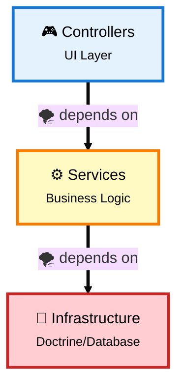
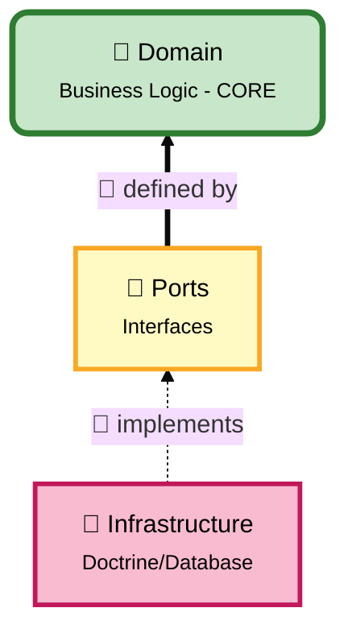
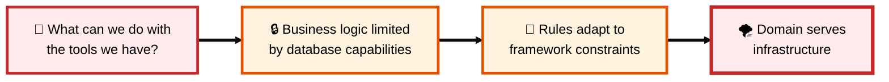
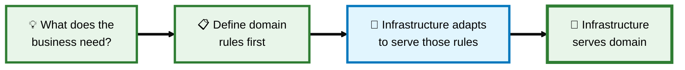

# Why Hexagonal Architecture

## Table of Contents

- [2.1 The Fundamental Question](#21-the-fundamental-question)
- [2.2 Traditional Layered Architecture: The Critical Problems](#22-traditional-layered-architecture-the-critical-problems)
- [2.3 Hexagonal Architecture: Inverting the Dependency Chain](#23-hexagonal-architecture-inverting-the-dependency-chain)
- [2.4 Real-World Scenarios](#24-real-world-scenarios)
- [2.5 Benefits Comparison](#25-benefits-comparison)
- [2.6 Cost Predictability: The "5-Day Rule"](#26-cost-predictability-the-5-day-rule)
- [2.7 Database Migration: The Ultimate Test](#27-database-migration-the-ultimate-test)
- [2.8 Decision Guide](#28-decision-guide)
- [2.9 Summary](#29-summary)
- [2.10 Hexagonal Architecture & Core Design Principles](#210-hexagonal-architecture--core-design-principles)
- [2.11 Complete Decision Tree](#211-complete-decision-tree-what-to-create-and-how-)

---

## 2.1 The Fundamental Question

**Everything is coupled anyway, so why bother?**

Your code will always call other code. Repositories, services, databases—everything is connected. The question is not about eliminating coupling (impossible), but about **controlling the direction** of coupling.

---

## 2.2 Traditional Layered Architecture: The Critical Problems

In a traditional layered architecture, business logic (Services) depends directly on infrastructure (Database, Framework, Libraries). This creates a dangerous dependency chain with the following critical problems:

### 2.2.1 Framework Prison
- Business logic is tightly coupled to Doctrine, Symfony, or any framework
- Switching from MySQL to MongoDB requires rewriting everything
- Framework update breaking APIs stops the entire application
- **Real cost:** Weeks of rewriting for technology changes

### 2.2.2 Testing Complexity
- Every test requires a real database, containers, and fixtures
- Test suite takes 10 minutes instead of 10 seconds
- Cannot test business rules without booting the entire framework
- **Real cost:** Developers wait, lose focus, tests get skipped

### 2.2.3 Lost Business Rules
- Rules scattered across controllers, services, entities, templates
- Question: "Can we cancel a shipped order?" requires searching multiple locations
- Same rule duplicated in 5 different places with slight variations
- **Real cost:** Bugs, inconsistencies, impossible maintenance

### 2.2.4 Cannot Evolve
- Adding GraphQL API requires duplicating all logic
- Adding CLI commands requires copy-pasting controllers
- Planning gRPC requires starting from scratch
- **Real cost:** Code duplication, diverging implementations

### 2.2.5 Death by Thousand Cuts
- "Just one quick change" touches 20 files
- Simple features become 3-day tasks
- Fear of refactoring because everything is interconnected
- **Real cost:** Technical debt accumulates until rewrite is the only option

---

## 2.3 Hexagonal Architecture: Inverting the Dependency Chain

**Core Principle:** Make business logic independent by inverting who depends on whom.

### 2.3.0 The Laptop Analogy 💻🔌

Before diving into technical details, let's use a simple, everyday analogy:

**Your Laptop and USB Devices**

Think about your laptop and how it connects to external devices:

- Your **laptop** is the core (business logic)
- Your laptop has **USB ports** (interfaces/contracts)
- You can plug in different **devices** (adapters):
  - USB mouse
  - USB keyboard
  - USB external hard drive
  - USB printer
  - USB phone charger

**Key Insight:** Your laptop doesn't care WHAT you plug in, as long as it respects the USB standard (interface).

**What if USB didn't exist?**
- Every laptop would need a specific Sony mouse port, HP keyboard port, Samsung phone port
- Want to change your mouse brand? Buy a new laptop!
- This is exactly how **traditional layered architecture** works 🌪️

**With USB (Ports & Adapters):**
- Your laptop defines: "I need a USB port"
- Devices provide: "I implement USB"
- Change devices anytime without changing the laptop
- This is **Hexagonal Architecture** 🎯

**Mapping to Software:**

| Real World | Software |
|------------|----------|
| 💻 **Laptop** | Domain (Business Logic) |
| 🔌 **USB Port** | Port Interface (Contract) |
| 🖱️ **USB Mouse** | Doctrine Adapter |
| ⌨️ **USB Keyboard** | MongoDB Adapter |
| 🖨️ **USB Printer** | Redis Adapter |
| 📱 **USB Phone** | InMemory Adapter (for tests) |

**The Power:**
- Your laptop (domain) doesn't know if a mouse, keyboard, or hard drive is plugged in
- It just knows: "Something respecting USB is connected"
- Your domain doesn't know if MySQL, MongoDB, or Redis is used
- It just knows: "Something respecting `UserRepositoryInterface` is connected"

**Real Example in Code:**

```php
// 🌪️ Traditional: Domain depends on concrete MySQL
class OrderService {
    public function __construct(
        private DoctrineRepository $repo  // Tightly coupled!
    ) {}
}
// Problem: Want MongoDB? Rewrite OrderService!

// 🎯 Hexagonal: Domain depends on interface (USB port)
class PlaceOrderHandler {
    public function __construct(
        private OrderRepositoryInterface $repo  // Just a port!
    ) {}
}
// Solution: Want MongoDB? Create MongoOrderRepository implementing the interface!
```

**Why This Matters:**

Just like you can use your mouse on any laptop (Windows, Mac, Linux) because they all have USB ports, your business logic works with any database (MySQL, MongoDB, Redis) because they all implement your port interfaces.

You control the "USB standard" (interface), not the device manufacturers (infrastructure libraries).

---

### 2.3.1 Dependency Direction

**Traditional (Dependencies flow DOWN):**



**Problem:** Change database = rewrite business logic 🌪️

**Hexagonal (Dependencies flow INWARD):**



**Solution:** Change database = new adapter, business logic untouched 🎯

### 2.3.2 Practical Implications

**Traditional:** `Order` entity has Doctrine annotations. Remove Doctrine? Domain breaks.
- 🔴 Like having a laptop with a hardwired Sony mouse - want a Logitech? Buy a new laptop!

**Hexagonal:** `Order` is pure PHP with business rules. Infrastructure adapts to it. Remove Doctrine? Create a new adapter.
- 🟢 Like having a laptop with USB ports - want a different mouse? Just plug it in!

**Key insight:** Business logic doesn't know (and doesn't care) if data is stored in MySQL, MongoDB, Redis, or a text file. It defines WHAT it needs (interfaces/ports), and infrastructure provides HOW (adapters).

**Back to the Laptop Analogy:**
- Your laptop doesn't have "Logitech mouse code" or "HP printer code" inside
- It has generic USB port logic: "Accept anything that implements USB"
- Similarly, your domain doesn't have "Doctrine code" or "MongoDB code" inside
- It has generic port logic: "Accept anything that implements `OrderRepositoryInterface`"

**The Freedom This Gives You:**
- 🔄 Switch databases like swapping USB devices
- 🧪 Test with in-memory storage (like testing laptop without plugging real devices)
- 🚀 Deploy with different storage per environment (dev/staging/prod)
- 🔌 Add new storage types without touching business logic

---

## 2.4 Real-World Scenarios

### 2.4.1 Framework Update (Symfony 4 to 7)

**Layered Architecture Impact:**
- Business services depend on Symfony APIs (TokenStorage, Session, etc.)
- Framework APIs changed? Business logic needs rewriting
- Risk: Breaking changes cascade through entire application
- Time: Days to weeks fixing compatibility issues

**Hexagonal Architecture Impact:**
- Business handlers depend only on your own interfaces
- Framework APIs changed? Update adapters, handlers stay untouched
- Risk: Isolated to infrastructure layer
- Time: Hours updating specific adapters

### 2.4.2 Testing Speed Comparison

**Layered Architecture Reality:**
- Boot Symfony kernel for every test
- Connect to database, load fixtures
- Run test with full I/O operations
- **Time per test:** 2-3 seconds
- **Result:** 100 tests = 5 minutes (developers skip tests)

**Hexagonal Architecture Reality:**
- Instantiate handler with in-memory repository
- Test pure PHP logic with zero I/O
- **Time per test:** 0.001 seconds
- **Result:** 1000 tests = 1 second (developers run tests constantly)

**Impact:** You can run 1000 hexagonal tests in the time layered runs 10 tests.

**Laptop Analogy for Testing:**
- 🔴 **Traditional**: Testing laptop functionality requires plugging in real mouse, keyboard, printer, etc.
  - Takes forever to set up
  - Need physical devices for every test
  - If printer is broken, can't test laptop!

- 🟢 **Hexagonal**: Testing laptop functionality with "mock USB devices"
  - Instant setup (no physical devices needed)
  - Test laptop logic in isolation
  - Real devices can be broken, laptop tests still pass!

This is exactly what in-memory repositories do - they're "mock USB devices" for your tests!

### 2.4.3 Lost Business Rules

**The Question:** "Can we cancel a shipped order?"

**Layered Architecture:** Rule scattered across:
- Controller (validation: `if ($status === 'shipped') return error;`)
- Service (business logic with different check)
- Template (UI hiding/showing cancel button with yet another condition)
- Repository (queries filtering "cancelable" orders)

**Result:** 4 different implementations, slight variations, which one is correct? Nobody knows.

**Hexagonal Architecture:** One method in Domain:
```php
Order->cancel() throws exception if status is SHIPPED
```

**Result:** ONE source of truth. Crystal clear. Impossible to miss.

### 2.4.4 Adding New Interface (GraphQL)

**Layered Architecture Problem:**
- Business logic mixed in REST controllers
- Want GraphQL? Must copy-paste logic
- Result: Same business rules duplicated in 2+ places
- Maintenance nightmare: change rule = update everywhere

**Hexagonal Architecture Solution:**
- Business logic in handler (once)
- REST controller dispatches command
- GraphQL resolver dispatches same command
- CLI command dispatches same command
- Result: Write once, use everywhere

**Laptop Analogy for Multiple Interfaces:**
- 🔴 **Traditional**: Want to use mouse with desktop, laptop, and tablet?
  - Need to buy 3 different mice (one for each device)
  - Each mouse has custom logic for its device
  - Update mouse firmware? Do it 3 times!

- 🟢 **Hexagonal**: One USB mouse works with ALL devices
  - Same mouse plugs into desktop, laptop, tablet
  - Mouse logic written once
  - Update firmware once, works everywhere!

Your business logic is the "mouse" - write it once, plug it into REST/GraphQL/CLI/gRPC!

---

## 2.5 Benefits Comparison

| Benefit | Concrete Impact | Time Saved |
|---------|----------------|------------|
| **Direction Control** | Change database, framework, or any infrastructure without touching business logic | Weeks to Days |
| **Single Source of Truth** | Business rules in ONE place (Domain), not scattered across 10 files | 50% less bugs |
| **Lightning Tests** | 1000x faster (in-memory vs database I/O) | 10 min to 10 sec |
| **Technology Freedom** | Swap MySQL to MongoDB, Doctrine to Another ORM in days not months | 80% effort reduction |
| **Reusability** | Same business logic for REST, GraphQL, CLI, gRPC, message queue | Write once, use everywhere |
| **Team Scalability** | Juniors on adapters (infrastructure), Seniors on domain (business) | Clear separation of skill levels |
| **Long-term Viability** | Code survives framework updates, technology shifts, team changes | 10 years vs 10 months |

---

## 2.6 Cost Predictability: The "5-Day Rule"

In traditional layered architecture, components are tightly coupled. When you add feature "X" after two years into the project, you must navigate code where business logic is mixed with database concerns and framework dependencies. Each modification risks breaking hidden dependencies.

### 2.6.1 The Layered Architecture "Fail"

**The Problem:** Time spent is no longer dedicated to coding the feature itself, but to:
- Doing archaeology in the codebase
- Understanding tangled dependencies
- Fixing side effects and cascading breakages
- Working around technical debt accumulated over time

**Real Impact:** A feature that should take 5 days now takes 15 days because:
- 3 days understanding existing code
- 5 days implementing the feature
- 7 days fixing broken tests and side effects

### 2.6.2 The Hexagonal Architecture Advantage

**The Solution:** Because the domain is isolated, adding business feature "X" happens in a protected environment (the core). Technical complexity (ports and adapters) is pushed to the periphery.

**Result:** Similar features always cost approximately **5 days**, because technical "friction" doesn't increase with business complexity growth.

**Why This Works:**
- 📦 **Isolated Domain**: Business logic lives in its own protected space
- 🔌 **Peripheral Complexity**: Technical concerns stay at the edges
- 📏 **Predictable Costs**: No hidden dependencies to unravel
- 🎯 **Focus**: Developers code features, not fix technical debt

### 2.6.3 Tests: The Safety Net That Accelerates Development

This is the most powerful technical argument for maintaining the 5-day velocity:

**High-Fidelity, Fast Tests:**
- Write unit tests for your domain covering 100% of business rules
- Never need to start a database or server
- Tests run in milliseconds, not seconds

**Immediate Feedback:**
- Developer knows in **10 seconds** if new feature "X" broke something
- In traditional architecture, database-dependent tests are slow or skipped
- Bugs discovered later cost **10x-100x more** to fix

**Example:**
```php
// 🎯 Hexagonal: Test in 10ms
$handler = new PlaceOrderHandler(new InMemoryOrderRepository());
$result = $handler->handle($command);
$this->assertTrue($result->isSuccess());

// 🌪️ Traditional: Test in 2-3 seconds
// - Boot Symfony kernel
// - Connect to database
// - Load fixtures
// - Execute test
// - Rollback transaction
```

### 2.6.4 The Investment vs. Credit Analogy

**Layered Architecture is Consumer Credit:**
- ✨ Easy and fast at the beginning
- 💸 But interest (technical debt) compounds
- 🔒 Eventually, debt strangles you
- 💰 Every feature becomes exponentially more expensive

**Hexagonal Architecture is Investment:**
- 💪 Pay a bit more upfront (learning curve, initial structure)
- 📈 Each future feature costs its **real price**
- 🚫 No additional complexity tax
- 💎 Value grows over time instead of degrading

### 2.6.5 The Long-Term Math

**Year 1:** Both architectures similar speed

**Year 2:**
- Layered: Features take 2x longer (archaeology + side effects)
- Hexagonal: Features still take baseline time

**Year 3:**
- Layered: Features take 3-5x longer (massive technical debt)
- Hexagonal: Features still take baseline time

**Year 5:**
- Layered: Major refactoring or rewrite required
- Hexagonal: Still delivering features at predictable pace

**The "5-Day Rule" in Practice:**
- Traditional: "Similar" feature in Year 3 = 15-25 days
- Hexagonal: "Similar" feature in Year 3 = 5-7 days
- **Savings:** 10-20 days per feature × 50 features/year = 500-1000 days saved

---

## 2.7 Database Migration: The Ultimate Test

**Challenge:** Change from MySQL (Doctrine ORM) to MongoDB (Document Database)

**Laptop Analogy:**
- 🔴 **Traditional**: Laptop hardwired to Sony mouse - want Logitech? Buy new laptop and reinstall all your software!
- 🟢 **Hexagonal**: Laptop with USB port - want different mouse? Unplug Sony, plug Logitech. Laptop works instantly!

This is database migration in a nutshell. Let's see the real impact:

### Layered Architecture Impact:

**What must change:**
1. All Entities with `@ORM` annotations must be rewritten as documents
2. All Repositories using Doctrine API must be rewritten for MongoDB driver
3. All Services depending on EntityManager must refactor dependencies
4. All Tests with database fixtures must be rewritten for MongoDB
5. All Query Builder usage must be rewritten as MongoDB queries

**Estimated effort:** 2-4 weeks of full-team work
**Risk level:** HIGH - touching 60-80% of codebase
**Regression probability:** Very high - every query must be rewritten and retested

### Hexagonal Architecture Impact:

**What must change:**
1. Create `MongoUserRepository implements UserRepositoryInterface`
2. Create `MongoOrderRepository implements OrderRepositoryInterface`
3. Update dependency injection configuration
4. Done.

**What stays the same:**
- All Domain entities (pure PHP, no annotations)
- All Application handlers (depend on interfaces, not implementations)
- All Business rules (in Domain, framework-agnostic)
- All Unit tests (use in-memory repositories)

**Estimated effort:** 1-2 days
**Risk level:** LOW - only infrastructure adapters change
**Regression probability:** Minimal - business logic untouched

**The Math:** Hexagonal saves you 10-20x the effort on technology changes.

---

## 2.8 Decision Guide

### 2.8.1 Choose Hexagonal Architecture When:

| Criterion | Why It Matters |
|-----------|---------------|
| **Long-term project (> 2 years)** | Architecture ROI pays off over time as tech evolves |
| **Growing team (> 3 devs)** | Clear boundaries help multiple developers work in parallel |
| **Complex business rules** | Need single source of truth for domain logic |
| **Multiple interfaces** | REST + GraphQL + CLI + Events = reusable handlers |
| **Tech might change** | Framework updates, database migrations, cloud migrations |
| **Testing is critical** | Fast, reliable tests enable continuous deployment |
| **Enterprise/production** | Business continuity requires technology independence |

### 2.8.2 Stick with Simpler Architecture When:

| Situation | Better Approach |
|-----------|-----------------|
| **Quick prototype (< 3 months)** | Speed matters more than structure |
| **Simple CRUD** | Little to no business logic = overkill |
| **Solo dev, tiny project** | Overhead not justified |
| **Stack 100% frozen** | If you're SURE nothing will ever change (rarely true) |

### 2.8.3 The Core Truth About Decoupling

**What People Think Decoupling Means:**
> "My code doesn't depend on anything! Zero coupling!"

**Reality:** Impossible. Your code will always call other code. That's programming.

**What Decoupling ACTUALLY Means:**
> "My business logic defines WHAT it needs (interfaces). Infrastructure provides HOW (implementations)."

#### The Fundamental Shift

**Traditional Mindset:**



**Hexagonal Mindset:**



---

## 2.9 Summary

**Hexagonal architecture is not about:**
- Eliminating all coupling
- Making code more complex
- Following a trendy pattern

**Hexagonal architecture IS about:**
- **Direction Control:** Your business logic depends on abstractions, infrastructure depends on your business
- **Stability:** Business rules stable while technology changes around them
- **Clarity:** One place for each business rule, impossible to miss
- **Freedom:** Change tech stack in days, not months
- **Speed:** Test suite runs in seconds, not minutes

**The Question to Ask:**
> "If we need to change databases, frameworks, or add new interfaces next year, do I want to spend 2 weeks or 2 days?"

If your answer is "2 days," hexagonal architecture is your solution.

**Remember:** The coupling doesn't go away. You're still calling repositories and services. What changes is **who is in charge**—your business logic or your database.

---

## 2.10 Hexagonal Architecture & Core Design Principles

Hexagonal Architecture isn't just a pattern—it's the natural embodiment of fundamental software engineering principles. Here's how it adheres to and enforces the most important design principles:

### 2.10.1 DRY (Don't Repeat Yourself)

**The Principle:** Every piece of knowledge should have a single, unambiguous representation in your system.

**How Hexagonal Enforces DRY:**

**Traditional Layered Architecture - DRY Violations:**
```php
// Controller
if ($order->getStatus() === 'shipped') {
    throw new Exception('Cannot cancel shipped order');
}

// Service
if ($order->getStatus() === 'shipped') {
    return false; // Same rule, different implementation
}

// Template

    <button>Cancel</button>  {# Same rule, third place #}

```

**Hexagonal Architecture - Single Source of Truth:**
```php
// Domain/Entity/Order.php - ONE place
public function cancel(): void
{
    if ($this->status->isShipped()) {
        throw new CannotCancelShippedOrder();
    }
    $this->status = OrderStatus::cancelled();
}

// Everywhere else just calls: $order->cancel()
```

**Impact:**
- Business rules written **once** in the Domain
- Controllers, CLI commands, GraphQL resolvers all use the same logic
- Change rule once, applies everywhere
- No diverging implementations

---

### 2.10.2 KISS (Keep It Simple, Stupid)

**The Principle:** Simplicity should be a key goal; unnecessary complexity should be avoided.

**How Hexagonal Enforces KISS:**

**The Clarity:**
- Domain entities are **pure PHP** (no annotations, no framework magic)
- Handlers do **one thing** (single responsibility)
- Ports are **simple interfaces** (clear contracts)
- Each layer has **one purpose** (no mixed concerns)

**Example - Simple Domain Entity:**
```php
// Simple, readable, no framework coupling
final class Order
{
    private OrderId $id;
    private OrderStatus $status;
    private Money $total;

    public function place(): void
    {
        if ($this->total->isZero()) {
            throw new EmptyOrderException();
        }
        $this->status = OrderStatus::placed();
    }
}
```

**What Makes It KISS:**
- No annotations cluttering the code
- No framework dependencies to understand
- Pure business logic, nothing else
- Junior developers can read and understand immediately

**Contrast with Traditional:**
```php
// Complex: ORM annotations, framework coupling, mixed concerns
/**
 * @ORM\Entity(repositoryClass="OrderRepository")
 * @ORM\Table(name="orders", indexes={...})
 * @ORM\HasLifecycleCallbacks
 */
class Order
{
    /** @ORM\Column(type="decimal", precision=10, scale=2) */
    private $total;

    /** @ORM\PrePersist */
    public function validate() { ... }
}
```

---

### 2.10.3 YAGNI (You Aren't Gonna Need It)

**The Principle:** Don't add functionality until it's necessary.

**How Hexagonal Enforces YAGNI:**

**The Protection:**
Hexagonal architecture prevents over-engineering by forcing you to focus on **what the business needs right now**, not hypothetical future scenarios.

**Example - Creating Exactly What You Need:**

**Bad (YAGNI Violation):**
```php
// Creating generic repository with 50 methods "just in case"
interface RepositoryInterface
{
    public function find($id);
    public function findAll();
    public function findBy(array $criteria);
    public function findOneBy(array $criteria);
    public function save($entity);
    public function remove($entity);
    public function count(array $criteria);
    public function paginate($page, $limit);
    // ... 42 more methods you don't use
}
```

**Good (YAGNI Compliant - Hexagonal Way):**
```php
// Only create methods you actually need TODAY
interface UserRepositoryInterface
{
    public function save(User $user): void;
    public function ofId(UserId $id): ?User;
    // That's it! Create new interfaces when needed.
}
```

**How Hexagonal Helps:**
- Ports (interfaces) force you to define **only what you need**
- Small, focused interfaces prevent premature generalization
- Easy to add methods later when requirements emerge
- No framework base classes forcing unused methods on you

---

### 2.10.4 SoC (Separation of Concerns)

**The Principle:** Different concerns should be handled by different parts of the system.

**How Hexagonal Enforces SoC:**

Hexagonal Architecture is **fundamentally about SoC**—it's built into the structure.

**The Four Concerns, Clearly Separated:**

| Concern | Layer | Responsibility | Example |
|---------|-------|----------------|---------|
| **Business Rules** | Domain | "What can/cannot happen?" | `Order->cancel()` |
| **Use Cases** | Application | "How to orchestrate?" | `PlaceOrderHandler` |
| **User Interface** | UI | "How to present/receive?" | `OrderController`, `CLI Command` |
| **External World** | Infrastructure | "How to persist/send?" | `DoctrineOrderRepository` |

**Real Example:**

**Traditional - Mixed Concerns:**
```php
// Controller doing EVERYTHING (UI + Business + Infrastructure)
class OrderController
{
    public function cancel(Request $request, EntityManager $em)
    {
        // UI concern
        $orderId = $request->get('id');

        // Infrastructure concern
        $order = $em->getRepository(Order::class)->find($orderId);

        // Business concern
        if ($order->getStatus() === 'shipped') {
            throw new Exception('Cannot cancel');
        }
        $order->setStatus('cancelled');

        // Infrastructure concern
        $em->persist($order);
        $em->flush();

        // UI concern
        return new JsonResponse(['success' => true]);
    }
}
```

**Hexagonal - Separated Concerns:**
```php
// UI Layer - Only handles HTTP
class OrderController
{
    public function __construct(private MessageBusInterface $bus) {}

    public function cancel(Request $request): JsonResponse
    {
        $command = new CancelOrder($request->get('id'));
        $this->bus->dispatch($command);
        return new JsonResponse(['success' => true]);
    }
}

// Application Layer - Orchestration
class CancelOrderHandler
{
    public function __construct(private OrderRepositoryInterface $orders) {}

    public function __invoke(CancelOrder $command): void
    {
        $order = $this->orders->ofId(new OrderId($command->orderId));
        $order->cancel(); // Business logic in Domain
        $this->orders->save($order);
    }
}

// Domain Layer - Business Rules
class Order
{
    public function cancel(): void
    {
        if ($this->status->isShipped()) {
            throw new CannotCancelShippedOrder();
        }
        $this->status = OrderStatus::cancelled();
    }
}

// Infrastructure Layer - Persistence
class DoctrineOrderRepository implements OrderRepositoryInterface
{
    public function save(Order $order): void { ... }
    public function ofId(OrderId $id): ?Order { ... }
}
```

**The Benefits:**
- **Change UI:** Swap REST for GraphQL without touching business logic
- **Change Database:** Swap MySQL for MongoDB without touching business logic
- **Change Business Rules:** Modify domain without touching infrastructure or UI
- **Test in Isolation:** Test each concern separately

---

### 2.10.5 Dependency Injection (DI)

**The Principle:** Depend on abstractions, not concretions. Inject dependencies rather than creating them.

**How Hexagonal Enforces DI:**

Hexagonal Architecture is **fundamentally built on Dependency Injection**—it's impossible to implement it without DI.

**The Pattern:**
- Handlers depend on **interfaces** (ports), not concrete implementations
- Dependencies are **injected** via constructor
- Framework handles **wiring** via dependency injection container
- **Inversion of Control** is mandatory, not optional

**Example:**

**Without DI (Tightly Coupled):**
```php
// Handler creates its own dependencies - IMPOSSIBLE to test or swap
class PlaceOrderHandler
{
    public function __invoke(PlaceOrder $command): void
    {
        // Creating concrete implementation inside!
        $repository = new DoctrineOrderRepository();
        $emailer = new SmtpEmailSender();

        // Now stuck with Doctrine and SMTP forever
        $order = Order::create($command->userId, $command->items);
        $repository->save($order);
        $emailer->send($order->userEmail(), 'Order placed');
    }
}
```

**With DI (Hexagonal Way):**
```php
// Handler receives dependencies via constructor - testable and swappable
class PlaceOrderHandler
{
    public function __construct(
        private OrderRepositoryInterface $orders,      // Port (abstraction)
        private EmailSenderInterface $emailer          // Port (abstraction)
    ) {}

    public function __invoke(PlaceOrder $command): void
    {
        $order = Order::create($command->userId, $command->items);
        $this->orders->save($order);
        $this->emailer->send($order->userEmail(), 'Order placed');
    }
}

// In tests: inject in-memory implementations
// In production: inject Doctrine + SMTP
// In staging: inject Doctrine + SendGrid
```

**Why This Matters:**
- **Testability:** Inject in-memory fakes for lightning-fast tests
- **Flexibility:** Swap implementations without changing handler code
- **Clarity:** Dependencies are explicit in constructor
- **Framework Agnostic:** Handler doesn't know about Symfony/Laravel/etc.

---

### 2.10.6 Factory Pattern

**The Principle:** Encapsulate complex object creation logic in dedicated factories.

**How Hexagonal Promotes Factory Pattern:**

Domain entities often have complex creation rules. Hexagonal Architecture promotes factories to keep entities clean and focused on business logic. **Factories work hand-in-hand with the CQRS pattern** - Command Handlers use factories to create entities from Commands, ensuring consistent object creation across all entry points (HTTP, CLI, GraphQL).

**The Pattern:**
- **Factory** handles complex entity creation
- **Entity constructor** stays simple (just assignment)
- **Business rules** for creation live in factory
- **Validation** happens during creation
- **CQRS integration:** Command Handlers delegate creation to factories

**Example:**

**Without Factory (Entity Does Everything):**
```php
// Entity constructor bloated with creation logic
class Order
{
    public function __construct(
        UserId $userId,
        array $items,
        ShippingAddress $address,
        PaymentMethod $payment
    ) {
        // Validation logic in constructor!
        if (empty($items)) {
            throw new EmptyOrderException();
        }

        // Business rules in constructor!
        if (count($items) > 100) {
            throw new TooManyItemsException();
        }

        // Calculation in constructor!
        $this->total = $this->calculateTotal($items);
        $this->tax = $this->calculateTax($this->total, $address);

        // Assignment
        $this->id = OrderId::generate();
        $this->userId = $userId;
        $this->items = $items;
        // ...
    }
}
```

**With Factory (Clean Separation):**
```php
// Entity: Simple, focused on behavior
class Order
{
    private function __construct(
        private OrderId $id,
        private UserId $userId,
        private OrderItems $items,
        private Money $total,
        private OrderStatus $status
    ) {}

    // Behavior methods
    public function cancel(): void { ... }
    public function ship(): void { ... }
}

// Factory: Handles complex creation
class OrderFactory
{
    public function __construct(
        private TaxCalculator $taxCalculator,
        private DiscountCalculator $discountCalculator
    ) {}

    public function create(
        UserId $userId,
        array $rawItems,
        ShippingAddress $address,
        PaymentMethod $payment
    ): Order {
        // Validation
        if (empty($rawItems)) {
            throw new EmptyOrderException();
        }

        // Complex construction logic
        $items = OrderItems::fromArray($rawItems);
        $subtotal = $items->calculateTotal();
        $discount = $this->discountCalculator->calculate($userId, $subtotal);
        $tax = $this->taxCalculator->calculate($subtotal, $address);
        $total = $subtotal->subtract($discount)->add($tax);

        // Clean creation
        return new Order(
            OrderId::generate(),
            $userId,
            $items,
            $total,
            OrderStatus::pending()
        );
    }
}

// Usage in handler
class PlaceOrderHandler
{
    public function __construct(
        private OrderFactory $factory,
        private OrderRepositoryInterface $orders
    ) {}

    public function __invoke(PlaceOrder $command): void
    {
        $order = $this->factory->create(
            $command->userId,
            $command->items,
            $command->address,
            $command->payment
        );

        $this->orders->save($order);
    }
}
```

**Benefits:**
- **Entity Stays Clean:** Focused on business behavior, not creation
- **Testable Creation:** Test factory logic independently
- **Reusable:** Same factory used by multiple handlers
- **Complex Logic Isolated:** Tax, discounts, validation in one place

---

### 2.10.7 DTO Pattern (Data Transfer Objects)

**The Principle:** Use simple data structures to transfer data between layers without coupling to business logic.

**How Hexagonal Promotes DTOs:**

Hexagonal Architecture uses DTOs extensively to maintain layer boundaries and prevent coupling.

**The Three Main DTO Types:**

**1. Commands & Queries (Application Layer Input):**
```php
// Command DTO - Input to write operations
final readonly class PlaceOrder
{
    public function __construct(
        public string $userId,
        public array $items,
        public string $shippingAddress,
        public string $paymentMethod
    ) {}
}

// Query DTO - Input to read operations
final readonly class FindOrderById
{
    public function __construct(
        public string $orderId
    ) {}
}
```

**2. Response DTOs (Application Layer Output):**
```php
// Response DTO - Output from queries
final readonly class OrderView
{
    public function __construct(
        public string $id,
        public string $status,
        public float $total,
        public array $items,
        public string $createdAt
    ) {}

    public static function fromEntity(Order $order): self
    {
        return new self(
            $order->id()->value(),
            $order->status()->value(),
            $order->total()->amount(),
            $order->items()->toArray(),
            $order->createdAt()->format('Y-m-d H:i:s')
        );
    }
}
```

**3. Input DTOs (UI Layer to Application):**
```php
// Input DTO - From forms/API to commands
final readonly class CreateUserInput
{
    public function __construct(
        public string $email,
        public string $password,
        public string $firstName,
        public string $lastName
    ) {}

    public function toCommand(): RegisterUser
    {
        return new RegisterUser(
            $this->email,
            $this->password,
            $this->firstName,
            $this->lastName
        );
    }
}
```

**Why DTOs Matter in Hexagonal:**

```php
// WITHOUT DTOs - Tight Coupling
class OrderController
{
    public function create(Request $request)
    {
        // Domain entity exposed to UI layer!
        $order = new Order(
            new UserId($request->get('user_id')),
            $request->get('items'),
            // ...
        );

        // UI knows about domain internals - BAD!
    }
}

// WITH DTOs - Proper Decoupling
class OrderController
{
    public function __construct(private MessageBusInterface $bus) {}

    public function create(Request $request): JsonResponse
    {
        // DTO: Simple data structure
        $command = new PlaceOrder(
            $request->get('user_id'),
            $request->get('items'),
            $request->get('shipping_address'),
            $request->get('payment_method')
        );

        // Dispatch to application layer
        $this->bus->dispatch($command);

        return new JsonResponse(['success' => true]);
    }
}
```

**Benefits:**
- **Layer Independence:** UI doesn't know about Domain entities
- **Versioning:** Change DTOs without breaking domain
- **Serialization:** Easy to serialize/deserialize for APIs
- **Validation:** Validate at boundaries before reaching domain
- **Documentation:** DTOs serve as API contracts

---

### 2.10.8 Event Sourcing Pattern

**The Principle:** Store state changes as a sequence of events rather than current state.

**How Hexagonal Promotes Event Sourcing:**

Hexagonal Architecture's separation of concerns makes Event Sourcing a natural fit. Domain events are first-class citizens.

**The Pattern:**
- **Domain Events** record what happened
- **Event Store** persists event stream
- **Event Handlers** react to events
- **Projections** rebuild state from events

**Example:**

**Traditional State Storage:**
```php
// Only current state stored
class Order
{
    private OrderStatus $status = OrderStatus::PENDING;

    public function place(): void
    {
        $this->status = OrderStatus::PLACED;
        // Lost: WHEN it was placed, WHO placed it
    }

    public function ship(): void
    {
        $this->status = OrderStatus::SHIPPED;
        // Lost: WHEN it shipped, tracking number, carrier
    }
}

// Database stores: { status: "SHIPPED" }
// History lost forever!
```

**Event Sourcing in Hexagonal:**
```php
// Domain Event (immutable DTO)
final readonly class OrderPlaced
{
    public function __construct(
        public OrderId $orderId,
        public UserId $userId,
        public Money $total,
        public DateTimeImmutable $occurredAt
    ) {}
}

final readonly class OrderShipped
{
    public function __construct(
        public OrderId $orderId,
        public string $trackingNumber,
        public string $carrier,
        public DateTimeImmutable $occurredAt
    ) {}
}

// Entity that emits events
class Order
{
    private array $recordedEvents = [];
    private OrderStatus $status;

    public function place(): void
    {
        if (!$this->status->isPending()) {
            throw new OrderAlreadyPlacedException();
        }

        $this->status = OrderStatus::placed();

        // Record what happened
        $this->recordedEvents[] = new OrderPlaced(
            $this->id,
            $this->userId,
            $this->total,
            new DateTimeImmutable()
        );
    }

    public function ship(string $trackingNumber, string $carrier): void
    {
        if (!$this->status->isPlaced()) {
            throw new CannotShipUnplacedOrderException();
        }

        $this->status = OrderStatus::shipped();

        // Record what happened
        $this->recordedEvents[] = new OrderShipped(
            $this->id,
            $trackingNumber,
            $carrier,
            new DateTimeImmutable()
        );
    }

    public function pullEvents(): array
    {
        $events = $this->recordedEvents;
        $this->recordedEvents = [];
        return $events;
    }
}

// Handler publishes events
class PlaceOrderHandler
{
    public function __construct(
        private OrderRepositoryInterface $orders,
        private EventBusInterface $eventBus
    ) {}

    public function __invoke(PlaceOrder $command): void
    {
        $order = Order::create($command->userId, $command->items);
        $order->place();

        $this->orders->save($order);

        // Publish all domain events
        foreach ($order->pullEvents() as $event) {
            $this->eventBus->publish($event);
        }
    }
}

// Event Subscriber reacts to events
class SendOrderConfirmationEmail
{
    public function __construct(private EmailSenderInterface $emailer) {}

    public function __invoke(OrderPlaced $event): void
    {
        $this->emailer->send(
            $event->userId,
            'Order Confirmation',
            "Your order #{$event->orderId->value()} has been placed!"
        );
    }
}

// Event Store (if doing full event sourcing)
interface EventStoreInterface
{
    public function append(OrderId $orderId, array $events): void;
    public function loadEvents(OrderId $orderId): array;
}

// Rebuild entity from events
class OrderEventSourcedRepository implements OrderRepositoryInterface
{
    public function __construct(private EventStoreInterface $eventStore) {}

    public function ofId(OrderId $id): ?Order
    {
        $events = $this->eventStore->loadEvents($id);

        if (empty($events)) {
            return null;
        }

        // Replay events to rebuild state
        return Order::fromEvents($events);
    }
}
```

**Why Event Sourcing Fits Hexagonal:**

| Hexagonal Concept | Event Sourcing Benefit |
|-------------------|------------------------|
| **Domain Events** | Natural part of domain model |
| **Ports** | Easy to swap event store implementations |
| **Adapters** | Event subscribers in infrastructure layer |
| **SoC** | Events separate "what happened" from "what to do" |
| **Testability** | Test event emission without infrastructure |

**Benefits:**
- **Complete Audit Trail:** Know WHEN, WHO, WHAT for everything
- **Time Travel:** Reconstruct state at any point in time
- **Business Intelligence:** Analyze event streams for insights
- **Debugging:** Replay events to reproduce bugs
- **CQRS Ready:** Events naturally separate writes from reads

---

### 2.10.9 Strategy Pattern

**The Principle:** Define a family of algorithms, encapsulate each one, and make them interchangeable.

**How Hexagonal Promotes Strategy Pattern:**

Hexagonal Architecture's use of ports (interfaces) is essentially the Strategy pattern at the architectural level. Every port is a strategy contract.

**The Pattern:**
- **Port Interface** defines the strategy contract
- **Multiple Adapters** implement different strategies
- **Dependency Injection** selects which strategy to use
- **Runtime Switching** possible via configuration or business logic

**Example 1: Payment Processing Strategies**

```php
// Port - Strategy Interface
interface PaymentProcessorInterface
{
    public function charge(Money $amount, PaymentDetails $details): PaymentResult;
    public function refund(TransactionId $transactionId, Money $amount): RefundResult;
}

// Strategy 1: Stripe Adapter
class StripePaymentProcessor implements PaymentProcessorInterface
{
    public function __construct(private StripeClient $client) {}

    public function charge(Money $amount, PaymentDetails $details): PaymentResult
    {
        $charge = $this->client->charges->create([
            'amount' => $amount->cents(),
            'currency' => $amount->currency(),
            'source' => $details->token()
        ]);

        return PaymentResult::success($charge->id);
    }

    public function refund(TransactionId $transactionId, Money $amount): RefundResult
    {
        // Stripe-specific refund logic
    }
}

// Strategy 2: PayPal Adapter
class PayPalPaymentProcessor implements PaymentProcessorInterface
{
    public function __construct(private PayPalClient $client) {}

    public function charge(Money $amount, PaymentDetails $details): PaymentResult
    {
        $payment = $this->client->createPayment([
            'amount' => $amount->cents(),
            'currency_code' => $amount->currency(),
            'payment_method_token' => $details->token()
        ]);

        return PaymentResult::success($payment->id);
    }

    public function refund(TransactionId $transactionId, Money $amount): RefundResult
    {
        // PayPal-specific refund logic
    }
}

// Strategy 3: Test/Mock Adapter
class InMemoryPaymentProcessor implements PaymentProcessorInterface
{
    private array $transactions = [];

    public function charge(Money $amount, PaymentDetails $details): PaymentResult
    {
        $id = uniqid('txn_');
        $this->transactions[$id] = ['amount' => $amount, 'status' => 'charged'];
        return PaymentResult::success($id);
    }

    public function refund(TransactionId $transactionId, Money $amount): RefundResult
    {
        $this->transactions[$transactionId->value()]['status'] = 'refunded';
        return RefundResult::success();
    }
}

// Handler - Strategy Consumer
class ProcessPaymentHandler
{
    public function __construct(
        private PaymentProcessorInterface $processor  // Strategy injected!
    ) {}

    public function __invoke(ProcessPayment $command): void
    {
        // Business logic doesn't know WHICH processor is used
        $result = $this->processor->charge(
            new Money($command->amount, $command->currency),
            new PaymentDetails($command->paymentToken)
        );

        if ($result->failed()) {
            throw new PaymentFailedException($result->error());
        }
    }
}

// Configuration - Strategy Selection
// config/services.yaml
services:
    # Production: Use Stripe
    PaymentProcessorInterface:
        class: StripePaymentProcessor

    # Or PayPal for specific regions
    # PaymentProcessorInterface:
    #     class: PayPalPaymentProcessor

    # Or in-memory for tests
    # PaymentProcessorInterface:
    #     class: InMemoryPaymentProcessor
```

**Example 2: Dynamic Strategy Selection Based on Business Rules**

```php
// Multiple notification strategies
interface NotificationSenderInterface
{
    public function send(UserId $userId, string $message): void;
    public function supports(NotificationPreference $preference): bool;
}

class EmailNotificationSender implements NotificationSenderInterface
{
    public function send(UserId $userId, string $message): void
    {
        // Send email
    }

    public function supports(NotificationPreference $preference): bool
    {
        return $preference->isEmail();
    }
}

class SmsNotificationSender implements NotificationSenderInterface
{
    public function send(UserId $userId, string $message): void
    {
        // Send SMS
    }

    public function supports(NotificationPreference $preference): bool
    {
        return $preference->isSms();
    }
}

class PushNotificationSender implements NotificationSenderInterface
{
    public function send(UserId $userId, string $message): void
    {
        // Send push notification
    }

    public function supports(NotificationPreference $preference): bool
    {
        return $preference->isPush();
    }
}

// Strategy Selector (Chain of Responsibility + Strategy)
class NotificationService
{
    /** @param NotificationSenderInterface[] $senders */
    public function __construct(
        private iterable $senders,
        private UserRepositoryInterface $users
    ) {}

    public function notify(UserId $userId, string $message): void
    {
        $user = $this->users->ofId($userId);
        $preference = $user->notificationPreference();

        // Select strategy based on business rules
        foreach ($this->senders as $sender) {
            if ($sender->supports($preference)) {
                $sender->send($userId, $message);
                return;
            }
        }

        throw new NoSupportedNotificationMethodException();
    }
}

// Configuration - Register all strategies
// config/services.yaml
services:
    EmailNotificationSender:
        tags: ['notification.sender']

    SmsNotificationSender:
        tags: ['notification.sender']

    PushNotificationSender:
        tags: ['notification.sender']

    NotificationService:
        arguments:
            $senders: !tagged_iterator notification.sender
```

**Example 3: Storage Strategy**

```php
// Port - Storage Strategy
interface FileStorageInterface
{
    public function store(string $path, string $contents): void;
    public function retrieve(string $path): string;
    public function delete(string $path): void;
}

// Strategy 1: Local Filesystem
class LocalFileStorage implements FileStorageInterface
{
    public function __construct(private string $basePath) {}

    public function store(string $path, string $contents): void
    {
        file_put_contents($this->basePath . '/' . $path, $contents);
    }

    public function retrieve(string $path): string
    {
        return file_get_contents($this->basePath . '/' . $path);
    }

    public function delete(string $path): void
    {
        unlink($this->basePath . '/' . $path);
    }
}

// Strategy 2: AWS S3
class S3FileStorage implements FileStorageInterface
{
    public function __construct(private S3Client $client, private string $bucket) {}

    public function store(string $path, string $contents): void
    {
        $this->client->putObject([
            'Bucket' => $this->bucket,
            'Key' => $path,
            'Body' => $contents
        ]);
    }

    public function retrieve(string $path): string
    {
        $result = $this->client->getObject([
            'Bucket' => $this->bucket,
            'Key' => $path
        ]);
        return $result['Body']->getContents();
    }

    public function delete(string $path): void
    {
        $this->client->deleteObject([
            'Bucket' => $this->bucket,
            'Key' => $path
        ]);
    }
}

// Strategy 3: In-Memory (for tests)
class InMemoryFileStorage implements FileStorageInterface
{
    private array $files = [];

    public function store(string $path, string $contents): void
    {
        $this->files[$path] = $contents;
    }

    public function retrieve(string $path): string
    {
        return $this->files[$path] ?? throw new FileNotFoundException();
    }

    public function delete(string $path): void
    {
        unset($this->files[$path]);
    }
}

// Usage in domain
class UploadDocumentHandler
{
    public function __construct(
        private FileStorageInterface $storage,  // Strategy!
        private DocumentRepositoryInterface $documents
    ) {}

    public function __invoke(UploadDocument $command): void
    {
        // Business logic doesn't know WHERE files are stored
        $this->storage->store(
            $command->filePath,
            $command->fileContents
        );

        $document = Document::create($command->filePath, $command->fileName);
        $this->documents->save($document);
    }
}
```

**Why Strategy Pattern Fits Hexagonal:**

| Hexagonal Concept | Strategy Benefit |
|-------------------|------------------|
| **Ports** | Strategy interfaces (contracts) |
| **Adapters** | Strategy implementations (algorithms) |
| **DI** | Runtime strategy selection |
| **Testability** | Inject test strategies easily |
| **Flexibility** | Swap strategies per environment |

**Real-World Scenarios:**

```php
// Development environment
FileStorageInterface -> LocalFileStorage

// Staging environment
FileStorageInterface -> S3FileStorage (staging bucket)

// Production environment
FileStorageInterface -> S3FileStorage (production bucket)

// Tests
FileStorageInterface -> InMemoryFileStorage
```

**Benefits:**
- **Algorithm Flexibility:** Change algorithms without changing business logic
- **Configuration-Based:** Select strategy via config, not code changes
- **Environment-Specific:** Different strategies per environment (dev/staging/prod)
- **A/B Testing:** Switch strategies to compare performance
- **Gradual Migration:** Run old and new strategies in parallel
- **Open/Closed Principle:** Add new strategies without modifying existing code

**The Power:**

Traditional approach requires code changes:
```php
// BAD: Hard-coded strategy
class PaymentHandler
{
    public function process()
    {
        $stripe = new StripeClient();  // Changing to PayPal? Rewrite!
        $stripe->charge(...);
    }
}
```

Hexagonal with Strategy pattern:
```php
// GOOD: Strategy injected
class PaymentHandler
{
    public function __construct(private PaymentProcessorInterface $processor) {}

    public function process()
    {
        $this->processor->charge(...);  // Changing to PayPal? Change config!
    }
}
```

**Key Insight:** In Hexagonal Architecture, **every port is a potential strategy**. The pattern is baked into the architecture itself.

---

### 2.10.10 Why These Patterns Matter Together

Hexagonal Architecture doesn't just allow these patterns—it **naturally promotes** them:

```mermaid
%%{init: {'theme':'base', 'themeVariables': { 'fontSize':'12px'}}}%%
graph TD
    A["🎯 Hexagonal<br/>Architecture"]
    B["✅ DRY<br/>Single source of truth"]
    C["✅ KISS<br/>Pure, simple code"]
    D["✅ YAGNI<br/>Build what you need"]
    E["✅ SoC<br/>Clear layer boundaries"]
    F["🔌 Dependency Injection<br/>Inject ports, not implementations"]
    G["🏭 Factory Pattern<br/>Clean entity creation"]
    H["📦 DTO Pattern<br/>Layer decoupling"]
    I["📅 Event Sourcing<br/>Domain events as first-class"]
    J["⚡ Strategy Pattern<br/>Swappable algorithms"]

    A ==> B
    A ==> C
    A ==> D
    A ==> E
    A ==> F
    A ==> G
    A ==> H
    A ==> I
    A ==> J

    style A fill:#C8E6C9,stroke:#2E7D32,stroke-width:4px,color:#000
    style B fill:#E3F2FD,stroke:#1976D2,stroke-width:2px,color:#000
    style C fill:#FFF9C4,stroke:#F57C00,stroke-width:2px,color:#000
    style D fill:#F3E5F5,stroke:#7B1FA2,stroke-width:2px,color:#000
    style E fill:#FFE0B2,stroke:#E65100,stroke-width:2px,color:#000
    style F fill:#E1F5FE,stroke:#0277BD,stroke-width:2px,color:#000
    style G fill:#FCE4EC,stroke:#C2185B,stroke-width:2px,color:#000
    style H fill:#F3E5F5,stroke:#6A1B9A,stroke-width:2px,color:#000
    style I fill:#E8F5E9,stroke:#388E3C,stroke-width:2px,color:#000
    style J fill:#FFF3E0,stroke:#EF6C00,stroke-width:2px,color:#000
```



**The Synergy:**

| Principle/Pattern | How Hexagonal Enforces It |
|-------------------|---------------------------|
| **DRY** | Business rules in Domain, used everywhere via handlers |
| **KISS** | Pure entities, simple interfaces, focused handlers |
| **YAGNI** | Minimal ports, add methods only when needed |
| **SoC** | Strict layer boundaries, clear responsibilities |
| **DI** | Mandatory for ports/adapters, enables testing |
| **Factory** | Complex creation isolated from entity behavior |
| **DTO** | Commands, Queries, Responses decouple layers |
| **Event Sourcing** | Domain events natural, easy to implement |
| **Strategy** | Every port is a strategy, swap via config/DI |

**The Result:**
- Code that's **easy to understand** (KISS + DTOs)
- Code that's **easy to maintain** (DRY + SoC)
- Code that's **easy to test** (DI + Factories + Strategy)
- Code that's **easy to evolve** (YAGNI + Event Sourcing)
- Code that's **flexible** (Strategy + DI for runtime swapping)
- Code that **survives technology changes** (SoC + Ports/Adapters)

**Real-World Impact:**
- Change database? **DI + Strategy** makes it trivial (inject different repository)
- Change payment provider? **Strategy** pattern (Stripe → PayPal via config)
- Add new feature? **Factory + DTOs** keep it clean
- Track user actions? **Event Sourcing** gives complete audit trail
- Understand business rules? **DRY** means one place to look
- Test complex scenarios? **DI + DTOs + Strategy** make tests lightning fast
- A/B test algorithms? **Strategy** enables runtime switching

---

## 2.11 Complete Decision Tree: What to Create and How 🌳

This comprehensive decision tree covers **ALL possible scenarios** when building with hexagonal architecture. Follow the flow to know exactly what to create, how to create it, and whether you need an interface.

### 🎯 The Master Decision Tree

```
What do you need to create?
│
├─────────────────────────────────────────────────────────────────
│ 📦 DOMAIN LAYER (Core Business Logic - Pure PHP)
├─────────────────────────────────────────────────────────────────
│
├─ 1️⃣ Entity (User, Order, Product)?
│  └─ 🎯 bin/console make:hexagonal:entity user/account User [--with-repository] [--with-id-vo]
│     Generates: Entity + YAML mapping
│     Options:
│       --with-repository → adds Port interface + Doctrine adapter
│       --with-id-vo → adds UserId value object
│
├─ 2️⃣ Value Object (Email, Money, Address)?
│  └─ 🎯 bin/console make:hexagonal:value-object user/account Email
│
├─ 3️⃣ Domain Exception (InvalidEmail, InsufficientFunds)?
│  └─ 🎯 bin/console make:hexagonal:exception user/account InvalidEmailException
│
├─ 4️⃣ Domain Event (OrderPlaced, UserRegistered)?
│  └─ 🎯 bin/console make:hexagonal:domain-event order/payment OrderPlaced [--with-subscriber]
│     Options:
│       --with-subscriber → adds event subscriber in Application layer
│
├─ 5️⃣ Domain Service (PriceCalculator, IdGenerator)?
│  └─ 🎯 Create manually - Concrete class in Domain/Service/
│     No interface needed (pure business logic)
│
├─ 6️⃣ Repository (data access)?
│  └─ 🎯 bin/console make:hexagonal:repository user/account User
│     Generates: Port interface + Doctrine adapter
│
│
├─────────────────────────────────────────────────────────────────
│ ⚙️ APPLICATION LAYER (Use Cases & Orchestration)
├─────────────────────────────────────────────────────────────────
│
├─ 7️⃣ Command (write operation)?
│  └─ 🎯 bin/console make:hexagonal:command user/account register [--factory] [--with-tests]
│     Options:
│       --factory → adds entity factory
│       --with-tests → adds unit + integration tests
│
├─ 8️⃣ Query (read operation)?
│  └─ 🎯 bin/console make:hexagonal:query user/account find-by-id
│     Generates: Query + Handler + Response
│
├─ 9️⃣ UseCase?
│  └─ 🎯 bin/console make:hexagonal:use-case user/account CreateUser [--with-test]
│     Options:
│       --with-test → adds test (KernelTestCase)
│
├─ 🔟 Input DTO?
│  └─ 🎯 bin/console make:hexagonal:input user/account CreateUserInput
│
├─ 1️⃣1️⃣ Event Subscriber (business workflow)?
│  └─ 🎯 bin/console make:hexagonal:event-subscriber order/payment OrderPlaced --layer=application
│
│
├─────────────────────────────────────────────────────────────────
│ 🎮 UI LAYER (Primary Adapters - User Interfaces)
├─────────────────────────────────────────────────────────────────
│
├─ 1️⃣2️⃣ Controller?
│  └─ 🎯 bin/console make:hexagonal:controller user/account CreateUser /users/create [--with-workflow]
│     Options:
│       --with-workflow → adds Form + UseCase + Command + Input (6 files!)
│
├─ 1️⃣3️⃣ Form?
│  └─ 🎯 bin/console make:hexagonal:form user/account User [--with-command --action=Create]
│     Options:
│       --with-command → adds Command + Input
│
├─ 1️⃣4️⃣ CLI Command?
│  └─ 🎯 bin/console make:hexagonal:cli-command user/account CreateUser app:user:create [--with-use-case]
│     Options:
│       --with-use-case → adds UseCase + Command + Input
│
│
├─────────────────────────────────────────────────────────────────
│ 🔌 INFRASTRUCTURE LAYER (Secondary Adapters - External Services)
├─────────────────────────────────────────────────────────────────
│
├─ 1️⃣5️⃣ External Service (Email, FileStorage, Payment, Cache, Notification, etc.)?
│  └─ 🎯 Create manually - Port + Adapter pattern
│     Step 1: Create interface in Domain/Port/{Service}Interface.php
│     Step 2: Create adapter in Infrastructure/Service/{Service}Adapter.php
│     Step 3: Configure binding in config/services.yaml
│     Examples: EmailSender, FileStorage, PaymentGateway, CacheService, HttpClient
│
├─ 1️⃣6️⃣ Framework Bridge (Filesystem, Mailer wrapper)?
│  └─ 🎯 Create manually - Concrete class (no interface)
│     Location: Infrastructure/Bridge/{Service}Handler.php
│     Use: Simplify framework component usage
│
├─ 1️⃣7️⃣ Event Subscriber (technical concerns)?
│  └─ 🎯 bin/console make:hexagonal:event-subscriber shared/logging Exception --layer=infrastructure
│
├─ 1️⃣8️⃣ Async Message Handler (background jobs, emails, workers)?
│  └─ 🎯 bin/console make:hexagonal:message-handler user/account SendWelcomeEmail [--with-message]
│     Generates: Infrastructure/Messaging/Handler/{Name}Handler.php
│     Use for: Async emails, background jobs, queue processing
│
│
├─────────────────────────────────────────────────────────────────
│ 🧪 TESTING (Test Coverage)
├─────────────────────────────────────────────────────────────────
│
├─ 1️⃣9️⃣ Tests?
│  ├─ UseCase test: bin/console make:hexagonal:use-case-test blog/post CreatePost
│  ├─ Controller test: bin/console make:hexagonal:controller-test blog/post CreatePost /posts/create
│  ├─ CLI test: bin/console make:hexagonal:cli-command-test blog/post CreatePost app:post:create
│  └─ Test config: bin/console make:hexagonal:test-config
│
│
├─────────────────────────────────────────────────────────────────
│ 🚀 RAPID DEVELOPMENT (Scaffolding)
├─────────────────────────────────────────────────────────────────
│
└─ 2️⃣0️⃣ Complete CRUD (all layers)?
   └─ 🎯 bin/console make:hexagonal:crud blog/post Post [--with-tests] [--with-id-vo]
      Generates 20+ files: Entity + Repository + 5 UseCases + 5 Controllers + Form + Tests
```

---

### 📊 Quick Reference: Interface Decision Matrix

| What you're creating | Need Interface? | Why? |
|----------------------|----------------|------|
| **Domain Entity** | 🌪️ NO | Concrete business concept |
| **Value Object** | 🌪️ NO | Immutable value |
| **Domain Exception** | 🌪️ NO | Exception class |
| **Domain Event** | 🌪️ NO | Immutable DTO |
| **Domain Service** (pure logic) | 🌪️ NO | No external dependencies |
| **Repository** | 🎯 YES | Database can be swapped |
| **Command/Query Handler** | 🌪️ NO | Decoupled via Messenger |
| **UseCase** | 🌪️ NO | Concrete orchestrator |
| **Input DTO** | 🌪️ NO | Data structure |
| **Controller** | 🌪️ NO | UI adapter |
| **Form** | 🌪️ NO | UI component |
| **CLI Command** | 🌪️ NO | UI adapter |
| **EmailSender** | 🎯 YES | Can swap SMTP/SendGrid/etc |
| **FileStorage** | 🎯 YES | Can swap Local/S3/Cloud |
| **PaymentGateway** | 🎯 YES | Can swap Stripe/PayPal/etc |
| **Cache** | 🎯 YES | Can swap Redis/Memcached/etc |
| **HTTP Client** | 🎯 YES | Can swap implementations |
| **Notification** | 🎯 YES | Can swap SMS/Push/Email |
| **Framework Bridge** | 🌪️ NO | Internal utility |
| **Parser/Serializer** | 🌪️ NO (usually) | Internal utility |

---

### 🎯 Golden Rule for Interfaces

**Create an interface (Port) if and ONLY if:**
1. 🎯 It's an **external dependency** (database, API, file, email, etc.)
2. 🎯 You want to **swap implementations** (MySQL → MongoDB, Local → S3)
3. 🎯 You want to **easily mock** in tests (in-memory repository)

**Otherwise, use a concrete class!**

---

### 💡 Common Scenarios

**User Registration:**
```bash
bin/console make:hexagonal:entity user/account User --with-repository --with-id-vo
bin/console make:hexagonal:command user/account register --factory
bin/console make:hexagonal:controller user/account Register /register --with-workflow
```

**Complete CRUD:**
```bash
bin/console make:hexagonal:crud product/catalog Product --with-tests --with-id-vo
```

---

This decision tree covers **100% of scenarios** you'll encounter when building with hexagonal architecture! 🎉
