# Why Hexagonal Architecture

## Table of Contents

- [2.1 The Fundamental Question](#21-the-fundamental-question)
- [2.2 Traditional Layered Architecture: The Critical Problems](#22-traditional-layered-architecture-the-critical-problems)
- [2.3 Hexagonal Architecture: Inverting the Dependency Chain](#23-hexagonal-architecture-inverting-the-dependency-chain)
- [2.4 Real-World Scenarios](#24-real-world-scenarios)
- [2.5 Benefits Comparison](#25-benefits-comparison)
- [2.6 Cost Predictability: The "5-Day Rule"](#26-cost-predictability-the-5-day-rule)
- [2.7 Database Migration: The Ultimate Test](#27-database-migration-the-ultimate-test)
- [2.8 Decision Guide](#28-decision-guide)
- [2.9 Summary](#29-summary)
- [2.10 Complete Decision Tree](#210-complete-decision-tree-what-to-create-and-how-)

---

## 2.1 The Fundamental Question

**Everything is coupled anyway, so why bother?**

Your code will always call other code. Repositories, services, databases—everything is connected. The question is not about eliminating coupling (impossible), but about **controlling the direction** of coupling.

---

## 2.2 Traditional Layered Architecture: The Critical Problems

In a traditional layered architecture, business logic (Services) depends directly on infrastructure (Database, Framework, Libraries). This creates a dangerous dependency chain with the following critical problems:

### 2.2.1 Framework Prison
- Business logic is tightly coupled to Doctrine, Symfony, or any framework
- Switching from MySQL to MongoDB requires rewriting everything
- Framework update breaking APIs stops the entire application
- **Real cost:** Weeks of rewriting for technology changes

### 2.2.2 Testing Complexity
- Every test requires a real database, containers, and fixtures
- Test suite takes 10 minutes instead of 10 seconds
- Cannot test business rules without booting the entire framework
- **Real cost:** Developers wait, lose focus, tests get skipped

### 2.2.3 Lost Business Rules
- Rules scattered across controllers, services, entities, templates
- Question: "Can we cancel a shipped order?" requires searching multiple locations
- Same rule duplicated in 5 different places with slight variations
- **Real cost:** Bugs, inconsistencies, impossible maintenance

### 2.2.4 Cannot Evolve
- Adding GraphQL API requires duplicating all logic
- Adding CLI commands requires copy-pasting controllers
- Planning gRPC requires starting from scratch
- **Real cost:** Code duplication, diverging implementations

### 2.2.5 Death by Thousand Cuts
- "Just one quick change" touches 20 files
- Simple features become 3-day tasks
- Fear of refactoring because everything is interconnected
- **Real cost:** Technical debt accumulates until rewrite is the only option

---

## 2.3 Hexagonal Architecture: Inverting the Dependency Chain

**Core Principle:** Make business logic independent by inverting who depends on whom.

### 2.3.0 The Laptop Analogy 💻🔌

Before diving into technical details, let's use a simple, everyday analogy:

**Your Laptop and USB Devices**

Think about your laptop and how it connects to external devices:

- Your **laptop** is the core (business logic)
- Your laptop has **USB ports** (interfaces/contracts)
- You can plug in different **devices** (adapters):
  - USB mouse
  - USB keyboard
  - USB external hard drive
  - USB printer
  - USB phone charger

**Key Insight:** Your laptop doesn't care WHAT you plug in, as long as it respects the USB standard (interface).

**What if USB didn't exist?**
- Every laptop would need a specific Sony mouse port, HP keyboard port, Samsung phone port
- Want to change your mouse brand? Buy a new laptop!
- This is exactly how **traditional layered architecture** works 🌪️

**With USB (Ports & Adapters):**
- Your laptop defines: "I need a USB port"
- Devices provide: "I implement USB"
- Change devices anytime without changing the laptop
- This is **Hexagonal Architecture** 😎

**Mapping to Software:**

| Real World | Software |
|------------|----------|
| 💻 **Laptop** | Domain (Business Logic) |
| 🔌 **USB Port** | Port Interface (Contract) |
| 🖱️ **USB Mouse** | Doctrine Adapter |
| ⌨️ **USB Keyboard** | MongoDB Adapter |
| 🖨️ **USB Printer** | Redis Adapter |
| 📱 **USB Phone** | InMemory Adapter (for tests) |

**The Power:**
- Your laptop (domain) doesn't know if a mouse, keyboard, or hard drive is plugged in
- It just knows: "Something respecting USB is connected"
- Your domain doesn't know if MySQL, MongoDB, or Redis is used
- It just knows: "Something respecting `UserRepositoryInterface` is connected"

**Real Example in Code:**

```php
// 🌪️ Traditional: Domain depends on concrete MySQL
class OrderService {
    public function __construct(
        private DoctrineRepository $repo  // Tightly coupled!
    ) {}
}
// Problem: Want MongoDB? Rewrite OrderService!

// 😎 Hexagonal: Domain depends on interface (USB port)
class PlaceOrderHandler {
    public function __construct(
        private OrderRepositoryInterface $repo  // Just a port!
    ) {}
}
// Solution: Want MongoDB? Create MongoOrderRepository implementing the interface!
```

**Why This Matters:**

Just like you can use your mouse on any laptop (Windows, Mac, Linux) because they all have USB ports, your business logic works with any database (MySQL, MongoDB, Redis) because they all implement your port interfaces.

You control the "USB standard" (interface), not the device manufacturers (infrastructure libraries).

---

### 2.3.1 Dependency Direction

**Traditional (Dependencies flow DOWN):**

```mermaid
%%{init: {'theme':'base', 'themeVariables': { 'fontSize':'16px'}}}%%
graph TD
    A["🎮 Controllers<br/><small>UI Layer</small>"]
    B["⚙️ Services<br/><small>Business Logic</small>"]
    C["💾 Infrastructure<br/><small>Doctrine/Database</small>"]

    A ==>|"🌪️ depends on"| B
    B ==>|"🌪️ depends on"| C

    style A fill:#E3F2FD,stroke:#1976D2,stroke-width:3px,color:#000
    style B fill:#FFF9C4,stroke:#F57C00,stroke-width:3px,color:#000
    style C fill:#FFCDD2,stroke:#C62828,stroke-width:3px,color:#000

    classDef problemArrow stroke:#C62828,stroke-width:3px
```



**Problem:** Change database = rewrite business logic 🌪️

**Hexagonal (Dependencies flow INWARD):**

```mermaid
%%{init: {'theme':'base', 'themeVariables': { 'fontSize':'16px'}}}%%
graph BT
    C["🔌 Infrastructure<br/><small>Doctrine/Database</small>"]
    B["🔗 Ports<br/><small>Interfaces</small>"]
    A["💎 Domain<br/><small>Business Logic - CORE</small>"]

    C -.->|"😎 implements"| B
    B ==>|"😎 defined by"| A

    style A fill:#C8E6C9,stroke:#2E7D32,stroke-width:4px,color:#000,rx:10,ry:10
    style B fill:#FFF9C4,stroke:#F9A825,stroke-width:3px,color:#000
    style C fill:#F8BBD0,stroke:#C2185B,stroke-width:3px,color:#000
```



**Solution:** Change database = new adapter, business logic untouched 😎

### 2.3.2 Practical Implications

**Traditional:** `Order` entity has Doctrine annotations. Remove Doctrine? Domain breaks.
- 🔴 Like having a laptop with a hardwired Sony mouse - want a Logitech? Buy a new laptop!

**Hexagonal:** `Order` is pure PHP with business rules. Infrastructure adapts to it. Remove Doctrine? Create a new adapter.
- 🟢 Like having a laptop with USB ports - want a different mouse? Just plug it in!

**Key insight:** Business logic doesn't know (and doesn't care) if data is stored in MySQL, MongoDB, Redis, or a text file. It defines WHAT it needs (interfaces/ports), and infrastructure provides HOW (adapters).

**Back to the Laptop Analogy:**
- Your laptop doesn't have "Logitech mouse code" or "HP printer code" inside
- It has generic USB port logic: "Accept anything that implements USB"
- Similarly, your domain doesn't have "Doctrine code" or "MongoDB code" inside
- It has generic port logic: "Accept anything that implements `OrderRepositoryInterface`"

**The Freedom This Gives You:**
- 🔄 Switch databases like swapping USB devices
- 🧪 Test with in-memory storage (like testing laptop without plugging real devices)
- 🚀 Deploy with different storage per environment (dev/staging/prod)
- 🔌 Add new storage types without touching business logic

---

## 2.4 Real-World Scenarios

### 2.4.1 Framework Update (Symfony 4 to 7)

**Layered Architecture Impact:**
- Business services depend on Symfony APIs (TokenStorage, Session, etc.)
- Framework APIs changed? Business logic needs rewriting
- Risk: Breaking changes cascade through entire application
- Time: Days to weeks fixing compatibility issues

**Hexagonal Architecture Impact:**
- Business handlers depend only on your own interfaces
- Framework APIs changed? Update adapters, handlers stay untouched
- Risk: Isolated to infrastructure layer
- Time: Hours updating specific adapters

### 2.4.2 Testing Speed Comparison

**Layered Architecture Reality:**
- Boot Symfony kernel for every test
- Connect to database, load fixtures
- Run test with full I/O operations
- **Time per test:** 2-3 seconds
- **Result:** 100 tests = 5 minutes (developers skip tests)

**Hexagonal Architecture Reality:**
- Instantiate handler with in-memory repository
- Test pure PHP logic with zero I/O
- **Time per test:** 0.001 seconds
- **Result:** 1000 tests = 1 second (developers run tests constantly)

**Impact:** You can run 1000 hexagonal tests in the time layered runs 10 tests.

**Laptop Analogy for Testing:**
- 🔴 **Traditional**: Testing laptop functionality requires plugging in real mouse, keyboard, printer, etc.
  - Takes forever to set up
  - Need physical devices for every test
  - If printer is broken, can't test laptop!

- 🟢 **Hexagonal**: Testing laptop functionality with "mock USB devices"
  - Instant setup (no physical devices needed)
  - Test laptop logic in isolation
  - Real devices can be broken, laptop tests still pass!

This is exactly what in-memory repositories do - they're "mock USB devices" for your tests!

### 2.4.3 Lost Business Rules

**The Question:** "Can we cancel a shipped order?"

**Layered Architecture:** Rule scattered across:
- Controller (validation: `if ($status === 'shipped') return error;`)
- Service (business logic with different check)
- Template (UI hiding/showing cancel button with yet another condition)
- Repository (queries filtering "cancelable" orders)

**Result:** 4 different implementations, slight variations, which one is correct? Nobody knows.

**Hexagonal Architecture:** One method in Domain:
```php
Order->cancel() throws exception if status is SHIPPED
```

**Result:** ONE source of truth. Crystal clear. Impossible to miss.

### 2.4.4 Adding New Interface (GraphQL)

**Layered Architecture Problem:**
- Business logic mixed in REST controllers
- Want GraphQL? Must copy-paste logic
- Result: Same business rules duplicated in 2+ places
- Maintenance nightmare: change rule = update everywhere

**Hexagonal Architecture Solution:**
- Business logic in handler (once)
- REST controller dispatches command
- GraphQL resolver dispatches same command
- CLI command dispatches same command
- Result: Write once, use everywhere

**Laptop Analogy for Multiple Interfaces:**
- 🔴 **Traditional**: Want to use mouse with desktop, laptop, and tablet?
  - Need to buy 3 different mice (one for each device)
  - Each mouse has custom logic for its device
  - Update mouse firmware? Do it 3 times!

- 🟢 **Hexagonal**: One USB mouse works with ALL devices
  - Same mouse plugs into desktop, laptop, tablet
  - Mouse logic written once
  - Update firmware once, works everywhere!

Your business logic is the "mouse" - write it once, plug it into REST/GraphQL/CLI/gRPC!

---

## 2.5 Benefits Comparison

| Benefit | Concrete Impact | Time Saved |
|---------|----------------|------------|
| **Direction Control** | Change database, framework, or any infrastructure without touching business logic | Weeks to Days |
| **Single Source of Truth** | Business rules in ONE place (Domain), not scattered across 10 files | 50% less bugs |
| **Lightning Tests** | 1000x faster (in-memory vs database I/O) | 10 min to 10 sec |
| **Technology Freedom** | Swap MySQL to MongoDB, Doctrine to Another ORM in days not months | 80% effort reduction |
| **Reusability** | Same business logic for REST, GraphQL, CLI, gRPC, message queue | Write once, use everywhere |
| **Team Scalability** | Juniors on adapters (infrastructure), Seniors on domain (business) | Clear separation of skill levels |
| **Long-term Viability** | Code survives framework updates, technology shifts, team changes | 10 years vs 10 months |

---

## 2.6 Cost Predictability: The "5-Day Rule"

In traditional layered architecture, components are tightly coupled. When you add feature "X" after two years into the project, you must navigate code where business logic is mixed with database concerns and framework dependencies. Each modification risks breaking hidden dependencies.

### 2.6.1 The Layered Architecture "Fail"

**The Problem:** Time spent is no longer dedicated to coding the feature itself, but to:
- Doing archaeology in the codebase
- Understanding tangled dependencies
- Fixing side effects and cascading breakages
- Working around technical debt accumulated over time

**Real Impact:** A feature that should take 5 days now takes 15 days because:
- 3 days understanding existing code
- 5 days implementing the feature
- 7 days fixing broken tests and side effects

### 2.6.2 The Hexagonal Architecture Advantage

**The Solution:** Because the domain is isolated, adding business feature "X" happens in a protected environment (the core). Technical complexity (ports and adapters) is pushed to the periphery.

**Result:** Similar features always cost approximately **5 days**, because technical "friction" doesn't increase with business complexity growth.

**Why This Works:**
- 📦 **Isolated Domain**: Business logic lives in its own protected space
- 🔌 **Peripheral Complexity**: Technical concerns stay at the edges
- 📏 **Predictable Costs**: No hidden dependencies to unravel
- 🎯 **Focus**: Developers code features, not fix technical debt

### 2.6.3 Tests: The Safety Net That Accelerates Development

This is the most powerful technical argument for maintaining the 5-day velocity:

**High-Fidelity, Fast Tests:**
- Write unit tests for your domain covering 100% of business rules
- Never need to start a database or server
- Tests run in milliseconds, not seconds

**Immediate Feedback:**
- Developer knows in **10 seconds** if new feature "X" broke something
- In traditional architecture, database-dependent tests are slow or skipped
- Bugs discovered later cost **10x-100x more** to fix

**Example:**
```php
// 😎 Hexagonal: Test in 10ms
$handler = new PlaceOrderHandler(new InMemoryOrderRepository());
$result = $handler->handle($command);
$this->assertTrue($result->isSuccess());

// 🌪️ Traditional: Test in 2-3 seconds
// - Boot Symfony kernel
// - Connect to database
// - Load fixtures
// - Execute test
// - Rollback transaction
```

### 2.6.4 The Investment vs. Credit Analogy

**Layered Architecture is Consumer Credit:**
- ✨ Easy and fast at the beginning
- 💸 But interest (technical debt) compounds
- 🔒 Eventually, debt strangles you
- 💰 Every feature becomes exponentially more expensive

**Hexagonal Architecture is Investment:**
- 💪 Pay a bit more upfront (learning curve, initial structure)
- 📈 Each future feature costs its **real price**
- 🚫 No additional complexity tax
- 💎 Value grows over time instead of degrading

### 2.6.5 The Long-Term Math

**Year 1:** Both architectures similar speed

**Year 2:**
- Layered: Features take 2x longer (archaeology + side effects)
- Hexagonal: Features still take baseline time

**Year 3:**
- Layered: Features take 3-5x longer (massive technical debt)
- Hexagonal: Features still take baseline time

**Year 5:**
- Layered: Major refactoring or rewrite required
- Hexagonal: Still delivering features at predictable pace

**The "5-Day Rule" in Practice:**
- Traditional: "Similar" feature in Year 3 = 15-25 days
- Hexagonal: "Similar" feature in Year 3 = 5-7 days
- **Savings:** 10-20 days per feature × 50 features/year = 500-1000 days saved

---

## 2.7 Database Migration: The Ultimate Test

**Challenge:** Change from MySQL (Doctrine ORM) to MongoDB (Document Database)

**Laptop Analogy:**
- 🔴 **Traditional**: Laptop hardwired to Sony mouse - want Logitech? Buy new laptop and reinstall all your software!
- 🟢 **Hexagonal**: Laptop with USB port - want different mouse? Unplug Sony, plug Logitech. Laptop works instantly!

This is database migration in a nutshell. Let's see the real impact:

### Layered Architecture Impact:

**What must change:**
1. All Entities with `@ORM` annotations must be rewritten as documents
2. All Repositories using Doctrine API must be rewritten for MongoDB driver
3. All Services depending on EntityManager must refactor dependencies
4. All Tests with database fixtures must be rewritten for MongoDB
5. All Query Builder usage must be rewritten as MongoDB queries

**Estimated effort:** 2-4 weeks of full-team work
**Risk level:** HIGH - touching 60-80% of codebase
**Regression probability:** Very high - every query must be rewritten and retested

### Hexagonal Architecture Impact:

**What must change:**
1. Create `MongoUserRepository implements UserRepositoryInterface`
2. Create `MongoOrderRepository implements OrderRepositoryInterface`
3. Update dependency injection configuration
4. Done.

**What stays the same:**
- All Domain entities (pure PHP, no annotations)
- All Application handlers (depend on interfaces, not implementations)
- All Business rules (in Domain, framework-agnostic)
- All Unit tests (use in-memory repositories)

**Estimated effort:** 1-2 days
**Risk level:** LOW - only infrastructure adapters change
**Regression probability:** Minimal - business logic untouched

**The Math:** Hexagonal saves you 10-20x the effort on technology changes.

---

## 2.8 Decision Guide

### 2.8.1 Choose Hexagonal Architecture When:

| Criterion | Why It Matters |
|-----------|---------------|
| **Long-term project (> 2 years)** | Architecture ROI pays off over time as tech evolves |
| **Growing team (> 3 devs)** | Clear boundaries help multiple developers work in parallel |
| **Complex business rules** | Need single source of truth for domain logic |
| **Multiple interfaces** | REST + GraphQL + CLI + Events = reusable handlers |
| **Tech might change** | Framework updates, database migrations, cloud migrations |
| **Testing is critical** | Fast, reliable tests enable continuous deployment |
| **Enterprise/production** | Business continuity requires technology independence |

### 2.8.2 Stick with Simpler Architecture When:

| Situation | Better Approach |
|-----------|-----------------|
| **Quick prototype (< 3 months)** | Speed matters more than structure |
| **Simple CRUD** | Little to no business logic = overkill |
| **Solo dev, tiny project** | Overhead not justified |
| **Stack 100% frozen** | If you're SURE nothing will ever change (rarely true) |

### 2.8.3 The Core Truth About Decoupling

**What People Think Decoupling Means:**
> "My code doesn't depend on anything! Zero coupling!"

**Reality:** Impossible. Your code will always call other code. That's programming.

**What Decoupling ACTUALLY Means:**
> "My business logic defines WHAT it needs (interfaces). Infrastructure provides HOW (implementations)."

#### The Fundamental Shift

**Traditional Mindset:**

```mermaid
%%{init: {'theme':'base', 'themeVariables': { 'fontSize':'15px'}}}%%
graph LR
    A["🤔 What can we do with<br/>the tools we have?"]
    B["🔒 Business logic limited<br/>by database capabilities"]
    C["👀 Rules adapt to<br/>framework constraints"]
    D["🌪️ Domain serves<br/>infrastructure"]

    A ==> B ==> C ==> D

    style A fill:#FFEBEE,stroke:#C62828,stroke-width:3px,color:#000
    style B fill:#FFF3E0,stroke:#E65100,stroke-width:3px,color:#000
    style C fill:#FFF3E0,stroke:#E65100,stroke-width:3px,color:#000
    style D fill:#FFEBEE,stroke:#C62828,stroke-width:4px,color:#000
```



**Hexagonal Mindset:**

```mermaid
%%{init: {'theme':'base', 'themeVariables': { 'fontSize':'15px'}}}%%
graph LR
    A["💡 What does the<br/>business need?"]
    B["📋 Define domain<br/>rules first"]
    C["🔧 Infrastructure adapts<br/>to serve those rules"]
    D["😎 Infrastructure<br/>serves domain"]

    A ==> B ==> C ==> D

    style A fill:#E8F5E9,stroke:#2E7D32,stroke-width:3px,color:#000
    style B fill:#E8F5E9,stroke:#2E7D32,stroke-width:3px,color:#000
    style C fill:#E1F5FE,stroke:#0277BD,stroke-width:3px,color:#000
    style D fill:#E8F5E9,stroke:#2E7D32,stroke-width:4px,color:#000
```



---

## 2.9 Summary

**Hexagonal architecture is not about:**
- Eliminating all coupling
- Making code more complex
- Following a trendy pattern

**Hexagonal architecture IS about:**
- **Direction Control:** Your business logic depends on abstractions, infrastructure depends on your business
- **Stability:** Business rules stable while technology changes around them
- **Clarity:** One place for each business rule, impossible to miss
- **Freedom:** Change tech stack in days, not months
- **Speed:** Test suite runs in seconds, not minutes

**The Question to Ask:**
> "If we need to change databases, frameworks, or add new interfaces next year, do I want to spend 2 weeks or 2 days?"

If your answer is "2 days," hexagonal architecture is your solution.

**Remember:** The coupling doesn't go away. You're still calling repositories and services. What changes is **who is in charge**—your business logic or your database.

---

## 2.10 Complete Decision Tree: What to Create and How 🌳

This comprehensive decision tree covers **ALL possible scenarios** when building with hexagonal architecture. Follow the flow to know exactly what to create, how to create it, and whether you need an interface.

### 🎯 The Master Decision Tree

```
What do you need to create?
│
├─────────────────────────────────────────────────────────────────
│ 📦 DOMAIN LAYER (Core Business Logic - Pure PHP)
├─────────────────────────────────────────────────────────────────
│
├─ 1️⃣ Entity (User, Order, Product)?
│  └─ 😎 bin/console make:hexagonal:entity user/account User [--with-repository] [--with-id-vo]
│     Generates: Entity + YAML mapping
│     Options:
│       --with-repository → adds Port interface + Doctrine adapter
│       --with-id-vo → adds UserId value object
│
├─ 2️⃣ Value Object (Email, Money, Address)?
│  └─ 😎 bin/console make:hexagonal:value-object user/account Email
│
├─ 3️⃣ Domain Exception (InvalidEmail, InsufficientFunds)?
│  └─ 😎 bin/console make:hexagonal:exception user/account InvalidEmailException
│
├─ 4️⃣ Domain Event (OrderPlaced, UserRegistered)?
│  └─ 😎 bin/console make:hexagonal:domain-event order/payment OrderPlaced [--with-subscriber]
│     Options:
│       --with-subscriber → adds event subscriber in Application layer
│
├─ 5️⃣ Domain Service (PriceCalculator, IdGenerator)?
│  └─ 😎 Create manually - Concrete class in Domain/Service/
│     No interface needed (pure business logic)
│
├─ 6️⃣ Repository (data access)?
│  └─ 😎 bin/console make:hexagonal:repository user/account User
│     Generates: Port interface + Doctrine adapter
│
│
├─────────────────────────────────────────────────────────────────
│ ⚙️ APPLICATION LAYER (Use Cases & Orchestration)
├─────────────────────────────────────────────────────────────────
│
├─ 7️⃣ Command (write operation)?
│  └─ 😎 bin/console make:hexagonal:command user/account register [--factory] [--with-tests]
│     Options:
│       --factory → adds entity factory
│       --with-tests → adds unit + integration tests
│
├─ 8️⃣ Query (read operation)?
│  └─ 😎 bin/console make:hexagonal:query user/account find-by-id
│     Generates: Query + Handler + Response
│
├─ 9️⃣ UseCase?
│  └─ 😎 bin/console make:hexagonal:use-case user/account CreateUser [--with-test]
│     Options:
│       --with-test → adds test (KernelTestCase)
│
├─ 🔟 Input DTO?
│  └─ 😎 bin/console make:hexagonal:input user/account CreateUserInput
│
├─ 1️⃣1️⃣ Event Subscriber (business workflow)?
│  └─ 😎 bin/console make:hexagonal:event-subscriber order/payment OrderPlaced --layer=application
│
│
├─────────────────────────────────────────────────────────────────
│ 🎮 UI LAYER (Primary Adapters - User Interfaces)
├─────────────────────────────────────────────────────────────────
│
├─ 1️⃣2️⃣ Controller?
│  └─ 😎 bin/console make:hexagonal:controller user/account CreateUser /users/create [--with-workflow]
│     Options:
│       --with-workflow → adds Form + UseCase + Command + Input (6 files!)
│
├─ 1️⃣3️⃣ Form?
│  └─ 😎 bin/console make:hexagonal:form user/account User [--with-command --action=Create]
│     Options:
│       --with-command → adds Command + Input
│
├─ 1️⃣4️⃣ CLI Command?
│  └─ 😎 bin/console make:hexagonal:cli-command user/account CreateUser app:user:create [--with-use-case]
│     Options:
│       --with-use-case → adds UseCase + Command + Input
│
│
├─────────────────────────────────────────────────────────────────
│ 🔌 INFRASTRUCTURE LAYER (Secondary Adapters - External Services)
├─────────────────────────────────────────────────────────────────
│
├─ 1️⃣5️⃣ External Service (Email, FileStorage, Payment, Cache, Notification, etc.)?
│  └─ 😎 Create manually - Port + Adapter pattern
│     Step 1: Create interface in Domain/Port/{Service}Interface.php
│     Step 2: Create adapter in Infrastructure/Service/{Service}Adapter.php
│     Step 3: Configure binding in config/services.yaml
│     Examples: EmailSender, FileStorage, PaymentGateway, CacheService, HttpClient
│
├─ 1️⃣6️⃣ Framework Bridge (Filesystem, Mailer wrapper)?
│  └─ 😎 Create manually - Concrete class (no interface)
│     Location: Infrastructure/Bridge/{Service}Handler.php
│     Use: Simplify framework component usage
│
├─ 1️⃣7️⃣ Event Subscriber (technical concerns)?
│  └─ 😎 bin/console make:hexagonal:event-subscriber shared/logging Exception --layer=infrastructure
│
├─ 1️⃣8️⃣ Async Message Handler (background jobs, emails, workers)?
│  └─ 😎 bin/console make:hexagonal:message-handler user/account SendWelcomeEmail [--with-message]
│     Generates: Infrastructure/Messaging/Handler/{Name}Handler.php
│     Use for: Async emails, background jobs, queue processing
│
│
├─────────────────────────────────────────────────────────────────
│ 🧪 TESTING (Test Coverage)
├─────────────────────────────────────────────────────────────────
│
├─ 1️⃣9️⃣ Tests?
│  ├─ UseCase test: bin/console make:hexagonal:use-case-test blog/post CreatePost
│  ├─ Controller test: bin/console make:hexagonal:controller-test blog/post CreatePost /posts/create
│  ├─ CLI test: bin/console make:hexagonal:cli-command-test blog/post CreatePost app:post:create
│  └─ Test config: bin/console make:hexagonal:test-config
│
│
├─────────────────────────────────────────────────────────────────
│ 🚀 RAPID DEVELOPMENT (Scaffolding)
├─────────────────────────────────────────────────────────────────
│
└─ 2️⃣0️⃣ Complete CRUD (all layers)?
   └─ 😎 bin/console make:hexagonal:crud blog/post Post [--with-tests] [--with-id-vo]
      Generates 20+ files: Entity + Repository + 5 UseCases + 5 Controllers + Form + Tests
```

---

### 📊 Quick Reference: Interface Decision Matrix

| What you're creating | Need Interface? | Why? |
|----------------------|----------------|------|
| **Domain Entity** | 🌪️ NO | Concrete business concept |
| **Value Object** | 🌪️ NO | Immutable value |
| **Domain Exception** | 🌪️ NO | Exception class |
| **Domain Event** | 🌪️ NO | Immutable DTO |
| **Domain Service** (pure logic) | 🌪️ NO | No external dependencies |
| **Repository** | 😎 YES | Database can be swapped |
| **Command/Query Handler** | 🌪️ NO | Decoupled via Messenger |
| **UseCase** | 🌪️ NO | Concrete orchestrator |
| **Input DTO** | 🌪️ NO | Data structure |
| **Controller** | 🌪️ NO | UI adapter |
| **Form** | 🌪️ NO | UI component |
| **CLI Command** | 🌪️ NO | UI adapter |
| **EmailSender** | 😎 YES | Can swap SMTP/SendGrid/etc |
| **FileStorage** | 😎 YES | Can swap Local/S3/Cloud |
| **PaymentGateway** | 😎 YES | Can swap Stripe/PayPal/etc |
| **Cache** | 😎 YES | Can swap Redis/Memcached/etc |
| **HTTP Client** | 😎 YES | Can swap implementations |
| **Notification** | 😎 YES | Can swap SMS/Push/Email |
| **Framework Bridge** | 🌪️ NO | Internal utility |
| **Parser/Serializer** | 🌪️ NO (usually) | Internal utility |

---

### 🎯 Golden Rule for Interfaces

**Create an interface (Port) if and ONLY if:**
1. 😎 It's an **external dependency** (database, API, file, email, etc.)
2. 😎 You want to **swap implementations** (MySQL → MongoDB, Local → S3)
3. 😎 You want to **easily mock** in tests (in-memory repository)

**Otherwise, use a concrete class!**

---

### 💡 Common Scenarios

**User Registration:**
```bash
bin/console make:hexagonal:entity user/account User --with-repository --with-id-vo
bin/console make:hexagonal:command user/account register --factory
bin/console make:hexagonal:controller user/account Register /register --with-workflow
```

**Complete CRUD:**
```bash
bin/console make:hexagonal:crud product/catalog Product --with-tests --with-id-vo
```

---

This decision tree covers **100% of scenarios** you'll encounter when building with hexagonal architecture! 🎉
