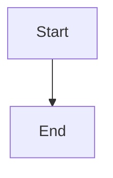

# Documentation

This documentation is built with Jekyll and the Just the Docs theme, deployed on GitHub Pages.

## View Online

The documentation is available at: https://ahmed-bhs.github.io/hexagonal-maker-bundle/

## Local Development

### Prerequisites

- Ruby 2.7 or higher
- Bundler gem

### Setup

1. Install dependencies:
```bash
cd docs
bundle install
```

2. Serve the site locally:
```bash
bundle exec jekyll serve
```

3. Open your browser to http://localhost:4000/hexagonal-maker-bundle/

### Live Reload

For automatic rebuilding when files change:
```bash
bundle exec jekyll serve --livereload
```

## Project Structure

```
docs/
├── _config.yml              # Jekyll configuration
├── Gemfile                  # Ruby dependencies
├── index.md                 # Home page
├── getting-started/         # Getting started guides
├── makers/                  # Maker commands reference
├── examples/                # Usage examples
├── advanced/                # Advanced topics
├── contributing/            # Contribution guides
├── about/                   # About pages
└── images/                  # Images and assets
```

## Adding New Pages

1. Create a new markdown file in the appropriate directory
2. Add YAML front matter:

```yaml
---
layout: default
title: Page Title
parent: Parent Page Title  # Optional
nav_order: 1              # Optional
---
```

### Front Matter Options

- `layout`: Template to use (usually `default` or `home`)
- `title`: Page title shown in navigation
- `parent`: Parent page for nested navigation
- `nav_order`: Order in navigation menu
- `has_children`: Set to `true` for parent pages
- `permalink`: Custom URL path

## Just the Docs Features

### Navigation Structure

Pages are automatically organized based on `parent` and `nav_order` fields.

### Search

Full-text search is enabled by default and indexes all page content.

### Code Blocks

Use fenced code blocks with language specification:

````markdown
```php
// Your PHP code here
```
````

### Mermaid Diagrams

Mermaid diagrams are supported:

````markdown

````

### Callouts

Use callout blocks for notes and warnings:

```markdown
{: .note }
This is a note callout.

{: .warning }
This is a warning callout.

{: .important }
This is an important callout.
```

## Deployment

The site is automatically deployed to GitHub Pages when changes are pushed to the main branch.

GitHub Pages uses Jekyll natively, so no build step is required in the workflow.

## Configuration

Edit `_config.yml` to customize:
- Site title and description
- Theme settings
- Navigation
- Search
- Footer content
- External links

## Theme Documentation

For more information about the Just the Docs theme:
- [Just the Docs Documentation](https://just-the-docs.github.io/just-the-docs/)
- [Just the Docs GitHub](https://github.com/just-the-docs/just-the-docs)
