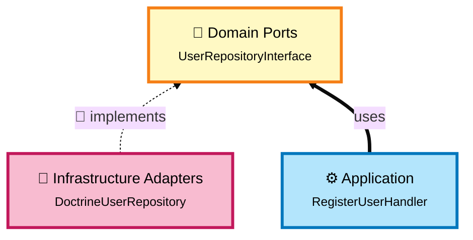
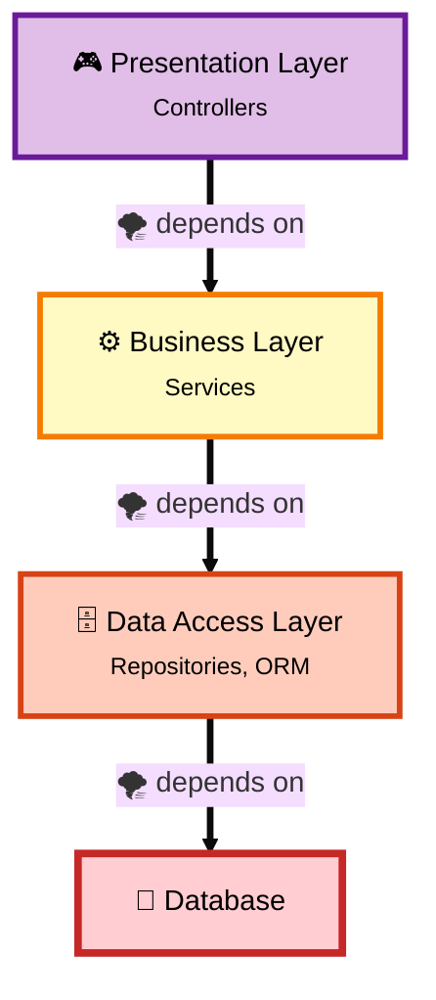
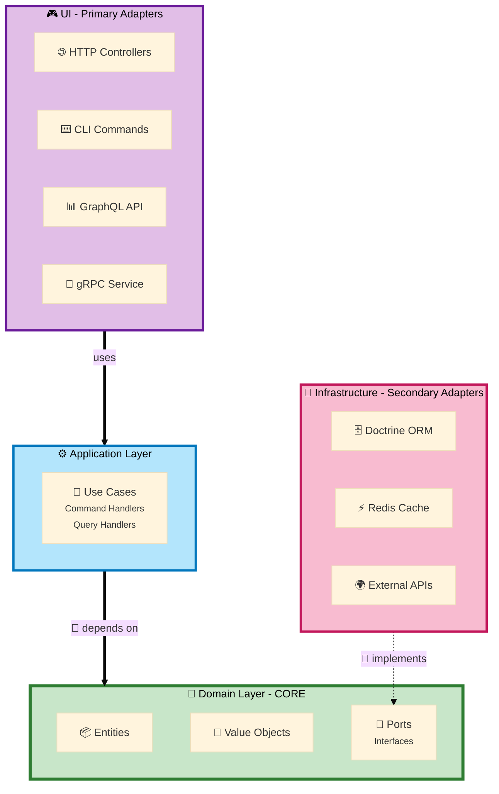
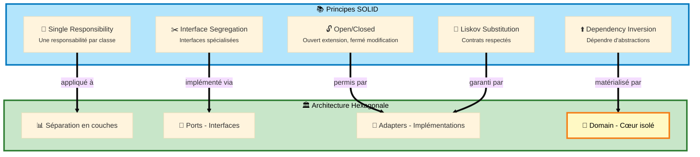

# Architecture Hexagonale & Principes SOLID

Ce document explique en détail comment l'architecture hexagonale respecte les principes SOLID, ses avantages par rapport à une architecture en couches traditionnelle, et les risques d'une mauvaise architecture.

## Table des matières

1. [Les Principes SOLID](#les-principes-solid)
2. [Architecture Hexagonale vs Architecture en Couches](#architecture-hexagonale-vs-architecture-en-couches)
3. [Comment l'Hexagonal Respecte SOLID](#comment-lhexagonal-respecte-solid)
4. [Les Risques d'une Mauvaise Architecture](#les-risques-dune-mauvaise-architecture)
5. [Cas Concrets et Exemples](#cas-concrets-et-exemples)

---

## 1. Les Principes SOLID

### 1.1 Single Responsibility Principle (SRP)
**"Une classe ne devrait avoir qu'une seule raison de changer"**

#### Violation (Architecture traditionnelle)
```php
class UserController
{
    public function register(Request $request): Response
    {
        // 1. Validation
        if (!filter_var($request->get('email'), FILTER_VALIDATE_EMAIL)) {
            throw new Exception('Invalid email');
        }

        // 2. Logique métier
        $user = new User();
        $user->setEmail($request->get('email'));
        $user->setPassword(password_hash($request->get('password'), PASSWORD_BCRYPT));

        // 3. Persistance
        $this->entityManager->persist($user);
        $this->entityManager->flush();

        // 4. Envoi email
        $this->mailer->send(new WelcomeEmail($user));

        return new JsonResponse(['status' => 'ok']);
    }
}
```

**Problèmes:**
- Le contrôleur a **4 responsabilités** différentes
- Si la validation change → modification du contrôleur
- Si la base de données change → modification du contrôleur
- Si l'email change → modification du contrôleur
- **Impossible à tester** unitairement

#### Avec Architecture Hexagonale
```php
// Controller (UI Layer) - Responsabilité: Traduire HTTP en Command
class UserController
{
    public function register(Request $request): Response
    {
        $command = new RegisterCommand(
            email: $request->get('email'),
            password: $request->get('password')
        );

        $this->commandBus->dispatch($command);

        return new JsonResponse(['status' => 'ok']);
    }
}

// Command Handler (Application Layer) - Responsabilité: Orchestrer
#[AsMessageHandler]
class RegisterCommandHandler
{
    public function __invoke(RegisterCommand $command): void
    {
        $user = $this->factory->create($command);
        $this->repository->save($user);
        $this->eventDispatcher->dispatch(new UserRegistered($user));
    }
}

// Entity (Domain Layer) - Responsabilité: Logique métier
class User
{
    public function __construct(
        private Email $email,    // Value Object avec validation
        private HashedPassword $password
    ) {}
}

// Repository Adapter (Infrastructure) - Responsabilité: Persistance
class DoctrineUserRepository implements UserRepositoryInterface
{
    public function save(User $user): void
    {
        $this->em->persist($user);
        $this->em->flush();
    }
}
```

**Avantages:**
- Chaque classe a **UNE SEULE** responsabilité
- Facile à tester indépendamment
- Changement isolé à un seul endroit

---

### 1.2 Open/Closed Principle (OCP)
**"Ouvert à l'extension, fermé à la modification"**

#### Violation
```php
class NotificationService
{
    public function send(User $user, string $type): void
    {
        if ($type === 'email') {
            // Logique email
            $this->mailer->send(...);
        } elseif ($type === 'sms') {
            // Logique SMS
            $this->smsClient->send(...);
        } elseif ($type === 'push') {
            // Logique Push
            $this->pushService->send(...);
        }
        // Si on ajoute Slack, il faut MODIFIER cette classe !
    }
}
```

**Problème:** Pour ajouter un nouveau canal, on doit **modifier** le code existant.

#### Avec Architecture Hexagonale (Ports & Adapters)
```php
// Port (Domain) - Interface stable
interface NotificationSenderInterface
{
    public function send(Notification $notification): void;
    public function supports(NotificationChannel $channel): bool;
}

// Adapter 1 - Email
class EmailNotificationSender implements NotificationSenderInterface
{
    public function send(Notification $notification): void
    {
        $this->mailer->send(...);
    }

    public function supports(NotificationChannel $channel): bool
    {
        return $channel === NotificationChannel::EMAIL;
    }
}

// Adapter 2 - SMS
class SmsNotificationSender implements NotificationSenderInterface
{
    public function send(Notification $notification): void
    {
        $this->smsClient->send(...);
    }

    public function supports(NotificationChannel $channel): bool
    {
        return $channel === NotificationChannel::SMS;
    }
}

// Adapter 3 - Slack (NOUVEAU - sans modifier le code existant!)
class SlackNotificationSender implements NotificationSenderInterface
{
    public function send(Notification $notification): void
    {
        $this->slackClient->send(...);
    }

    public function supports(NotificationChannel $channel): bool
    {
        return $channel === NotificationChannel::SLACK;
    }
}

// Application Layer - Utilise les adapters
class SendNotificationHandler
{
    /** @param NotificationSenderInterface[] $senders */
    public function __construct(private iterable $senders) {}

    public function __invoke(SendNotificationCommand $cmd): void
    {
        foreach ($this->senders as $sender) {
            if ($sender->supports($cmd->channel)) {
                $sender->send($notification);
                return;
            }
        }
    }
}
```

**Avantages:**
- Ajouter Slack = créer une **nouvelle classe**, aucune modification du code existant
- Chaque adapter est **indépendant**
- Pas de risque de régression

---

### 1.3 Liskov Substitution Principle (LSP)
**"Les objets doivent pouvoir être remplacés par des instances de leurs sous-types sans altérer le comportement"**

#### Avec Architecture Hexagonale
```php
// Port (contrat stable)
interface UserRepositoryInterface
{
    public function save(User $user): void;
    public function findById(UserId $id): ?User;
}

// Adapter 1 - Production (Doctrine)
class DoctrineUserRepository implements UserRepositoryInterface
{
    public function save(User $user): void
    {
        $this->em->persist($user);
        $this->em->flush();
    }

    public function findById(UserId $id): ?User
    {
        return $this->em->find(User::class, $id->value);
    }
}

// Adapter 2 - Tests (In Memory)
class InMemoryUserRepository implements UserRepositoryInterface
{
    private array $users = [];

    public function save(User $user): void
    {
        $this->users[$user->getId()->value] = $user;
    }

    public function findById(UserId $id): ?User
    {
        return $this->users[$id->value] ?? null;
    }
}

// Adapter 3 - Cache
class CachedUserRepository implements UserRepositoryInterface
{
    public function __construct(
        private UserRepositoryInterface $decorated,
        private CacheInterface $cache
    ) {}

    public function findById(UserId $id): ?User
    {
        return $this->cache->get(
            'user_' . $id->value,
            fn() => $this->decorated->findById($id)
        );
    }

    public function save(User $user): void
    {
        $this->decorated->save($user);
        $this->cache->delete('user_' . $user->getId()->value);
    }
}

// Application - Fonctionne avec N'IMPORTE quel adapter
class RegisterUserHandler
{
    public function __construct(
        private UserRepositoryInterface $repository // Peut être n'importe quelle implémentation
    ) {}

    public function __invoke(RegisterCommand $cmd): void
    {
        $user = new User(...);
        $this->repository->save($user); // Fonctionne avec les 3 adapters !
    }
}
```

**Avantages:**
- **Interchangeabilité** totale des adapters
- Tests avec `InMemoryUserRepository` (rapide, pas de DB)
- Production avec `DoctrineUserRepository`
- Cache transparent avec `CachedUserRepository`
- Le handler ne sait pas et **ne doit pas savoir** quel adapter est utilisé

---

### 1.4 Interface Segregation Principle (ISP)
**"Ne pas forcer un client à dépendre d'interfaces qu'il n'utilise pas"**

#### Violation
```php
interface UserRepositoryInterface
{
    public function save(User $user): void;
    public function findById(int $id): ?User;
    public function findAll(): array;
    public function search(array $criteria): array;
    public function count(): int;
    public function export(string $format): string;
    public function import(string $data): void;
    public function backup(): void;
    public function restore(string $backup): void;
}

// Un handler qui veut juste sauvegarder doit dépendre de 9 méthodes !
class RegisterUserHandler
{
    public function __construct(
        private UserRepositoryInterface $repository // Trop de méthodes inutiles
    ) {}

    public function __invoke(RegisterCommand $cmd): void
    {
        $user = new User(...);
        $this->repository->save($user); // Utilise seulement 1/9 des méthodes
    }
}
```

#### Avec Architecture Hexagonale (Ports spécialisés)
```php
// Port 1 - Pour l'écriture
interface UserWriterInterface
{
    public function save(User $user): void;
}

// Port 2 - Pour la lecture simple
interface UserReaderInterface
{
    public function findById(UserId $id): ?User;
}

// Port 3 - Pour la recherche
interface UserSearchInterface
{
    public function search(UserSearchCriteria $criteria): array;
}

// Handlers utilisent UNIQUEMENT ce dont ils ont besoin
class RegisterUserHandler
{
    public function __construct(
        private UserWriterInterface $writer // Seulement 1 méthode
    ) {}
}

class FindUserHandler
{
    public function __construct(
        private UserReaderInterface $reader // Seulement 1 méthode
    ) {}
}

class SearchUsersHandler
{
    public function __construct(
        private UserSearchInterface $searcher // Méthodes de recherche uniquement
    ) {}
}

// Un adapter peut implémenter plusieurs ports
class DoctrineUserRepository implements
    UserWriterInterface,
    UserReaderInterface,
    UserSearchInterface
{
    public function save(User $user): void { ... }
    public function findById(UserId $id): ?User { ... }
    public function search(UserSearchCriteria $criteria): array { ... }
}
```

**Avantages:**
- Chaque handler dépend **uniquement** de ce qu'il utilise
- Interfaces **petites** et **cohérentes**
- Facile à mocker pour les tests

---

### 1.5 Dependency Inversion Principle (DIP)
**"Dépendre d'abstractions, pas d'implémentations concrètes"**

C'est le **principe central** de l'architecture hexagonale !

#### Violation 1 - Dépendance à des classes concrètes
```php
// Violation DIRECTE du DIP - Dépend de classes concrètes
class RegisterUserService
{
    public function __construct(
        private EntityManager $em,              // Classe concrète Doctrine
        private Mailer $mailer,                 // Classe concrète Symfony
        private FileLogger $logger              // Classe concrète
    ) {}

    public function register(string $email, string $password): void
    {
        $user = new User();
        $user->setEmail($email);

        $this->em->persist($user);
        $this->em->flush();

        $this->mailer->send(...);
    }
}
```

**Problèmes:**
- Dépend de **classes concrètes** au lieu d'abstractions
- Impossible de mocker pour les tests
- Impossible de changer l'implémentation

---

#### Violation 2 - Abstractions définies par l'infrastructure (plus subtil)
```php
// Violation ARCHITECTURALE du DIP - Utilise des interfaces,
// MAIS définies par l'infrastructure, pas par le Domain
class RegisterUserService
{
    public function __construct(
        private EntityManagerInterface $em,        // Interface définie par Doctrine
        private MailerInterface $mailer,           // Interface définie par Symfony
        private LoggerInterface $logger            // Interface définie par PSR
    ) {}

    public function register(string $email, string $password): void
    {
        $user = new User();
        $user->setEmail($email);

        $this->em->persist($user);   // API Doctrine (persist/flush)
        $this->em->flush();

        $this->mailer->send(...);    // API Symfony Mailer
    }
}
```

**Problème subtil mais critique:**
- **Bon point:** Utilise des **interfaces** (mieux que des classes concrètes)
- **MAIS:** Ces interfaces sont **définies par l'infrastructure** (Doctrine/Symfony), pas par votre Domain
- Votre Application **dépend de l'infrastructure** pour connaître les contrats
- **Direction de dépendance incorrecte**: Application → Infrastructure
- L'Application utilise le **vocabulaire technique** de Doctrine (`persist()`, `flush()`) au lieu du **vocabulaire métier** (`save()`)
- Changer de Doctrine à autre chose nécessite de **modifier tout le code** qui utilise `persist()/flush()`

**Pourquoi c'est une violation du DIP:**
```
📦 Domain/Application (haut niveau)
        ↓ dépend de
🔌 Infrastructure (bas niveau)
```

**Le DIP dit:** Les modules de haut niveau ne doivent PAS dépendre des modules de bas niveau. Les deux doivent dépendre d'abstractions.

Ici, votre **Application** (haut niveau) dépend de **Doctrine/Symfony** (bas niveau) pour définir les contrats.

#### Avec Architecture Hexagonale (DIP Correct)
```php
// 1️⃣ Domain Layer - DÉFINIT ses propres abstractions (PORTS)
namespace App\User\Domain\Port;

interface UserRepositoryInterface  // Interface définie par le DOMAIN
{
    public function save(User $user): void;           // Vocabulaire métier
    public function ofId(UserId $id): ?User;          // Vocabulaire métier
}

interface EmailSenderInterface     // Interface définie par le DOMAIN
{
    public function sendWelcomeEmail(User $user): void;  // Vocabulaire métier
}

// 2️⃣ Application Layer - Dépend UNIQUEMENT des abstractions du Domain
namespace App\User\Application;

class RegisterUserHandler
{
    public function __construct(
        private UserRepositoryInterface $repository,  // Port du Domain
        private EmailSenderInterface $emailSender     // Port du Domain
    ) {}

    public function __invoke(RegisterCommand $cmd): void
    {
        $user = User::register(
            new Email($cmd->email),
            HashedPassword::fromPlain($cmd->password)
        );

        $this->repository->save($user);              // Vocabulaire métier
        $this->emailSender->sendWelcomeEmail($user); // Vocabulaire métier
    }
}

// 3️⃣ Infrastructure Layer - IMPLÉMENTE les abstractions du Domain
namespace App\User\Infrastructure\Persistence;

class DoctrineUserRepository implements UserRepositoryInterface  // Implémente le port
{
    public function __construct(
        private EntityManagerInterface $em  // Doctrine utilisé ICI seulement
    ) {}

    public function save(User $user): void
    {
        $this->em->persist($user);   // Détails techniques cachés ici
        $this->em->flush();
    }

    public function ofId(UserId $id): ?User
    {
        return $this->em->find(User::class, $id->value());
    }
}

namespace App\User\Infrastructure\Messaging;

class SymfonyEmailSender implements EmailSenderInterface  // Implémente le port
{
    public function __construct(
        private MailerInterface $mailer  // Symfony Mailer utilisé ICI seulement
    ) {}

    public function sendWelcomeEmail(User $user): void
    {
        $email = (new Email())
            ->to($user->email()->value())
            ->subject('Welcome!')
            ->html('...');

        $this->mailer->send($email);  // Détails techniques cachés ici
    }
}
```

**Direction des dépendances (CORRECTE):**
```
🔌 Infrastructure (DoctrineUserRepository, SymfonyEmailSender)
        ↓ implements
🔗 Domain Ports (UserRepositoryInterface, EmailSenderInterface)
        ↑ uses
⚙️ Application (RegisterUserHandler)
        ↑ uses
💎 Domain (User, Email, HashedPassword)
```

**Tous les modules dépendent du Domain, pas l'inverse !**

**Flux de dépendances:**



**L'Infrastructure dépend du Domain, PAS l'inverse !**

**Avantages:**
- Le **Domain** ne dépend de **RIEN** (zéro dépendance externe)
- L'**Application** dépend **uniquement du Domain** (pas de l'infrastructure)
- L'**Infrastructure** dépend du **Domain** et **implémente ses ports**
- Les **interfaces** sont définies par le **Domain** (votre métier), pas par Doctrine/Symfony
- Le code utilise le **vocabulaire métier** (`save()`, `ofId()`) au lieu du vocabulaire technique (`persist()`, `flush()`)
- Changement d'infrastructure = créer un nouvel adapter, **zéro modification** du Domain/Application

**Comparaison concrète:**

| Aspect | Violation DIP | Hexagonal (DIP Correct) |
|--------|---------------|-------------------------|
| **Qui définit l'interface?** | Doctrine/Symfony | Votre Domain |
| **Direction dépendance** | App → Infrastructure | Infrastructure → Domain |
| **Vocabulaire utilisé** | Technique (`persist`, `flush`) | Métier (`save`, `ofId`) |
| **Changer Doctrine** | Modifier tout le code | Créer nouvel adapter |
| **Tests** | Dépend de Doctrine | In-memory (rapide) |
| **Framework upgrade** | Casse l'application | Modifier adapters seulement |

---

## 2. Architecture Hexagonale vs Architecture en Couches

### Architecture en Couches Traditionnelle (Layered)



#### 2.1.1 Problèmes de l'Architecture en Couches

**1. Dépendance vers le bas (Database Centric)**
```php
// Business Layer dépend de la Data Layer
class UserService
{
    public function __construct(
        private EntityManagerInterface $em  // Couplé à Doctrine
    ) {}

    public function registerUser(string $email): void
    {
        $user = new User();  // Entity Doctrine avec annotations
        $user->setEmail($email);

        $this->em->persist($user);
        $this->em->flush();
    }
}
```

**Conséquences:**
- Impossible de tester sans base de données
- Changement de base de données = réécriture du Business Layer
- La logique métier est **couplée** à la technologie de persistance
- Les Entities contiennent des annotations Doctrine (pas de Domain pur)

**2. Logique métier diluée**
```php
// Entity avec annotations Doctrine - PAS un vrai Domain Model
use Doctrine\ORM\Mapping as ORM;

#[ORM\Entity]
#[ORM\Table(name: 'users')]
class User
{
    #[ORM\Id]
    #[ORM\GeneratedValue]
    #[ORM\Column(type: 'integer')]
    private int $id;

    #[ORM\Column(type: 'string')]
    private string $email;

    // Getters/Setters - PAS de logique métier
    public function setEmail(string $email): void
    {
        $this->email = $email;  // Pas de validation
    }
}

// Service contient toute la logique
class UserService
{
    public function registerUser(string $email): void
    {
        // Validation dans le service (devrait être dans le domain)
        if (!filter_var($email, FILTER_VALIDATE_EMAIL)) {
            throw new Exception('Invalid email');
        }

        $user = new User();
        $user->setEmail($email);  // Entity = simple conteneur de données

        $this->em->persist($user);
        $this->em->flush();
    }
}
```

**Conséquences:**
- Entity = conteneur de données sans logique (Anemic Domain Model)
- Logique métier éparpillée dans les Services
- Difficile de comprendre les règles métier
- Duplication de la validation dans plusieurs services

**3. Difficile à tester**
```php
class UserServiceTest extends TestCase
{
    public function testRegisterUser(): void
    {
        // Besoin d'une vraie base de données
        $entityManager = $this->createEntityManager();

        // Besoin de fixtures
        $this->loadFixtures();

        $service = new UserService($entityManager);
        $service->registerUser('test@example.com');

        // Test lent (I/O database)
        $user = $entityManager->find(User::class, 1);
        $this->assertEquals('test@example.com', $user->getEmail());
    }
}
```

### Architecture Hexagonale (Ports & Adapters)



#### 2.2.1 Avantages de l'Architecture Hexagonale

**1. Domain indépendant (Domain Centric)**
```php
// Domain Layer - Pur PHP, AUCUNE dépendance
namespace App\User\Domain\Model;

final class User
{
    public function __construct(
        private UserId $id,
        private Email $email,  // Value Object avec validation
        private bool $isActive = false
    ) {}

    // Logique métier dans le domain
    public function activate(): void
    {
        if ($this->isActive) {
            throw new UserAlreadyActiveException();
        }

        $this->isActive = true;
    }

    public function changeEmail(Email $newEmail): void
    {
        // Règle métier: email doit être différent
        if ($this->email->equals($newEmail)) {
            throw new SameEmailException();
        }

        $this->email = $newEmail;
    }
}

// Value Object avec validation
final readonly class Email
{
    public function __construct(public string $value)
    {
        if (!filter_var($value, FILTER_VALIDATE_EMAIL)) {
            throw new InvalidEmailException($value);
        }
    }

    public function equals(self $other): bool
    {
        return $this->value === $other->value;
    }
}
```

**Avantages:**
- Logique métier **centralisée** dans le Domain
- **Zéro** dépendance externe (pas d'annotations)
- Validation **encapsulée** dans les Value Objects
- Règles métier **explicites** et testables

**2. Testabilité**
```php
// Test du Domain - Ultra rapide, aucune dépendance
class UserTest extends TestCase
{
    public function testUserCanBeActivated(): void
    {
        $user = new User(
            id: UserId::generate(),
            email: new Email('test@example.com')
        );

        $user->activate();

        $this->assertTrue($user->isActive());
    }

    public function testCannotActivateTwice(): void
    {
        $user = new User(
            id: UserId::generate(),
            email: new Email('test@example.com')
        );

        $user->activate();

        $this->expectException(UserAlreadyActiveException::class);
        $user->activate();  // Should throw
    }
}

// Test du Handler avec In-Memory repository
class RegisterUserHandlerTest extends TestCase
{
    public function testUserIsRegistered(): void
    {
        $repository = new InMemoryUserRepository();  // Pas de DB
        $handler = new RegisterUserHandler($repository);

        $command = new RegisterCommand('test@example.com', 'password');
        $handler($command);

        $this->assertCount(1, $repository->all());
    }
}
```

**Avantages:**
- Tests **ultra-rapides** (pas d'I/O)
- Tests **isolés** (pas de DB, pas de fixtures)
- Tests du domain **sans framework**

**3. Flexibilité technologique**
```php
// En développement: In-Memory
$container->set(UserRepositoryInterface::class, InMemoryUserRepository::class);

// En production: Doctrine
$container->set(UserRepositoryInterface::class, DoctrineUserRepository::class);

// En production avec cache: Decorator
$container->set(UserRepositoryInterface::class, CachedUserRepository::class);
```

**Avantages:**
- Changement de technologie **sans toucher au code métier**
- Plusieurs implémentations possibles
- Stack technology evolutive

---

## 3. Les Risques d'une Mauvaise Architecture

### 1. Le Modèle Anémique (Anemic Domain Model)

#### 3.1.1 Anti-pattern
```php
// Entity = simple conteneur de données
class Order
{
    private int $id;
    private string $status;
    private float $total;

    // Getters/Setters uniquement
    public function setStatus(string $status): void
    {
        $this->status = $status;  // Aucune validation
    }

    public function setTotal(float $total): void
    {
        $this->total = $total;  // Peut être négatif
    }
}

// Service contient toute la logique
class OrderService
{
    public function placeOrder(Order $order): void
    {
        // Validation éparpillée dans le service
        if ($order->getTotal() < 0) {
            throw new Exception('Invalid total');
        }

        $order->setStatus('confirmed');  // String magic

        $this->em->persist($order);
        $this->em->flush();
    }

    public function cancelOrder(Order $order): void
    {
        // Duplication de la logique de validation
        if ($order->getStatus() === 'shipped') {
            throw new Exception('Cannot cancel shipped order');
        }

        $order->setStatus('cancelled');

        $this->em->flush();
    }
}
```

**Risques:**
- **Duplication** de la logique dans plusieurs services
- **Incohérence** (différents services peuvent avoir des règles différentes)
- **Bugs** difficiles à trouver (pas de validation centralisée)
- **Maintenance cauchemardesque** (logique éparpillée)

#### 3.1.2 Rich Domain Model (Hexagonal)
```php
enum OrderStatus: string
{
    case PENDING = 'pending';
    case CONFIRMED = 'confirmed';
    case SHIPPED = 'shipped';
    case CANCELLED = 'cancelled';
}

final class Order
{
    public function __construct(
        private OrderId $id,
        private Money $total,
        private OrderStatus $status = OrderStatus::PENDING
    ) {
        if ($total->amount <= 0) {
            throw new InvalidOrderTotalException();
        }
    }

    // Logique métier encapsulée
    public function confirm(): void
    {
        if ($this->status !== OrderStatus::PENDING) {
            throw new OrderCannotBeConfirmedException($this->status);
        }

        $this->status = OrderStatus::CONFIRMED;
    }

    public function cancel(): void
    {
        if ($this->status === OrderStatus::SHIPPED) {
            throw new ShippedOrderCannotBeCancelledException();
        }

        $this->status = OrderStatus::CANCELLED;
    }

    public function ship(): void
    {
        if ($this->status !== OrderStatus::CONFIRMED) {
            throw new OrderMustBeConfirmedBeforeShippingException();
        }

        $this->status = OrderStatus::SHIPPED;
    }
}

// Handler = simple orchestration
class ConfirmOrderHandler
{
    public function __invoke(ConfirmOrderCommand $cmd): void
    {
        $order = $this->repository->findById($cmd->orderId);
        $order->confirm();  // Logique dans le domain
        $this->repository->save($order);
    }
}
```

**Avantages:**
- Logique **centralisée** dans l'entity
- **Impossible** de mettre l'objet dans un état invalide
- **Type-safe** (enum au lieu de string)
- Règles métier **explicites**

### 2. Le Couplage Fort (Tight Coupling)

#### 3.2.1 Couplage fort
```php
class UserService
{
    public function __construct(
        private EntityManagerInterface $em,
        private Swift_Mailer $mailer,  // Couplé à SwiftMailer
        private MonologLogger $logger   // Couplé à Monolog
    ) {}

    public function register(string $email): void
    {
        $user = new User();
        $user->setEmail($email);

        $this->em->persist($user);
        $this->em->flush();

        // Si on veut changer de mailer, il faut modifier tout ça
        $message = (new Swift_Message('Welcome'))
            ->setTo($email)
            ->setBody('Welcome!');

        $this->mailer->send($message);
    }
}
```

**Risques:**
- **Impossible de changer** SwiftMailer sans réécrire le code
- **Tests difficiles** (besoin de vraies dépendances)
- **Migration framework impossible** (couplage fort)

#### 3.2.2 Faible couplage (Hexagonal)
```php
// Port
interface EmailSenderInterface
{
    public function send(Email $email): void;
}

// Domain
final readonly class WelcomeEmail
{
    public function __construct(
        public string $to,
        public string $subject,
        public string $body
    ) {}
}

// Handler
class RegisterUserHandler
{
    public function __construct(
        private UserRepositoryInterface $repository,
        private EmailSenderInterface $emailSender  // Abstraction
    ) {}

    public function __invoke(RegisterCommand $cmd): void
    {
        $user = new User(...);
        $this->repository->save($user);

        $email = new WelcomeEmail(
            to: $user->getEmail()->value,
            subject: 'Welcome',
            body: 'Welcome to our platform!'
        );

        $this->emailSender->send($email);  // Ne sait pas comment
    }
}

// Adapter 1 - SwiftMailer
class SwiftMailerAdapter implements EmailSenderInterface
{
    public function send(Email $email): void
    {
        $message = (new Swift_Message($email->subject))
            ->setTo($email->to)
            ->setBody($email->body);

        $this->mailer->send($message);
    }
}

// Adapter 2 - Symfony Mailer (migration facile!)
class SymfonyMailerAdapter implements EmailSenderInterface
{
    public function send(Email $email): void
    {
        $message = (new Email())
            ->to($email->to)
            ->subject($email->subject)
            ->text($email->body);

        $this->mailer->send($message);
    }
}
```

**Avantages:**
- Migration SwiftMailer → Symfony Mailer **sans toucher au handler**
- Tests avec `FakeEmailSender`
- Peut avoir plusieurs adapters (email + SMS)

### 3. Le Big Ball of Mud

#### 3.3.1 Sans architecture
```php
// Tout est mélangé dans le controller
class OrderController
{
    public function create(Request $request): Response
    {
        // Validation
        if (empty($request->get('items'))) {
            return new JsonResponse(['error' => 'No items'], 400);
        }

        // Calcul métier
        $total = 0;
        foreach ($request->get('items') as $item) {
            $product = $this->em->find(Product::class, $item['id']);
            $total += $product->getPrice() * $item['quantity'];
        }

        // Création
        $order = new Order();
        $order->setTotal($total);
        $order->setStatus('pending');

        // Persistance
        $this->em->persist($order);
        $this->em->flush();

        // Email
        $this->mailer->send(...);

        // Log
        $this->logger->info('Order created: ' . $order->getId());

        // Envoi événement
        $this->eventBus->dispatch(new OrderCreated($order));

        return new JsonResponse(['id' => $order->getId()]);
    }
}
```

**Risques:**
- **Impossible à tester** (trop de dépendances)
- **Impossible à maintenir** (tout est mélangé)
- **Impossible à réutiliser** (couplé au HTTP)
- **Impossible d'ajouter une API GraphQL** (logique dans le controller)

#### 3.3.2 Avec Hexagonal
```php
// Controller = adapter HTTP
class OrderController
{
    public function create(Request $request): Response
    {
        $command = new CreateOrderCommand(
            items: $request->get('items'),
            customerId: $request->get('customer_id')
        );

        $orderId = $this->commandBus->dispatch($command);

        return new JsonResponse(['id' => $orderId]);
    }
}

// GraphQL = adapter GraphQL (réutilise la même logique!)
class OrderMutation
{
    public function createOrder(array $items, string $customerId): string
    {
        $command = new CreateOrderCommand($items, $customerId);
        return $this->commandBus->dispatch($command);
    }
}

// CLI = adapter CLI (même logique!)
class CreateOrderCommand extends Command
{
    protected function execute(InputInterface $input, OutputInterface $output): int
    {
        $command = new CreateOrderCommand(
            items: json_decode($input->getArgument('items'), true),
            customerId: $input->getArgument('customer-id')
        );

        $this->commandBus->dispatch($command);

        return Command::SUCCESS;
    }
}
```

**Avantages:**
- **Une seule implémentation** réutilisée par HTTP, GraphQL, CLI
- **Testable** indépendamment
- **Évolutif** (ajouter gRPC = nouvel adapter)

---

## 4. Tableau Comparatif

| Aspect | Architecture Layered | Architecture Hexagonale |
|--------|---------------------|------------------------|
| **Dépendances** | Vers le bas (DB-centric) | Vers le centre (Domain-centric) |
| **Testabilité** | Tests lents (DB requise) | Tests rapides (in-memory) |
| **Logique métier** | Éparpillée dans services | Centralisée dans Domain |
| **Couplage** | Fort (framework, ORM) | Faible (ports/adapters) |
| **Changement techno** | Réécriture massive | Nouveau adapter |
| **Réutilisabilité** | Difficile | Facile (même use case, plusieurs adapters) |
| **Principe SOLID** | Violations fréquentes | Respect total |
| **Complexité initiale** | Faible | Moyenne |
| **Maintenabilité long terme** | Difficile | Excellente |

---

## 5. Conclusion

### Quand utiliser l'Architecture Hexagonale ?

**Utiliser Hexagonal si:**
- Projet **complexe** avec beaucoup de logique métier
- Projet **long terme** (maintenance sur plusieurs années)
- Équipe qui grandit
- Besoin de **plusieurs interfaces** (API REST, GraphQL, CLI)
- Tests **automatisés** critiques
- Stack technologique susceptible d'**évoluer**

**Ne pas utiliser si:**
- Prototype rapide
- CRUD simple sans logique métier
- Projet jetable (< 6 mois)
- Équipe très junior (courbe d'apprentissage)

### Principes SOLID = Fondation de l'Hexagonal

L'architecture hexagonale n'est pas "en plus" de SOLID, c'est **l'application concrète** des principes SOLID à l'échelle d'une application :



**Correspondances:**

- **SRP** → Chaque couche a une responsabilité
- **OCP** → Nouveaux adapters sans modifier le code existant
- **LSP** → Adapters interchangeables
- **ISP** → Ports spécialisés
- **DIP** → Domain ne dépend de rien, Infrastructure dépend du Domain

---

**Rappel:** Ce bundle vous aide à respecter ces principes automatiquement en générant la bonne structure.
