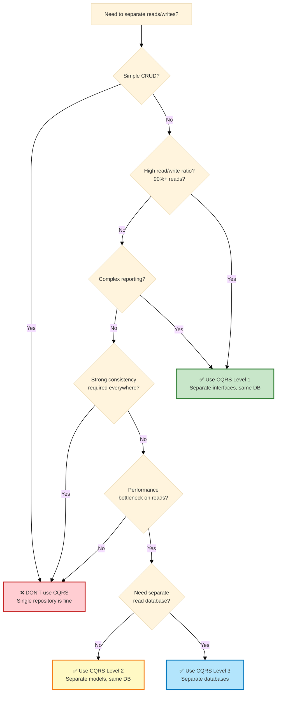

# CQRS: When to Use It, When to Avoid It

## Table of Contents

1. [What is CQRS?](#what-is-cqrs)
2. [The Core Problem CQRS Solves](#the-core-problem-cqrs-solves)
3. [Cost-Benefit Analysis](#cost-benefit-analysis)
4. [When to Use CQRS](#when-to-use-cqrs)
5. [When NOT to Use CQRS](#when-not-to-use-cqrs)
6. [Implementation Levels](#implementation-levels)
7. [Real-World Decision Examples](#real-world-decision-examples)
8. [Migration Strategy](#migration-strategy)

---

## What is CQRS?

**CQRS = Command Query Responsibility Segregation**

> **Separate the model that writes data (Commands) from the model that reads data (Queries).**

### Traditional Approach (Single Model)

```php
// One repository handles both reads and writes
interface UserRepositoryInterface
{
    // Writes
    public function save(User $user): void;
    public function delete(User $user): void;

    // Reads
    public function findById(UserId $id): ?User;
    public function findAll(): array;
    public function findActiveUsers(): array;
}
```

### CQRS Approach (Separate Models)

```php
// Write model (Commands)
interface UserRepositoryInterface
{
    public function save(User $user): void;
    public function delete(User $user): void;
}

// Read model (Queries)
interface UserQueryInterface
{
    public function findById(UserId $id): ?UserDTO;
    public function findAll(): array; // array<UserDTO>
    public function findActiveUsers(): array;
}
```

---

## The Core Problem CQRS Solves

### Problem 1: Read and Write Have Different Needs

| Concern | Writes (Commands) | Reads (Queries) |
|---------|-------------------|-----------------|
| **Focus** | Business rules, consistency | Speed, denormalization |
| **Model** | Rich domain entities | Simple DTOs |
| **Validation** | Complex business logic | None (already validated) |
| **Performance** | Can be slower (transactional) | Must be fast (cached) |
| **Complexity** | Complex object graphs | Flat projections |

**Example: E-Commerce Order**

```php
// WRITE: Complex entity with business logic
class Order
{
    private OrderId $id;
    private CustomerId $customerId;
    private array $items; // OrderItem[]
    private Money $totalAmount;
    private OrderStatus $status;

    public function addItem(Product $product, int $quantity): void
    {
        // Complex business rules
        if ($this->status !== OrderStatus::DRAFT) {
            throw new CannotModifyConfirmedOrderException();
        }

        if ($quantity <= 0) {
            throw new InvalidQuantityException();
        }

        $this->items[] = new OrderItem($product, $quantity);
        $this->recalculateTotal();
    }
}

// READ: Simple DTO for display
final readonly class OrderListDTO
{
    public function __construct(
        public string $orderId,
        public string $customerName,
        public int $totalAmountCents,
        public string $status,
        public string $createdAt,
    ) {}
}
```

**Why separation helps:**
- Write model can be complex (business logic)
- Read model can be simple (just data for display)
- Each optimized for its purpose

---

### Problem 2: Conflicting Query Patterns

**Write queries need:**
- Entity relationships preserved
- Transactional consistency
- Full object graphs

**Read queries need:**
- Denormalized data (joins avoided)
- Aggressive caching
- Pagination, filtering, sorting

```php
// ❌ Trying to serve both needs with one model leads to compromise

// Write: needs full entity
$order = $this->orders->findById($orderId); // Loads Order with all relationships
$order->addItem($product, 2);
$this->orders->save($order);

// Read: needs flat data for display
$orders = $this->orders->findAllOrders(); // Same repository!
// But we don't need full entities with business logic for display...
// We load too much data, waste memory, and it's slow
```

**CQRS solution:** Different models for different needs.

---

## Cost-Benefit Analysis

### ✅ Benefits of CQRS

#### 1. **Optimized Performance**

**Write side:**
```php
// Complex entity with business logic
$order->confirm(); // Rich domain logic
$this->orders->save($order);
```

**Read side:**
```php
// Optimized SQL query, returns flat DTO
$orders = $this->queryBus->dispatch(new FindOrdersQuery());
// SELECT o.id, o.status, c.name AS customer_name, ...
// FROM orders o JOIN customers c ON ...
// Flat result, no hydration overhead
```

**Benefit:** Reads can be aggressively optimized (denormalization, caching) without affecting write model.

---

#### 2. **Simplified Read Logic**

```php
// ❌ Without CQRS: read uses complex entity
$user = $this->users->findById($userId); // Returns full User entity
return new UserResponse(
    id: $user->getId()->toString(),
    email: $user->getEmail()->value,
    name: $user->getName(),
    // Extract data from complex entity
);

// ✅ With CQRS: read returns DTO directly
$userDTO = $this->queries->findById($userId); // Returns UserDTO
return $userDTO; // Already in the right format
```

---

#### 3. **Scalability: Independent Scaling**

```
┌─────────────┐         ┌─────────────┐
│ Write DB    │         │  Read DB    │
│ (Master)    │────────>│  (Replicas) │
│             │  Sync   │             │
│ 1 instance  │         │ 10 replicas │
└─────────────┘         └─────────────┘
       ↑                       ↑
   10% traffic            90% traffic
```

**Benefit:** Scale read and write sides independently based on load.

---

#### 4. **Eventual Consistency (When Acceptable)**

```php
// Command: Write immediately
$this->commandBus->dispatch(new CreateOrderCommand(...));
// Order saved to write DB

// Query: Read from replica (might be slightly delayed)
$orders = $this->queryBus->dispatch(new FindOrdersQuery());
// Reads from read replica (eventual consistency)
```

**Benefit:** Accept slight delay in reads to achieve better write throughput.

---

#### 5. **Better Security: Read-Only Views**

```php
// Read model: expose only safe data
interface PublicUserQueryInterface
{
    public function findByUsername(string $username): ?PublicUserDTO;
    // Returns: username, bio, avatar (safe fields)
}

// Write model: contains sensitive data
interface UserRepositoryInterface
{
    public function save(User $user): void;
    // User entity contains password hash, email (sensitive)
}
```

**Benefit:** Read models can expose different projections for different users (public vs admin).

---

### ❌ Costs of CQRS

#### 1. **Increased Complexity**

**Without CQRS (simple):**
```php
interface UserRepositoryInterface
{
    public function save(User $user): void;
    public function findById(UserId $id): ?User;
}

// 1 interface, 1 implementation, 1 model
```

**With CQRS (complex):**
```php
interface UserRepositoryInterface { /* write methods */ }
interface UserQueryInterface { /* read methods */ }

class DoctrineUserRepository implements UserRepositoryInterface { /* ... */ }
class DoctrineUserQuery implements UserQueryInterface { /* ... */ }

// 2 interfaces, 2 implementations, 2 models (entity + DTO)
```

**Cost:** Double the code, double the maintenance.

---

#### 2. **Synchronization Overhead**

If write and read databases are separate:

```php
// Write to write DB
$this->commandBus->dispatch(new CreateUserCommand(...));

// Must sync to read DB
$this->eventBus->dispatch(new UserCreatedEvent(...));

// Event handler updates read DB
class UserCreatedEventHandler
{
    public function __invoke(UserCreatedEvent $event): void
    {
        $this->readDatabase->insertUser(...); // Sync!
    }
}
```

**Cost:** Extra infrastructure (message queues, event handlers, sync logic).

---

#### 3. **Eventual Consistency Issues**

```php
// User creates account
$this->commandBus->dispatch(new RegisterUserCommand(...));

// Immediately tries to log in
$user = $this->queries->findByEmail($email);
// ❌ Might return null if read DB not yet synced!
```

**Cost:** Must handle "read your own writes" problem, adding complexity.

---

#### 4. **Development Time**

| Task | Without CQRS | With CQRS |
|------|--------------|-----------|
| Add new entity | 1 repository | 1 repository + 1 query interface + sync |
| Add new read operation | Add method to repository | Add method to query interface |
| Add new write operation | Add method to repository | Add method + event + sync handler |
| Testing | Test repository | Test repository + query + sync + eventual consistency |

**Cost:** 30-50% more development time for CRUD operations.

---

#### 5. **Team Learning Curve**

- Developers must understand:
  - Command vs Query separation
  - Event-driven architecture
  - Eventual consistency
  - Message queues
  - Read model synchronization

**Cost:** Training time, mistakes during learning phase.

---

## When to Use CQRS

### ✅ Good Use Cases

#### 1. **High Read/Write Ratio (90%+ reads)**

**Example: Analytics Dashboard**

```php
// Writes: rare (once per hour, background job)
$this->commandBus->dispatch(new GenerateReportCommand(...));

// Reads: frequent (thousands per second)
$report = $this->queries->getReport($reportId);
```

**Why CQRS helps:** Optimize read side aggressively (caching, denormalization) without impacting rare writes.

---

#### 2. **Complex Reporting Requirements**

**Example: E-Commerce Admin Dashboard**

```php
// Write model: normalized entities
Order -> OrderItem -> Product
Customer -> Address

// Read model: denormalized view
interface AdminDashboardQueryInterface
{
    public function getOrderSummary(): OrderSummaryDTO;
    // Returns: total orders, revenue, avg order value, top products
    // All denormalized in a single optimized query
}
```

**Why CQRS helps:** Read model can be denormalized for fast reporting without polluting write model.

---

#### 3. **Multiple Read Representations**

**Example: Product Catalog**

```php
// Write model: single Product entity
class Product { /* business logic */ }

// Read models: multiple projections
interface ProductListQueryInterface
{
    public function findAll(): array; // Simple list
}

interface ProductDetailQueryInterface
{
    public function findById(ProductId $id): ProductDetailDTO; // Full details
}

interface ProductSearchQueryInterface
{
    public function search(string $query): array; // Elasticsearch
}
```

**Why CQRS helps:** Different read models for different use cases without coupling.

---

#### 4. **Different Consistency Requirements**

```php
// Write: must be strongly consistent
$this->orderRepository->save($order); // Immediate consistency

// Read: can be eventually consistent
$orders = $this->orderQuery->findRecent(); // Slight delay OK
```

**Why CQRS helps:** Accept eventual consistency on reads to improve write throughput.

---

#### 5. **Audit Trail / Event Sourcing**

```php
// Write: events stored
$this->commandBus->dispatch(new UpdatePriceCommand(...));
// Produces: PriceUpdatedEvent stored in event store

// Read: materialized view from events
$product = $this->queries->findById($productId);
// Rebuilt from events or cached projection
```

**Why CQRS helps:** Natural fit with event sourcing (events = write model, projections = read model).

---

## When NOT to Use CQRS

### ❌ Bad Use Cases

#### 1. **Simple CRUD Applications**

```php
// Just create, read, update, delete users
// ❌ CQRS is overkill here
interface UserRepositoryInterface
{
    public function save(User $user): void;
    public function findById(UserId $id): ?User;
    public function findAll(): array;
    public function delete(User $user): void;
}

// ✅ Single repository is enough
```

**Why avoid CQRS:** No performance bottleneck, no complex queries, unnecessary complexity.

---

#### 2. **Strong Consistency Required Everywhere**

```php
// Banking: user checks balance, then withdraws
$balance = $this->accountQuery->getBalance($accountId);
// ❌ If read DB is out of sync, shows wrong balance!

$this->commandBus->dispatch(new WithdrawCommand($accountId, $amount));
// ❌ Might allow overdraft due to stale read
```

**Why avoid CQRS:** Eventual consistency can cause bugs in scenarios requiring strong consistency.

---

#### 3. **Small Team, Tight Deadlines**

- 2-3 developers
- 3-month deadline
- Simple web app

**Why avoid CQRS:** Overhead not worth it, will slow down delivery.

---

#### 4. **Low Traffic**

- 100 users per day
- 10 requests per minute

**Why avoid CQRS:** No performance problem to solve, premature optimization.

---

#### 5. **Write-Heavy Systems**

- Logging system (writes >> reads)
- Data ingestion pipeline

**Why avoid CQRS:** CQRS optimizes reads, but this system is write-heavy.

---

## Implementation Levels

### Level 0: Single Model (No CQRS)

```php
interface UserRepositoryInterface
{
    public function save(User $user): void;
    public function findById(UserId $id): ?User;
}
```

**Complexity:** Low
**When to use:** Small apps, simple CRUD

---

### Level 1: Separate Interfaces, Same Database

```php
// Write interface
interface UserRepositoryInterface
{
    public function save(User $user): void;
}

// Read interface
interface UserQueryInterface
{
    public function findById(UserId $id): ?UserDTO;
}

// Both use same database, different interfaces
```

**Complexity:** Medium
**When to use:** Logical separation, same DB

---

### Level 2: Separate Models, Same Database

```php
// Write: uses entities
class DoctrineUserRepository implements UserRepositoryInterface
{
    public function save(User $user): void { /* ORM */ }
}

// Read: uses raw SQL
class SqlUserQuery implements UserQueryInterface
{
    public function findById(UserId $id): ?UserDTO
    {
        // Raw SQL optimized for reads
        $stmt = $this->connection->executeQuery('SELECT ...');
        return $this->hydrateDTO($stmt->fetchAssociative());
    }
}
```

**Complexity:** Medium-High
**When to use:** Optimize reads, still single DB

---

### Level 3: Separate Databases (Full CQRS)

```php
// Write: Master DB
class DoctrineUserRepository implements UserRepositoryInterface
{
    public function save(User $user): void
    {
        $this->entityManager->persist($user); // Write DB
        $this->eventBus->dispatch(new UserSavedEvent($user)); // Trigger sync
    }
}

// Read: Replica DB
class ReplicaUserQuery implements UserQueryInterface
{
    public function findById(UserId $id): ?UserDTO
    {
        return $this->replicaConnection->fetchOne(...); // Read DB
    }
}

// Event handler syncs write → read
class UserSavedEventHandler
{
    public function __invoke(UserSavedEvent $event): void
    {
        $this->readDatabase->upsertUser(...); // Sync
    }
}
```

**Complexity:** High
**When to use:** High scale, independent scaling needed

---

## Real-World Decision Examples

### Example 1: Blog Platform

**Scenario:**
- 10,000 articles
- 1M page views/month
- 50 new articles/day

**Reads:** Viewing articles (99% of traffic)
**Writes:** Publishing articles (1% of traffic)

**Decision: ✅ Use CQRS Level 1**

```php
// Write: entity with business logic
interface ArticleRepositoryInterface
{
    public function save(Article $article): void;
}

// Read: optimized DTOs
interface ArticleQueryInterface
{
    public function findPublished(int $limit, int $offset): array;
    public function findBySlug(string $slug): ?ArticleDetailDTO;
}
```

**Reason:** High read/write ratio, same DB is fine, logical separation helps.

---

### Example 2: Simple Todo App

**Scenario:**
- 1,000 users
- Simple CRUD (create, read, update, delete tasks)
- Low traffic

**Decision: ❌ Don't use CQRS**

```php
// Single repository is enough
interface TaskRepositoryInterface
{
    public function save(Task $task): void;
    public function findById(TaskId $id): ?Task;
    public function findByUser(UserId $userId): array;
    public function delete(Task $task): void;
}
```

**Reason:** No performance issue, no complex queries, CQRS adds unnecessary complexity.

---

### Example 3: E-Commerce Platform

**Scenario:**
- 100,000 products
- 10,000 orders/day
- Complex admin dashboard (sales reports, inventory, analytics)

**Decision: ✅ Use CQRS Level 2-3**

```php
// Write: normalized entities
interface OrderRepositoryInterface
{
    public function save(Order $order): void;
}

// Read: denormalized projections
interface AdminDashboardQueryInterface
{
    public function getSalesReport(): SalesReportDTO;
    public function getInventoryStatus(): InventoryDTO;
}

interface OrderQueryInterface
{
    public function findRecent(int $limit): array;
}
```

**Reason:** Complex reporting, high read volume, eventual consistency acceptable for dashboards.

---

### Example 4: Banking System

**Scenario:**
- Account balances must be accurate
- Transactions must be strongly consistent

**Decision: ❌ Don't use CQRS (or use Level 1 only)**

```php
// Single model, strong consistency
interface AccountRepositoryInterface
{
    public function save(Account $account): void;
    public function findById(AccountId $id): ?Account;
    // Same DB, immediate consistency
}
```

**Reason:** Strong consistency required, eventual consistency unacceptable.

---

## Migration Strategy

### Step 1: Identify Candidates

Look for:
- ✅ High read/write ratio
- ✅ Complex queries
- ✅ Performance bottlenecks on reads

---

### Step 2: Start with Level 1 (Same DB, Separate Interfaces)

```php
// Split repository into write + read
// Before:
interface UserRepositoryInterface { /* all methods */ }

// After:
interface UserRepositoryInterface { /* write methods */ }
interface UserQueryInterface { /* read methods */ }
```

**Benefit:** Logical separation, low risk.

---

### Step 3: Optimize Read Queries

```php
// Read interface uses raw SQL instead of ORM
class SqlUserQuery implements UserQueryInterface
{
    public function findAll(): array
    {
        // Optimized SQL with caching
        return $this->cache->remember('users.all', function() {
            return $this->connection->fetchAllAssociative('SELECT ...');
        });
    }
}
```

---

### Step 4: Consider Separate Read DB (If Needed)

Only if:
- Read load is too high for single DB
- Need independent scaling

---

## Decision Flowchart



---

## Summary

### ✅ Use CQRS When:
1. High read/write ratio (90%+ reads)
2. Complex reporting requirements
3. Different consistency requirements (eventual consistency acceptable)
4. Performance bottleneck on reads
5. Multiple read representations needed

### ❌ Avoid CQRS When:
1. Simple CRUD application
2. Strong consistency required everywhere
3. Small team, tight deadlines
4. Low traffic, no performance issues
5. Write-heavy system

### 🎯 Golden Rule:
> **Don't use CQRS by default. Add it when you have a proven performance problem or complex read requirements.**

---

**Next:** [Dependency Injection Configuration →](./dependency-injection-guide.md)
