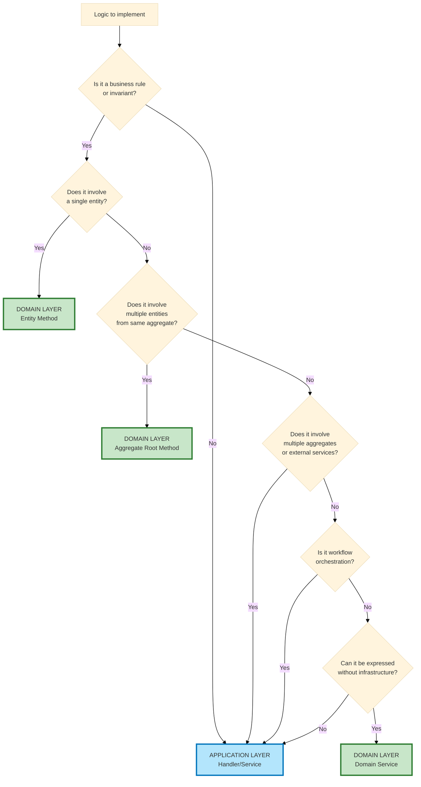

# Domain vs Application Logic: Decision Guide

## Table of Contents

1. [The Core Question](#the-core-question)
2. [Quick Decision Flowchart](#quick-decision-flowchart)
3. [The Golden Rule](#the-golden-rule)
4. [Domain Layer Responsibilities](#domain-layer-responsibilities)
5. [Application Layer Responsibilities](#application-layer-responsibilities)
6. [Real-World Examples](#real-world-examples)
7. [Common Mistakes](#common-mistakes)
8. [Testing As Validation](#testing-as-validation)

---

## The Core Question

**Where should this logic live: in the Domain (Entity/Value Object) or in the Application (Handler)?**

This is THE most common question when implementing hexagonal architecture. The boundary between Domain and Application is often unclear, leading to either:
- **Anemic Domain Model** - Entities become data containers, handlers contain all logic
- **Fat Handlers** - Application layer has business rules that should be in domain

---

## Quick Decision Flowchart



---

## The Golden Rule

> **If a business expert would describe it as a rule, it belongs in the Domain.**
>
> **If a business expert would describe it as a process/workflow, it belongs in Application.**

### Examples:
- ❌ "When a user registers, send them an email" → **Application** (workflow/orchestration)
- ✅ "A user cannot be activated if already active" → **Domain** (business invariant)
- ❌ "Save the user, then log the event, then notify admins" → **Application** (orchestration)
- ✅ "An order total must equal sum of line items" → **Domain** (business rule)

---

## Domain Layer Responsibilities

### ✅ DOMAIN Should Contain:

#### 1. **Business Invariants**
Rules that MUST ALWAYS be true, regardless of how the entity is used.

```php
// ✅ GOOD: Domain enforces invariant
class Order
{
    private OrderStatus $status;
    private \DateTimeImmutable $shippedAt;

    public function ship(): void
    {
        if ($this->status === OrderStatus::CANCELLED) {
            throw new CannotShipCancelledOrderException();
        }

        if ($this->status === OrderStatus::SHIPPED) {
            throw new OrderAlreadyShippedException();
        }

        $this->status = OrderStatus::SHIPPED;
        $this->shippedAt = new \DateTimeImmutable();
    }
}
```

**Why Domain?** The rule "cancelled orders cannot be shipped" is a business invariant. No matter where `Order` is used (CLI, API, background job), this rule applies.

#### 2. **State Transitions**
Logic governing how an entity moves between states.

```php
// ✅ GOOD: Domain controls state machine
class Invoice
{
    private InvoiceStatus $status;

    public function markAsPaid(Money $amount): void
    {
        if (!$this->status->canTransitionTo(InvoiceStatus::PAID)) {
            throw new InvalidInvoiceStatusTransitionException(
                $this->status,
                InvoiceStatus::PAID
            );
        }

        if (!$amount->equals($this->totalAmount)) {
            throw new InvalidPaymentAmountException($amount, $this->totalAmount);
        }

        $this->status = InvoiceStatus::PAID;
        $this->paidAt = new \DateTimeImmutable();
    }
}
```

#### 3. **Value Object Validation**
Validation that ensures a value makes sense in the business domain.

```php
// ✅ GOOD: Domain validates business constraints
final readonly class Email
{
    public function __construct(public string $value)
    {
        if (!filter_var($value, FILTER_VALIDATE_EMAIL)) {
            throw new InvalidEmailException($value);
        }

        // Business rule: corporate domain only
        if (!str_ends_with($value, '@company.com')) {
            throw new InvalidEmailDomainException($value);
        }
    }
}
```

#### 4. **Calculations Based on Entity Data**
Pure calculations using entity properties.

```php
// ✅ GOOD: Domain calculates business values
class Order
{
    private array $items; // OrderItem[]
    private Money $shippingCost;
    private Discount $discount;

    public function calculateTotal(): Money
    {
        $subtotal = array_reduce(
            $this->items,
            fn(Money $sum, OrderItem $item) => $sum->add($item->getTotal()),
            Money::zero()
        );

        $afterDiscount = $this->discount->apply($subtotal);

        return $afterDiscount->add($this->shippingCost);
    }
}
```

#### 5. **Business Logic Methods**
Methods that express business operations.

```php
// ✅ GOOD: Domain expresses business concepts
class Subscription
{
    private \DateTimeImmutable $expiresAt;

    public function isExpired(): bool
    {
        return $this->expiresAt < new \DateTimeImmutable();
    }

    public function renew(Period $period): void
    {
        if ($this->isExpired()) {
            throw new CannotRenewExpiredSubscriptionException();
        }

        $this->expiresAt = $period->addTo($this->expiresAt);
    }
}
```

---

## Application Layer Responsibilities

### ✅ APPLICATION Should Contain:

#### 1. **Orchestration & Workflow**
Coordinating multiple operations in sequence.

```php
// ✅ GOOD: Application orchestrates workflow
final readonly class RegisterUserHandler
{
    public function __construct(
        private UserRepositoryInterface $users,
        private EmailSenderInterface $emailSender,
        private EventDispatcherInterface $eventDispatcher,
    ) {}

    public function __invoke(RegisterUserCommand $command): void
    {
        // 1. Create domain entity (domain logic inside factory)
        $user = UserFactory::create($command->email, $command->password);

        // 2. Persist (infrastructure concern)
        $this->users->save($user);

        // 3. Send email (infrastructure concern)
        $this->emailSender->send(
            new WelcomeEmail($user->getEmail())
        );

        // 4. Dispatch event (infrastructure concern)
        $this->eventDispatcher->dispatch(
            new UserRegisteredEvent($user->getId())
        );
    }
}
```

**Why Application?** This is a workflow: "do this, then this, then this". It coordinates multiple infrastructure concerns.

#### 2. **Cross-Aggregate Operations**
Operations involving multiple aggregate roots.

```php
// ✅ GOOD: Application coordinates multiple aggregates
final readonly class TransferMoneyHandler
{
    public function __construct(
        private AccountRepositoryInterface $accounts,
        private TransactionRepositoryInterface $transactions,
    ) {}

    public function __invoke(TransferMoneyCommand $command): void
    {
        $sourceAccount = $this->accounts->findById($command->sourceAccountId);
        $destinationAccount = $this->accounts->findById($command->destinationAccountId);

        // Domain logic: each account validates its own rules
        $sourceAccount->withdraw($command->amount);
        $destinationAccount->deposit($command->amount);

        // Application logic: coordinate persistence of both aggregates
        $this->accounts->save($sourceAccount);
        $this->accounts->save($destinationAccount);

        // Application logic: create transaction record
        $transaction = new Transaction(
            TransactionId::generate(),
            $sourceAccount->getId(),
            $destinationAccount->getId(),
            $command->amount
        );
        $this->transactions->save($transaction);
    }
}
```

**Why Application?** Modifying two different aggregates requires coordination at application level.

#### 3. **Infrastructure Coordination**
Dealing with repositories, email, messaging, etc.

```php
// ✅ GOOD: Application handles infrastructure
final readonly class PublishArticleHandler
{
    public function __construct(
        private ArticleRepositoryInterface $articles,
        private SearchIndexInterface $searchIndex,
        private CacheInterface $cache,
    ) {}

    public function __invoke(PublishArticleCommand $command): void
    {
        $article = $this->articles->findById($command->articleId);

        // Domain logic
        $article->publish();

        // Infrastructure coordination
        $this->articles->save($article);
        $this->searchIndex->index($article);
        $this->cache->invalidate("article:{$article->getId()}");
    }
}
```

#### 4. **Transaction Management**
Managing database transactions across operations.

```php
// ✅ GOOD: Application manages transactions
final readonly class CheckoutOrderHandler
{
    public function __construct(
        private OrderRepositoryInterface $orders,
        private InventoryServiceInterface $inventory,
        private EntityManagerInterface $entityManager, // Doctrine
    ) {}

    public function __invoke(CheckoutOrderCommand $command): void
    {
        $this->entityManager->beginTransaction();

        try {
            $order = $this->orders->findById($command->orderId);

            // Domain logic
            $order->confirm();

            // Infrastructure operations within transaction
            $this->orders->save($order);
            $this->inventory->reserveStock($order->getItems());

            $this->entityManager->commit();
        } catch (\Exception $e) {
            $this->entityManager->rollback();
            throw $e;
        }
    }
}
```

#### 5. **Input Validation & Transformation**
Validating external input and transforming to domain objects.

```php
// ✅ GOOD: Application validates input
final readonly class CreateProductHandler
{
    public function __construct(
        private ProductRepositoryInterface $products,
        private ValidatorInterface $validator,
    ) {}

    public function __invoke(CreateProductCommand $command): void
    {
        // Application: validate command structure
        $errors = $this->validator->validate($command);
        if (count($errors) > 0) {
            throw new ValidationException($errors);
        }

        // Application: check business constraints requiring repository
        if ($this->products->existsByName($command->name)) {
            throw new ProductNameAlreadyExistsException($command->name);
        }

        // Domain: factory contains entity creation logic
        $product = ProductFactory::create(
            name: $command->name,
            price: Money::fromCents($command->priceInCents),
            stock: $command->initialStock
        );

        // Application: persist
        $this->products->save($product);
    }
}
```

---

## Real-World Examples

### Example 1: Order Cancellation

#### ❌ BAD: Business Logic in Handler

```php
// ❌ WRONG: Handler contains business rules
final readonly class CancelOrderHandler
{
    public function __invoke(CancelOrderCommand $command): void
    {
        $order = $this->orders->findById($command->orderId);

        // Business logic leaked into handler!
        if ($order->getStatus() === OrderStatus::SHIPPED) {
            throw new CannotCancelShippedOrderException();
        }

        if ($order->getStatus() === OrderStatus::DELIVERED) {
            throw new CannotCancelDeliveredOrderException();
        }

        $order->setStatus(OrderStatus::CANCELLED);
        $order->setCancelledAt(new \DateTimeImmutable());

        $this->orders->save($order);
    }
}
```

**Problems:**
- Business rules scattered in handler
- Cannot reuse cancellation logic elsewhere
- Hard to test cancellation rules without handler
- `Order` is just a data bag (anemic model)

#### ✅ GOOD: Business Logic in Domain

```php
// ✅ CORRECT: Entity enforces business rules
class Order
{
    public function cancel(): void
    {
        if ($this->status === OrderStatus::SHIPPED) {
            throw new CannotCancelShippedOrderException();
        }

        if ($this->status === OrderStatus::DELIVERED) {
            throw new CannotCancelDeliveredOrderException();
        }

        $this->status = OrderStatus::CANCELLED;
        $this->cancelledAt = new \DateTimeImmutable();
    }
}

// Handler becomes thin orchestrator
final readonly class CancelOrderHandler
{
    public function __invoke(CancelOrderCommand $command): void
    {
        $order = $this->orders->findById($command->orderId);

        $order->cancel(); // Domain enforces rules

        $this->orders->save($order);
        $this->eventDispatcher->dispatch(new OrderCancelledEvent($order->getId()));
    }
}
```

**Benefits:**
- Business rules encapsulated in domain
- Reusable across any use case (API, CLI, batch job)
- Easy to test in isolation
- Handler is thin orchestrator

---

### Example 2: User Registration

#### ❌ BAD: Everything in Handler

```php
// ❌ WRONG: Mixing domain and application concerns
final readonly class RegisterUserHandler
{
    public function __invoke(RegisterUserCommand $command): void
    {
        // Input validation (OK in application)
        if (empty($command->email)) {
            throw new InvalidArgumentException('Email required');
        }

        // Business validation (should be in domain!)
        if (!filter_var($command->email, FILTER_VALIDATE_EMAIL)) {
            throw new InvalidEmailException();
        }

        // Business rule (should be in domain!)
        if (strlen($command->password) < 8) {
            throw new PasswordTooShortException();
        }

        // Business rule check (OK, needs repository)
        if ($this->users->existsByEmail($command->email)) {
            throw new EmailAlreadyExistsException();
        }

        // Entity creation (should be factory!)
        $user = new User(
            UserId::generate(),
            new Email($command->email),
            new HashedPassword($command->password),
            false
        );

        $this->users->save($user);
        $this->emailSender->send(new WelcomeEmail($user->getEmail()));
    }
}
```

#### ✅ GOOD: Separated Concerns

```php
// Domain: Value Object with validation
final readonly class Email
{
    public function __construct(public string $value)
    {
        if (!filter_var($value, FILTER_VALIDATE_EMAIL)) {
            throw new InvalidEmailException($value);
        }
    }
}

// Domain: Value Object with validation
final readonly class Password
{
    public function __construct(public string $value)
    {
        if (strlen($value) < 8) {
            throw new PasswordTooShortException();
        }
    }
}

// Domain: Factory encapsulates creation logic
final class UserFactory
{
    public static function create(string $email, string $password): User
    {
        return new User(
            UserId::generate(),
            new Email($email), // Validates in constructor
            HashedPassword::fromPlaintext($password), // Hashes + validates
            isActive: false
        );
    }
}

// Application: Thin orchestrator
final readonly class RegisterUserHandler
{
    public function __invoke(RegisterUserCommand $command): void
    {
        // Application: check uniqueness (requires repository)
        if ($this->users->existsByEmail($command->email)) {
            throw new EmailAlreadyExistsException($command->email);
        }

        // Domain: factory handles creation + validation
        $user = UserFactory::create($command->email, $command->password);

        // Application: orchestrate infrastructure
        $this->users->save($user);
        $this->emailSender->send(new WelcomeEmail($user->getEmail()));
        $this->eventDispatcher->dispatch(new UserRegisteredEvent($user->getId()));
    }
}
```

---

## Common Mistakes

### Mistake 1: Anemic Domain Model

**Symptom:** Entities are just data containers with getters/setters, all logic in handlers.

```php
// ❌ Anemic entity
class Order
{
    private OrderStatus $status;

    public function getStatus(): OrderStatus { return $this->status; }
    public function setStatus(OrderStatus $status): void { $this->status = $status; }
}

// ❌ Handler with business logic
class ShipOrderHandler
{
    public function __invoke(ShipOrderCommand $command): void
    {
        $order = $this->orders->findById($command->orderId);

        if ($order->getStatus() !== OrderStatus::CONFIRMED) {
            throw new InvalidOrderStatusException();
        }

        $order->setStatus(OrderStatus::SHIPPED);
        $this->orders->save($order);
    }
}
```

**Fix:** Move business logic into entity methods.

```php
// ✅ Rich domain model
class Order
{
    private OrderStatus $status;

    public function ship(): void
    {
        if ($this->status !== OrderStatus::CONFIRMED) {
            throw new CannotShipUnconfirmedOrderException();
        }

        $this->status = OrderStatus::SHIPPED;
        $this->shippedAt = new \DateTimeImmutable();
    }
}

// ✅ Thin handler
class ShipOrderHandler
{
    public function __invoke(ShipOrderCommand $command): void
    {
        $order = $this->orders->findById($command->orderId);
        $order->ship(); // Domain handles the rules
        $this->orders->save($order);
    }
}
```

---

### Mistake 2: Fat Handlers (God Objects)

**Symptom:** Handlers contain hundreds of lines, multiple responsibilities.

```php
// ❌ Fat handler with too much responsibility
class ProcessOrderHandler
{
    public function __invoke(ProcessOrderCommand $command): void
    {
        // 200 lines of validation, calculation, orchestration...
        // Business rules mixed with infrastructure
        // Hard to test, hard to understand
    }
}
```

**Fix:** Extract business logic to domain, keep handler focused on orchestration.

---

### Mistake 3: Business Logic Requiring Repository

**Symptom:** Trying to put logic needing external data in domain.

```php
// ❌ WRONG: Entity cannot access repository
class User
{
    public function changeEmail(Email $newEmail, UserRepositoryInterface $users): void
    {
        // Cannot inject repository into entity!
        if ($users->existsByEmail($newEmail)) {
            throw new EmailAlreadyExistsException();
        }

        $this->email = $newEmail;
    }
}
```

**Fix:** Put the check in application layer.

```php
// ✅ CORRECT: Application checks, domain updates
class ChangeUserEmailHandler
{
    public function __invoke(ChangeUserEmailCommand $command): void
    {
        $user = $this->users->findById($command->userId);

        // Application: uniqueness check requires repository
        if ($this->users->existsByEmail($command->newEmail)) {
            throw new EmailAlreadyExistsException($command->newEmail);
        }

        // Domain: simple update with validation
        $user->changeEmail(new Email($command->newEmail));

        $this->users->save($user);
    }
}
```

---

## Testing As Validation

**Good separation means easy testing:**

### Domain Testing (No Infrastructure)

```php
// ✅ Test domain logic without any infrastructure
class OrderTest extends TestCase
{
    public function test_cannot_ship_cancelled_order(): void
    {
        $order = new Order(OrderId::generate(), OrderStatus::CANCELLED);

        $this->expectException(CannotShipCancelledOrderException::class);

        $order->ship();
    }

    // No database, no framework, pure PHP testing
}
```

### Application Testing (With Test Doubles)

```php
// ✅ Test handler orchestration with in-memory repository
class ShipOrderHandlerTest extends TestCase
{
    public function test_ships_order_and_dispatches_event(): void
    {
        $orders = new InMemoryOrderRepository();
        $events = new InMemoryEventDispatcher();
        $handler = new ShipOrderHandler($orders, $events);

        $order = new Order(OrderId::generate(), OrderStatus::CONFIRMED);
        $orders->save($order);

        $handler(new ShipOrderCommand($order->getId()));

        $this->assertEquals(OrderStatus::SHIPPED, $order->getStatus());
        $this->assertTrue($events->wasDispatched(OrderShippedEvent::class));
    }
}
```

**If you cannot test domain logic without infrastructure, your separation is wrong.**

---

## Summary Decision Matrix

| Question | Domain | Application |
|----------|--------|-------------|
| Is it a business invariant? | ✅ | ❌ |
| Involves single entity? | ✅ | ❌ |
| State transition logic? | ✅ | ❌ |
| Value object validation? | ✅ | ❌ |
| Calculations on entity data? | ✅ | ❌ |
| Needs repository/infrastructure? | ❌ | ✅ |
| Orchestrates multiple operations? | ❌ | ✅ |
| Involves multiple aggregates? | ❌ | ✅ |
| Transaction management? | ❌ | ✅ |
| External service calls? | ❌ | ✅ |
| Input validation? | ❌ | ✅ |

---

## Key Takeaways

1. **Domain = "WHAT are the business rules?"**
2. **Application = "HOW do we orchestrate those rules?"**
3. **When in doubt:** Can a business expert explain it without mentioning technology? → **Domain**
4. **Test smell:** If you need a database to test a business rule → **Wrong layer**
5. **Rich domain > Anemic domain:** Entities should have behavior, not just data
6. **Thin handlers > Fat handlers:** Handlers orchestrate, don't implement business rules

---

**Next:** [Port Interface Design Principles →](./port-design-principles.md)
