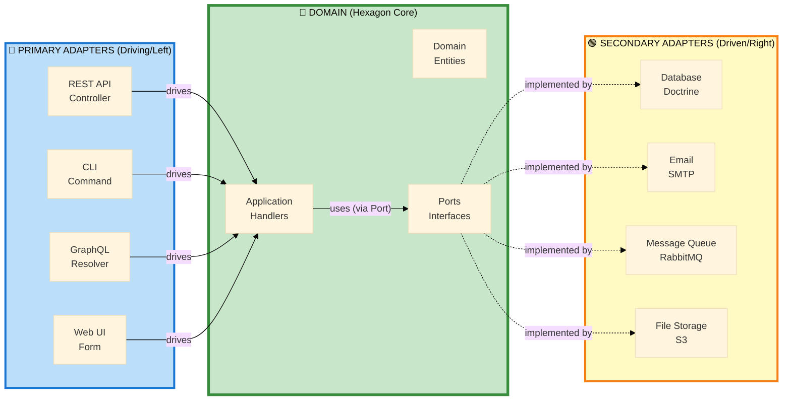
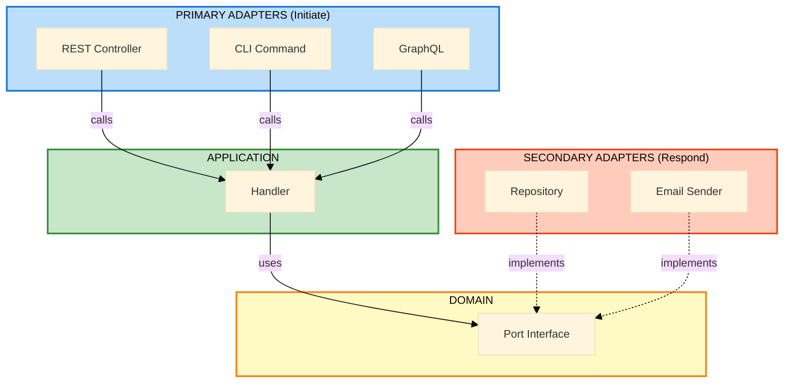

# Primary vs Secondary Adapters: The Two Sides of the Hexagon

## Table of Contents

1. [The Hexagon Has Two Sides](#the-hexagon-has-two-sides)
2. [Primary Adapters (Driving/Left Side)](#primary-adapters-drivingleft-side)
3. [Secondary Adapters (Driven/Right Side)](#secondary-adapters-drivenright-side)
4. [Key Differences](#key-differences)
5. [Dependency Direction](#dependency-direction)
6. [Real-World Examples](#real-world-examples)
7. [Testing Strategy](#testing-strategy)
8. [Common Patterns](#common-patterns)

---

## The Hexagon Has Two Sides



---

## Primary Adapters (Driving/Left Side)

### What Are Primary Adapters?

**Primary adapters DRIVE the application. They initiate interactions with your business logic.**

> "I want to do something" → Primary Adapter → Application

### Characteristics

- **Initiate requests** to the application
- **Depend ON the domain** (know about handlers, commands)
- **Convert external input** to application commands
- **Located on the LEFT side** of the hexagon (driving side)
- **Examples:** Controllers, CLI commands, GraphQL resolvers, event listeners

### Responsibility: Input Transformation

Primary adapters transform external format → application format.

```
HTTP JSON → Request DTO → Command → Handler
CLI arguments → Command → Handler
GraphQL query → Command → Handler
```

---

### Example 1: REST API Controller (Primary Adapter)

```php
namespace App\User\Infrastructure\Controller;

use App\User\Application\Command\RegisterUserCommand;
use Symfony\Component\HttpFoundation\JsonResponse;
use Symfony\Component\HttpFoundation\Request;
use Symfony\Component\Messenger\MessageBusInterface;

#[Route('/api/users', methods: ['POST'])]
final readonly class RegisterUserController
{
    public function __construct(
        private MessageBusInterface $messageBus,
        private SerializerInterface $serializer,
    ) {}

    public function __invoke(Request $request): JsonResponse
    {
        // 1. Deserialize HTTP JSON → DTO
        $dto = $this->serializer->deserialize(
            $request->getContent(),
            RegisterUserRequest::class,
            'json'
        );

        // 2. Transform DTO → Command (Application)
        $command = new RegisterUserCommand(
            email: $dto->email,
            password: $dto->password
        );

        // 3. DRIVE the application by dispatching command
        $this->messageBus->dispatch($command);

        // 4. Transform result → HTTP JSON
        return new JsonResponse(['status' => 'created'], 201);
    }
}
```

**Key Points:**
- **Initiates** the interaction (user makes HTTP request)
- **Depends on** Application layer (imports `RegisterUserCommand`)
- **Knows about** HTTP, JSON, Symfony Request/Response
- **Drives** the application by calling `messageBus->dispatch()`

---

### Example 2: CLI Command (Primary Adapter)

```php
namespace App\User\Infrastructure\Console;

use App\User\Application\Command\ImportUsersCommand;
use Symfony\Component\Console\Command\Command;
use Symfony\Component\Console\Input\InputArgument;
use Symfony\Component\Console\Input\InputInterface;
use Symfony\Component\Console\Output\OutputInterface;
use Symfony\Component\Messenger\MessageBusInterface;

final class ImportUsersCliCommand extends Command
{
    protected static $defaultName = 'app:import-users';

    public function __construct(
        private MessageBusInterface $messageBus,
    ) {
        parent::__construct();
    }

    protected function configure(): void
    {
        $this->addArgument('file', InputArgument::REQUIRED, 'CSV file path');
    }

    protected function execute(InputInterface $input, OutputInterface $output): int
    {
        $filePath = $input->getArgument('file');

        // Parse CSV file
        $users = $this->parseCSV($filePath);

        // For each user, DRIVE the application
        foreach ($users as $userData) {
            $command = new ImportUsersCommand(
                email: $userData['email'],
                name: $userData['name']
            );

            $this->messageBus->dispatch($command);
        }

        $output->writeln('Users imported successfully');

        return Command::SUCCESS;
    }
}
```

**Key Points:**
- **Initiates** via CLI execution
- **Depends on** Application (imports command)
- **Knows about** Symfony Console, file I/O
- **Drives** application by dispatching commands

---

### Example 3: GraphQL Resolver (Primary Adapter)

```php
namespace App\Product\Infrastructure\GraphQL;

use App\Product\Application\Query\FindProductQuery;
use Overblog\GraphQLBundle\Annotation as GQL;

#[GQL\Type]
final readonly class ProductResolver
{
    public function __construct(
        private MessageBusInterface $queryBus,
    ) {}

    #[GQL\Query(name: "product")]
    public function getProduct(string $id): ProductGraphQLDTO
    {
        // DRIVE the application
        $query = new FindProductQuery($id);
        $product = $this->queryBus->dispatch($query);

        // Transform domain → GraphQL DTO
        return new ProductGraphQLDTO(
            id: $product->getId(),
            name: $product->getName(),
            price: $product->getPrice()->toCents()
        );
    }
}
```

---

## Secondary Adapters (Driven/Right Side)

### What Are Secondary Adapters?

**Secondary adapters are DRIVEN by the application. The application tells them what to do.**

> Application → "I need to save this" → Secondary Adapter → Database

### Characteristics

- **Respond to requests** from the application
- **Implement domain ports** (interfaces defined in domain)
- **Convert domain → external system** format
- **Located on the RIGHT side** of the hexagon (driven side)
- **Examples:** Repositories, email senders, message publishers, file storage

### Responsibility: Output Transformation

Secondary adapters transform domain format → external format.

```
Entity → Repository → Doctrine Mapping → SQL → Database
Email Object → EmailSender → SMTP Protocol → Email Server
Event → EventPublisher → JSON → Message Queue
```

---

### Example 1: Doctrine Repository (Secondary Adapter)

```php
namespace App\User\Infrastructure\Persistence;

use App\User\Domain\Model\User;
use App\User\Domain\Port\UserRepositoryInterface; // Port (interface)
use App\User\Domain\ValueObject\UserId;
use Doctrine\ORM\EntityManagerInterface;

final class DoctrineUserRepository implements UserRepositoryInterface
{
    public function __construct(
        private EntityManagerInterface $entityManager
    ) {}

    // DRIVEN by the application
    public function save(User $user): void
    {
        // Transform: Domain Entity → Doctrine Persistence → SQL
        $this->entityManager->persist($user);
        $this->entityManager->flush();
    }

    public function findById(UserId $id): ?User
    {
        // Transform: Database Row → Doctrine Hydration → Domain Entity
        return $this->entityManager->find(User::class, $id->toString());
    }

    public function existsByEmail(string $email): bool
    {
        // Transform: Domain Query → SQL Query → Boolean Result
        $qb = $this->entityManager->createQueryBuilder();
        $qb->select('COUNT(u.id)')
           ->from(User::class, 'u')
           ->where('u.email = :email')
           ->setParameter('email', $email);

        return (int) $qb->getQuery()->getSingleScalarResult() > 0;
    }
}
```

**Key Points:**
- **Implements** port interface defined in Domain
- **Driven by** application (handler calls methods)
- **Knows about** Doctrine, SQL, database
- **Does NOT initiate** interactions—waits to be called

---

### Example 2: Email Sender (Secondary Adapter)

```php
namespace App\Notification\Infrastructure\Email;

use App\Notification\Domain\Port\EmailSenderInterface; // Port
use App\Notification\Domain\ValueObject\Email;
use Symfony\Component\Mailer\MailerInterface;
use Symfony\Component\Mime\Email as SymfonyEmail;

final readonly class SymfonyEmailSender implements EmailSenderInterface
{
    public function __construct(
        private MailerInterface $mailer,
    ) {}

    // DRIVEN by the application
    public function send(Email $email): void
    {
        // Transform: Domain Email → Symfony Email → SMTP Protocol
        $message = (new SymfonyEmail())
            ->from($email->from->value)
            ->to($email->to->value)
            ->subject($email->subject)
            ->html($email->body);

        $this->mailer->send($message);
    }
}
```

**Key Points:**
- **Implements** `EmailSenderInterface` (domain port)
- **Driven by** handler calling `send()`
- **Knows about** Symfony Mailer, SMTP
- **Transforms** domain object → infrastructure format

---

### Example 3: Message Queue Publisher (Secondary Adapter)

```php
namespace App\Order\Infrastructure\Messaging;

use App\Order\Domain\Event\OrderPlacedEvent;
use App\Order\Domain\Port\EventPublisherInterface; // Port
use Symfony\Component\Messenger\MessageBusInterface;

final readonly class SymfonyEventPublisher implements EventPublisherInterface
{
    public function __construct(
        private MessageBusInterface $eventBus,
    ) {}

    // DRIVEN by the application
    public function publish(OrderPlacedEvent $event): void
    {
        // Transform: Domain Event → Message Bus → RabbitMQ
        $this->eventBus->dispatch($event);
    }
}
```

---

## Key Differences

| Aspect | Primary Adapter | Secondary Adapter |
|--------|-----------------|-------------------|
| **Direction** | Drives application | Driven by application |
| **Initiates?** | Yes (user action, cron, event) | No (called by application) |
| **Depends On** | Application layer | Domain ports (interfaces) |
| **Implements** | Nothing (calls handlers) | Port interfaces |
| **Location** | Left side (driving) | Right side (driven) |
| **Examples** | Controller, CLI, GraphQL | Repository, Email, Queue |
| **Input/Output** | Receives external input | Produces external output |
| **Knows About** | Commands, Queries, Handlers | Ports, Entities |

---

## Dependency Direction

### Primary Adapter Dependencies

```
Primary Adapter (Infrastructure)
    ↓ depends on
Application Layer (Commands, Handlers)
    ↓ depends on
Domain Layer (Entities, Ports)
```

**Example:**
```php
// Controller (Primary Adapter) depends on Application
use App\User\Application\Command\RegisterUserCommand; // ✅ OK

class RegisterUserController
{
    public function __invoke(Request $request): Response
    {
        $command = new RegisterUserCommand(...);
        $this->messageBus->dispatch($command);
    }
}
```

---

### Secondary Adapter Dependencies

```
Domain Layer (Ports = Interfaces)
    ↑ implemented by
Secondary Adapter (Infrastructure)
```

**Example:**
```php
// Repository (Secondary Adapter) implements Domain Port
namespace App\User\Infrastructure\Persistence;

use App\User\Domain\Port\UserRepositoryInterface; // Domain interface

class DoctrineUserRepository implements UserRepositoryInterface
{
    // Implementation details...
}
```

**Key Point:** Domain defines interface, Infrastructure implements it (Dependency Inversion Principle).

---

## Real-World Examples

### Example: E-Commerce Order System

```php
// PRIMARY ADAPTERS (Driving)

// 1. REST API Controller
#[Route('/api/orders', methods: ['POST'])]
class CreateOrderController // Drives application
{
    public function __invoke(Request $request): JsonResponse
    {
        $command = new CreateOrderCommand(...);
        $this->messageBus->dispatch($command); // Drives
        return new JsonResponse(['status' => 'created'], 201);
    }
}

// 2. CLI Command
class ProcessPendingOrdersCommand extends Command
{
    protected function execute(...): int
    {
        $orders = $this->orders->findPending();
        foreach ($orders as $order) {
            $command = new ProcessOrderCommand($order->getId());
            $this->messageBus->dispatch($command); // Drives
        }
        return Command::SUCCESS;
    }
}

// 3. Event Listener (triggered by external event)
class PaymentReceivedListener // Drives application when payment event arrives
{
    public function __invoke(PaymentReceivedEvent $event): void
    {
        $command = new ConfirmOrderCommand($event->orderId);
        $this->messageBus->dispatch($command); // Drives
    }
}
```

```php
// SECONDARY ADAPTERS (Driven)

// 1. Order Repository (Database)
class DoctrineOrderRepository implements OrderRepositoryInterface
{
    // Driven by handlers calling save(), findById(), etc.
    public function save(Order $order): void { /* ... */ }
}

// 2. Payment Processor (External API)
class StripePaymentProcessor implements PaymentProcessorInterface
{
    // Driven by handlers calling charge(), refund(), etc.
    public function charge(PaymentRequest $request): PaymentResult { /* ... */ }
}

// 3. Email Sender (Email Service)
class SendGridEmailSender implements EmailSenderInterface
{
    // Driven by handlers calling send()
    public function send(Email $email): void { /* ... */ }
}

// 4. Inventory Service (External Microservice)
class HttpInventoryService implements InventoryServiceInterface
{
    // Driven by handlers calling reserveStock()
    public function reserveStock(ProductId $id, int $quantity): void { /* ... */ }
}
```

---

## Testing Strategy

### Testing Primary Adapters

**Focus:** Test input transformation and command/query dispatch.

```php
class RegisterUserControllerTest extends WebTestCase
{
    public function test_registers_user_via_api(): void
    {
        $client = static::createClient();

        // Test HTTP → Command transformation
        $client->request('POST', '/api/users', [], [], [
            'CONTENT_TYPE' => 'application/json',
        ], json_encode([
            'email' => 'user@example.com',
            'password' => 'secret123',
        ]));

        $this->assertResponseStatusCodeSame(201);

        // Verify command was dispatched correctly
        // (use test message bus or check side effects)
    }
}
```

---

### Testing Secondary Adapters

**Focus:** Test port implementation correctness.

```php
class DoctrineUserRepositoryTest extends KernelTestCase
{
    public function test_saves_and_retrieves_user(): void
    {
        $repository = $this->getContainer()->get(UserRepositoryInterface::class);

        $user = new User(
            UserId::generate(),
            new Email('test@example.com'),
            HashedPassword::fromPlaintext('password')
        );

        // Test port implementation
        $repository->save($user);

        $retrieved = $repository->findById($user->getId());

        $this->assertEquals($user->getId(), $retrieved->getId());
        $this->assertEquals($user->getEmail(), $retrieved->getEmail());
    }
}
```

---

### Testing Without Adapters (Pure Domain)

**Use in-memory fakes for secondary adapters:**

```php
class RegisterUserHandlerTest extends TestCase
{
    public function test_registers_user(): void
    {
        // Fake secondary adapter (in-memory)
        $users = new InMemoryUserRepository();

        $handler = new RegisterUserHandler($users);

        $command = new RegisterUserCommand('user@example.com', 'password123');
        $handler($command);

        // Verify via in-memory repository
        $this->assertTrue($users->existsByEmail('user@example.com'));
    }
}
```

---

## Common Patterns

### Pattern 1: Multiple Primary Adapters, Same Use Case

```
REST API Controller  ────┐
CLI Command          ────┼───→ CreateOrderCommand → Handler
GraphQL Resolver     ────┘
```

**All three primary adapters drive the same application logic.**

---

### Pattern 2: One Secondary Adapter, Multiple Implementations

```
Handler uses UserRepositoryInterface (Port)
                    ↑
    ┌───────────────┼───────────────┐
    │               │               │
InMemory      Doctrine        DynamoDB
(Test)        (Production)    (AWS)
```

**Multiple secondary adapters implement the same port for different contexts.**

---

### Pattern 3: Adapter Composition

```php
// Secondary adapter wrapping another adapter
final readonly class CachedUserRepository implements UserRepositoryInterface
{
    public function __construct(
        private UserRepositoryInterface $decorated, // Another secondary adapter
        private CacheInterface $cache,
    ) {}

    public function findById(UserId $id): ?User
    {
        return $this->cache->get(
            "user:{$id}",
            fn() => $this->decorated->findById($id) // Delegate to real adapter
        );
    }
}
```

**Decorator pattern: one secondary adapter wraps another.**

---

## Visual Summary



---

## Key Takeaways

1. **Primary = Driving** (Controllers, CLI) → Initiate interactions
2. **Secondary = Driven** (Repositories, Email) → Respond to application
3. **Primary depends ON application** (knows about commands/handlers)
4. **Secondary implements domain ports** (interfaces defined by domain)
5. **Dependency Inversion:** Domain defines interfaces, infrastructure implements
6. **Testing:** Primary = functional tests, Secondary = integration tests, Domain = unit tests

---

**Next:** [CQRS: Cost-Benefit Analysis →](./cqrs-cost-benefit.md)
