# Complete Request-Response Flow: End-to-End Journey

## Table of Contents

1. [Overview](#overview)
2. [The Complete Flow Diagram](#the-complete-flow-diagram)
3. [Step-by-Step Breakdown](#step-by-step-breakdown)
4. [Data Transformations](#data-transformations)
5. [Real Example: Register User](#real-example-register-user)
6. [Error Flow](#error-flow)
7. [Performance Considerations](#performance-considerations)

---

## Overview

Understanding how a request flows through all layers of hexagonal architecture is crucial. This guide shows the **complete journey** from HTTP request to database and back, with **data transformations** at each boundary.

### The Journey in One Sentence

> **HTTP JSON → Controller → Command DTO → Handler → Domain Entity → Repository Port → Doctrine Adapter → Database → Entity → Query Result → Response DTO → Controller → HTTP JSON**

---

## The Complete Flow Diagram


---

## Step-by-Step Breakdown

### Phase 1: Request Entry (Infrastructure)

#### Step 1-2: Routing
```
Input:  POST /api/users HTTP/1.1
        Content-Type: application/json
        {"email": "user@example.com", "password": "secret123"}

Action: Symfony Router matches route → RegisterUserController
```

#### Step 3: Deserialization
```php
// Controller receives raw request
public function __invoke(Request $request): JsonResponse
{
    // Deserialize JSON to DTO
    $dto = $this->serializer->deserialize(
        $request->getContent(),
        RegisterUserRequest::class,
        'json'
    );

    // $dto is now: RegisterUserRequest {
    //     email: "user@example.com",
    //     password: "secret123"
    // }
}
```

**Data Transformation:**
```
Raw JSON String → RegisterUserRequest DTO (Infrastructure)
```

#### Step 4-5: Validation
```php
// Validate using Symfony constraints
$errors = $this->validator->validate($dto);

if (count($errors) > 0) {
    throw new ValidationException($errors);
}

// DTO class with constraints:
class RegisterUserRequest
{
    #[Assert\NotBlank]
    #[Assert\Email]
    public string $email;

    #[Assert\NotBlank]
    #[Assert\Length(min: 8)]
    public string $password;
}
```

#### Step 6: Create Command & Dispatch
```php
// Transform DTO → Command (Application DTO)
$command = new RegisterUserCommand(
    email: $dto->email,
    password: $dto->password
);

// Dispatch to message bus
$this->messageBus->dispatch($command);
```

**Data Transformation:**
```
RegisterUserRequest DTO → RegisterUserCommand DTO (Application)
```

---

### Phase 2: Application Layer Orchestration

#### Step 7: Handler Invocation
```php
// Symfony automatically invokes handler
#[AsMessageHandler]
final readonly class RegisterUserHandler
{
    public function __invoke(RegisterUserCommand $command): void
    {
        // Handler starts orchestration
    }
}
```

#### Step 8-12: Check Email Uniqueness
```php
// Handler calls port
if ($this->users->existsByEmail($command->email)) {
    throw new EmailAlreadyExistsException($command->email);
}

// Port interface (Domain)
interface UserRepositoryInterface
{
    public function existsByEmail(string $email): bool;
}

// Adapter implementation (Infrastructure)
final class DoctrineUserRepository implements UserRepositoryInterface
{
    public function existsByEmail(string $email): bool
    {
        $qb = $this->entityManager->createQueryBuilder();
        $qb->select('COUNT(u.id)')
           ->from(User::class, 'u')
           ->where('u.email = :email')
           ->setParameter('email', $email);

        return (int) $qb->getQuery()->getSingleScalarResult() > 0;
    }
}

// Database query executed:
// SELECT COUNT(id) FROM users WHERE email = 'user@example.com'
```

**Data Flow:**
```
Command (email string)
  → Port method call
    → Adapter (Doctrine QueryBuilder)
      → SQL Query
        → Database
          → Result (0)
            → Adapter (false)
              → Port (false)
                → Handler (proceeds)
```

---

### Phase 3: Domain Layer Business Logic

#### Step 13: Factory Invocation
```php
// Handler delegates creation to factory
$user = UserFactory::create($command->email, $command->password);
```

#### Step 14-17: Email Value Object Creation
```php
// Factory creates Email value object
$email = new Email($command->email);

// Email constructor validates
final readonly class Email
{
    public function __construct(public string $value)
    {
        // Business rule: must be valid email
        if (!filter_var($value, FILTER_VALIDATE_EMAIL)) {
            throw new InvalidEmailException($value);
        }

        // Business rule: corporate domain only (example)
        if (!str_ends_with($value, '@company.com')) {
            throw new InvalidEmailDomainException($value);
        }
    }
}
```

**Data Transformation:**
```
Primitive string → Email Value Object (Domain)
```

#### Step 18-20: Password Hashing
```php
// Factory creates hashed password
$hashedPassword = HashedPassword::fromPlaintext($command->password);

// Value object handles hashing
final readonly class HashedPassword
{
    private function __construct(public string $hash) {}

    public static function fromPlaintext(string $plaintext): self
    {
        // Business rule: minimum length
        if (strlen($plaintext) < 8) {
            throw new PasswordTooShortException();
        }

        // Hash the password
        $hash = password_hash($plaintext, PASSWORD_ARGON2ID);

        return new self($hash);
    }
}
```

**Data Transformation:**
```
Plaintext string → HashedPassword Value Object (Domain)
```

#### Step 21-23: Entity Creation
```php
// Factory creates entity with all value objects
public static function create(string $email, string $password): User
{
    return new User(
        id: UserId::generate(),
        email: new Email($email),
        password: HashedPassword::fromPlaintext($password),
        isActive: false,
        createdAt: new \DateTimeImmutable()
    );
}

// Entity constructor applies business rules
public function __construct(
    private UserId $id,
    private Email $email,
    private HashedPassword $password,
    private bool $isActive,
    private \DateTimeImmutable $createdAt,
) {
    // Business invariant: new users are inactive
    if ($this->isActive) {
        throw new NewUserCannotBeActiveException();
    }
}
```

**Data Transformation:**
```
Primitives (string, string)
  → Value Objects (Email, HashedPassword)
    → Entity (User) [Domain]
```

---

### Phase 4: Persistence (Infrastructure)

#### Step 24-28: Save to Database
```php
// Handler saves entity through port
$this->users->save($user);

// Port interface (Domain)
interface UserRepositoryInterface
{
    public function save(User $user): void;
}

// Adapter implementation (Infrastructure)
final class DoctrineUserRepository implements UserRepositoryInterface
{
    public function save(User $user): void
    {
        $this->entityManager->persist($user);
        $this->entityManager->flush();
    }
}

// Doctrine generates SQL:
// INSERT INTO users (id, email, password, is_active, created_at)
// VALUES ('550e8400-...', 'user@example.com', '$argon2id$...', false, '2024-01-15 10:30:00')
```

**Data Transformation:**
```
User Entity (Domain)
  → Doctrine Metadata Mapping
    → SQL INSERT Statement
      → Database Row
```

---

### Phase 5: Response Path

#### Step 29-30: Handler Completion
```php
// Handler completes (returns void)
public function __invoke(RegisterUserCommand $command): void
{
    // ... all steps completed

    // No return value (command pattern)
}
```

#### Step 31: Response DTO Creation
```php
// Controller receives void, creates response
public function __invoke(Request $request): JsonResponse
{
    $command = new RegisterUserCommand(/*...*/);

    $this->messageBus->dispatch($command);

    // Fetch created user to return
    $user = $this->users->findByEmail($command->email);

    // Transform Entity → Response DTO
    $response = new UserResponse(
        id: $user->getId()->toString(),
        email: $user->getEmail()->value,
        isActive: $user->isActive(),
        createdAt: $user->getCreatedAt()->format('c')
    );

    return new JsonResponse($response, Response::HTTP_CREATED);
}
```

**Data Transformation:**
```
User Entity (Domain) → UserResponse DTO (Infrastructure) → JSON
```

#### Step 32-33: JSON Response
```
Output: HTTP/1.1 201 Created
        Content-Type: application/json

        {
            "id": "550e8400-e29b-41d4-a716-446655440000",
            "email": "user@example.com",
            "isActive": false,
            "createdAt": "2024-01-15T10:30:00+00:00"
        }
```

---

## Data Transformations

### Complete Transformation Chain

```
1. Raw JSON (HTTP)
   ↓
2. RegisterUserRequest DTO (Infrastructure - Input validation)
   ↓
3. RegisterUserCommand (Application - Use case intent)
   ↓
4. Email + Password (strings)
   ↓
5. Email Value Object + HashedPassword Value Object (Domain - Business validation)
   ↓
6. User Entity (Domain - Business logic)
   ↓
7. Doctrine Entity Metadata (Infrastructure - ORM mapping)
   ↓
8. SQL INSERT (Infrastructure - Database)
   ↓
9. Database Row (Persistence)
   ↓
10. User Entity (Domain - Loaded from DB)
   ↓
11. UserResponse DTO (Infrastructure - Output formatting)
   ↓
12. JSON Response (HTTP)
```

### Why So Many Transformations?

Each transformation serves a purpose:

| Transformation | Purpose | Layer |
|----------------|---------|-------|
| JSON → Request DTO | Input validation, HTTP concerns | Infrastructure |
| Request DTO → Command | Use case intent, application concern | Application |
| Command → Value Objects | Business validation | Domain |
| Value Objects → Entity | Business logic encapsulation | Domain |
| Entity → SQL | Persistence mapping | Infrastructure |
| SQL → Database Row | Storage | Infrastructure |
| Entity → Response DTO | Output formatting, hide internals | Infrastructure |
| Response DTO → JSON | HTTP serialization | Infrastructure |

**Key Principle:** Each layer has its own representation, preventing coupling.

---

## Real Example: Register User

### Complete Code Flow

```php
// 1. INFRASTRUCTURE: Controller
namespace App\User\Infrastructure\Controller;

#[Route('/api/users', methods: ['POST'])]
final readonly class RegisterUserController extends AbstractController
{
    public function __invoke(Request $request): JsonResponse
    {
        // Deserialize + validate
        $dto = $this->serializer->deserialize(
            $request->getContent(),
            RegisterUserRequest::class,
            'json'
        );

        $violations = $this->validator->validate($dto);
        if (count($violations) > 0) {
            throw new ValidationException($violations);
        }

        // Create command
        $command = new RegisterUserCommand(
            email: $dto->email,
            password: $dto->password
        );

        // Dispatch
        $this->messageBus->dispatch($command);

        // Fetch result
        $user = $this->users->findByEmail($command->email);

        // Create response
        return $this->json(
            new UserResponse(
                id: $user->getId()->toString(),
                email: $user->getEmail()->value,
                isActive: $user->isActive()
            ),
            Response::HTTP_CREATED
        );
    }
}

// 2. APPLICATION: Command (DTO)
namespace App\User\Application\Command;

final readonly class RegisterUserCommand
{
    public function __construct(
        public string $email,
        public string $password,
    ) {}
}

// 3. APPLICATION: Handler
namespace App\User\Application\Handler;

#[AsMessageHandler]
final readonly class RegisterUserHandler
{
    public function __construct(
        private UserRepositoryInterface $users,
        private EventDispatcherInterface $eventDispatcher,
    ) {}

    public function __invoke(RegisterUserCommand $command): void
    {
        // Check uniqueness (application concern - needs repository)
        if ($this->users->existsByEmail($command->email)) {
            throw new EmailAlreadyExistsException($command->email);
        }

        // Create user (domain logic in factory)
        $user = UserFactory::create($command->email, $command->password);

        // Persist (infrastructure concern)
        $this->users->save($user);

        // Dispatch event (infrastructure concern)
        $this->eventDispatcher->dispatch(
            new UserRegisteredEvent($user->getId())
        );
    }
}

// 4. DOMAIN: Factory
namespace App\User\Domain\Factory;

final class UserFactory
{
    public static function create(string $email, string $password): User
    {
        return new User(
            id: UserId::generate(),
            email: new Email($email),           // Validates format
            password: HashedPassword::fromPlaintext($password), // Validates + hashes
            isActive: false,
            createdAt: new \DateTimeImmutable()
        );
    }
}

// 5. DOMAIN: Value Objects
namespace App\User\Domain\ValueObject;

final readonly class Email
{
    public function __construct(public string $value)
    {
        if (!filter_var($value, FILTER_VALIDATE_EMAIL)) {
            throw new InvalidEmailException($value);
        }
    }
}

final readonly class HashedPassword
{
    private function __construct(public string $hash) {}

    public static function fromPlaintext(string $plaintext): self
    {
        if (strlen($plaintext) < 8) {
            throw new PasswordTooShortException();
        }

        return new self(password_hash($plaintext, PASSWORD_ARGON2ID));
    }
}

// 6. DOMAIN: Entity
namespace App\User\Domain\Model;

class User
{
    public function __construct(
        private UserId $id,
        private Email $email,
        private HashedPassword $password,
        private bool $isActive,
        private \DateTimeImmutable $createdAt,
    ) {}

    public function activate(): void
    {
        if ($this->isActive) {
            throw new UserAlreadyActiveException();
        }

        $this->isActive = true;
    }

    // Getters...
}

// 7. DOMAIN: Port (Interface)
namespace App\User\Domain\Port;

interface UserRepositoryInterface
{
    public function save(User $user): void;
    public function existsByEmail(string $email): bool;
    public function findByEmail(string $email): ?User;
}

// 8. INFRASTRUCTURE: Adapter (Doctrine Implementation)
namespace App\User\Infrastructure\Persistence;

final class DoctrineUserRepository implements UserRepositoryInterface
{
    public function __construct(
        private EntityManagerInterface $entityManager
    ) {}

    public function save(User $user): void
    {
        $this->entityManager->persist($user);
        $this->entityManager->flush();
    }

    public function existsByEmail(string $email): bool
    {
        return $this->entityManager->createQueryBuilder()
            ->select('COUNT(u.id)')
            ->from(User::class, 'u')
            ->where('u.email = :email')
            ->setParameter('email', $email)
            ->getQuery()
            ->getSingleScalarResult() > 0;
    }

    public function findByEmail(string $email): ?User
    {
        return $this->entityManager
            ->getRepository(User::class)
            ->findOneBy(['email' => $email]);
    }
}
```

---

## Error Flow

### Domain Exception Path

```mermaid
sequenceDiagram
    participant Client
    participant Controller
    participant Handler
    participant Factory
    participant Email

    Client->>Controller: POST /api/users<br/>{"email": "invalid", "password": "secret"}
    Controller->>Handler: dispatch(command)
    Handler->>Factory: create("invalid", "secret")
    Factory->>Email: new Email("invalid")
    Email->>Email: validate format
    Email-->>Factory: ❌ InvalidEmailException
    Factory-->>Handler: ❌ InvalidEmailException
    Handler-->>Controller: ❌ InvalidEmailException
    Controller->>Controller: catch & transform
    Controller-->>Client: 400 Bad Request<br/>{"error": "Invalid email format"}
```



### Infrastructure Exception Path

```mermaid
sequenceDiagram
    participant Handler
    participant Port
    participant Adapter
    participant DB

    Handler->>Port: save(user)
    Port->>Adapter: save(user)
    Adapter->>DB: INSERT INTO users...
    DB-->>Adapter: ❌ Duplicate key violation
    Adapter-->>Port: ❌ UniqueConstraintViolationException
    Port-->>Handler: ❌ UniqueConstraintViolationException
    Handler->>Handler: catch & wrap
    Handler-->>Handler: ❌ EmailAlreadyExistsException
```



**Exception Translation:** Infrastructure exceptions are caught and translated to domain exceptions.

---

## Performance Considerations

### Query Optimization

```php
// ❌ BAD: N+1 Query Problem
public function listUsers(): array
{
    $users = $this->users->findAll(); // 1 query

    foreach ($users as $user) {
        $user->getOrders(); // N queries!
    }

    return $users;
}

// ✅ GOOD: Eager Loading
public function listUsers(): array
{
    return $this->entityManager->createQueryBuilder()
        ->select('u', 'o')
        ->from(User::class, 'u')
        ->leftJoin('u.orders', 'o')
        ->getQuery()
        ->getResult(); // 1 query
}
```

### Caching Strategy

```php
// Add caching at infrastructure layer
final class CachedUserRepository implements UserRepositoryInterface
{
    public function __construct(
        private UserRepositoryInterface $decorated,
        private CacheInterface $cache,
    ) {}

    public function findByEmail(string $email): ?User
    {
        return $this->cache->get(
            "user:email:{$email}",
            fn() => $this->decorated->findByEmail($email)
        );
    }
}
```

### Database Connection Pooling

Configure in `config/packages/doctrine.yaml`:

```yaml
doctrine:
    dbal:
        connections:
            default:
                url: '%env(resolve:DATABASE_URL)%'
                driver: 'pdo_pgsql'
                server_version: '15'
                options:
                    # Connection pooling
                    persistent: true
                    # Prepared statement caching
                    cache_prepared_statements: true
```

---

## Key Takeaways

1. **Layered Transformations:** Data transforms at each boundary to maintain separation
2. **Direction Matters:** Dependencies always point inward (Infrastructure → Application → Domain)
3. **Ports at Boundaries:** All domain access to infrastructure goes through ports
4. **DTOs Everywhere:** Input DTO, Command DTO, Entity, Response DTO—each has a purpose
5. **Exception Translation:** Infrastructure exceptions become domain exceptions
6. **Performance via Infrastructure:** Caching, query optimization happen in adapters, not domain

---

**Next:** [Port Interface Design Principles →](./port-design-principles.md)
