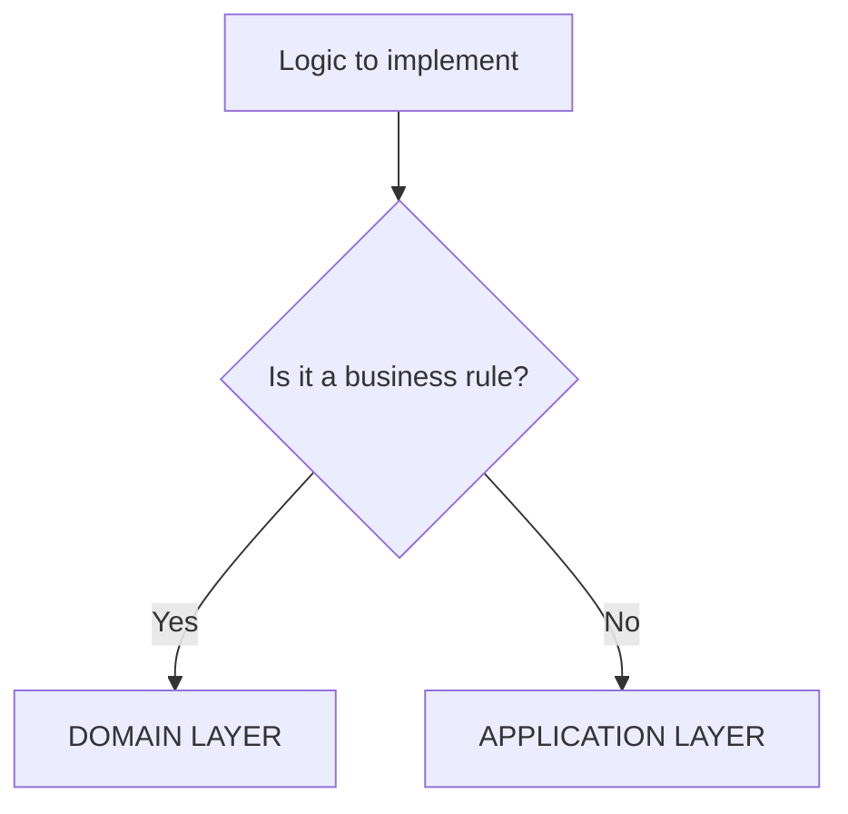
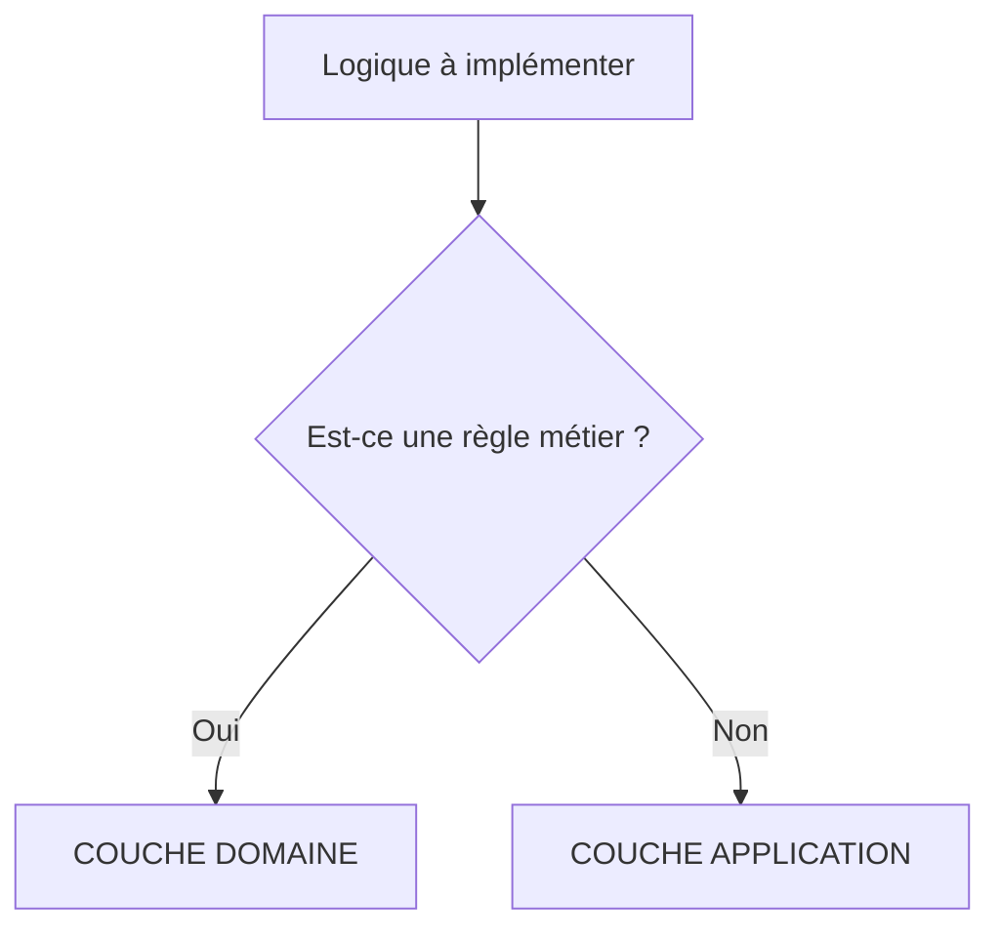

# Guide de Contribution - Traductions

## 🎯 Objectif

Aider la communauté francophone à contribuer aux traductions de la documentation du Hexagonal Maker Bundle.

## 📊 État Actuel des Traductions

### ✅ Complètement Traduit

- Page d'accueil (`index.md` ↔ `fr/index.md`)

### 🔄 Partiellement Traduit

- Guide Architecture (`ARCHITECTURE.md` - version française existe)

### ❌ À Traduire (Priorité Haute)

Les **9 nouveaux guides avancés** créés sont en anglais et nécessitent une traduction :

1. **Domain vs Application Logic** (`advanced/domain-vs-application.md`)
   - Guide de décision crucial pour les développeurs
   - ~26 KB de contenu
   - Contient des flowcharts et exemples de code

2. **Request-Response Flow** (`advanced/request-response-flow.md`)
   - Flux complet end-to-end avec diagrammes
   - ~24 KB de contenu
   - Diagrammes Mermaid séquentiels

3. **Port Design Principles** (`advanced/port-design-principles.md`)
   - Principes de conception des interfaces
   - ~21 KB de contenu
   - Exemples comparatifs ✅/❌

4. **Primary vs Secondary Adapters** (`advanced/primary-secondary-adapters.md`)
   - Les deux côtés de l'hexagone
   - ~22 KB de contenu
   - Diagrammes d'architecture

5. **CQRS: Cost-Benefit Analysis** (`advanced/cqrs-cost-benefit.md`)
   - Analyse coûts/bénéfices CQRS
   - ~26 KB de contenu
   - Flowchart de décision

6. **Dependency Injection Guide** (`advanced/dependency-injection-guide.md`)
   - Configuration Symfony complète
   - ~25 KB de contenu
   - Exemples de configuration YAML

7. **Factory Pattern Guide** (`advanced/factory-pattern-guide.md`)
   - Implémentation complète des factories
   - ~27 KB de contenu
   - Patterns multiples avec exemples

8. **Error Handling Strategy** (`advanced/error-handling-strategy.md`)
   - Gestion des exceptions
   - ~24 KB de contenu
   - Hiérarchie d'exceptions

9. **Anti-Patterns & Pitfalls** (`advanced/anti-patterns-pitfalls.md`)
   - Erreurs courantes à éviter
   - ~25 KB de contenu
   - Comparaisons ❌ mauvais vs ✅ bon

**Total à traduire : ~220 KB de documentation technique**

---

## 🚀 Comment Contribuer

### Étape 1 : Choisir un Document

Consultez la liste ci-dessus et choisissez un document à traduire. Les guides sont indépendants, vous pouvez en choisir un seul.

### Étape 2 : Forker le Dépôt

```bash
# Fork sur GitHub, puis clone
git clone https://github.com/VOTRE-USERNAME/hexagonal-maker-bundle.git
cd hexagonal-maker-bundle
git checkout -b traduction-domain-vs-application
```

### Étape 3 : Créer la Structure

```bash
# Créer le dossier si nécessaire
mkdir -p docs/fr/advanced

# Copier le fichier source
cp docs/advanced/domain-vs-application.md docs/fr/advanced/domain-vs-application.md
```

### Étape 4 : Traduire le Contenu

Ouvrez `docs/fr/advanced/domain-vs-application.md` et commencez la traduction.

#### Front Matter (En-tête YAML)

```yaml
---
layout: default_with_lang
title: Domain vs Application Logic  # ← Traduire le titre
parent: Sujets Avancés             # ← Traduire "Advanced Topics"
nav_order: 10
lang: fr                            # ← Changer 'en' en 'fr'
lang_ref: advanced/domain-vs-application.md  # ← Chemin vers version anglaise
---
```

#### Contenu Markdown

**À traduire :**
- Titres et sous-titres
- Paragraphes explicatifs
- Commentaires dans les exemples de code
- Légendes des diagrammes
- Tableaux et listes

**À NE PAS traduire :**
- Noms de variables et fonctions dans le code
- Mots-clés du langage (class, public, function, etc.)
- URLs et chemins de fichiers
- Noms de classes PHP
- Diagrammes Mermaid (sauf labels/textes)

---

## 📝 Règles de Traduction

### 1. Terminologie Technique

Utilisez ces traductions cohérentes :

| English | Français |
|---------|----------|
| Port | Port (garder en anglais dans contexte technique) |
| Adapter | Adaptateur |
| Domain | Domaine |
| Application Layer | Couche Application |
| Infrastructure | Infrastructure |
| Handler | Handler (garder en anglais) |
| Repository | Repository (ou Dépôt) |
| Value Object | Value Object (ou Objet-Valeur) |
| Entity | Entité |
| Use Case | Cas d'Usage |
| Command | Commande |
| Query | Requête (ou Query en contexte CQRS) |
| Factory | Fabrique (ou Factory) |
| Dependency Injection | Injection de Dépendances |

### 2. Termes à Garder en Anglais

Certains termes sont mieux reconnus en anglais :

- **CQRS** (Command Query Responsibility Segregation)
- **SOLID** (principes)
- **Design Patterns** (ou Patterns de Conception)
- **Hexagonal Architecture**
- **Ports & Adapters**
- **DTO** (Data Transfer Object)

### 3. Code et Exemples

**✅ BIEN :**

```php
// ✅ BON : La logique métier dans l'entité
class Order
{
    public function ship(): void
    {
        if ($this->status === OrderStatus::CANCELLED) {
            throw new CannotShipCancelledOrderException();
        }

        $this->status = OrderStatus::SHIPPED;
    }
}
```

**Notez :**
- Commentaire traduit : "BON : La logique métier dans l'entité"
- Code non traduit : `class Order`, `ship()`, etc.

### 4. Titres de Sections

Traduisez les titres mais gardez la structure :

**Anglais :**
```markdown
## The Problem: Anemic Domain Model
```

**Français :**
```markdown
## Le Problème : Modèle de Domaine Anémique
```

### 5. Diagrammes Mermaid

Traduisez uniquement les labels/textes :

**Anglais :**


**Français :**


### 6. Tableaux

Traduisez les en-têtes et le contenu :

**Anglais :**
```markdown
| Question | Domain | Application |
|----------|--------|-------------|
| Is it a business rule? | ✅ | ❌ |
```

**Français :**
```markdown
| Question | Domaine | Application |
|----------|---------|-------------|
| Est-ce une règle métier ? | ✅ | ❌ |
```

---

## 🎨 Style et Ton

### Ton Général

- **Formel mais accessible** : Utilisez "vous" (tutoiement possible si cohérent avec le reste)
- **Technique mais clair** : Expliquez les concepts complexes simplement
- **Didactique** : La documentation est pédagogique, gardez cet esprit

### Exemples de Style

**Anglais :**
> "If you need to validate input, use value objects."

**❌ Mauvaise traduction :**
> "Si tu as besoin de valider l'input, utilise des value objects."

**✅ Bonne traduction :**
> "Si vous devez valider les données d'entrée, utilisez des value objects."

---

## 🧪 Tester Votre Traduction

### 1. Installation Locale de Jekyll

```bash
cd docs
bundle install
```

### 2. Lancer le Serveur Local

```bash
bundle exec jekyll serve
```

### 3. Vérifier

- Ouvrez http://localhost:4000
- Naviguez vers votre page traduite
- Vérifiez le language switcher (🇬🇧 ↔ 🇫🇷)
- Testez les liens internes
- Vérifiez le rendu des diagrammes Mermaid

### 4. Checklist de Validation

- [ ] Front matter correct (lang: fr)
- [ ] Titre traduit
- [ ] Navigation fonctionne
- [ ] Language switcher fonctionne
- [ ] Liens internes corrects
- [ ] Diagrammes s'affichent correctement
- [ ] Code s'affiche avec coloration syntaxique
- [ ] Tableaux bien formatés
- [ ] Pas de fautes d'orthographe/grammaire

---

## 📤 Soumettre Votre Traduction

### 1. Commit et Push

```bash
git add docs/fr/advanced/domain-vs-application.md
git commit -m "feat(docs): add French translation for Domain vs Application Logic"
git push origin traduction-domain-vs-application
```

### 2. Créer une Pull Request

- Allez sur GitHub
- Cliquez sur "New Pull Request"
- Titre : `docs(fr): traduction Domain vs Application Logic`
- Description :
  ```markdown
  ## Description
  Traduction française du guide "Domain vs Application Logic"

  ## Checklist
  - [x] Front matter correct
  - [x] Contenu traduit
  - [x] Diagrammes traduits
  - [x] Testé localement
  - [x] Liens fonctionnels
  ```

### 3. Review

Le mainteneur reviewera votre traduction et pourra demander des ajustements.

---

## 🎯 Priorités de Traduction

Si vous ne savez pas par où commencer, voici l'ordre de priorité suggéré :

### 🔥 Priorité Haute

1. **Domain vs Application Logic** - Le guide le plus important pour les débutants
2. **Anti-Patterns & Pitfalls** - Éviter les erreurs courantes
3. **Request-Response Flow** - Comprendre le flux complet

### ⚡ Priorité Moyenne

4. **Port Design Principles** - Conception des interfaces
5. **Primary vs Secondary Adapters** - Les deux côtés de l'hexagone
6. **Error Handling Strategy** - Gestion des erreurs

### 💡 Priorité Basse

7. **CQRS: Cost-Benefit Analysis** - Concept avancé
8. **Dependency Injection Guide** - Configuration technique
9. **Factory Pattern Guide** - Pattern spécifique

---

## 🤝 Besoin d'Aide ?

### Questions

Si vous avez des questions sur :
- La terminologie à utiliser
- L'ambiguïté d'un terme
- La meilleure façon de traduire un concept

**Créez une issue sur GitHub** avec le label `traduction` :
- Titre : `[Traduction] Question sur terme "X"`
- Décrivez votre question avec contexte

### Glossaire Collaboratif

Un glossaire FR/EN est maintenu dans :
`docs/fr/GLOSSAIRE.md`

Consultez-le avant de traduire et contribuez-y si vous trouvez de nouveaux termes.

---

## 📊 Suivi de Progression

### Tableau de Bord

| Guide | Taille | Traducteur | Statut | PR |
|-------|--------|------------|--------|----|
| Domain vs Application | 26 KB | - | ❌ À faire | - |
| Request-Response Flow | 24 KB | - | ❌ À faire | - |
| Port Design Principles | 21 KB | - | ❌ À faire | - |
| Primary vs Secondary | 22 KB | - | ❌ À faire | - |
| CQRS Cost-Benefit | 26 KB | - | ❌ À faire | - |
| Dependency Injection | 25 KB | - | ❌ À faire | - |
| Factory Pattern | 27 KB | - | ❌ À faire | - |
| Error Handling | 24 KB | - | ❌ À faire | - |
| Anti-Patterns | 25 KB | - | ❌ À faire | - |

### Légende

- ❌ **À faire** - Pas encore commencé
- 🔄 **En cours** - Traduction en cours
- ✅ **Terminé** - Traduit et mergé
- 🔍 **Review** - En attente de review

---

## 🌟 Remerciements

Merci à tous les contributeurs qui aident à rendre cette documentation accessible à la communauté francophone !

Votre nom sera ajouté dans :
- Le fichier `CONTRIBUTORS.md`
- La section "Contributeurs" de la documentation
- Les release notes

---

**Questions ?** Ouvrez une issue avec le label `question` ou contactez [@ahmed-bhs](https://github.com/ahmed-bhs)

**Prêt à contribuer ?** Choisissez un guide dans la liste ci-dessus et lancez-vous ! 🚀
