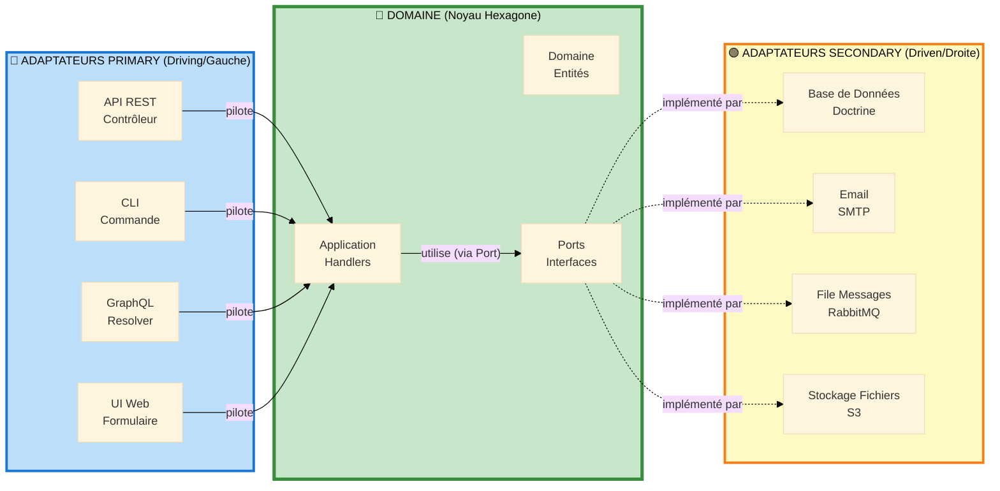

# Adaptateurs Primary vs Secondary : Les Deux Côtés de l'Hexagone

## Table des Matières

1. [L'Hexagone a Deux Côtés](#lhexagone-a-deux-côtés)
2. [Adaptateurs Primary (Driving/Gauche)](#adaptateurs-primary-drivingleft)
3. [Adaptateurs Secondary (Driven/Droite)](#adaptateurs-secondary-drivendroite)
4. [Différences Clés](#différences-clés)
5. [Direction des Dépendances](#direction-des-dépendances)
6. [Exemples Concrets](#exemples-concrets)
7. [Stratégie de Test](#stratégie-de-test)
8. [Patterns Courants](#patterns-courants)

---

## L'Hexagone a Deux Côtés



---

## Adaptateurs Primary (Driving/Gauche)

### Que Sont les Adaptateurs Primary ?

**Les adaptateurs primary PILOTENT l'application. Ils initient les interactions avec votre logique métier.**

> "Je veux faire quelque chose" → Adaptateur Primary → Application

### Caractéristiques

- **Initient les requêtes** vers l'application
- **Dépendent DU domaine** (connaissent les handlers, commandes)
- **Convertissent entrée externe** en commandes application
- **Situés du CÔTÉ GAUCHE** de l'hexagone (côté driving)
- **Exemples :** Contrôleurs, commandes CLI, resolvers GraphQL, event listeners

### Responsabilité : Transformation d'Entrée

Les adaptateurs primary transforment format externe → format application.

```
JSON HTTP → DTO Request → Command → Handler
Arguments CLI → Command → Handler
Query GraphQL → Command → Handler
```

---

### Exemple 1 : Contrôleur API REST (Adaptateur Primary)

```php
namespace App\User\Infrastructure\Controller;

use App\User\Application\Command\RegisterUserCommand;
use Symfony\Component\HttpFoundation\JsonResponse;
use Symfony\Component\HttpFoundation\Request;
use Symfony\Component\Messenger\MessageBusInterface;

#[Route('/api/users', methods: ['POST'])]
final readonly class RegisterUserController
{
    public function __construct(
        private MessageBusInterface $messageBus,
        private SerializerInterface $serializer,
    ) {}

    public function __invoke(Request $request): JsonResponse
    {
        // 1. Désérialiser JSON HTTP → DTO
        $dto = $this->serializer->deserialize(
            $request->getContent(),
            RegisterUserRequest::class,
            'json'
        );

        // 2. Transformer DTO → Command (Application)
        $command = new RegisterUserCommand(
            email: $dto->email,
            password: $dto->password
        );

        // 3. PILOTER l'application en dispatchant la commande
        $this->messageBus->dispatch($command);

        // 4. Transformer résultat → JSON HTTP
        return new JsonResponse(['status' => 'created'], 201);
    }
}
```

**Points Clés :**
- **Initie** l'interaction (utilisateur fait requête HTTP)
- **Dépend de** la couche Application (importe `RegisterUserCommand`)
- **Connaît** HTTP, JSON, Symfony Request/Response
- **Pilote** l'application en appelant `messageBus->dispatch()`

---

### Exemple 2 : Commande CLI (Adaptateur Primary)

```php
namespace App\User\Infrastructure\Console;

use App\User\Application\Command\ImportUsersCommand;
use Symfony\Component\Console\Command\Command;

final class ImportUsersCliCommand extends Command
{
    protected static $defaultName = 'app:import-users';

    public function __construct(
        private MessageBusInterface $messageBus,
    ) {
        parent::__construct();
    }

    protected function execute(InputInterface $input, OutputInterface $output): int
    {
        $filePath = $input->getArgument('file');
        $users = $this->parseCSV($filePath);

        // PILOTER l'application pour chaque utilisateur
        foreach ($users as $userData) {
            $command = new ImportUsersCommand(
                email: $userData['email'],
                name: $userData['name']
            );

            $this->messageBus->dispatch($command);
        }

        $output->writeln('Utilisateurs importés avec succès');
        return Command::SUCCESS;
    }
}
```

---

## Adaptateurs Secondary (Driven/Droite)

### Que Sont les Adaptateurs Secondary ?

**Les adaptateurs secondary sont PILOTÉS par l'application. L'application leur dit quoi faire.**

> Application → "J'ai besoin de sauvegarder ceci" → Adaptateur Secondary → Base de Données

### Caractéristiques

- **Répondent aux requêtes** de l'application
- **Implémentent les ports domaine** (interfaces définies dans le domaine)
- **Convertissent domaine → système externe** format
- **Situés du CÔTÉ DROIT** de l'hexagone (côté driven)
- **Exemples :** Repositories, email senders, message publishers, file storage

### Responsabilité : Transformation de Sortie

Les adaptateurs secondary transforment format domaine → format externe.

```
Entité → Repository → Mapping Doctrine → SQL → Base de Données
Objet Email → EmailSender → Protocole SMTP → Serveur Email
Événement → EventPublisher → JSON → File Messages
```

---

### Exemple 1 : Repository Doctrine (Adaptateur Secondary)

```php
namespace App\User\Infrastructure\Persistence;

use App\User\Domain\Model\User;
use App\User\Domain\Port\UserRepositoryInterface; // Port (interface)
use Doctrine\ORM\EntityManagerInterface;

final class DoctrineUserRepository implements UserRepositoryInterface
{
    public function __construct(
        private EntityManagerInterface $entityManager
    ) {}

    // PILOTÉ par l'application
    public function save(User $user): void
    {
        // Transformer : Entité Domaine → Persistance Doctrine → SQL
        $this->entityManager->persist($user);
        $this->entityManager->flush();
    }

    public function findById(UserId $id): ?User
    {
        // Transformer : Ligne BD → Hydratation Doctrine → Entité Domaine
        return $this->entityManager->find(User::class, $id->toString());
    }

    public function existsByEmail(string $email): bool
    {
        // Transformer : Query Domaine → Query SQL → Résultat Boolean
        $qb = $this->entityManager->createQueryBuilder();
        $qb->select('COUNT(u.id)')
           ->from(User::class, 'u')
           ->where('u.email = :email')
           ->setParameter('email', $email);

        return (int) $qb->getQuery()->getSingleScalarResult() > 0;
    }
}
```

**Points Clés :**
- **Implémente** interface port définie dans Domaine
- **Piloté par** application (handler appelle méthodes)
- **Connaît** Doctrine, SQL, base de données
- **N'initie PAS** interactions—attend d'être appelé

---

### Exemple 2 : Email Sender (Adaptateur Secondary)

```php
namespace App\Notification\Infrastructure\Email;

use App\Notification\Domain\Port\EmailSenderInterface; // Port
use Symfony\Component\Mailer\MailerInterface;

final readonly class SymfonyEmailSender implements EmailSenderInterface
{
    public function __construct(
        private MailerInterface $mailer,
    ) {}

    // PILOTÉ par l'application
    public function send(Email $email): void
    {
        // Transformer : Email Domaine → Email Symfony → Protocole SMTP
        $message = (new SymfonyEmail())
            ->from($email->from->value)
            ->to($email->to->value)
            ->subject($email->subject)
            ->html($email->body);

        $this->mailer->send($message);
    }
}
```

---

## Différences Clés

| Aspect | Adaptateur Primary | Adaptateur Secondary |
|--------|-------------------|---------------------|
| **Direction** | Pilote application | Piloté par application |
| **Initie?** | Oui (action utilisateur, cron, événement) | Non (appelé par application) |
| **Dépend De** | Couche application | Ports domaine (interfaces) |
| **Implémente** | Rien (appelle handlers) | Interfaces port |
| **Localisation** | Côté gauche (driving) | Côté droite (driven) |
| **Exemples** | Contrôleur, CLI, GraphQL | Repository, Email, Queue |
| **Entrée/Sortie** | Reçoit entrée externe | Produit sortie externe |
| **Connaît** | Commands, Queries, Handlers | Ports, Entités |

---

## Direction des Dépendances

### Dépendances Adaptateur Primary

```
Adaptateur Primary (Infrastructure)
    ↓ dépend de
Couche Application (Commands, Handlers)
    ↓ dépend de
Couche Domaine (Entités, Ports)
```

### Dépendances Adaptateur Secondary

```
Couche Domaine (Ports = Interfaces)
    ↑ implémenté par
Adaptateur Secondary (Infrastructure)
```

**Point Clé :** Le domaine définit l'interface, l'infrastructure l'implémente (Principe d'Inversion de Dépendance).

---

## Exemples Concrets

### Exemple : Système de Commandes E-Commerce

```php
// ADAPTATEURS PRIMARY (Pilotent)

// 1. Contrôleur API REST
#[Route('/api/orders', methods: ['POST'])]
class CreateOrderController // Pilote l'application
{
    public function __invoke(Request $request): JsonResponse
    {
        $command = new CreateOrderCommand(...);
        $this->messageBus->dispatch($command); // Pilote
        return new JsonResponse(['status' => 'created'], 201);
    }
}

// 2. Commande CLI
class ProcessPendingOrdersCommand extends Command
{
    protected function execute(...): int
    {
        $orders = $this->orders->findPending();
        foreach ($orders as $order) {
            $command = new ProcessOrderCommand($order->getId());
            $this->messageBus->dispatch($command); // Pilote
        }
        return Command::SUCCESS;
    }
}

// ADAPTATEURS SECONDARY (Pilotés)

// 1. Repository Commandes (Base de Données)
class DoctrineOrderRepository implements OrderRepositoryInterface
{
    // Piloté par handlers appelant save(), findById(), etc.
    public function save(Order $order): void { /* ... */ }
}

// 2. Processeur Paiement (API Externe)
class StripePaymentProcessor implements PaymentProcessorInterface
{
    // Piloté par handlers appelant charge(), refund(), etc.
    public function charge(PaymentRequest $request): PaymentResult { /* ... */ }
}

// 3. Email Sender (Service Email)
class SendGridEmailSender implements EmailSenderInterface
{
    // Piloté par handlers appelant send()
    public function send(Email $email): void { /* ... */ }
}
```

---

## Stratégie de Test

### Tester Adaptateurs Primary

**Focus :** Tester transformation entrée et dispatch command/query.

```php
class RegisterUserControllerTest extends WebTestCase
{
    public function test_registers_user_via_api(): void
    {
        $client = static::createClient();

        // Tester transformation HTTP → Command
        $client->request('POST', '/api/users', [], [], [
            'CONTENT_TYPE' => 'application/json',
        ], json_encode([
            'email' => 'user@example.com',
            'password' => 'secret123',
        ]));

        $this->assertResponseStatusCodeSame(201);
    }
}
```

### Tester Adaptateurs Secondary

**Focus :** Tester correction implémentation port.

```php
class DoctrineUserRepositoryTest extends KernelTestCase
{
    public function test_saves_and_retrieves_user(): void
    {
        $repository = $this->getContainer()->get(UserRepositoryInterface::class);

        $user = new User(
            UserId::generate(),
            new Email('test@example.com'),
            HashedPassword::fromPlaintext('password')
        );

        // Tester implémentation port
        $repository->save($user);

        $retrieved = $repository->findById($user->getId());

        $this->assertEquals($user->getId(), $retrieved->getId());
    }
}
```

---

## Résumé Visuel

| Aspect | Primary (Gauche) | Secondary (Droite) |
|--------|------------------|-------------------|
| **Rôle** | Initie | Répond |
| **Dépend de** | Application | Ports Domaine |
| **Exemples** | REST, CLI, GraphQL | Doctrine, SMTP, S3 |
| **Direction** | Entrée → Domaine | Domaine → Sortie |

---

## Points Clés à Retenir

1. **Primary = Driving** (Contrôleurs, CLI) → Initient interactions
2. **Secondary = Driven** (Repositories, Email) → Répondent à l'application
3. **Primary dépend DE l'application** (connaît commands/handlers)
4. **Secondary implémente ports domaine** (interfaces définies par domaine)
5. **Inversion de Dépendance :** Domaine définit interfaces, infrastructure implémente
6. **Tests :** Primary = tests fonctionnels, Secondary = tests d'intégration, Domaine = tests unitaires

---

**Suivant :** [CQRS: Analyse Coûts-Bénéfices →](./cqrs-analyse-couts-benefices.md)
