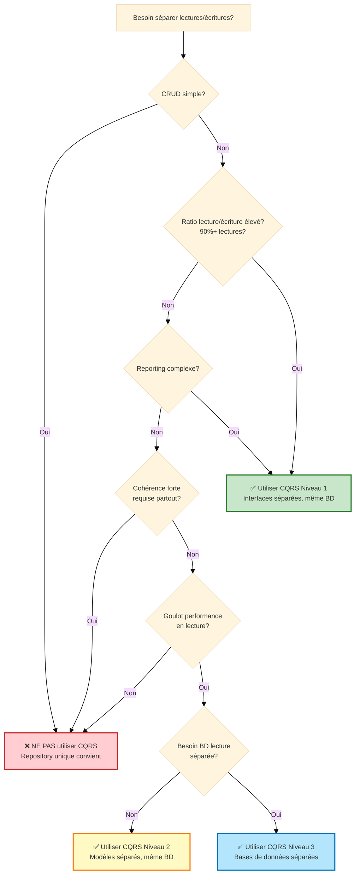

# CQRS : Quand l'Utiliser, Quand l'Éviter

## Table des Matières

1. [Qu'est-ce que CQRS ?](#quest-ce-que-cqrs-)
2. [Le Problème Central que CQRS Résout](#le-problème-central-que-cqrs-résout)
3. [Analyse Coûts-Bénéfices](#analyse-coûts-bénéfices)
4. [Quand Utiliser CQRS](#quand-utiliser-cqrs)
5. [Quand NE PAS Utiliser CQRS](#quand-ne-pas-utiliser-cqrs)
6. [Niveaux d'Implémentation](#niveaux-dimplémentation)
7. [Exemples de Décisions Réelles](#exemples-de-décisions-réelles)
8. [Stratégie de Migration](#stratégie-de-migration)

---

## Qu'est-ce que CQRS ?

**CQRS = Command Query Responsibility Segregation (Ségrégation des Responsabilités entre Commandes et Requêtes)**

> **Séparer le modèle qui écrit les données (Commands) du modèle qui lit les données (Queries).**

### Approche Traditionnelle (Modèle Unique)

```php
// Un repository gère lectures et écritures
interface UserRepositoryInterface
{
    // Écritures
    public function save(User $user): void;
    public function delete(User $user): void;

    // Lectures
    public function findById(UserId $id): ?User;
    public function findAll(): array;
    public function findActiveUsers(): array;
}
```

### Approche CQRS (Modèles Séparés)

```php
// Modèle écriture (Commands)
interface UserRepositoryInterface
{
    public function save(User $user): void;
    public function delete(User $user): void;
}

// Modèle lecture (Queries)
interface UserQueryInterface
{
    public function findById(UserId $id): ?UserDTO;
    public function findAll(): array; // array<UserDTO>
    public function findActiveUsers(): array;
}
```

---

## Le Problème Central que CQRS Résout

### Problème 1 : Lectures et Écritures Ont des Besoins Différents

| Préoccupation | Écritures (Commands) | Lectures (Queries) |
|---------------|----------------------|-------------------|
| **Focus** | Règles métier, cohérence | Vitesse, dénormalisation |
| **Modèle** | Entités riches | DTOs simples |
| **Validation** | Logique métier complexe | Aucune (déjà validé) |
| **Performance** | Peut être lent (transactionnel) | Doit être rapide (caché) |
| **Complexité** | Graphes d'objets complexes | Projections plates |

**Exemple : Commande E-Commerce**

```php
// ÉCRITURE : Entité complexe avec logique métier
class Order
{
    private OrderId $id;
    private CustomerId $customerId;
    private array $items; // OrderItem[]
    private Money $totalAmount;
    private OrderStatus $status;

    public function addItem(Product $product, int $quantity): void
    {
        // Règles métier complexes
        if ($this->status !== OrderStatus::DRAFT) {
            throw new CannotModifyConfirmedOrderException();
        }

        if ($quantity <= 0) {
            throw new InvalidQuantityException();
        }

        $this->items[] = new OrderItem($product, $quantity);
        $this->recalculateTotal();
    }
}

// LECTURE : DTO simple pour affichage
final readonly class OrderListDTO
{
    public function __construct(
        public string $orderId,
        public string $customerName,
        public int $totalAmountCents,
        public string $status,
        public string $createdAt,
    ) {}
}
```

**Pourquoi la séparation aide :**
- Modèle écriture peut être complexe (logique métier)
- Modèle lecture peut être simple (juste données pour affichage)
- Chacun optimisé pour son objectif

---

### Problème 2 : Patterns de Requêtes Conflictuels

**Requêtes écriture nécessitent :**
- Relations entités préservées
- Cohérence transactionnelle
- Graphes d'objets complets

**Requêtes lecture nécessitent :**
- Données dénormalisées (joins évités)
- Cache agressif
- Pagination, filtrage, tri

```php
// ❌ Tenter de servir les deux besoins avec un modèle mène au compromis

// Écriture : nécessite entité complète
$order = $this->orders->findById($orderId); // Charge Order avec toutes relations
$order->addItem($product, 2);
$this->orders->save($order);

// Lecture : nécessite données plates pour affichage
$orders = $this->orders->findAllOrders(); // Même repository!
// Mais on n'a pas besoin d'entités complètes avec logique métier pour affichage...
// On charge trop de données, gaspille mémoire, et c'est lent
```

**Solution CQRS :** Modèles différents pour besoins différents.

---

## Analyse Coûts-Bénéfices

### ✅ Bénéfices de CQRS

#### 1. **Performance Optimisée**

**Côté écriture :**
```php
// Entité complexe avec logique métier
$order->confirm(); // Logique domaine riche
$this->orders->save($order);
```

**Côté lecture :**
```php
// Requête SQL optimisée, retourne DTO plat
$orders = $this->queryBus->dispatch(new FindOrdersQuery());
// SELECT o.id, o.status, c.name AS customer_name, ...
// FROM orders o JOIN customers c ON ...
// Résultat plat, pas de surcharge d'hydratation
```

**Bénéfice :** Les lectures peuvent être optimisées agressivement (dénormalisation, cache) sans affecter modèle écriture.

---

#### 2. **Logique Lecture Simplifiée**

```php
// ❌ Sans CQRS : lecture utilise entité complexe
$user = $this->users->findById($userId); // Retourne entité User complète
return new UserResponse(
    id: $user->getId()->toString(),
    email: $user->getEmail()->value,
    name: $user->getName(),
    // Extraire données de l'entité complexe
);

// ✅ Avec CQRS : lecture retourne DTO directement
$userDTO = $this->queries->findById($userId); // Retourne UserDTO
return $userDTO; // Déjà dans le bon format
```

---

#### 3. **Scalabilité : Mise à l'Échelle Indépendante**

```
┌─────────────┐         ┌─────────────┐
│ BD Écriture │         │  BD Lecture │
│ (Master)    │────────>│  (Replicas) │
│             │  Sync   │             │
│ 1 instance  │         │ 10 replicas │
└─────────────┘         └─────────────┘
       ↑                       ↑
   10% trafic             90% trafic
```

**Bénéfice :** Mettre à l'échelle côtés lecture et écriture indépendamment selon charge.

---

#### 4. **Cohérence Éventuelle (Quand Acceptable)**

```php
// Commande : Écriture immédiate
$this->commandBus->dispatch(new CreateOrderCommand(...));
// Commande sauvegardée en BD écriture

// Requête : Lecture depuis replica (peut être légèrement retardée)
$orders = $this->queryBus->dispatch(new FindOrdersQuery());
// Lit depuis replica lecture (cohérence éventuelle)
```

**Bénéfice :** Accepter léger délai en lecture pour meilleur débit écriture.

---

#### 5. **Meilleure Sécurité : Vues en Lecture Seule**

```php
// Modèle lecture : exposer seulement données sûres
interface PublicUserQueryInterface
{
    public function findByUsername(string $username): ?PublicUserDTO;
    // Retourne : username, bio, avatar (champs sûrs)
}

// Modèle écriture : contient données sensibles
interface UserRepositoryInterface
{
    public function save(User $user): void;
    // Entité User contient hash password, email (sensible)
}
```

**Bénéfice :** Modèles lecture peuvent exposer différentes projections pour différents utilisateurs (public vs admin).

---

### ❌ Coûts de CQRS

#### 1. **Complexité Accrue**

**Sans CQRS (simple) :**
```php
interface UserRepositoryInterface
{
    public function save(User $user): void;
    public function findById(UserId $id): ?User;
}

// 1 interface, 1 implémentation, 1 modèle
```

**Avec CQRS (complexe) :**
```php
interface UserRepositoryInterface { /* méthodes écriture */ }
interface UserQueryInterface { /* méthodes lecture */ }

class DoctrineUserRepository implements UserRepositoryInterface { /* ... */ }
class DoctrineUserQuery implements UserQueryInterface { /* ... */ }

// 2 interfaces, 2 implémentations, 2 modèles (entité + DTO)
```

**Coût :** Double de code, double de maintenance.

---

#### 2. **Surcharge de Synchronisation**

Si bases de données écriture et lecture sont séparées :

```php
// Écrire en BD écriture
$this->commandBus->dispatch(new CreateUserCommand(...));

// Doit synchroniser vers BD lecture
$this->eventBus->dispatch(new UserCreatedEvent(...));

// Gestionnaire événement met à jour BD lecture
class UserCreatedEventHandler
{
    public function __invoke(UserCreatedEvent $event): void
    {
        $this->readDatabase->insertUser(...); // Sync!
    }
}
```

**Coût :** Infrastructure supplémentaire (files messages, gestionnaires événements, logique sync).

---

#### 3. **Problèmes Cohérence Éventuelle**

```php
// Utilisateur crée compte
$this->commandBus->dispatch(new RegisterUserCommand(...));

// Essaie immédiatement de se connecter
$user = $this->queries->findByEmail($email);
// ❌ Peut retourner null si BD lecture pas encore synchronisée!
```

**Coût :** Doit gérer problème "lire ses propres écritures", ajoutant complexité.

---

#### 4. **Temps de Développement**

| Tâche | Sans CQRS | Avec CQRS |
|-------|-----------|-----------|
| Ajouter nouvelle entité | 1 repository | 1 repository + 1 interface query + sync |
| Ajouter opération lecture | Ajouter méthode au repository | Ajouter méthode à interface query |
| Ajouter opération écriture | Ajouter méthode au repository | Ajouter méthode + événement + gestionnaire sync |
| Tests | Tester repository | Tester repository + query + sync + cohérence éventuelle |

**Coût :** 30-50% plus de temps développement pour opérations CRUD.

---

#### 5. **Courbe d'Apprentissage Équipe**

- Développeurs doivent comprendre :
  - Séparation Command vs Query
  - Architecture événementielle
  - Cohérence éventuelle
  - Files de messages
  - Synchronisation modèle lecture

**Coût :** Temps formation, erreurs pendant phase apprentissage.

---

## Quand Utiliser CQRS

### ✅ Bons Cas d'Usage

#### 1. **Ratio Lecture/Écriture Élevé (90%+ lectures)**

**Exemple : Tableau de Bord Analytics**

```php
// Écritures : rares (une fois par heure, tâche fond)
$this->commandBus->dispatch(new GenerateReportCommand(...));

// Lectures : fréquentes (milliers par seconde)
$report = $this->queries->getReport($reportId);
```

**Pourquoi CQRS aide :** Optimiser côté lecture agressivement (cache, dénormalisation) sans impacter écritures rares.

---

#### 2. **Exigences Reporting Complexes**

**Exemple : Tableau de Bord Admin E-Commerce**

```php
// Modèle écriture : entités normalisées
Order -> OrderItem -> Product
Customer -> Address

// Modèle lecture : vue dénormalisée
interface AdminDashboardQueryInterface
{
    public function getOrderSummary(): OrderSummaryDTO;
    // Retourne : total commandes, revenu, valeur commande moyenne, top produits
    // Tout dénormalisé en une seule requête optimisée
}
```

**Pourquoi CQRS aide :** Modèle lecture peut être dénormalisé pour reporting rapide sans polluer modèle écriture.

---

#### 3. **Multiples Représentations Lecture**

**Exemple : Catalogue Produits**

```php
// Modèle écriture : entité Product unique
class Product { /* logique métier */ }

// Modèles lecture : multiples projections
interface ProductListQueryInterface
{
    public function findAll(): array; // Liste simple
}

interface ProductDetailQueryInterface
{
    public function findById(ProductId $id): ProductDetailDTO; // Détails complets
}

interface ProductSearchQueryInterface
{
    public function search(string $query): array; // Elasticsearch
}
```

**Pourquoi CQRS aide :** Différents modèles lecture pour différents cas d'usage sans couplage.

---

#### 4. **Exigences Cohérence Différentes**

```php
// Écriture : doit être fortement cohérent
$this->orderRepository->save($order); // Cohérence immédiate

// Lecture : peut être éventuellement cohérent
$orders = $this->orderQuery->findRecent(); // Léger délai OK
```

**Pourquoi CQRS aide :** Accepter cohérence éventuelle en lecture pour améliorer débit écriture.

---

#### 5. **Piste Audit / Event Sourcing**

```php
// Écriture : événements stockés
$this->commandBus->dispatch(new UpdatePriceCommand(...));
// Produit : PriceUpdatedEvent stocké dans event store

// Lecture : vue matérialisée depuis événements
$product = $this->queries->findById($productId);
// Reconstruit depuis événements ou projection cachée
```

**Pourquoi CQRS aide :** S'adapte naturellement avec event sourcing (événements = modèle écriture, projections = modèle lecture).

---

## Quand NE PAS Utiliser CQRS

### ❌ Mauvais Cas d'Usage

#### 1. **Applications CRUD Simples**

```php
// Juste créer, lire, mettre à jour, supprimer utilisateurs
// ❌ CQRS est excessif ici
interface UserRepositoryInterface
{
    public function save(User $user): void;
    public function findById(UserId $id): ?User;
    public function findAll(): array;
    public function delete(User $user): void;
}

// ✅ Repository unique suffit
```

**Pourquoi éviter CQRS :** Pas de goulot performance, pas de requêtes complexes, complexité inutile.

---

#### 2. **Cohérence Forte Requise Partout**

```php
// Banque : utilisateur vérifie solde, puis retire
$balance = $this->accountQuery->getBalance($accountId);
// ❌ Si BD lecture désynchronisée, affiche mauvais solde!

$this->commandBus->dispatch(new WithdrawCommand($accountId, $amount));
// ❌ Peut permettre découvert à cause lecture obsolète
```

**Pourquoi éviter CQRS :** Cohérence éventuelle peut causer bugs dans scénarios nécessitant cohérence forte.

---

#### 3. **Petite Équipe, Délais Serrés**

- 2-3 développeurs
- Délai 3 mois
- Application web simple

**Pourquoi éviter CQRS :** Surcharge pas valable, ralentira livraison.

---

#### 4. **Trafic Faible**

- 100 utilisateurs par jour
- 10 requêtes par minute

**Pourquoi éviter CQRS :** Pas de problème performance à résoudre, optimisation prématurée.

---

#### 5. **Systèmes Intensifs Écriture**

- Système logging (écritures >> lectures)
- Pipeline ingestion données

**Pourquoi éviter CQRS :** CQRS optimise lectures, mais ce système est intensif écriture.

---

## Niveaux d'Implémentation

### Niveau 0 : Modèle Unique (Pas CQRS)

```php
interface UserRepositoryInterface
{
    public function save(User $user): void;
    public function findById(UserId $id): ?User;
}
```

**Complexité :** Faible
**Quand utiliser :** Petites apps, CRUD simple

---

### Niveau 1 : Interfaces Séparées, Même Base de Données

```php
// Interface écriture
interface UserRepositoryInterface
{
    public function save(User $user): void;
}

// Interface lecture
interface UserQueryInterface
{
    public function findById(UserId $id): ?UserDTO;
}

// Les deux utilisent même BD, interfaces différentes
```

**Complexité :** Moyenne
**Quand utiliser :** Séparation logique, même BD

---

### Niveau 2 : Modèles Séparés, Même Base de Données

```php
// Écriture : utilise entités
class DoctrineUserRepository implements UserRepositoryInterface
{
    public function save(User $user): void { /* ORM */ }
}

// Lecture : utilise SQL brut
class SqlUserQuery implements UserQueryInterface
{
    public function findById(UserId $id): ?UserDTO
    {
        // SQL brut optimisé pour lectures
        $stmt = $this->connection->executeQuery('SELECT ...');
        return $this->hydrateDTO($stmt->fetchAssociative());
    }
}
```

**Complexité :** Moyenne-Élevée
**Quand utiliser :** Optimiser lectures, toujours BD unique

---

### Niveau 3 : Bases de Données Séparées (CQRS Complet)

```php
// Écriture : BD Master
class DoctrineUserRepository implements UserRepositoryInterface
{
    public function save(User $user): void
    {
        $this->entityManager->persist($user); // BD écriture
        $this->eventBus->dispatch(new UserSavedEvent($user)); // Déclencher sync
    }
}

// Lecture : BD Replica
class ReplicaUserQuery implements UserQueryInterface
{
    public function findById(UserId $id): ?UserDTO
    {
        return $this->replicaConnection->fetchOne(...); // BD lecture
    }
}

// Gestionnaire événement synchronise écriture → lecture
class UserSavedEventHandler
{
    public function __invoke(UserSavedEvent $event): void
    {
        $this->readDatabase->upsertUser(...); // Sync
    }
}
```

**Complexité :** Élevée
**Quand utiliser :** Grande échelle, mise à l'échelle indépendante nécessaire

---

## Exemples de Décisions Réelles

### Exemple 1 : Plateforme Blog

**Scénario :**
- 10 000 articles
- 1M vues pages/mois
- 50 nouveaux articles/jour

**Lectures :** Voir articles (99% du trafic)
**Écritures :** Publier articles (1% du trafic)

**Décision : ✅ Utiliser CQRS Niveau 1**

```php
// Écriture : entité avec logique métier
interface ArticleRepositoryInterface
{
    public function save(Article $article): void;
}

// Lecture : DTOs optimisés
interface ArticleQueryInterface
{
    public function findPublished(int $limit, int $offset): array;
    public function findBySlug(string $slug): ?ArticleDetailDTO;
}
```

**Raison :** Ratio lecture/écriture élevé, même BD convient, séparation logique aide.

---

### Exemple 2 : Application Todo Simple

**Scénario :**
- 1 000 utilisateurs
- CRUD simple (créer, lire, mettre à jour, supprimer tâches)
- Trafic faible

**Décision : ❌ Ne pas utiliser CQRS**

```php
// Repository unique suffit
interface TaskRepositoryInterface
{
    public function save(Task $task): void;
    public function findById(TaskId $id): ?Task;
    public function findByUser(UserId $userId): array;
    public function delete(Task $task): void;
}
```

**Raison :** Pas de problème performance, pas de requêtes complexes, CQRS ajoute complexité inutile.

---

### Exemple 3 : Plateforme E-Commerce

**Scénario :**
- 100 000 produits
- 10 000 commandes/jour
- Tableau de bord admin complexe (rapports ventes, inventaire, analytics)

**Décision : ✅ Utiliser CQRS Niveau 2-3**

```php
// Écriture : entités normalisées
interface OrderRepositoryInterface
{
    public function save(Order $order): void;
}

// Lecture : projections dénormalisées
interface AdminDashboardQueryInterface
{
    public function getSalesReport(): SalesReportDTO;
    public function getInventoryStatus(): InventoryDTO;
}

interface OrderQueryInterface
{
    public function findRecent(int $limit): array;
}
```

**Raison :** Reporting complexe, volume lecture élevé, cohérence éventuelle acceptable pour tableaux de bord.

---

### Exemple 4 : Système Bancaire

**Scénario :**
- Soldes comptes doivent être précis
- Transactions doivent être fortement cohérentes

**Décision : ❌ Ne pas utiliser CQRS (ou utiliser Niveau 1 seulement)**

```php
// Modèle unique, cohérence forte
interface AccountRepositoryInterface
{
    public function save(Account $account): void;
    public function findById(AccountId $id): ?Account;
    // Même BD, cohérence immédiate
}
```

**Raison :** Cohérence forte requise, cohérence éventuelle inacceptable.

---

## Stratégie de Migration

### Étape 1 : Identifier Candidats

Chercher :
- ✅ Ratio lecture/écriture élevé
- ✅ Requêtes complexes
- ✅ Goulots performance en lecture

---

### Étape 2 : Commencer avec Niveau 1 (Même BD, Interfaces Séparées)

```php
// Diviser repository en écriture + lecture
// Avant :
interface UserRepositoryInterface { /* toutes méthodes */ }

// Après :
interface UserRepositoryInterface { /* méthodes écriture */ }
interface UserQueryInterface { /* méthodes lecture */ }
```

**Bénéfice :** Séparation logique, risque faible.

---

### Étape 3 : Optimiser Requêtes Lecture

```php
// Interface lecture utilise SQL brut au lieu ORM
class SqlUserQuery implements UserQueryInterface
{
    public function findAll(): array
    {
        // SQL optimisé avec cache
        return $this->cache->remember('users.all', function() {
            return $this->connection->fetchAllAssociative('SELECT ...');
        });
    }
}
```

---

### Étape 4 : Considérer BD Lecture Séparée (Si Nécessaire)

Seulement si :
- Charge lecture trop élevée pour BD unique
- Besoin mise à l'échelle indépendante

---

## Diagramme de Décision



---

## Résumé

### ✅ Utiliser CQRS Quand :
1. Ratio lecture/écriture élevé (90%+ lectures)
2. Exigences reporting complexes
3. Exigences cohérence différentes (cohérence éventuelle acceptable)
4. Goulot performance en lecture
5. Multiples représentations lecture nécessaires

### ❌ Éviter CQRS Quand :
1. Application CRUD simple
2. Cohérence forte requise partout
3. Petite équipe, délais serrés
4. Trafic faible, pas de problèmes performance
5. Système intensif écriture

### 🎯 Règle d'Or :
> **N'utilisez pas CQRS par défaut. Ajoutez-le quand vous avez un problème de performance prouvé ou des exigences de lecture complexes.**

---

**Suivant :** [Guide Injection de Dépendances →](./injection-dependances-guide.md)
