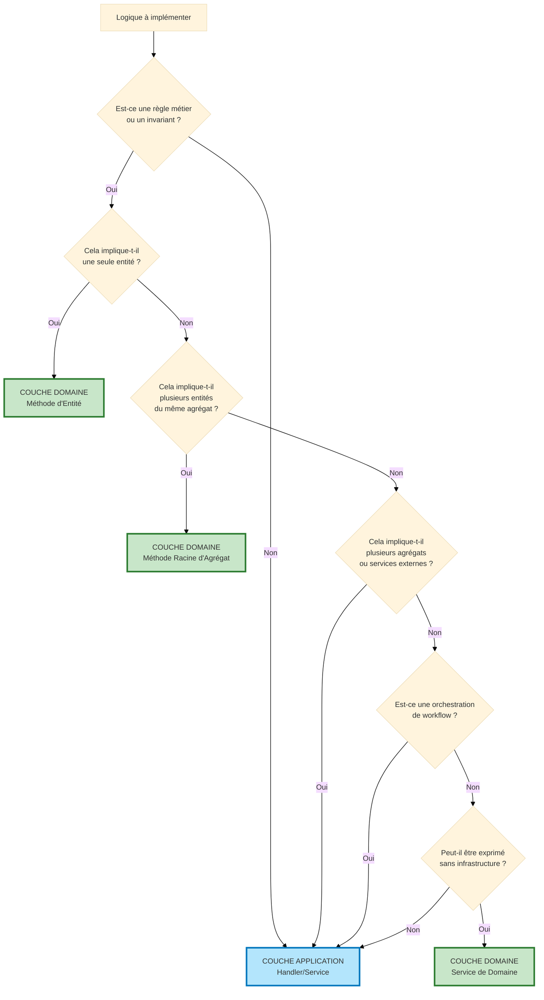

# Logique Domaine vs Application : Guide de Décision

## Table des Matières

1. [La Question Centrale](#la-question-centrale)
2. [Diagramme de Décision Rapide](#diagramme-de-décision-rapide)
3. [La Règle d'Or](#la-règle-dor)
4. [Responsabilités de la Couche Domaine](#responsabilités-de-la-couche-domaine)
5. [Responsabilités de la Couche Application](#responsabilités-de-la-couche-application)
6. [Exemples Concrets](#exemples-concrets)
7. [Erreurs Courantes](#erreurs-courantes)
8. [Les Tests Comme Validation](#les-tests-comme-validation)

---

## La Question Centrale

**Où cette logique doit-elle vivre : dans le Domaine (Entité/Value Object) ou dans l'Application (Handler) ?**

C'est LA question la plus fréquente lors de l'implémentation d'une architecture hexagonale. La frontière entre Domaine et Application est souvent floue, conduisant à :
- **Modèle de Domaine Anémique** - Les entités deviennent des conteneurs de données, les handlers contiennent toute la logique
- **Handlers Obèses** - La couche Application contient des règles métier qui devraient être dans le domaine

---

## Diagramme de Décision Rapide



---

## La Règle d'Or

> **Si un expert métier le décrirait comme une règle, cela appartient au Domaine.**
>
> **Si un expert métier le décrirait comme un processus/workflow, cela appartient à l'Application.**

### Exemples :
- ❌ "Quand un utilisateur s'inscrit, lui envoyer un email" → **Application** (workflow/orchestration)
- ✅ "Un utilisateur ne peut pas être activé s'il est déjà actif" → **Domaine** (invariant métier)
- ❌ "Sauvegarder l'utilisateur, puis logger l'événement, puis notifier les admins" → **Application** (orchestration)
- ✅ "Le total d'une commande doit égaler la somme des lignes" → **Domaine** (règle métier)

---

## Responsabilités de la Couche Domaine

### ✅ Le DOMAINE Doit Contenir :

#### 1. **Invariants Métier**
Règles qui DOIVENT TOUJOURS être vraies, quelle que soit la façon dont l'entité est utilisée.

```php
// ✅ BON : Le domaine impose l'invariant
class Order
{
    private OrderStatus $status;
    private \DateTimeImmutable $shippedAt;

    public function ship(): void
    {
        if ($this->status === OrderStatus::CANCELLED) {
            throw new CannotShipCancelledOrderException();
        }

        if ($this->status === OrderStatus::SHIPPED) {
            throw new OrderAlreadyShippedException();
        }

        $this->status = OrderStatus::SHIPPED;
        $this->shippedAt = new \DateTimeImmutable();
    }
}
```

**Pourquoi dans le Domaine ?** La règle "les commandes annulées ne peuvent pas être expédiées" est un invariant métier. Peu importe où `Order` est utilisé (CLI, API, job en arrière-plan), cette règle s'applique.

#### 2. **Transitions d'État**
Logique gouvernant comment une entité passe d'un état à un autre.

```php
// ✅ BON : Le domaine contrôle la machine à états
class Invoice
{
    private InvoiceStatus $status;

    public function markAsPaid(Money $amount): void
    {
        if (!$this->status->canTransitionTo(InvoiceStatus::PAID)) {
            throw new InvalidInvoiceStatusTransitionException(
                $this->status,
                InvoiceStatus::PAID
            );
        }

        if (!$amount->equals($this->totalAmount)) {
            throw new InvalidPaymentAmountException($amount, $this->totalAmount);
        }

        $this->status = InvoiceStatus::PAID;
        $this->paidAt = new \DateTimeImmutable();
    }
}
```

#### 3. **Validation des Value Objects**
Validation qui assure qu'une valeur a du sens dans le domaine métier.

```php
// ✅ BON : Le domaine valide les contraintes métier
final readonly class Email
{
    public function __construct(public string $value)
    {
        if (!filter_var($value, FILTER_VALIDATE_EMAIL)) {
            throw new InvalidEmailException($value);
        }

        // Règle métier : domaine entreprise uniquement
        if (!str_ends_with($value, '@company.com')) {
            throw new InvalidEmailDomainException($value);
        }
    }
}
```

#### 4. **Calculs Basés sur les Données de l'Entité**
Calculs purs utilisant les propriétés de l'entité.

```php
// ✅ BON : Le domaine calcule les valeurs métier
class Order
{
    private array $items; // OrderItem[]
    private Money $shippingCost;
    private Discount $discount;

    public function calculateTotal(): Money
    {
        $subtotal = array_reduce(
            $this->items,
            fn(Money $sum, OrderItem $item) => $sum->add($item->getTotal()),
            Money::zero()
        );

        $afterDiscount = $this->discount->apply($subtotal);

        return $afterDiscount->add($this->shippingCost);
    }
}
```

#### 5. **Méthodes de Logique Métier**
Méthodes qui expriment des opérations métier.

```php
// ✅ BON : Le domaine exprime des concepts métier
class Subscription
{
    private \DateTimeImmutable $expiresAt;

    public function isExpired(): bool
    {
        return $this->expiresAt < new \DateTimeImmutable();
    }

    public function renew(Period $period): void
    {
        if ($this->isExpired()) {
            throw new CannotRenewExpiredSubscriptionException();
        }

        $this->expiresAt = $period->addTo($this->expiresAt);
    }
}
```

---

## Responsabilités de la Couche Application

### ✅ L'APPLICATION Doit Contenir :

#### 1. **Orchestration & Workflow**
Coordination de plusieurs opérations en séquence.

```php
// ✅ BON : L'application orchestre le workflow
final readonly class RegisterUserHandler
{
    public function __construct(
        private UserRepositoryInterface $users,
        private EmailSenderInterface $emailSender,
        private EventDispatcherInterface $eventDispatcher,
    ) {}

    public function __invoke(RegisterUserCommand $command): void
    {
        // 1. Créer l'entité de domaine (logique domaine dans la factory)
        $user = UserFactory::create($command->email, $command->password);

        // 2. Persister (préoccupation infrastructure)
        $this->users->save($user);

        // 3. Envoyer l'email (préoccupation infrastructure)
        $this->emailSender->send(
            new WelcomeEmail($user->getEmail())
        );

        // 4. Dispatcher l'événement (préoccupation infrastructure)
        $this->eventDispatcher->dispatch(
            new UserRegisteredEvent($user->getId())
        );
    }
}
```

**Pourquoi dans l'Application ?** C'est un workflow : "faire ceci, puis cela, puis cela". Il coordonne plusieurs préoccupations d'infrastructure.

#### 2. **Opérations Cross-Agrégat**
Opérations impliquant plusieurs racines d'agrégat.

```php
// ✅ BON : L'application coordonne plusieurs agrégats
final readonly class TransferMoneyHandler
{
    public function __construct(
        private AccountRepositoryInterface $accounts,
        private TransactionRepositoryInterface $transactions,
    ) {}

    public function __invoke(TransferMoneyCommand $command): void
    {
        $sourceAccount = $this->accounts->findById($command->sourceAccountId);
        $destinationAccount = $this->accounts->findById($command->destinationAccountId);

        // Logique domaine : chaque compte valide ses propres règles
        $sourceAccount->withdraw($command->amount);
        $destinationAccount->deposit($command->amount);

        // Logique application : coordonner la persistance des deux agrégats
        $this->accounts->save($sourceAccount);
        $this->accounts->save($destinationAccount);

        // Logique application : créer l'enregistrement de transaction
        $transaction = new Transaction(
            TransactionId::generate(),
            $sourceAccount->getId(),
            $destinationAccount->getId(),
            $command->amount
        );
        $this->transactions->save($transaction);
    }
}
```

**Pourquoi dans l'Application ?** Modifier deux agrégats différents nécessite une coordination au niveau application.

#### 3. **Coordination d'Infrastructure**
Gérer les repositories, emails, messaging, etc.

```php
// ✅ BON : L'application gère l'infrastructure
final readonly class PublishArticleHandler
{
    public function __construct(
        private ArticleRepositoryInterface $articles,
        private SearchIndexInterface $searchIndex,
        private CacheInterface $cache,
    ) {}

    public function __invoke(PublishArticleCommand $command): void
    {
        $article = $this->articles->findById($command->articleId);

        // Logique domaine
        $article->publish();

        // Coordination infrastructure
        $this->articles->save($article);
        $this->searchIndex->index($article);
        $this->cache->invalidate("article:{$article->getId()}");
    }
}
```

#### 4. **Gestion des Transactions**
Gérer les transactions de base de données à travers les opérations.

```php
// ✅ BON : L'application gère les transactions
final readonly class CheckoutOrderHandler
{
    public function __construct(
        private OrderRepositoryInterface $orders,
        private InventoryServiceInterface $inventory,
        private EntityManagerInterface $entityManager,
    ) {}

    public function __invoke(CheckoutOrderCommand $command): void
    {
        $this->entityManager->beginTransaction();

        try {
            $order = $this->orders->findById($command->orderId);

            // Logique domaine
            $order->confirm();

            // Opérations infrastructure dans la transaction
            $this->orders->save($order);
            $this->inventory->reserveStock($order->getItems());

            $this->entityManager->commit();
        } catch (\Exception $e) {
            $this->entityManager->rollback();
            throw $e;
        }
    }
}
```

#### 5. **Validation & Transformation des Entrées**
Valider les entrées externes et transformer en objets domaine.

```php
// ✅ BON : L'application valide les entrées
final readonly class CreateProductHandler
{
    public function __construct(
        private ProductRepositoryInterface $products,
        private ValidatorInterface $validator,
    ) {}

    public function __invoke(CreateProductCommand $command): void
    {
        // Application : valider la structure de la commande
        $errors = $this->validator->validate($command);
        if (count($errors) > 0) {
            throw new ValidationException($errors);
        }

        // Application : vérifier les contraintes métier nécessitant le repository
        if ($this->products->existsByName($command->name)) {
            throw new ProductNameAlreadyExistsException($command->name);
        }

        // Domaine : la factory contient la logique de création d'entité
        $product = ProductFactory::create(
            name: $command->name,
            price: Money::fromCents($command->priceInCents),
            stock: $command->initialStock
        );

        // Application : persister
        $this->products->save($product);
    }
}
```

---

## Exemples Concrets

### Exemple 1 : Annulation de Commande

#### ❌ MAUVAIS : Logique Métier dans le Handler

```php
// ❌ FAUX : Le handler contient des règles métier !
final readonly class CancelOrderHandler
{
    public function __invoke(CancelOrderCommand $command): void
    {
        $order = $this->orders->findById($command->orderId);

        // Logique métier fuitée dans le handler !
        if ($order->getStatus() === OrderStatus::SHIPPED) {
            throw new CannotCancelShippedOrderException();
        }

        if ($order->getStatus() === OrderStatus::DELIVERED) {
            throw new CannotCancelDeliveredOrderException();
        }

        $order->setStatus(OrderStatus::CANCELLED);
        $order->setCancelledAt(new \DateTimeImmutable());

        $this->orders->save($order);
    }
}
```

**Problèmes :**
- Règles métier éparpillées dans le handler
- Impossible de réutiliser la logique d'annulation ailleurs
- Difficile de tester les règles d'annulation sans le handler
- `Order` est juste un sac de données (modèle anémique)

#### ✅ BON : Logique Métier dans le Domaine

```php
// ✅ CORRECT : L'entité impose les règles métier
class Order
{
    public function cancel(): void
    {
        if ($this->status === OrderStatus::SHIPPED) {
            throw new CannotCancelShippedOrderException();
        }

        if ($this->status === OrderStatus::DELIVERED) {
            throw new CannotCancelDeliveredOrderException();
        }

        $this->status = OrderStatus::CANCELLED;
        $this->cancelledAt = new \DateTimeImmutable();
    }
}

// Le handler devient un orchestrateur mince
final readonly class CancelOrderHandler
{
    public function __invoke(CancelOrderCommand $command): void
    {
        $order = $this->orders->findById($command->orderId);

        $order->cancel(); // Le domaine impose les règles

        $this->orders->save($order);
        $this->eventDispatcher->dispatch(new OrderCancelledEvent($order->getId()));
    }
}
```

**Bénéfices :**
- Règles métier encapsulées dans le domaine
- Réutilisable dans n'importe quel cas d'usage (API, CLI, job batch)
- Facile à tester en isolation
- Le handler est un orchestrateur mince

---

### Exemple 2 : Inscription Utilisateur

#### ❌ MAUVAIS : Tout dans le Handler

```php
// ❌ FAUX : Mélange des préoccupations domaine et application
final readonly class RegisterUserHandler
{
    public function __invoke(RegisterUserCommand $command): void
    {
        // Validation d'entrée (OK dans l'application)
        if (empty($command->email)) {
            throw new InvalidArgumentException('Email requis');
        }

        // Validation métier (devrait être dans le domaine !)
        if (!filter_var($command->email, FILTER_VALIDATE_EMAIL)) {
            throw new InvalidEmailException();
        }

        // Règle métier (devrait être dans le domaine !)
        if (strlen($command->password) < 8) {
            throw new PasswordTooShortException();
        }

        // Vérification de règle métier (OK, nécessite le repository)
        if ($this->users->existsByEmail($command->email)) {
            throw new EmailAlreadyExistsException();
        }

        // Création d'entité (devrait être dans une factory !)
        $user = new User(
            UserId::generate(),
            new Email($command->email),
            new HashedPassword($command->password),
            false
        );

        $this->users->save($user);
        $this->emailSender->send(new WelcomeEmail($user->getEmail()));
    }
}
```

#### ✅ BON : Séparation des Préoccupations

```php
// Domaine : Value Object avec validation
final readonly class Email
{
    public function __construct(public string $value)
    {
        if (!filter_var($value, FILTER_VALIDATE_EMAIL)) {
            throw new InvalidEmailException($value);
        }
    }
}

// Domaine : Value Object avec validation
final readonly class Password
{
    public function __construct(public string $value)
    {
        if (strlen($value) < 8) {
            throw new PasswordTooShortException();
        }
    }
}

// Domaine : Factory encapsule la logique de création
final class UserFactory
{
    public static function create(string $email, string $password): User
    {
        return new User(
            UserId::generate(),
            new Email($email), // Valide dans le constructeur
            HashedPassword::fromPlaintext($password), // Hash + valide
            isActive: false
        );
    }
}

// Application : Orchestrateur mince
final readonly class RegisterUserHandler
{
    public function __invoke(RegisterUserCommand $command): void
    {
        // Application : vérifier l'unicité (nécessite le repository)
        if ($this->users->existsByEmail($command->email)) {
            throw new EmailAlreadyExistsException($command->email);
        }

        // Domaine : la factory gère la création + validation
        $user = UserFactory::create($command->email, $command->password);

        // Application : orchestrer l'infrastructure
        $this->users->save($user);
        $this->emailSender->send(new WelcomeEmail($user->getEmail()));
        $this->eventDispatcher->dispatch(new UserRegisteredEvent($user->getId()));
    }
}
```

---

## Erreurs Courantes

### Erreur 1 : Modèle de Domaine Anémique

**Symptôme :** Les entités sont juste des conteneurs de données avec getters/setters, toute la logique est dans les handlers.

```php
// ❌ Entité anémique
class Order
{
    private OrderStatus $status;

    public function getStatus(): OrderStatus { return $this->status; }
    public function setStatus(OrderStatus $status): void { $this->status = $status; }
}

// ❌ Handler avec logique métier
class ShipOrderHandler
{
    public function __invoke(ShipOrderCommand $command): void
    {
        $order = $this->orders->findById($command->orderId);

        if ($order->getStatus() !== OrderStatus::CONFIRMED) {
            throw new InvalidOrderStatusException();
        }

        $order->setStatus(OrderStatus::SHIPPED);
        $this->orders->save($order);
    }
}
```

**Solution :** Déplacer la logique métier dans les méthodes d'entité.

```php
// ✅ Modèle de domaine riche
class Order
{
    private OrderStatus $status;

    public function ship(): void
    {
        if ($this->status !== OrderStatus::CONFIRMED) {
            throw new CannotShipUnconfirmedOrderException();
        }

        $this->status = OrderStatus::SHIPPED;
        $this->shippedAt = new \DateTimeImmutable();
    }
}

// ✅ Handler mince
class ShipOrderHandler
{
    public function __invoke(ShipOrderCommand $command): void
    {
        $order = $this->orders->findById($command->orderId);
        $order->ship(); // Le domaine gère les règles
        $this->orders->save($order);
    }
}
```

---

### Erreur 2 : Handlers Obèses (God Objects)

**Symptôme :** Les handlers contiennent des centaines de lignes, plusieurs responsabilités.

```php
// ❌ Handler obèse avec trop de responsabilités
class ProcessOrderHandler
{
    public function __invoke(ProcessOrderCommand $command): void
    {
        // 200 lignes de validation, calcul, orchestration...
        // Règles métier mélangées avec l'infrastructure
        // Difficile à tester, difficile à comprendre
    }
}
```

**Solution :** Extraire la logique métier vers le domaine, garder le handler focalisé sur l'orchestration.

---

### Erreur 3 : Logique Métier Nécessitant un Repository

**Symptôme :** Essayer de mettre une logique nécessitant des données externes dans le domaine.

```php
// ❌ FAUX : L'entité ne peut pas accéder au repository
class User
{
    public function changeEmail(Email $newEmail, UserRepositoryInterface $users): void
    {
        // Ne peut pas injecter le repository dans l'entité !
        if ($users->existsByEmail($newEmail)) {
            throw new EmailAlreadyExistsException();
        }

        $this->email = $newEmail;
    }
}
```

**Solution :** Mettre la vérification dans la couche application.

```php
// ✅ CORRECT : L'application vérifie, le domaine met à jour
class ChangeUserEmailHandler
{
    public function __invoke(ChangeUserEmailCommand $command): void
    {
        $user = $this->users->findById($command->userId);

        // Application : vérification d'unicité nécessite le repository
        if ($this->users->existsByEmail($command->newEmail)) {
            throw new EmailAlreadyExistsException($command->newEmail);
        }

        // Domaine : simple mise à jour avec validation
        $user->changeEmail(new Email($command->newEmail));

        $this->users->save($user);
    }
}
```

---

## Les Tests Comme Validation

**Une bonne séparation signifie des tests faciles :**

### Tests du Domaine (Sans Infrastructure)

```php
// ✅ Tester la logique domaine sans aucune infrastructure
class OrderTest extends TestCase
{
    public function test_cannot_ship_cancelled_order(): void
    {
        $order = new Order(OrderId::generate(), OrderStatus::CANCELLED);

        $this->expectException(CannotShipCancelledOrderException::class);

        $order->ship();
    }

    // Pas de base de données, pas de framework, tests PHP purs
}
```

### Tests de l'Application (Avec Doublures de Test)

```php
// ✅ Tester l'orchestration du handler avec repository en mémoire
class ShipOrderHandlerTest extends TestCase
{
    public function test_ships_order_and_dispatches_event(): void
    {
        $orders = new InMemoryOrderRepository(); // Fausse infrastructure
        $events = new InMemoryEventDispatcher();
        $handler = new ShipOrderHandler($orders, $events);

        $order = new Order(OrderId::generate(), OrderStatus::CONFIRMED);
        $orders->save($order);

        $handler(new ShipOrderCommand($order->getId()));

        $this->assertEquals(OrderStatus::SHIPPED, $order->getStatus());
        $this->assertTrue($events->wasDispatched(OrderShippedEvent::class));
    }
}
```

**Si vous ne pouvez pas tester la logique domaine sans infrastructure, votre séparation est incorrecte.**

---

## Matrice de Décision Résumée

| Question | Domaine | Application |
|----------|---------|-------------|
| Est-ce un invariant métier ? | ✅ | ❌ |
| Implique une seule entité ? | ✅ | ❌ |
| Logique de transition d'état ? | ✅ | ❌ |
| Validation de value object ? | ✅ | ❌ |
| Calculs sur données d'entité ? | ✅ | ❌ |
| Nécessite repository/infrastructure ? | ❌ | ✅ |
| Orchestre plusieurs opérations ? | ❌ | ✅ |
| Implique plusieurs agrégats ? | ❌ | ✅ |
| Gestion de transaction ? | ❌ | ✅ |
| Appels de services externes ? | ❌ | ✅ |
| Validation d'entrée ? | ❌ | ✅ |

---

## Points Clés à Retenir

1. **Domaine = "QUELLES sont les règles métier ?"**
2. **Application = "COMMENT orchestrons-nous ces règles ?"**
3. **En cas de doute :** Un expert métier peut-il l'expliquer sans mentionner la technologie ? → **Domaine**
4. **Smell de test :** Besoin d'une base de données pour tester une règle métier → **Mauvaise couche**
5. **Domaine riche > Domaine anémique :** Les entités doivent avoir du comportement, pas juste des données
6. **Handlers minces > Handlers obèses :** Les handlers orchestrent, n'implémentent pas les règles métier

---

**Suivant :** [Flux Requête-Réponse →](../request-response-flow.md)
