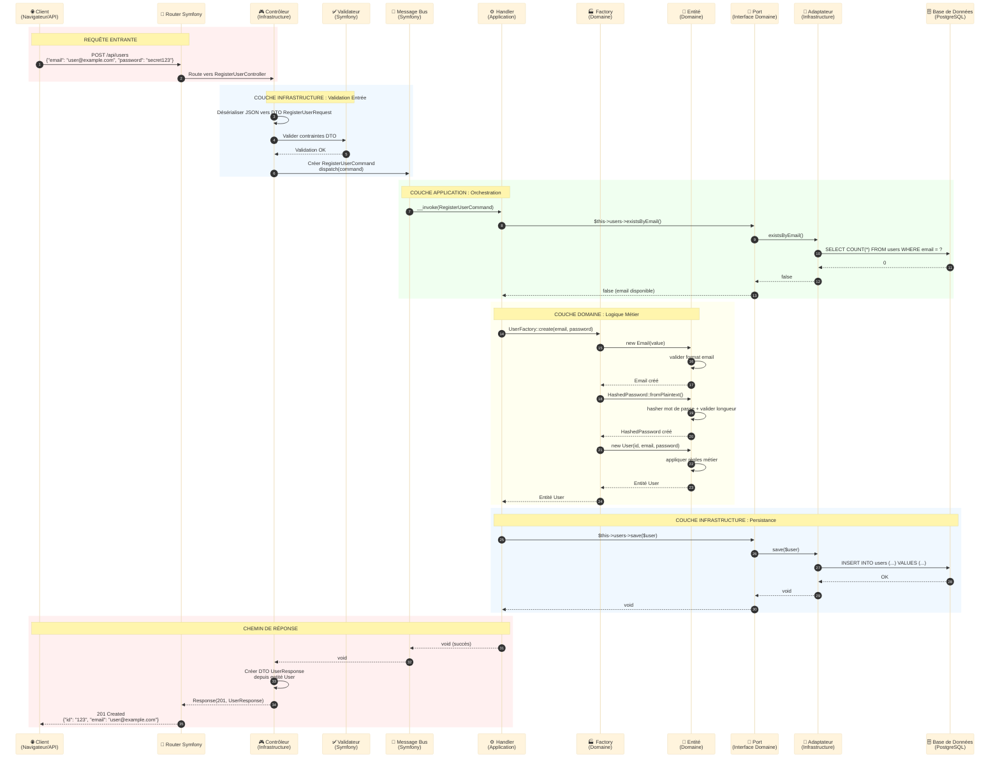
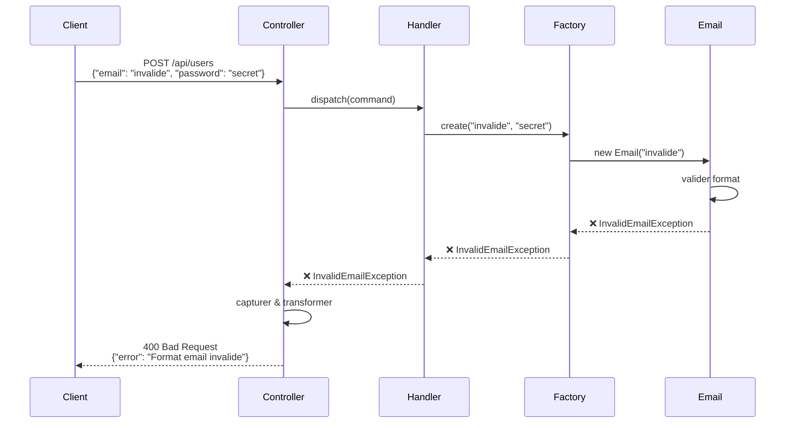
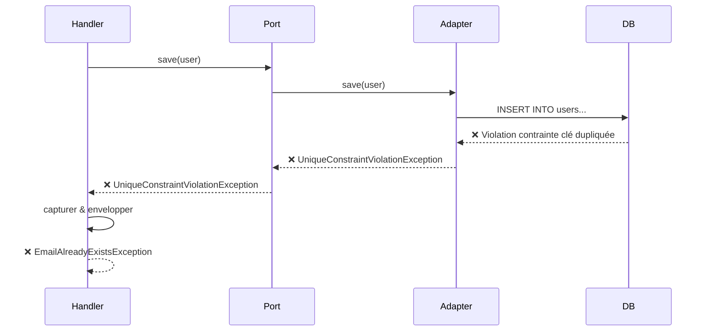

# Flux Requête-Réponse Complet : Voyage End-to-End

## Table des Matières

1. [Vue d'Ensemble](#vue-densemble)
2. [Le Diagramme de Flux Complet](#le-diagramme-de-flux-complet)
3. [Décomposition Étape par Étape](#décomposition-étape-par-étape)
4. [Transformations de Données](#transformations-de-données)
5. [Exemple Réel : Inscription Utilisateur](#exemple-réel--inscription-utilisateur)
6. [Flux d'Erreur](#flux-derreur)
7. [Considérations de Performance](#considérations-de-performance)

---

## Vue d'Ensemble

Comprendre comment une requête traverse toutes les couches de l'architecture hexagonale est crucial. Ce guide montre le **voyage complet** de la requête HTTP à la base de données et retour, avec les **transformations de données** à chaque frontière.

### Le Voyage en Une Phrase

> **JSON HTTP → Contrôleur → DTO Command → Handler → Entité Domain → Port Repository → Adaptateur Doctrine → Base de Données → Entité → Résultat Query → DTO Response → Contrôleur → JSON HTTP**

---

## Le Diagramme de Flux Complet



---

## Décomposition Étape par Étape

### Phase 1 : Entrée de Requête (Infrastructure)

#### Étapes 1-2 : Routage
```
Entrée:  POST /api/users HTTP/1.1
         Content-Type: application/json
         {"email": "user@example.com", "password": "secret123"}

Action: Le Router Symfony matche la route → RegisterUserController
```

#### Étape 3 : Désérialisation
```php
// Le contrôleur reçoit la requête brute
public function __invoke(Request $request): JsonResponse
{
    // Désérialiser JSON vers DTO
    $dto = $this->serializer->deserialize(
        $request->getContent(),
        RegisterUserRequest::class,
        'json'
    );

    // $dto est maintenant : RegisterUserRequest {
    //     email: "user@example.com",
    //     password: "secret123"
    // }
}
```

**Transformation de Données :**
```
Chaîne JSON Brute → DTO RegisterUserRequest (Infrastructure)
```

#### Étapes 4-5 : Validation
```php
// Valider avec contraintes Symfony
$errors = $this->validator->validate($dto);

if (count($errors) > 0) {
    throw new ValidationException($errors);
}

// Classe DTO avec contraintes :
class RegisterUserRequest
{
    #[Assert\NotBlank]
    #[Assert\Email]
    public string $email;

    #[Assert\NotBlank]
    #[Assert\Length(min: 8)]
    public string $password;
}
```

#### Étape 6 : Créer Command & Dispatcher
```php
// Transformer DTO → Command (DTO Application)
$command = new RegisterUserCommand(
    email: $dto->email,
    password: $dto->password
);

// Dispatcher vers message bus
$this->messageBus->dispatch($command);
```

**Transformation de Données :**
```
DTO RegisterUserRequest → DTO RegisterUserCommand (Application)
```

---

### Phase 2 : Orchestration Couche Application

#### Étape 7 : Invocation du Handler
```php
// Symfony invoque automatiquement le handler
#[AsMessageHandler]
final readonly class RegisterUserHandler
{
    public function __invoke(RegisterUserCommand $command): void
    {
        // Le handler démarre l'orchestration
    }
}
```

#### Étapes 8-12 : Vérifier l'Unicité de l'Email
```php
// Le handler appelle le port
if ($this->users->existsByEmail($command->email)) {
    throw new EmailAlreadyExistsException($command->email);
}

// Interface port (Domaine)
interface UserRepositoryInterface
{
    public function existsByEmail(string $email): bool;
}

// Implémentation adaptateur (Infrastructure)
final class DoctrineUserRepository implements UserRepositoryInterface
{
    public function existsByEmail(string $email): bool
    {
        $qb = $this->entityManager->createQueryBuilder();
        $qb->select('COUNT(u.id)')
           ->from(User::class, 'u')
           ->where('u.email = :email')
           ->setParameter('email', $email);

        return (int) $qb->getQuery()->getSingleScalarResult() > 0;
    }
}

// Requête base de données exécutée :
// SELECT COUNT(id) FROM users WHERE email = 'user@example.com'
```

**Flux de Données :**
```
Command (chaîne email)
  → Appel méthode Port
    → Adaptateur (Doctrine QueryBuilder)
      → Requête SQL
        → Base de Données
          → Résultat (0)
            → Adaptateur (false)
              → Port (false)
                → Handler (continue)
```

---

### Phase 3 : Logique Métier Couche Domaine

#### Étape 13 : Invocation de la Factory
```php
// Le handler délègue la création à la factory
$user = UserFactory::create($command->email, $command->password);
```

#### Étapes 14-17 : Création du Value Object Email
```php
// La factory crée le value object Email
$email = new Email($command->email);

// Le constructeur Email valide
final readonly class Email
{
    public function __construct(public string $value)
    {
        // Règle métier : doit être un email valide
        if (!filter_var($value, FILTER_VALIDATE_EMAIL)) {
            throw new InvalidEmailException($value);
        }

        // Règle métier : domaine entreprise uniquement (exemple)
        if (!str_ends_with($value, '@company.com')) {
            throw new InvalidEmailDomainException($value);
        }
    }
}
```

**Transformation de Données :**
```
Chaîne primitive → Value Object Email (Domaine)
```

#### Étapes 18-20 : Hachage du Mot de Passe
```php
// La factory crée le mot de passe haché
$hashedPassword = HashedPassword::fromPlaintext($command->password);

// Le value object gère le hachage
final readonly class HashedPassword
{
    private function __construct(public string $hash) {}

    public static function fromPlaintext(string $plaintext): self
    {
        // Règle métier : longueur minimale
        if (strlen($plaintext) < 8) {
            throw new PasswordTooShortException();
        }

        // Hasher le mot de passe
        $hash = password_hash($plaintext, PASSWORD_ARGON2ID);

        return new self($hash);
    }
}
```

**Transformation de Données :**
```
Chaîne en clair → Value Object HashedPassword (Domaine)
```

#### Étapes 21-23 : Création de l'Entité
```php
// La factory crée l'entité avec tous les value objects
public static function create(string $email, string $password): User
{
    return new User(
        id: UserId::generate(),
        email: new Email($email),
        password: HashedPassword::fromPlaintext($password),
        isActive: false,
        createdAt: new \DateTimeImmutable()
    );
}

// Le constructeur de l'entité applique les règles métier
public function __construct(
    private UserId $id,
    private Email $email,
    private HashedPassword $password,
    private bool $isActive,
    private \DateTimeImmutable $createdAt,
) {
    // Invariant métier : nouveaux utilisateurs inactifs
    if ($this->isActive) {
        throw new NewUserCannotBeActiveException();
    }
}
```

**Transformation de Données :**
```
Primitives (string, string)
  → Value Objects (Email, HashedPassword)
    → Entité (User) [Domaine]
```

---

### Phase 4 : Persistance (Infrastructure)

#### Étapes 24-28 : Sauvegarder en Base de Données
```php
// Le handler sauvegarde l'entité via le port
$this->users->save($user);

// Interface port (Domaine)
interface UserRepositoryInterface
{
    public function save(User $user): void;
}

// Implémentation adaptateur (Infrastructure)
final class DoctrineUserRepository implements UserRepositoryInterface
{
    public function save(User $user): void
    {
        $this->entityManager->persist($user);
        $this->entityManager->flush();
    }
}

// Doctrine génère le SQL :
// INSERT INTO users (id, email, password, is_active, created_at)
// VALUES ('550e8400-...', 'user@example.com', '$argon2id$...', false, '2024-01-15 10:30:00')
```

**Transformation de Données :**
```
Entité User (Domaine)
  → Mapping Metadata Doctrine
    → Instruction SQL INSERT
      → Ligne Base de Données
```

---

### Phase 5 : Chemin de Réponse

#### Étapes 29-30 : Complétion du Handler
```php
// Le handler se termine (retourne void)
public function __invoke(RegisterUserCommand $command): void
{
    // ... toutes les étapes complétées

    // Pas de valeur de retour (pattern command)
}
```

#### Étape 31 : Création du DTO Response
```php
// Le contrôleur reçoit void, crée la réponse
public function __invoke(Request $request): JsonResponse
{
    $command = new RegisterUserCommand(/*...*/);

    $this->messageBus->dispatch($command);

    // Récupérer l'utilisateur créé pour le retourner
    $user = $this->users->findByEmail($command->email);

    // Transformer Entité → DTO Response
    $response = new UserResponse(
        id: $user->getId()->toString(),
        email: $user->getEmail()->value,
        isActive: $user->isActive(),
        createdAt: $user->getCreatedAt()->format('c')
    );

    return new JsonResponse($response, Response::HTTP_CREATED);
}
```

**Transformation de Données :**
```
Entité User (Domaine) → DTO UserResponse (Infrastructure) → JSON
```

#### Étapes 32-33 : Réponse JSON
```
Sortie: HTTP/1.1 201 Created
        Content-Type: application/json

        {
            "id": "550e8400-e29b-41d4-a716-446655440000",
            "email": "user@example.com",
            "isActive": false,
            "createdAt": "2024-01-15T10:30:00+00:00"
        }
```

---

## Transformations de Données

### Chaîne de Transformation Complète

```
1. JSON Brut (HTTP)
   ↓
2. DTO RegisterUserRequest (Infrastructure - Validation entrée)
   ↓
3. RegisterUserCommand (Application - Intention cas d'usage)
   ↓
4. Email + Password (chaînes)
   ↓
5. Value Object Email + Value Object HashedPassword (Domaine - Validation métier)
   ↓
6. Entité User (Domaine - Logique métier)
   ↓
7. Metadata Entité Doctrine (Infrastructure - Mapping ORM)
   ↓
8. SQL INSERT (Infrastructure - Base de données)
   ↓
9. Ligne Base de Données (Persistance)
   ↓
10. Entité User (Domaine - Chargée depuis BD)
   ↓
11. DTO UserResponse (Infrastructure - Formatage sortie)
   ↓
12. Réponse JSON (HTTP)
```

### Pourquoi Autant de Transformations ?

Chaque transformation a un objectif :

| Transformation | Objectif | Couche |
|----------------|---------|--------|
| JSON → DTO Request | Validation entrée, préoccupations HTTP | Infrastructure |
| DTO Request → Command | Intention cas d'usage, préoccupation application | Application |
| Command → Value Objects | Validation métier | Domaine |
| Value Objects → Entité | Encapsulation logique métier | Domaine |
| Entité → SQL | Mapping persistance | Infrastructure |
| SQL → Ligne BD | Stockage | Infrastructure |
| Entité → DTO Response | Formatage sortie, cacher internes | Infrastructure |
| DTO Response → JSON | Sérialisation HTTP | Infrastructure |

**Principe Clé :** Chaque couche a sa propre représentation, évitant le couplage.

---

## Exemple Réel : Inscription Utilisateur

### Flux de Code Complet

```php
// 1. INFRASTRUCTURE : Contrôleur
namespace App\User\Infrastructure\Controller;

#[Route('/api/users', methods: ['POST'])]
final readonly class RegisterUserController extends AbstractController
{
    public function __invoke(Request $request): JsonResponse
    {
        // Désérialiser + valider
        $dto = $this->serializer->deserialize(
            $request->getContent(),
            RegisterUserRequest::class,
            'json'
        );

        $violations = $this->validator->validate($dto);
        if (count($violations) > 0) {
            throw new ValidationException($violations);
        }

        // Créer command
        $command = new RegisterUserCommand(
            email: $dto->email,
            password: $dto->password
        );

        // Dispatcher
        $this->messageBus->dispatch($command);

        // Récupérer résultat
        $user = $this->users->findByEmail($command->email);

        // Créer réponse
        return $this->json(
            new UserResponse(
                id: $user->getId()->toString(),
                email: $user->getEmail()->value,
                isActive: $user->isActive()
            ),
            Response::HTTP_CREATED
        );
    }
}

// 2. APPLICATION : Command (DTO)
namespace App\User\Application\Command;

final readonly class RegisterUserCommand
{
    public function __construct(
        public string $email,
        public string $password,
    ) {}
}

// 3. APPLICATION : Handler
namespace App\User\Application\Handler;

#[AsMessageHandler]
final readonly class RegisterUserHandler
{
    public function __construct(
        private UserRepositoryInterface $users,
        private EventDispatcherInterface $eventDispatcher,
    ) {}

    public function __invoke(RegisterUserCommand $command): void
    {
        // Vérifier unicité (préoccupation application - nécessite repository)
        if ($this->users->existsByEmail($command->email)) {
            throw new EmailAlreadyExistsException($command->email);
        }

        // Créer utilisateur (logique domaine dans factory)
        $user = UserFactory::create($command->email, $command->password);

        // Persister (préoccupation infrastructure)
        $this->users->save($user);

        // Dispatcher événement (préoccupation infrastructure)
        $this->eventDispatcher->dispatch(
            new UserRegisteredEvent($user->getId())
        );
    }
}

// 4. DOMAINE : Factory
namespace App\User\Domain\Factory;

final class UserFactory
{
    public static function create(string $email, string $password): User
    {
        return new User(
            id: UserId::generate(),
            email: new Email($email),           // Valide format
            password: HashedPassword::fromPlaintext($password), // Valide + hash
            isActive: false,
            createdAt: new \DateTimeImmutable()
        );
    }
}

// 5. DOMAINE : Value Objects
namespace App\User\Domain\ValueObject;

final readonly class Email
{
    public function __construct(public string $value)
    {
        if (!filter_var($value, FILTER_VALIDATE_EMAIL)) {
            throw new InvalidEmailException($value);
        }
    }
}

final readonly class HashedPassword
{
    private function __construct(public string $hash) {}

    public static function fromPlaintext(string $plaintext): self
    {
        if (strlen($plaintext) < 8) {
            throw new PasswordTooShortException();
        }

        return new self(password_hash($plaintext, PASSWORD_ARGON2ID));
    }
}

// 6. DOMAINE : Entité
namespace App\User\Domain\Model;

class User
{
    public function __construct(
        private UserId $id,
        private Email $email,
        private HashedPassword $password,
        private bool $isActive,
        private \DateTimeImmutable $createdAt,
    ) {}

    public function activate(): void
    {
        if ($this->isActive) {
            throw new UserAlreadyActiveException();
        }

        $this->isActive = true;
    }

    // Getters...
}

// 7. DOMAINE : Port (Interface)
namespace App\User\Domain\Port;

interface UserRepositoryInterface
{
    public function save(User $user): void;
    public function existsByEmail(string $email): bool;
    public function findByEmail(string $email): ?User;
}

// 8. INFRASTRUCTURE : Adaptateur (Implémentation Doctrine)
namespace App\User\Infrastructure\Persistence;

final class DoctrineUserRepository implements UserRepositoryInterface
{
    public function __construct(
        private EntityManagerInterface $entityManager
    ) {}

    public function save(User $user): void
    {
        $this->entityManager->persist($user);
        $this->entityManager->flush();
    }

    public function existsByEmail(string $email): bool
    {
        return $this->entityManager->createQueryBuilder()
            ->select('COUNT(u.id)')
            ->from(User::class, 'u')
            ->where('u.email = :email')
            ->setParameter('email', $email)
            ->getQuery()
            ->getSingleScalarResult() > 0;
    }

    public function findByEmail(string $email): ?User
    {
        return $this->entityManager
            ->getRepository(User::class)
            ->findOneBy(['email' => $email]);
    }
}
```

---

## Flux d'Erreur

### Chemin d'Exception Domaine



### Chemin d'Exception Infrastructure



**Traduction d'Exception :** Les exceptions infrastructure sont capturées et traduites en exceptions domaine.

---

## Considérations de Performance

### Optimisation des Requêtes

```php
// ❌ MAUVAIS : Problème N+1 Queries
public function listUsers(): array
{
    $users = $this->users->findAll(); // 1 requête

    foreach ($users as $user) {
        $user->getOrders(); // N requêtes !
    }

    return $users;
}

// ✅ BON : Chargement Eager
public function listUsers(): array
{
    return $this->entityManager->createQueryBuilder()
        ->select('u', 'o')
        ->from(User::class, 'u')
        ->leftJoin('u.orders', 'o')
        ->getQuery()
        ->getResult(); // 1 requête
}
```

### Stratégie de Cache

```php
// Ajouter du cache au niveau de la couche infrastructure
final class CachedUserRepository implements UserRepositoryInterface
{
    public function __construct(
        private UserRepositoryInterface $decorated,
        private CacheInterface $cache,
    ) {}

    public function findByEmail(string $email): ?User
    {
        return $this->cache->get(
            "user:email:{$email}",
            fn() => $this->decorated->findByEmail($email)
        );
    }
}
```

---

## Points Clés à Retenir

1. **Transformations en Couches :** Les données se transforment à chaque frontière pour maintenir la séparation
2. **Direction Importante :** Les dépendances pointent toujours vers l'intérieur (Infrastructure → Application → Domaine)
3. **Ports aux Frontières :** Tout accès du domaine à l'infrastructure passe par des ports
4. **DTOs Partout :** DTO Input, DTO Command, Entité, DTO Response—chacun a un objectif
5. **Traduction d'Exception :** Les exceptions infrastructure deviennent des exceptions domaine
6. **Performance via Infrastructure :** Cache, optimisation requêtes se font dans les adaptateurs, pas le domaine

---

**Suivant :** [Principes de Conception des Ports →](./principes-conception-ports.md)
