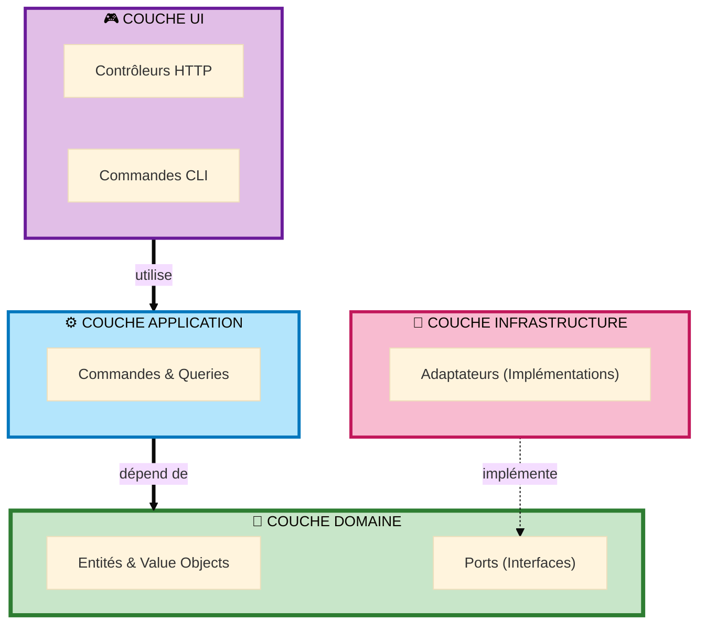

# Hexagonal Maker Bundle

<p align="center">
  
</p>

<p align="center">
  <strong>Bundle Symfony Maker pour l'Architecture Hexagonale (Ports & Adapters)</strong>
</p>

<p align="center">
  <a href="https://packagist.org/packages/ahmed-bhs/hexagonal-maker-bundle"></a>
  <a href="https://github.com/ahmed-bhs/hexagonal-maker-bundle/actions"></a>
  <a href="https://github.com/ahmed-bhs/hexagonal-maker-bundle/blob/main/LICENSE"></a>
  <a href="https://www.php.net/"></a>
  <a href="https://symfony.com/"></a>
</p>

<p align="center">
  ✨ <strong>19 commandes maker</strong> | 💎 <strong>Domaine Pur</strong> | 🎯 <strong>Pattern CQRS</strong> | 🏗️ <strong>Couverture Complète</strong>
</p>

---

## Pourquoi l'Architecture Hexagonale ?

L'architecture hexagonale (alias Ports & Adapters) vous aide à construire des applications maintenables et testables en :

- **💎 Isolation du Domaine** - Logique métier indépendante des frameworks
- **🎯 Contrôle des Dépendances** - L'infrastructure dépend du domaine, pas l'inverse
- **⚡ Vitesse de Test** - Tests unitaires 1000x plus rapides (pas de base de données)
- **🔄 Liberté Technologique** - Changez de base de données, de framework sans toucher la logique métier
- **💰 Coût Prévisible** - Les fonctionnalités coûtent un temps constant, pas de taxe de dette technique

[Lire le guide complet →](../WHY-HEXAGONAL.md)

---

## ⚡ Démarrage Rapide (2 minutes)

**Étape 1 : Installation**

```bash
composer require ahmed-bhs/hexagonal-maker-bundle --dev
```

**Étape 2 : Générez votre premier module**

```bash
# Créer un module d'enregistrement utilisateur
bin/console make:hexagonal:entity user/account User
bin/console make:hexagonal:repository user/account User
bin/console make:hexagonal:command user/account register --factory
bin/console make:hexagonal:controller user/account RegisterUser /users/register
```

**Étape 3 : Configurez le mapping Doctrine**

```yaml
# config/packages/doctrine.yaml
doctrine:
    orm:
        mappings:
            UserAccount:
                type: yml
                dir: '%kernel.project_dir%/src/User/Account/Infrastructure/Persistence/Doctrine/Orm/Mapping'
                prefix: 'App\User\Account\Domain\Model'
```

**Résultat :** Module hexagonal complet avec domaine pur, commandes CQRS et contrôleurs web ! 🚀

[Guide d'installation complet →](../getting-started/installation.md)

---

## Fonctionnalités

### 19 Commandes Maker

Générez une architecture hexagonale complète avec une seule commande :

| Couche | Maker | Ce qu'il génère |
|--------|-------|-----------------|
| **Domaine** | `make:hexagonal:entity` | Entités PHP pures + mapping YAML |
| **Domaine** | `make:hexagonal:value-object` | Value objects immuables |
| **Domaine** | `make:hexagonal:exception` | Exceptions métier |
| **Application** | `make:hexagonal:command` | Commandes CQRS + handlers |
| **Application** | `make:hexagonal:query` | Queries CQRS + handlers + réponses |
| **Application** | `make:hexagonal:repository` | Port repository + adaptateur Doctrine |
| **UI** | `make:hexagonal:controller` | Contrôleurs web |
| **UI** | `make:hexagonal:form` | Formulaires Symfony |
| **UI** | `make:hexagonal:cli-command` | Commandes console |
| **Tests** | `make:hexagonal:use-case-test` | Tests de cas d'usage |
| **Rapide** | `make:hexagonal:crud` | Module CRUD complet (20+ fichiers) |

[Voir les 19 commandes →](../makers/commands.md)

---

## Documentation

| Guide | Description |
|-------|-------------|
| [**Démarrage Rapide**](../getting-started/quick-start.md) | Installez et générez votre premier module en 2 minutes |
| [**Commandes Maker**](../makers/commands.md) | Référence complète des 19 commandes maker |
| [**Guide Architecture**](../ARCHITECTURE.md) | Plongée profonde dans les patterns d'architecture hexagonale |
| [**Pourquoi Hexagonal**](../WHY-HEXAGONAL.md) | Business case et bénéfices techniques |
| [**Principes SOLID**](../SOLID.md) | Comment l'architecture hexagonale applique SOLID |
| [**Exemples**](../examples/user-registration.md) | Exemples réels et cas d'usage |

---

## Documentation Avancée (Nouveaux Guides) 🆕

Ces guides approfondis couvrent les aspects critiques de l'architecture hexagonale :

| Guide | Description |
|-------|-------------|
| [**Domain vs Application Logic**](../advanced/domain-vs-application.md) | Guide de décision : où placer votre logique métier |
| [**Request-Response Flow**](../advanced/request-response-flow.md) | Flux complet end-to-end avec diagrammes |
| [**Port Design Principles**](../advanced/port-design-principles.md) | Comment concevoir des interfaces de ports efficaces |
| [**Primary vs Secondary Adapters**](../advanced/primary-secondary-adapters.md) | Comprendre les deux côtés de l'hexagone |
| [**CQRS: Cost-Benefit Analysis**](../advanced/cqrs-cost-benefit.md) | Quand utiliser CQRS (et quand l'éviter) |
| [**Dependency Injection Guide**](../advanced/dependency-injection-guide.md) | Configuration Symfony complète |
| [**Factory Pattern Guide**](../advanced/factory-pattern-guide.md) | Implémentation complète des factories |
| [**Error Handling Strategy**](../advanced/error-handling-strategy.md) | Gestion des exceptions et des erreurs |
| [**Anti-Patterns & Pitfalls**](../advanced/anti-patterns-pitfalls.md) | Éviter les erreurs courantes |

---

## Exemple : Module Utilisateur Complet

### Étape 1 : Domaine

**Générer les entités de domaine pures**

```bash
bin/console make:hexagonal:entity user/account User
bin/console make:hexagonal:value-object user/account Email
bin/console make:hexagonal:exception user/account InvalidEmailException
```

**Généré :**
- `Domain/Model/User.php` (PHP pur)
- `Domain/ValueObject/Email.php`
- `Domain/Exception/InvalidEmailException.php`

### Étape 2 : Application

**Générer les cas d'usage et commandes**

```bash
bin/console make:hexagonal:repository user/account User
bin/console make:hexagonal:command user/account register --factory
bin/console make:hexagonal:query user/account find-by-id
```

**Généré :**
- `Domain/Port/UserRepositoryInterface.php`
- `Application/Register/RegisterCommand.php`
- `Application/Register/RegisterCommandHandler.php`
- `Application/FindById/FindByIdQuery.php`

### Étape 3 : Infrastructure

**Adaptateurs auto-générés**

```bash
# Déjà générés avec la commande repository !
```

**Généré :**
- `Infrastructure/Persistence/Doctrine/DoctrineUserRepository.php`
- `Infrastructure/Persistence/Doctrine/Orm/Mapping/User.orm.yml`

### Étape 4 : UI

**Générer contrôleurs et formulaires**

```bash
bin/console make:hexagonal:controller user/account RegisterUser /users/register
bin/console make:hexagonal:form user/account User
```

**Généré :**
- `UI/Http/Web/Controller/RegisterUserController.php`
- `UI/Http/Web/Form/UserType.php`

---

## Couches d'Architecture



**Règle de Dépendance :** Toutes les dépendances pointent vers l'intérieur. Le domaine n'a aucune dépendance.

[Guide d'architecture →](../ARCHITECTURE.md)

---

## CRUD en 1 Commande ⚡

Générez un module CRUD complet avec toutes les couches :

```bash
bin/console make:hexagonal:crud blog/post Post --with-tests --with-id-vo
```

**Généré (30+ fichiers) :**
- Entité + ValueObjects + Repository
- 5 Cas d'Usage (Create, Update, Delete, Get, List)
- 5 Contrôleurs + Formulaire
- Tous les tests (Cas d'Usage + Contrôleur)
- Mapping YAML Doctrine

[Exemples CRUD →](../examples/crud-module.md)

---

## Architecture Layers


**Règle de Dépendance :** Toutes les dépendances pointent vers l'intérieur. Le domaine n'a aucune dépendance.

---

## Prérequis

- PHP 8.1+
- Symfony 6.4+ ou 7.x
- Composer

---

## Contribution

Nous accueillons les contributions ! Voir notre [Guide de Contribution](../contributing/overview.md).

---

## Licence

Licence MIT - voir [LICENSE](../about/license.md) pour les détails.

---

<div align="center" markdown="1">

**Créé par [Ahmed EBEN HASSINE](https://github.com/ahmed-bhs)**

<a href="https://github.com/sponsors/ahmed-bhs"></a>
<a href="https://www.buymeacoffee.com/w6ZhBSGX2"></a>

</div>
