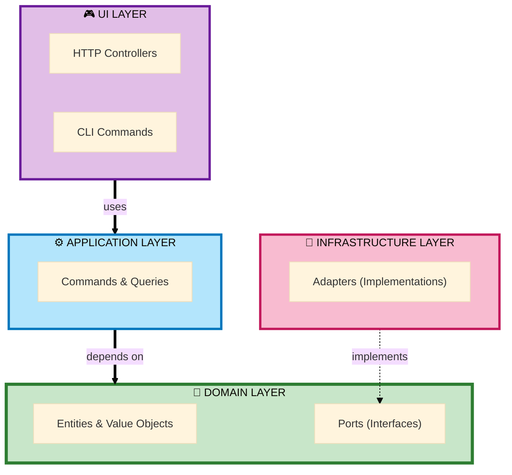

# Hexagonal Maker Bundle

<p align="center">
  
</p>

<p align="center">
  <strong>Symfony Maker Bundle for Hexagonal Architecture (Ports & Adapters)</strong>
</p>

<p align="center">
  <a href="https://packagist.org/packages/ahmed-bhs/hexagonal-maker-bundle"></a>
  <a href="https://github.com/ahmed-bhs/hexagonal-maker-bundle/actions"></a>
  <a href="https://github.com/ahmed-bhs/hexagonal-maker-bundle/blob/main/LICENSE"></a>
  <a href="https://www.php.net/"></a>
  <a href="https://symfony.com/"></a>
</p>

<p align="center">
  ✨ <strong>19 maker commands</strong> | 💎 <strong>Pure Domain</strong> | 🎯 <strong>CQRS Pattern</strong> | 🏗️ <strong>Full Layer Coverage</strong>
</p>

---

## Why Hexagonal Architecture?

Hexagonal architecture (aka Ports & Adapters) helps you build maintainable, testable applications by:

- **💎 Pure Domain Isolation** - Business logic independent of frameworks
- **🎯 Dependency Control** - Infrastructure depends on domain, not vice versa
- **⚡ Testing Speed** - Unit tests run 1000x faster (no database needed)
- **🔄 Technology Freedom** - Swap databases, frameworks without touching business logic
- **💰 Cost Predictability** - Features cost consistent time, no technical debt tax

[Read the complete guide →](WHY-HEXAGONAL.md)

---

## ⚡ Quick Start (2 minutes)

**Step 1: Install**

```bash
composer require ahmed-bhs/hexagonal-maker-bundle --dev
```

**Step 2: Generate your first module**

```bash
# Create a User Registration module
bin/console make:hexagonal:entity user/account User
bin/console make:hexagonal:repository user/account User
bin/console make:hexagonal:command user/account register --factory
bin/console make:hexagonal:controller user/account RegisterUser /users/register
```

**Step 3: Configure Doctrine mapping**

```yaml
# config/packages/doctrine.yaml
doctrine:
    orm:
        mappings:
            UserAccount:
                type: yml
                dir: '%kernel.project_dir%/src/User/Account/Infrastructure/Persistence/Doctrine/Orm/Mapping'
                prefix: 'App\User\Account\Domain\Model'
```

**Result:** Complete hexagonal module with pure domain, CQRS commands, and web controllers! 🚀

[Full installation guide →](getting-started/installation.md)

---

## Features

### 19 Maker Commands

Generate complete hexagonal architecture with a single command:

| Layer | Maker | What it generates |
|-------|-------|-------------------|
| **Domain** | `make:hexagonal:entity` | Pure PHP entities + YAML mapping |
| **Domain** | `make:hexagonal:value-object` | Immutable value objects |
| **Domain** | `make:hexagonal:exception` | Business exceptions |
| **Application** | `make:hexagonal:command` | CQRS commands + handlers |
| **Application** | `make:hexagonal:query` | CQRS queries + handlers + responses |
| **Application** | `make:hexagonal:repository` | Repository port + Doctrine adapter |
| **UI** | `make:hexagonal:controller` | Web controllers |
| **UI** | `make:hexagonal:form` | Symfony forms |
| **UI** | `make:hexagonal:cli-command` | Console commands |
| **Tests** | `make:hexagonal:use-case-test` | Use case tests |
| **Rapid** | `make:hexagonal:crud` | Complete CRUD module (20+ files) |

[See all 19 commands →](makers/commands.md)

---

## Example: Complete User Module

=== "Step 1: Domain"

    **Generate pure domain entities**

    ```bash
    bin/console make:hexagonal:entity user/account User
    bin/console make:hexagonal:value-object user/account Email
    bin/console make:hexagonal:exception user/account InvalidEmailException
    ```

    **Generated:**
    - `Domain/Model/User.php` (pure PHP)
    - `Domain/ValueObject/Email.php`
    - `Domain/Exception/InvalidEmailException.php`

=== "Step 2: Application"

    **Generate use cases and commands**

    ```bash
    bin/console make:hexagonal:repository user/account User
    bin/console make:hexagonal:command user/account register --factory
    bin/console make:hexagonal:query user/account find-by-id
    ```

    **Generated:**
    - `Domain/Port/UserRepositoryInterface.php`
    - `Application/Register/RegisterCommand.php`
    - `Application/Register/RegisterCommandHandler.php`
    - `Application/FindById/FindByIdQuery.php`

=== "Step 3: Infrastructure"

    **Auto-generated adapters**

    ```bash
    # Already generated with repository command!
    ```

    **Generated:**
    - `Infrastructure/Persistence/Doctrine/DoctrineUserRepository.php`
    - `Infrastructure/Persistence/Doctrine/Orm/Mapping/User.orm.yml`

=== "Step 4: UI"

    **Generate controllers and forms**

    ```bash
    bin/console make:hexagonal:controller user/account RegisterUser /users/register
    bin/console make:hexagonal:form user/account User
    ```

    **Generated:**
    - `UI/Http/Web/Controller/RegisterUserController.php`
    - `UI/Http/Web/Form/UserType.php`

---

## Architecture Layers



**Dependency Rule:** All dependencies point inward. Domain has zero dependencies.

[Architecture guide →](ARCHITECTURE.md)

---

## CRUD in 1 Command ⚡

Generate complete CRUD module with all layers:

```bash
bin/console make:hexagonal:crud blog/post Post --with-tests --with-id-vo
```

**Generated (30+ files):**
- Entity + ValueObjects + Repository
- 5 Use Cases (Create, Update, Delete, Get, List)
- 5 Controllers + Form
- All tests (Use Case + Controller)
- Doctrine YAML mapping

[CRUD examples →](examples/crud-module.md)

---

## Documentation

| Guide | Description |
|-------|-------------|
| [**Quick Start**](getting-started/quick-start.md) | Install and generate your first module in 2 minutes |
| [**Maker Commands**](makers/commands.md) | Complete reference for all 19 maker commands |
| [**Architecture Guide**](ARCHITECTURE.md) | Deep dive into hexagonal architecture patterns |
| [**Why Hexagonal**](WHY-HEXAGONAL.md) | Business case and technical benefits |
| [**SOLID Principles**](SOLID.md) | How hexagonal architecture enforces SOLID |
| [**Examples**](examples/user-registration.md) | Real-world examples and use cases |

---

## Requirements

- PHP 8.1+
- Symfony 6.4+ or 7.x
- Composer

---

## Contributing

We welcome contributions! See our [Contributing Guide](contributing/overview.md).

---

## License

MIT License - see [LICENSE](about/license.md) for details.

---

<div align="center" markdown="1">

**Created by [Ahmed EBEN HASSINE](https://github.com/ahmed-bhs)**

<a href="https://github.com/sponsors/ahmed-bhs"></a>
<a href="https://www.buymeacoffee.com/w6ZhBSGX2"></a>

</div>
